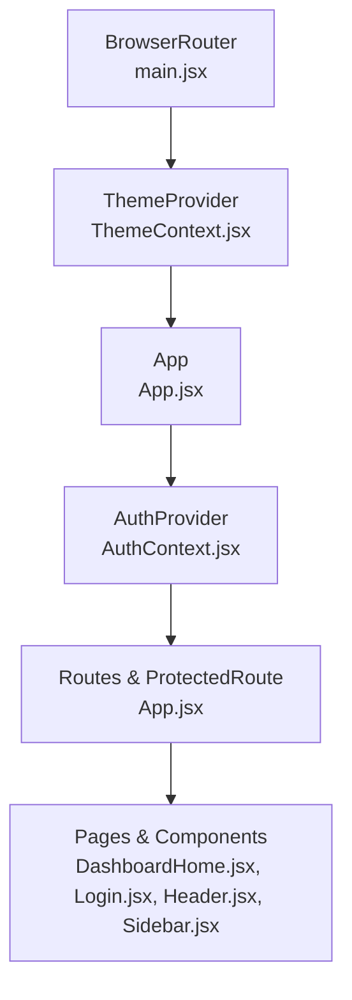
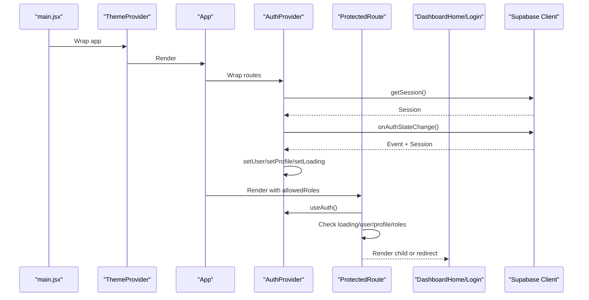
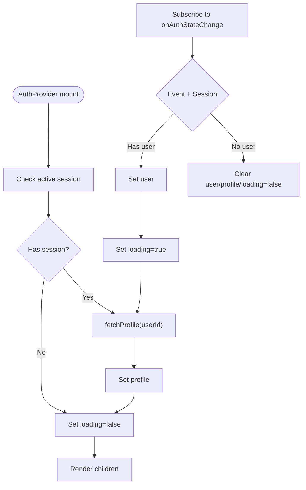
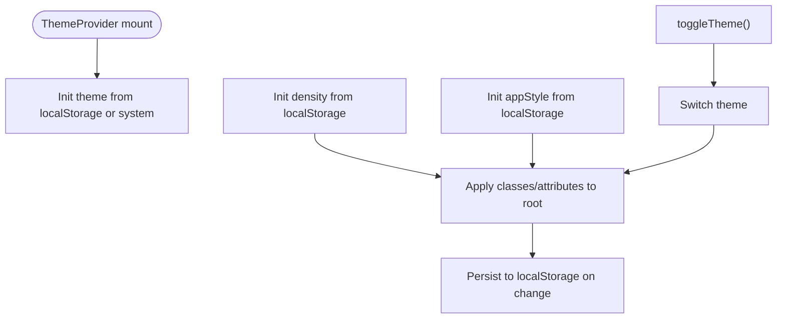
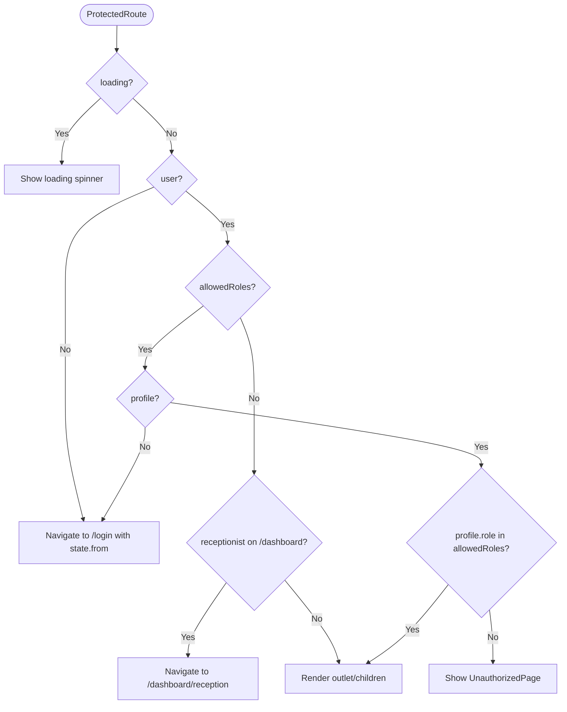
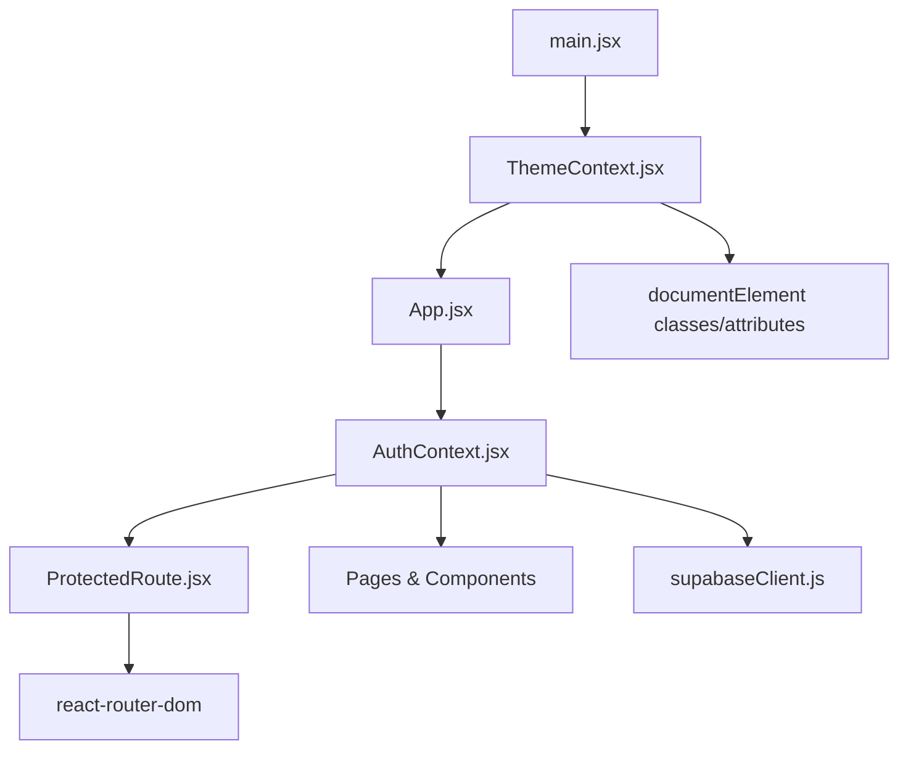

# State Management & Context API

<cite>
**Referenced Files in This Document**
- [AuthContext.jsx](file://frontend/src/context/AuthContext.jsx)
- [ThemeContext.jsx](file://frontend/src/context/ThemeContext.jsx)
- [ProtectedRoute.jsx](file://frontend/src/components/ProtectedRoute.jsx)
- [ThemeToggle.jsx](file://frontend/src/components/ThemeToggle.jsx)
- [App.jsx](file://frontend/src/App.jsx)
- [main.jsx](file://frontend/src/main.jsx)
- [Login.jsx](file://frontend/src/pages/Login.jsx)
- [DashboardHome.jsx](file://frontend/src/pages/DashboardHome.jsx)
- [Header.jsx](file://frontend/src/components/Header.jsx)
- [Sidebar.jsx](file://frontend/src/components/Sidebar.jsx)
- [supabaseClient.js](file://frontend/src/lib/supabaseClient.js)
</cite>

## Table of Contents
1. [Introduction](#introduction)
2. [Project Structure](#project-structure)
3. [Core Components](#core-components)
4. [Architecture Overview](#architecture-overview)
5. [Detailed Component Analysis](#detailed-component-analysis)
6. [Dependency Analysis](#dependency-analysis)
7. [Performance Considerations](#performance-considerations)
8. [Troubleshooting Guide](#troubleshooting-guide)
9. [Conclusion](#conclusion)

## Introduction
This document explains MedVita’s React Context API-based state management. It covers:
- Authentication state via AuthContext.jsx, including session handling, role-based access control, and login/logout flows
- Theme state via ThemeContext.jsx for dark/light mode switching
- ProtectedRoute implementation enforcing role-based access control across dashboard routes
- Practical examples of context consumption in components, state update patterns, and performance considerations
- Persistence strategies, provider composition, and best practices to avoid unnecessary re-renders

## Project Structure
MedVita composes two primary providers at the root:
- ThemeProvider wraps the entire app for theme and density preferences
- AuthProvider wraps routing to manage authentication and profile data

**Diagram sources**
- [main.jsx](file://frontend/src/main.jsx#L8-L16)
- [App.jsx](file://frontend/src/App.jsx#L26-L59)
- [AuthContext.jsx](file://frontend/src/context/AuthContext.jsx#L9-L107)
- [ThemeContext.jsx](file://frontend/src/context/ThemeContext.jsx#L5-L69)

**Section sources**
- [main.jsx](file://frontend/src/main.jsx#L8-L16)
- [App.jsx](file://frontend/src/App.jsx#L26-L59)

## Core Components
- AuthContext: Centralizes authentication state (user, profile, loading), session lifecycle, and actions (signUp, signIn, signOut, fetchProfile).
- ThemeContext: Manages theme, density, and app style with persistence to localStorage and system preference detection.
- ProtectedRoute: Enforces role-based access control and redirects for unauthenticated or unauthorized users.

**Section sources**
- [AuthContext.jsx](file://frontend/src/context/AuthContext.jsx#L1-L108)
- [ThemeContext.jsx](file://frontend/src/context/ThemeContext.jsx#L1-L79)
- [ProtectedRoute.jsx](file://frontend/src/components/ProtectedRoute.jsx#L1-L108)

## Architecture Overview
The app initializes providers in main.jsx, then App.jsx organizes routes and protected routes. ProtectedRoute uses AuthContext to gate access and redirect appropriately. ThemeContext is consumed globally by Header and ThemeToggle.

**Diagram sources**
- [main.jsx](file://frontend/src/main.jsx#L8-L16)
- [App.jsx](file://frontend/src/App.jsx#L26-L59)
- [AuthContext.jsx](file://frontend/src/context/AuthContext.jsx#L14-L41)
- [ProtectedRoute.jsx](file://frontend/src/components/ProtectedRoute.jsx#L53-L106)
- [supabaseClient.js](file://frontend/src/lib/supabaseClient.js#L1-L11)

## Detailed Component Analysis

### AuthContext: Authentication State Management
AuthContext manages:
- user: logged-in user object
- profile: normalized user profile from the profiles table
- loading: initialization/loading state during session and profile fetch
- Actions: signUp, signIn, signOut, fetchProfile

Key behaviors:
- Initializes by checking the active session and fetching the profile
- Subscribes to Supabase auth state changes to keep user/profile/loading in sync
- Exposes fetchProfile for manual refreshes
- Provider conditionally renders children only after loading completes to avoid flicker

**Diagram sources**
- [AuthContext.jsx](file://frontend/src/context/AuthContext.jsx#L14-L41)
- [AuthContext.jsx](file://frontend/src/context/AuthContext.jsx#L43-L61)
- [AuthContext.jsx](file://frontend/src/context/AuthContext.jsx#L92-L107)

Practical usage examples:
- Login page consumes useAuth to sign in and deterministically redirect based on role
- Header and Sidebar consume useAuth to display user info and trigger signOut
- DashboardHome consumes useAuth to compute role-specific data and navigation

**Section sources**
- [AuthContext.jsx](file://frontend/src/context/AuthContext.jsx#L1-L108)
- [Login.jsx](file://frontend/src/pages/Login.jsx#L10-L76)
- [Header.jsx](file://frontend/src/components/Header.jsx#L17-L36)
- [Sidebar.jsx](file://frontend/src/components/Sidebar.jsx#L19-L22)
- [DashboardHome.jsx](file://frontend/src/pages/DashboardHome.jsx#L275-L335)

### ThemeContext: Theme and Density State Management
ThemeContext manages:
- theme: light/dark
- density: compactness level
- appStyle: stylistic theme variant
Persistence and synchronization:
- Reads saved values from localStorage or system preference on mount
- Applies theme/density/appStyle to documentElement attributes/classes
- Persists updates to localStorage on change

**Diagram sources**
- [ThemeContext.jsx](file://frontend/src/context/ThemeContext.jsx#L6-L32)
- [ThemeContext.jsx](file://frontend/src/context/ThemeContext.jsx#L34-L51)
- [ThemeContext.jsx](file://frontend/src/context/ThemeContext.jsx#L53-L55)

Practical usage examples:
- ThemeToggle consumes useTheme to toggle theme and render themed UI
- Header integrates ThemeToggle to expose theme switching in the header

**Section sources**
- [ThemeContext.jsx](file://frontend/src/context/ThemeContext.jsx#L1-L79)
- [ThemeToggle.jsx](file://frontend/src/components/ThemeToggle.jsx#L1-L31)
- [Header.jsx](file://frontend/src/components/Header.jsx#L82-L85)

### ProtectedRoute: Role-Based Access Control
ProtectedRoute enforces:
- Loading: Waits for both session and profile resolution
- Authentication: Redirects unauthenticated users to login with return location
- Authorization: Compares profile.role against allowedRoles
- Defaults: Redirects users to their correct home route (e.g., receptionist to /dashboard/reception)

**Diagram sources**
- [ProtectedRoute.jsx](file://frontend/src/components/ProtectedRoute.jsx#L53-L106)

**Section sources**
- [ProtectedRoute.jsx](file://frontend/src/components/ProtectedRoute.jsx#L1-L108)
- [App.jsx](file://frontend/src/App.jsx#L35-L53)

### Context Consumption Patterns and State Updates
Common patterns across components:
- useAuth: Consume user, profile, loading, and actions (signIn, signOut, fetchProfile)
- useTheme: Consume theme, toggleTheme, density, appStyle setters
- Conditional rendering based on loading and profile.role
- Immediate profile reads in Login.jsx to determine deterministic redirect

Examples:
- Login.jsx: Uses useAuth.signIn and fetches profile to redirect to role-specific dashboards
- Header.jsx: Uses useAuth.signOut and useTheme.toggleTheme
- Sidebar.jsx: Filters navigation items by profile.role
- DashboardHome.jsx: Uses useAuth.profile and user to compute stats and navigation

**Section sources**
- [Login.jsx](file://frontend/src/pages/Login.jsx#L10-L76)
- [Header.jsx](file://frontend/src/components/Header.jsx#L17-L36)
- [Sidebar.jsx](file://frontend/src/components/Sidebar.jsx#L19-L35)
- [DashboardHome.jsx](file://frontend/src/pages/DashboardHome.jsx#L275-L335)

## Dependency Analysis
Provider composition and external dependencies:
- Providers are composed in main.jsx with ThemeProvider wrapping App, and App wraps routes with AuthProvider
- AuthContext depends on Supabase client for session and profile operations
- ProtectedRoute depends on AuthContext and react-router-dom for navigation
- ThemeContext persists to localStorage and reads system preference

**Diagram sources**
- [main.jsx](file://frontend/src/main.jsx#L8-L16)
- [App.jsx](file://frontend/src/App.jsx#L26-L59)
- [AuthContext.jsx](file://frontend/src/context/AuthContext.jsx#L1-L2)
- [ProtectedRoute.jsx](file://frontend/src/components/ProtectedRoute.jsx#L1-L2)
- [supabaseClient.js](file://frontend/src/lib/supabaseClient.js#L1-L11)

**Section sources**
- [main.jsx](file://frontend/src/main.jsx#L8-L16)
- [App.jsx](file://frontend/src/App.jsx#L26-L59)
- [AuthContext.jsx](file://frontend/src/context/AuthContext.jsx#L1-L2)
- [ProtectedRoute.jsx](file://frontend/src/components/ProtectedRoute.jsx#L1-L2)
- [supabaseClient.js](file://frontend/src/lib/supabaseClient.js#L1-L11)

## Performance Considerations
- Minimize re-renders by keeping provider values stable:
  - AuthContext exposes a single object value with user, profile, loading, and actions; consumers should destructure minimally
  - ThemeContext exposes theme, toggleTheme, density, setDensity, appStyle, setAppStyle; consumers should only subscribe to the fields they need
- Avoid unnecessary subscriptions:
  - AuthProvider unsubscribes from Supabase auth state changes on cleanup
- Conditional rendering:
  - AuthProvider renders children only after loading completes to prevent intermediate flashes
- Efficient profile fetching:
  - Login.jsx performs a targeted profile read to determine redirect quickly, reducing reliance on AuthProvider observer timing
- Real-time updates:
  - DashboardHome.jsx uses Supabase Realtime channels for live queue updates; ensure channels are cleaned up on unmount

Best practices:
- Use shallow comparisons in components where possible
- Memoize derived values computed from context
- Avoid spreading context values into props unnecessarily
- Keep heavy computations outside of render paths

**Section sources**
- [AuthContext.jsx](file://frontend/src/context/AuthContext.jsx#L92-L107)
- [ThemeContext.jsx](file://frontend/src/context/ThemeContext.jsx#L57-L69)
- [Login.jsx](file://frontend/src/pages/Login.jsx#L32-L57)
- [DashboardHome.jsx](file://frontend/src/pages/DashboardHome.jsx#L41-L76)

## Troubleshooting Guide
Common issues and resolutions:
- Auth loading flicker:
  - Ensure AuthProvider conditionally renders children only after loading completes
- Missing profile after login:
  - Verify onAuthStateChange triggers fetchProfile and that the profiles table contains the user’s record
- Role mismatch:
  - Confirm allowedRoles prop matches profile.role values and that ProtectedRoute handles default diversions
- Theme not persisting:
  - Check localStorage availability and that ThemeProvider applies classes/attributes to documentElement
- Logout not redirecting:
  - Ensure signOut is called and navigation occurs after completion

**Section sources**
- [AuthContext.jsx](file://frontend/src/context/AuthContext.jsx#L14-L41)
- [ProtectedRoute.jsx](file://frontend/src/components/ProtectedRoute.jsx#L57-L106)
- [ThemeContext.jsx](file://frontend/src/context/ThemeContext.jsx#L34-L51)
- [Header.jsx](file://frontend/src/components/Header.jsx#L29-L36)

## Conclusion
MedVita’s state management leverages React Context to centralize authentication and theme concerns. AuthContext integrates tightly with Supabase for session and profile management, while ThemeContext persists user preferences and system themes. ProtectedRoute ensures robust role-based access control across routes. By composing providers at the root and following best practices for context consumption and performance, the app maintains predictable state flows and responsive UIs.