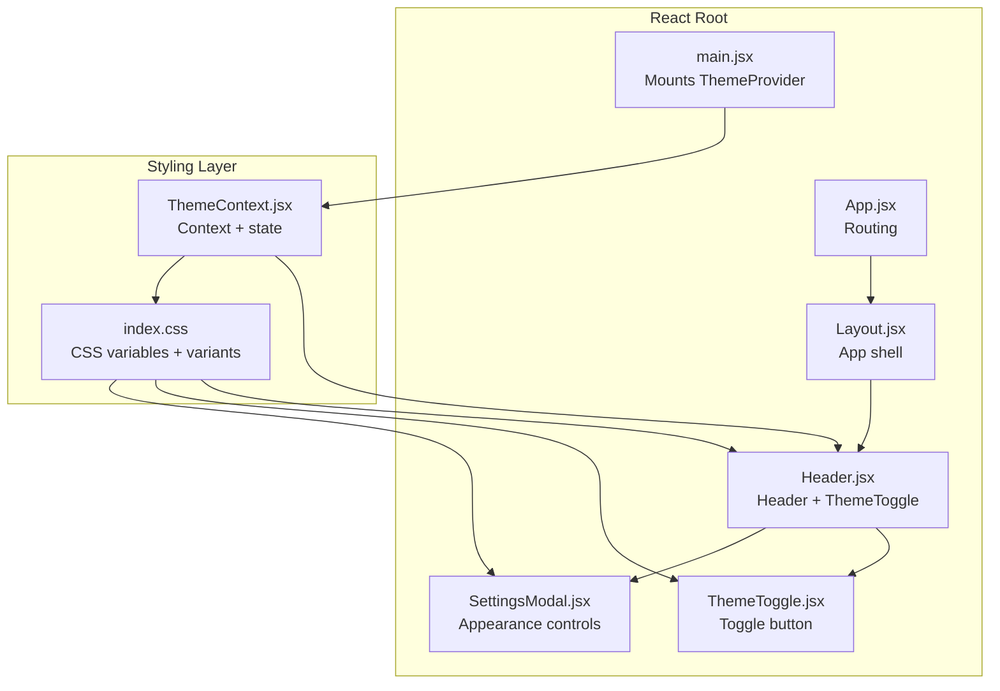
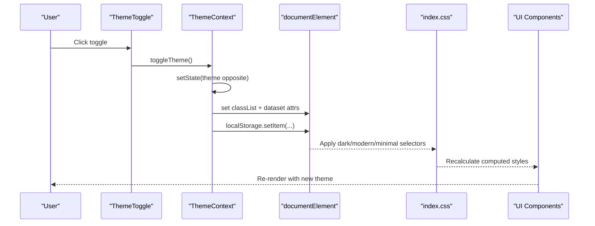
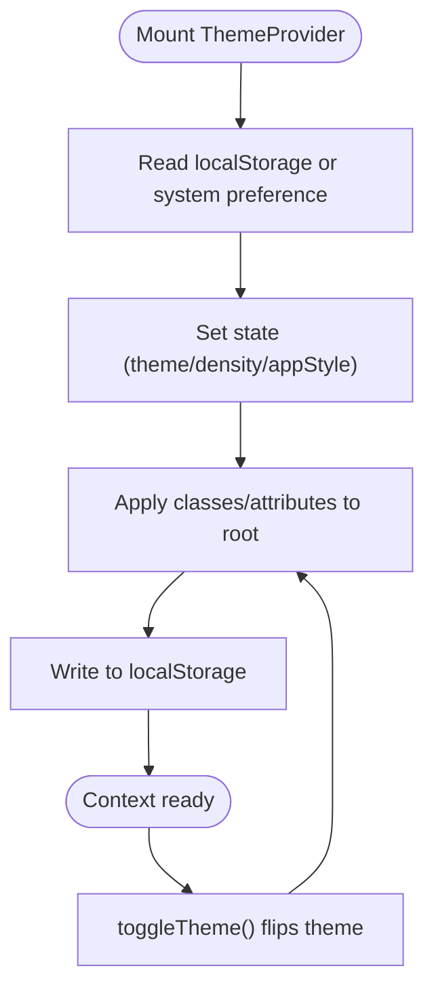
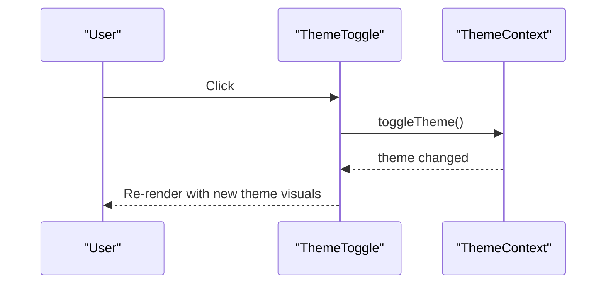
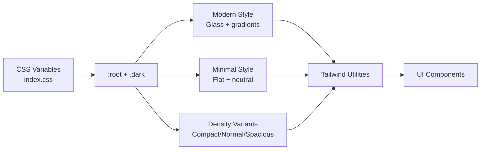
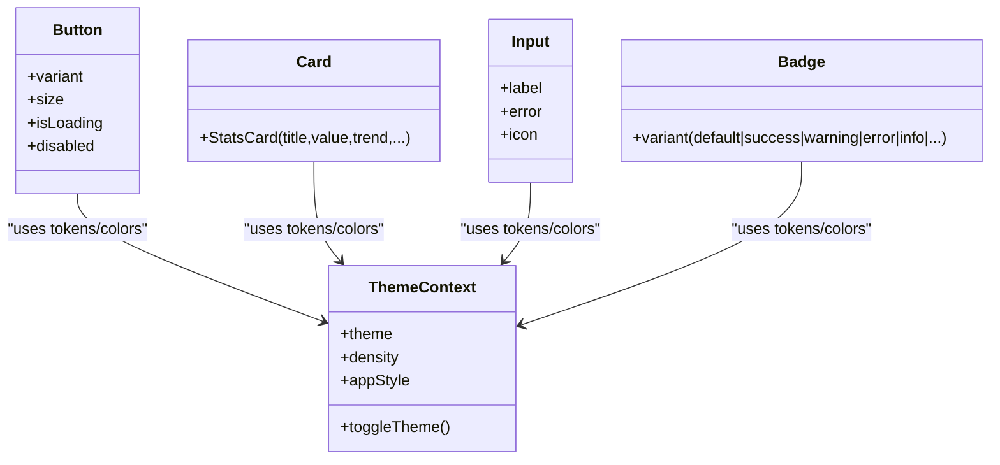
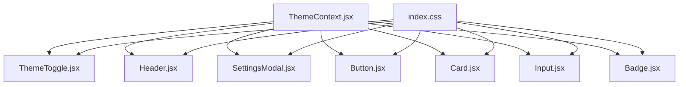

# Theming & Styling System

<cite>
**Referenced Files in This Document**
- [ThemeContext.jsx](file://frontend/src/context/ThemeContext.jsx)
- [ThemeToggle.jsx](file://frontend/src/components/ThemeToggle.jsx)
- [index.css](file://frontend/src/index.css)
- [main.jsx](file://frontend/src/main.jsx)
- [Button.jsx](file://frontend/src/components/ui/Button.jsx)
- [Card.jsx](file://frontend/src/components/ui/Card.jsx)
- [Input.jsx](file://frontend/src/components/ui/Input.jsx)
- [Badge.jsx](file://frontend/src/components/ui/Badge.jsx)
- [Header.jsx](file://frontend/src/components/Header.jsx)
- [Layout.jsx](file://frontend/src/components/Layout.jsx)
- [SettingsModal.jsx](file://frontend/src/components/SettingsModal.jsx)
- [package.json](file://frontend/package.json)
</cite>

## Table of Contents
1. [Introduction](#introduction)
2. [Project Structure](#project-structure)
3. [Core Components](#core-components)
4. [Architecture Overview](#architecture-overview)
5. [Detailed Component Analysis](#detailed-component-analysis)
6. [Dependency Analysis](#dependency-analysis)
7. [Performance Considerations](#performance-considerations)
8. [Troubleshooting Guide](#troubleshooting-guide)
9. [Conclusion](#conclusion)
10. [Appendices](#appendices)

## Introduction
This document describes MedVita’s Tailwind CSS-based theming and styling system. It explains how ThemeContext manages light/dark mode, density, and app style preferences, how ThemeToggle toggles themes and persists user choices, and how Tailwind utility classes, CSS variables, and component-specific patterns work together. It also covers theme-aware components, responsive design, accessibility considerations, customization options, and performance optimization strategies.

## Project Structure
The theming system is centered around a React context provider and global CSS variables. The provider is mounted at the application root and injects theme state into the component tree. UI components consume theme state via hooks and apply Tailwind classes and CSS variables to render consistently across modes and styles.

**Diagram sources**
- [main.jsx](file://frontend/src/main.jsx#L8-L16)
- [ThemeContext.jsx](file://frontend/src/context/ThemeContext.jsx#L5-L69)
- [Header.jsx](file://frontend/src/components/Header.jsx#L17-L157)
- [ThemeToggle.jsx](file://frontend/src/components/ThemeToggle.jsx#L5-L30)
- [SettingsModal.jsx](file://frontend/src/components/SettingsModal.jsx#L212-L399)
- [index.css](file://frontend/src/index.css#L1-L781)

**Section sources**
- [main.jsx](file://frontend/src/main.jsx#L8-L16)
- [ThemeContext.jsx](file://frontend/src/context/ThemeContext.jsx#L5-L69)
- [index.css](file://frontend/src/index.css#L1-L781)

## Core Components
- ThemeContext: Provides theme state (light/dark), density (compact/normal/spacious), and app style (modern/minimal). Persists selections to localStorage and applies attributes/classes to document.documentElement for global styling.
- ThemeToggle: A theme switcher button that reads current theme and triggers toggle via context.
- Global CSS: Defines CSS variables, dark mode variant, and component overrides for modern vs minimal styles.

Key behaviors:
- Initial selection: Reads localStorage or prefers-color-scheme media query.
- Persistence: Saves theme, density, and app style to localStorage on change.
- DOM attributes: Applies theme class and data-* attributes to root for CSS selectors.
- Component integration: UI components use Tailwind utilities and CSS variable-backed classes.

**Section sources**
- [ThemeContext.jsx](file://frontend/src/context/ThemeContext.jsx#L5-L69)
- [ThemeToggle.jsx](file://frontend/src/components/ThemeToggle.jsx#L5-L30)
- [index.css](file://frontend/src/index.css#L3-L59)
- [index.css](file://frontend/src/index.css#L61-L183)

## Architecture Overview
The theming pipeline connects React state to CSS variables and Tailwind variants. Changes propagate automatically to all components that rely on CSS variables and Tailwind utilities.

**Diagram sources**
- [ThemeToggle.jsx](file://frontend/src/components/ThemeToggle.jsx#L5-L30)
- [ThemeContext.jsx](file://frontend/src/context/ThemeContext.jsx#L34-L51)
- [index.css](file://frontend/src/index.css#L3-L59)
- [index.css](file://frontend/src/index.css#L111-L183)

## Detailed Component Analysis

### ThemeContext
- Responsibilities:
  - Initialize theme, density, and app style from localStorage or system defaults.
  - Apply theme class and data attributes to document.documentElement.
  - Persist updates to localStorage.
  - Expose toggleTheme and setters for density/appStyle.
- Data model:
  - theme: "light" | "dark"
  - density: "compact" | "normal" | "spacious"
  - appStyle: "modern" | "minimal"
- Effects:
  - Adds/removes ".dark" class.
  - Sets "data-density" and "data-app-style" attributes.
  - Updates localStorage for persistence.

**Diagram sources**
- [ThemeContext.jsx](file://frontend/src/context/ThemeContext.jsx#L5-L69)

**Section sources**
- [ThemeContext.jsx](file://frontend/src/context/ThemeContext.jsx#L5-L69)

### ThemeToggle
- Purpose: Toggle between light and dark modes.
- Behavior:
  - Uses useTheme to read current theme and toggle callback.
  - Renders sun/moon icons conditionally with transitions.
  - Integrates with accessibility via aria-label.
- Styling:
  - Uses Tailwind utilities and gradients.
  - Conditionally applies color classes based on theme.

**Diagram sources**
- [ThemeToggle.jsx](file://frontend/src/components/ThemeToggle.jsx#L5-L30)
- [ThemeContext.jsx](file://frontend/src/context/ThemeContext.jsx#L53-L55)

**Section sources**
- [ThemeToggle.jsx](file://frontend/src/components/ThemeToggle.jsx#L5-L30)
- [ThemeContext.jsx](file://frontend/src/context/ThemeContext.jsx#L53-L55)

### Header Integration
- The Header component imports ThemeToggle and displays it in the toolbar.
- It also uses theme-aware Tailwind classes for backgrounds, borders, and text colors.
- The header demonstrates responsive design and accessibility with focus rings and aria labels.

**Section sources**
- [Header.jsx](file://frontend/src/components/Header.jsx#L17-L157)
- [ThemeToggle.jsx](file://frontend/src/components/ThemeToggle.jsx#L5-L30)

### SettingsModal Customization
- Appearance section: Lets users switch between light and dark modes directly.
- Workspace Style: Switches between "modern" (vibrant, glassy) and "minimal" (flat, clean).
- Interface Density: Allows compact, normal, or spacious layouts.
- These settings update appStyle and density via ThemeContext setters.

**Section sources**
- [SettingsModal.jsx](file://frontend/src/components/SettingsModal.jsx#L212-L399)
- [ThemeContext.jsx](file://frontend/src/context/ThemeContext.jsx#L58-L69)

### Styling Architecture: Tailwind + CSS Variables
- CSS variables define brand colors, surfaces, shadows, and typography tokens.
- Dark mode variant selector targets root with ".dark".
- App style variants adjust backgrounds, borders, shadows, and remove glass effects in minimal mode.
- Density variants scale base font size, spacing, and radii.

**Diagram sources**
- [index.css](file://frontend/src/index.css#L5-L59)
- [index.css](file://frontend/src/index.css#L61-L183)
- [index.css](file://frontend/src/index.css#L96-L109)
- [index.css](file://frontend/src/index.css#L139-L183)

**Section sources**
- [index.css](file://frontend/src/index.css#L5-L59)
- [index.css](file://frontend/src/index.css#L61-L183)
- [index.css](file://frontend/src/index.css#L96-L109)
- [index.css](file://frontend/src/index.css#L139-L183)

### Theme-Aware UI Components
- Button: Uses Tailwind color utilities and hover/active states; integrates with theme via color tokens.
- Card: Demonstrates theme-aware hover and shadow transitions.
- Input: Uses CSS class "input-field" backed by CSS variables for background, border, and focus states.
- Badge: Provides semantic variants mapped to brand and status colors.

**Diagram sources**
- [Button.jsx](file://frontend/src/components/ui/Button.jsx#L5-L50)
- [Card.jsx](file://frontend/src/components/ui/Card.jsx#L3-L53)
- [Input.jsx](file://frontend/src/components/ui/Input.jsx#L6-L44)
- [Badge.jsx](file://frontend/src/components/ui/Badge.jsx#L3-L31)
- [ThemeContext.jsx](file://frontend/src/context/ThemeContext.jsx#L58-L69)

**Section sources**
- [Button.jsx](file://frontend/src/components/ui/Button.jsx#L5-L50)
- [Card.jsx](file://frontend/src/components/ui/Card.jsx#L3-L53)
- [Input.jsx](file://frontend/src/components/ui/Input.jsx#L6-L44)
- [Badge.jsx](file://frontend/src/components/ui/Badge.jsx#L3-L31)

### Responsive Design Implementation
- Breakpoints and responsive utilities are applied directly in component classes (e.g., md: prefixes).
- Layout.jsx uses responsive widths and padding for sidebar and content areas.
- Header adapts search bar and avatar layout for small screens.

**Section sources**
- [Layout.jsx](file://frontend/src/components/Layout.jsx#L8-L42)
- [Header.jsx](file://frontend/src/components/Header.jsx#L40-L157)

### Accessibility Considerations
- Focus management: Buttons and interactive elements use focus-visible utilities and ring classes.
- ARIA: ThemeToggle includes aria-label for screen readers.
- Color contrast: ThemeContext variables define accessible foreground/background pairs for both light and dark modes.
- Motion: Transitions and animations are reduced in minimal style; avoid excessive motion where appropriate.

**Section sources**
- [ThemeToggle.jsx](file://frontend/src/components/ThemeToggle.jsx#L18-L28)
- [index.css](file://frontend/src/index.css#L139-L183)

### Theme Customization Options
- Theme: light/dark
- Density: compact/normal/spacious
- App Style: modern/minimal
- These are persisted to localStorage and applied to document.documentElement for CSS selectors.

**Section sources**
- [ThemeContext.jsx](file://frontend/src/context/ThemeContext.jsx#L5-L69)
- [SettingsModal.jsx](file://frontend/src/components/SettingsModal.jsx#L212-L399)

### CSS-in-JS Alternatives
- Current approach relies on CSS variables and Tailwind utilities; no CSS-in-JS libraries are used.
- Alternative approaches could include styled-components or emotion, but they would require migrating existing Tailwind-based components and CSS variables.

**Section sources**
- [package.json](file://frontend/package.json#L13-L32)
- [index.css](file://frontend/src/index.css#L1-L781)

## Dependency Analysis
- ThemeContext depends on React Context and localStorage APIs.
- ThemeToggle depends on ThemeContext and renders theme-specific visuals.
- UI components depend on Tailwind utilities and CSS variables defined in index.css.
- SettingsModal depends on ThemeContext setters to update theme/density/style.

**Diagram sources**
- [ThemeContext.jsx](file://frontend/src/context/ThemeContext.jsx#L5-L69)
- [ThemeToggle.jsx](file://frontend/src/components/ThemeToggle.jsx#L5-L30)
- [Header.jsx](file://frontend/src/components/Header.jsx#L17-L157)
- [SettingsModal.jsx](file://frontend/src/components/SettingsModal.jsx#L212-L399)
- [Button.jsx](file://frontend/src/components/ui/Button.jsx#L5-L50)
- [Card.jsx](file://frontend/src/components/ui/Card.jsx#L3-L53)
- [Input.jsx](file://frontend/src/components/ui/Input.jsx#L6-L44)
- [Badge.jsx](file://frontend/src/components/ui/Badge.jsx#L3-L31)
- [index.css](file://frontend/src/index.css#L1-L781)

**Section sources**
- [ThemeContext.jsx](file://frontend/src/context/ThemeContext.jsx#L5-L69)
- [ThemeToggle.jsx](file://frontend/src/components/ThemeToggle.jsx#L5-L30)
- [Header.jsx](file://frontend/src/components/Header.jsx#L17-L157)
- [SettingsModal.jsx](file://frontend/src/components/SettingsModal.jsx#L212-L399)
- [Button.jsx](file://frontend/src/components/ui/Button.jsx#L5-L50)
- [Card.jsx](file://frontend/src/components/ui/Card.jsx#L3-L53)
- [Input.jsx](file://frontend/src/components/ui/Input.jsx#L6-L44)
- [Badge.jsx](file://frontend/src/components/ui/Badge.jsx#L3-L31)
- [index.css](file://frontend/src/index.css#L1-L781)

## Performance Considerations
- CSS variables minimize reflows by centralizing theme tokens.
- Tailwind 4 utility classes are generated at build time; avoid dynamic class concatenation in hot paths.
- Persisting to localStorage avoids repeated server requests for theme preferences.
- Consider lazy-loading heavy assets and deferring non-critical animations in minimal style.
- Keep CSS selectors efficient; avoid deeply nested selectors that trigger expensive recalculations.

[No sources needed since this section provides general guidance]

## Troubleshooting Guide
- Theme does not persist across reloads:
  - Verify localStorage keys and ThemeProvider initialization.
  - Confirm useEffect runs and sets attributes on document.documentElement.
- ThemeToggle not switching:
  - Ensure useTheme is called within ThemeProvider.
  - Check that aria-label and click handlers are present.
- Minimal style not applying:
  - Confirm data-app-style attribute is set on root.
  - Verify CSS overrides for glass panels and gradients are not overridden elsewhere.
- Density scaling not working:
  - Ensure data-density attribute is set and CSS variables scale factors are applied.

**Section sources**
- [ThemeContext.jsx](file://frontend/src/context/ThemeContext.jsx#L5-L69)
- [ThemeToggle.jsx](file://frontend/src/components/ThemeToggle.jsx#L5-L30)
- [index.css](file://frontend/src/index.css#L41-L59)
- [index.css](file://frontend/src/index.css#L96-L109)
- [index.css](file://frontend/src/index.css#L139-L183)

## Conclusion
MedVita’s theming system combines a lightweight React context with Tailwind CSS and CSS variables to deliver a flexible, persistent, and accessible theming experience. Users can switch between light/dark modes, choose between modern and minimal styles, and adjust interface density. The system’s reliance on CSS variables and Tailwind ensures fast rendering and easy customization while maintaining consistent design tokens across components.

[No sources needed since this section summarizes without analyzing specific files]

## Appendices

### Appendix A: Theme Tokens Reference
- Brand colors: primary-brand, accent-emerald, accent-blue
- Surfaces: bg-app, bg-card, bg-sidebar, bg-glass
- Typography: font-sans, font-mono
- Shadows: shadow-sm, shadow-md, shadow-lg, shadow-glow
- Animations: animate-float, animate-glow, animate-slide-up

**Section sources**
- [index.css](file://frontend/src/index.css#L5-L59)
- [index.css](file://frontend/src/index.css#L61-L183)