# Patient Management

<cite>
**Referenced Files in This Document**
- [README.md](file://README.md)
- [WIKI.md](file://WIKI.md)
- [schema.sql](file://backend/schema.sql)
- [supabaseClient.js](file://frontend/src/lib/supabaseClient.js)
- [AuthContext.jsx](file://frontend/src/context/AuthContext.jsx)
- [ProtectedRoute.jsx](file://frontend/src/components/ProtectedRoute.jsx)
- [PatientsManager.jsx](file://frontend/src/pages/PatientsManager.jsx)
- [ReceptionDashboard.jsx](file://frontend/src/pages/ReceptionDashboard.jsx)
- [AppointmentsManager.jsx](file://frontend/src/pages/AppointmentsManager.jsx)
- [DashboardHome.jsx](file://frontend/src/pages/DashboardHome.jsx)
- [PatientDetails.jsx](file://frontend/src/components/PatientDetails.jsx)
- [PrescriptionCreator.jsx](file://frontend/src/components/PrescriptionCreator.jsx)
- [PrescriptionsViewer.jsx](file://frontend/src/pages/PrescriptionsViewer.jsx)
- [PrescriptionPreviewModal.jsx](file://frontend/src/components/PrescriptionPreviewModal.jsx)
- [googleCalendar.js](file://frontend/src/lib/googleCalendar.js)
- [send-prescription-email/index.ts](file://supabase/functions/send-prescription-email/index.ts)
</cite>

## Table of Contents
1. [Introduction](#introduction)
2. [Project Structure](#project-structure)
3. [Core Components](#core-components)
4. [Architecture Overview](#architecture-overview)
5. [Detailed Component Analysis](#detailed-component-analysis)
6. [Dependency Analysis](#dependency-analysis)
7. [Performance Considerations](#performance-considerations)
8. [Troubleshooting Guide](#troubleshooting-guide)
9. [Conclusion](#conclusion)
10. [Appendices](#appendices)

## Introduction
This document describes the patient management workflows in MedVita, focusing on patient registration, profile management, medical history tracking, queue management for front desk operations, check-in procedures, and staff-patient interactions. It also covers patient search and filtering, profile updates, emergency contact management, integration with appointment scheduling, prescription creation, and billing systems. Workflow patterns for patient onboarding, status tracking, and discharge procedures are outlined, along with data privacy considerations, consent management, and audit trails. Examples of automation and integration with external healthcare systems are included.

## Project Structure
MedVita is a React + Vite frontend integrated with Supabase for backend and real-time features. The patient management system spans:
- Authentication and routing guards
- Doctor, patient, and receptionist dashboards
- Patient registry and profile management
- Queue management for front desk
- Appointment scheduling and calendar integration
- Prescription lifecycle and email delivery
- Storage for clinical documents

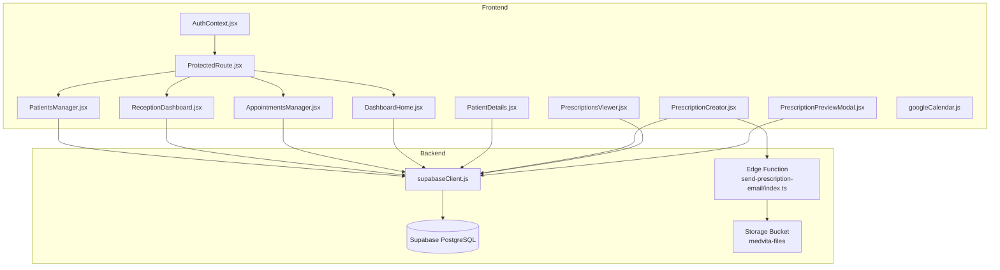

**Diagram sources**
- [AuthContext.jsx](file://frontend/src/context/AuthContext.jsx#L1-L108)
- [ProtectedRoute.jsx](file://frontend/src/components/ProtectedRoute.jsx#L1-L108)
- [PatientsManager.jsx](file://frontend/src/pages/PatientsManager.jsx#L1-L667)
- [ReceptionDashboard.jsx](file://frontend/src/pages/ReceptionDashboard.jsx#L1-L455)
- [AppointmentsManager.jsx](file://frontend/src/pages/AppointmentsManager.jsx#L1-L577)
- [DashboardHome.jsx](file://frontend/src/pages/DashboardHome.jsx#L1-L487)
- [PatientDetails.jsx](file://frontend/src/components/PatientDetails.jsx#L1-L400)
- [PrescriptionCreator.jsx](file://frontend/src/components/PrescriptionCreator.jsx#L1-L303)
- [PrescriptionsViewer.jsx](file://frontend/src/pages/PrescriptionsViewer.jsx#L1-L273)
- [PrescriptionPreviewModal.jsx](file://frontend/src/components/PrescriptionPreviewModal.jsx#L1-L331)
- [googleCalendar.js](file://frontend/src/lib/googleCalendar.js#L1-L199)
- [supabaseClient.js](file://frontend/src/lib/supabaseClient.js#L1-L11)
- [send-prescription-email/index.ts](file://supabase/functions/send-prescription-email/index.ts#L1-L193)

**Section sources**
- [README.md](file://README.md#L1-L89)
- [WIKI.md](file://WIKI.md#L108-L169)

## Core Components
- Authentication and RBAC: Centralized in AuthContext and enforced by ProtectedRoute. Roles: doctor, patient, receptionist.
- Patient Registry: Full CRUD in PatientsManager with search, filters, and vitals.
- Queue Management: ReceptionDashboard for front desk queue and real-time updates.
- Appointments: Calendar-based booking and management with Google Calendar integration.
- Prescriptions: Creation, PDF generation, storage, and email delivery via edge function.
- Medical History: PatientDetails timeline combining appointments and prescriptions.
- Storage: Secure bucket for clinical documents; prescriptions uploaded and shared via public URLs.

**Section sources**
- [AuthContext.jsx](file://frontend/src/context/AuthContext.jsx#L1-L108)
- [ProtectedRoute.jsx](file://frontend/src/components/ProtectedRoute.jsx#L53-L106)
- [PatientsManager.jsx](file://frontend/src/pages/PatientsManager.jsx#L15-L667)
- [ReceptionDashboard.jsx](file://frontend/src/pages/ReceptionDashboard.jsx#L37-L455)
- [AppointmentsManager.jsx](file://frontend/src/pages/AppointmentsManager.jsx#L14-L577)
- [PrescriptionCreator.jsx](file://frontend/src/components/PrescriptionCreator.jsx#L11-L303)
- [PrescriptionsViewer.jsx](file://frontend/src/pages/PrescriptionsViewer.jsx#L9-L273)
- [PatientDetails.jsx](file://frontend/src/components/PatientDetails.jsx#L9-L400)
- [PrescriptionPreviewModal.jsx](file://frontend/src/components/PrescriptionPreviewModal.jsx#L134-L331)
- [googleCalendar.js](file://frontend/src/lib/googleCalendar.js#L1-L199)
- [send-prescription-email/index.ts](file://supabase/functions/send-prescription-email/index.ts#L1-L193)

## Architecture Overview
MedVita uses Supabase for authentication, database, storage, and serverless functions. The frontend communicates via the Supabase client, leveraging real-time subscriptions for live updates. Edge functions handle asynchronous tasks like sending prescription emails.

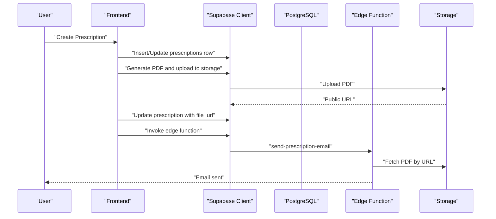

**Diagram sources**
- [PrescriptionCreator.jsx](file://frontend/src/components/PrescriptionCreator.jsx#L100-L188)
- [PrescriptionPreviewModal.jsx](file://frontend/src/components/PrescriptionPreviewModal.jsx#L186-L224)
- [send-prescription-email/index.ts](file://supabase/functions/send-prescription-email/index.ts#L25-L193)

## Detailed Component Analysis

### Patient Registration and Profile Management
- Registration: Receptionist adds new walk-in patients to today’s queue; the system auto-generates a patient ID and associates with the receptionist’s employer (doctor).
- Profile Updates: Doctors and receptionists can edit patient details; patients can view their own records.
- Search and Filters: PatientsManager supports real-time search by name or ID and date-range filters (today, week, month, all).
- Vitals: Blood pressure and heart rate captured during registration/update.

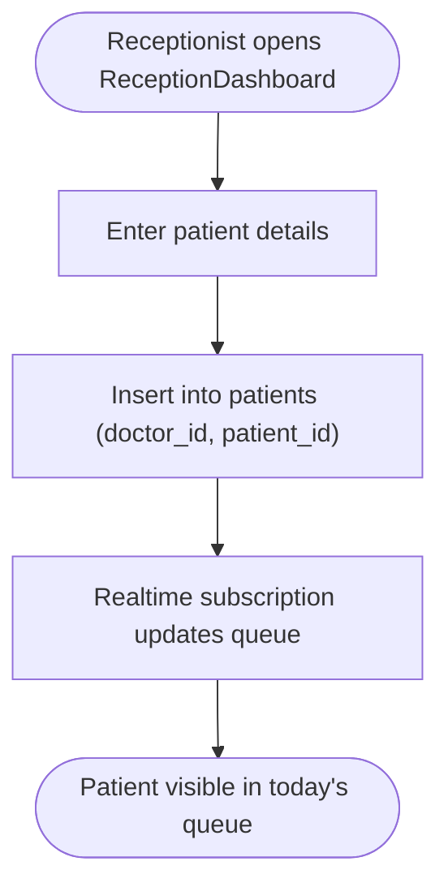

**Diagram sources**
- [ReceptionDashboard.jsx](file://frontend/src/pages/ReceptionDashboard.jsx#L149-L189)
- [PatientsManager.jsx](file://frontend/src/pages/PatientsManager.jsx#L56-L121)

**Section sources**
- [ReceptionDashboard.jsx](file://frontend/src/pages/ReceptionDashboard.jsx#L37-L455)
- [PatientsManager.jsx](file://frontend/src/pages/PatientsManager.jsx#L15-L667)
- [schema.sql](file://backend/schema.sql#L45-L116)

### Queue Management for Front Desk Operations
- Real-time queue: ReceptionDashboard subscribes to real-time changes for today’s patients and displays live updates.
- Status tracking: Receptionist can mark patients as seen; doctor dashboard mirrors queue status for check-in/check-out.
- Doctor’s Today’s Queue: DashboardHome shows waiting and seen patients, with quick actions to prescribe.

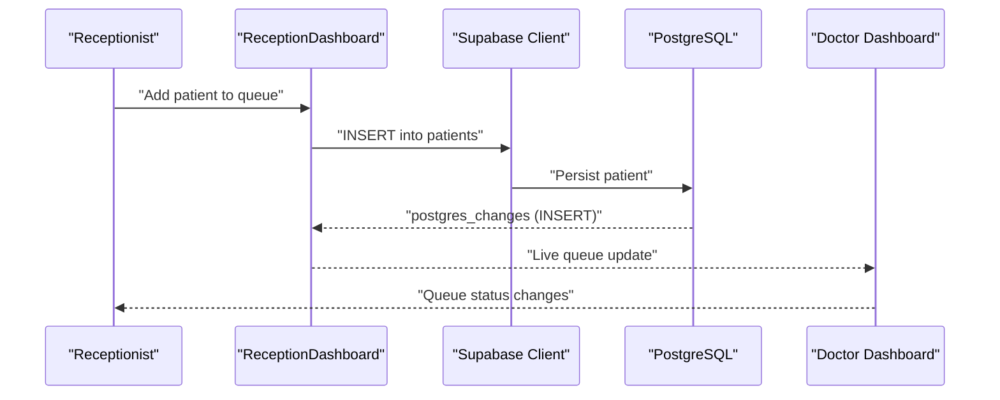

**Diagram sources**
- [ReceptionDashboard.jsx](file://frontend/src/pages/ReceptionDashboard.jsx#L71-L113)
- [DashboardHome.jsx](file://frontend/src/pages/DashboardHome.jsx#L41-L76)

**Section sources**
- [ReceptionDashboard.jsx](file://frontend/src/pages/ReceptionDashboard.jsx#L37-L455)
- [DashboardHome.jsx](file://frontend/src/pages/DashboardHome.jsx#L14-L272)

### Patient Check-In Procedures and Staff-Patient Interactions
- Check-in: Receptionist adds patients; doctor marks seen from the dashboard.
- Interaction: Doctor can immediately prescribe upon check-in; patient history is available via PatientDetails.
- Notifications: Email delivery of prescriptions via edge function; optional Google Calendar sync for appointments.

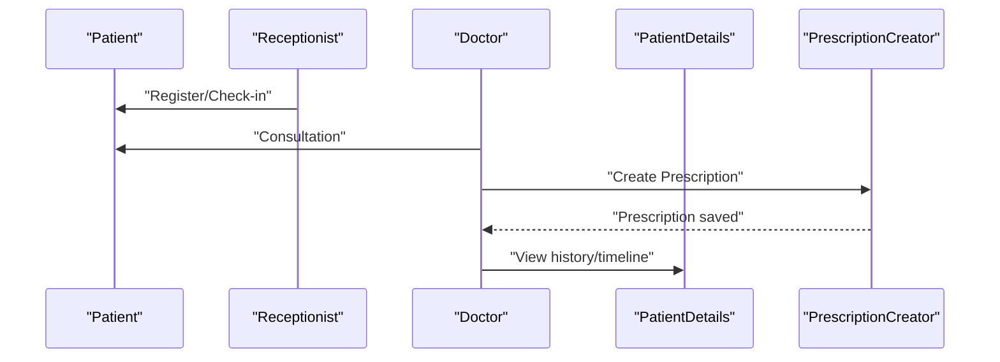

**Diagram sources**
- [ReceptionDashboard.jsx](file://frontend/src/pages/ReceptionDashboard.jsx#L149-L189)
- [DashboardHome.jsx](file://frontend/src/pages/DashboardHome.jsx#L90-L93)
- [PatientDetails.jsx](file://frontend/src/components/PatientDetails.jsx#L44-L90)
- [PrescriptionCreator.jsx](file://frontend/src/components/PrescriptionCreator.jsx#L100-L188)

**Section sources**
- [DashboardHome.jsx](file://frontend/src/pages/DashboardHome.jsx#L14-L272)
- [PatientDetails.jsx](file://frontend/src/components/PatientDetails.jsx#L9-L400)
- [PrescriptionCreator.jsx](file://frontend/src/components/PrescriptionCreator.jsx#L11-L303)

### Patient Search and Filtering, Profile Updates, Emergency Contacts
- Search: PatientsManager supports real-time search by name or ID with debounced queries.
- Filters: Date range filters (today, week, month, all) applied to patient list.
- Profile updates: Edit modal captures personal info, vitals, and optional contact details.
- Emergency contacts: While not explicitly modeled in the schema, contact fields (email, phone) support emergency linkage.

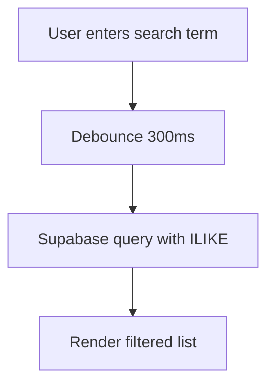

**Diagram sources**
- [PatientsManager.jsx](file://frontend/src/pages/PatientsManager.jsx#L113-L121)
- [PatientsManager.jsx](file://frontend/src/pages/PatientsManager.jsx#L75-L77)

**Section sources**
- [PatientsManager.jsx](file://frontend/src/pages/PatientsManager.jsx#L15-L667)
- [schema.sql](file://backend/schema.sql#L45-L116)

### Integration with Appointment Scheduling, Prescription Creation, and Billing
- Appointments: Calendar-based booking with time-slot selection; optional Google Calendar sync; list and grid views.
- Prescriptions: Text-based creation with PDF generation and storage; email delivery via edge function; optional auto-download.
- Billing: Not implemented in the current codebase; prescriptions can be viewed and downloaded for billing purposes.

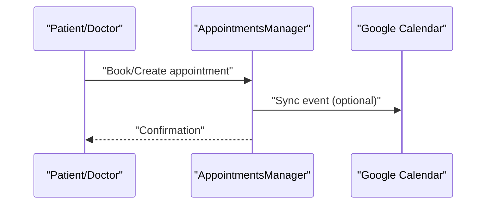

**Diagram sources**
- [AppointmentsManager.jsx](file://frontend/src/pages/AppointmentsManager.jsx#L134-L180)
- [googleCalendar.js](file://frontend/src/lib/googleCalendar.js#L125-L178)

**Section sources**
- [AppointmentsManager.jsx](file://frontend/src/pages/AppointmentsManager.jsx#L14-L577)
- [PrescriptionCreator.jsx](file://frontend/src/components/PrescriptionCreator.jsx#L100-L188)
- [PrescriptionsViewer.jsx](file://frontend/src/pages/PrescriptionsViewer.jsx#L57-L131)
- [googleCalendar.js](file://frontend/src/lib/googleCalendar.js#L1-L199)

### Workflow Patterns: Onboarding, Status Tracking, Discharge
- Onboarding: Receptionist registers walk-in patients; doctor receives live queue updates; initial vitals captured.
- Status tracking: Real-time seen/waiting indicators; appointment status updates; vitals visibility.
- Discharge: Mark seen in queue; prescribe if needed; patient receives email with PDF; history retained.

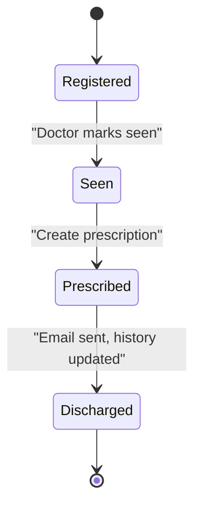

**Diagram sources**
- [DashboardHome.jsx](file://frontend/src/pages/DashboardHome.jsx#L78-L88)
- [PrescriptionCreator.jsx](file://frontend/src/components/PrescriptionCreator.jsx#L100-L188)
- [PatientDetails.jsx](file://frontend/src/components/PatientDetails.jsx#L44-L90)

**Section sources**
- [DashboardHome.jsx](file://frontend/src/pages/DashboardHome.jsx#L14-L272)
- [ReceptionDashboard.jsx](file://frontend/src/pages/ReceptionDashboard.jsx#L37-L455)
- [PrescriptionCreator.jsx](file://frontend/src/components/PrescriptionCreator.jsx#L11-L303)

### Data Privacy, Consent, and Audit Trails
- RBAC and RLS: Role-based access and row-level security policies restrict data visibility and mutations.
- Consent: Not explicitly modeled; patient opt-in for email delivery is implicit via the email field.
- Audit: Supabase logs and edge function invocations provide traceability; storage URLs enable document sharing with access control.

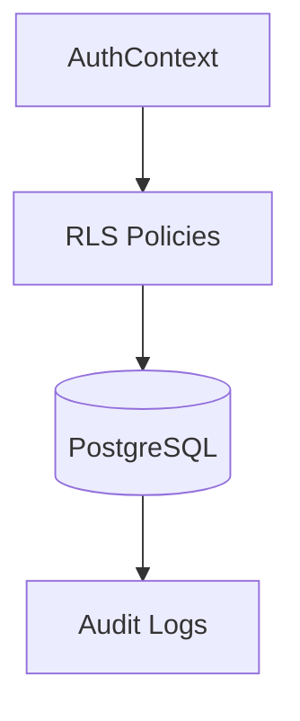

**Diagram sources**
- [AuthContext.jsx](file://frontend/src/context/AuthContext.jsx#L14-L61)
- [schema.sql](file://backend/schema.sql#L30-L237)

**Section sources**
- [schema.sql](file://backend/schema.sql#L30-L237)
- [AuthContext.jsx](file://frontend/src/context/AuthContext.jsx#L1-L108)

### Examples of Automation and External Integrations
- Prescription email automation: Edge function fetches PDF from storage, attaches, and sends via Resend.
- Google Calendar sync: Optional sync of appointments to Google Calendar; fallback link generation.
- Storage automation: PDF uploads to a public bucket with secure access.

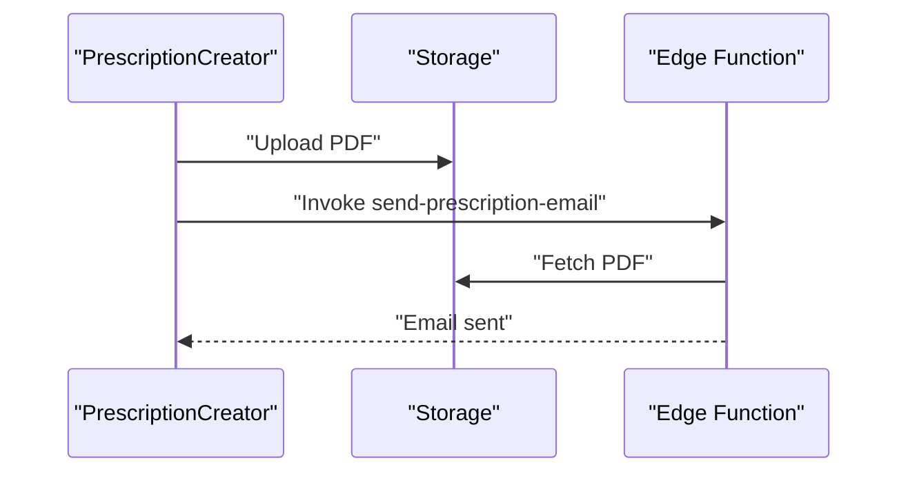

**Diagram sources**
- [PrescriptionCreator.jsx](file://frontend/src/components/PrescriptionCreator.jsx#L142-L168)
- [send-prescription-email/index.ts](file://supabase/functions/send-prescription-email/index.ts#L48-L58)
- [PrescriptionPreviewModal.jsx](file://frontend/src/components/PrescriptionPreviewModal.jsx#L186-L224)

**Section sources**
- [send-prescription-email/index.ts](file://supabase/functions/send-prescription-email/index.ts#L1-L193)
- [PrescriptionCreator.jsx](file://frontend/src/components/PrescriptionCreator.jsx#L11-L303)
- [googleCalendar.js](file://frontend/src/lib/googleCalendar.js#L180-L199)

## Dependency Analysis
- Frontend depends on Supabase client for all persistence and real-time features.
- Edge functions depend on Supabase storage and external APIs (Resend).
- Real-time subscriptions connect UI updates to database changes.

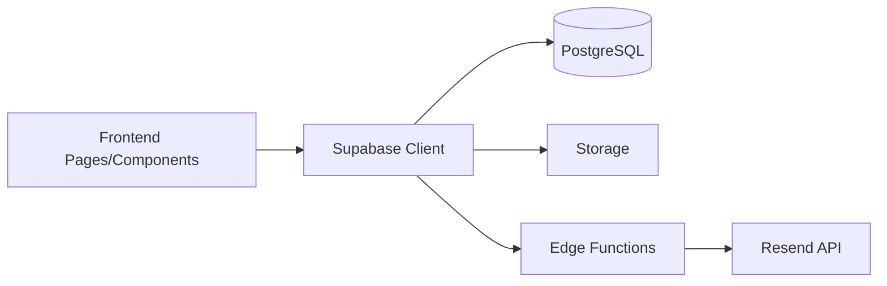

**Diagram sources**
- [supabaseClient.js](file://frontend/src/lib/supabaseClient.js#L1-L11)
- [send-prescription-email/index.ts](file://supabase/functions/send-prescription-email/index.ts#L31-L46)

**Section sources**
- [supabaseClient.js](file://frontend/src/lib/supabaseClient.js#L1-L11)
- [schema.sql](file://backend/schema.sql#L226-L237)

## Performance Considerations
- Debounced search reduces query frequency.
- Real-time subscriptions minimize polling and keep UI synchronized.
- PDF generation occurs client-side with optimized rendering; consider server-side generation for heavy workloads.
- Storage uploads use compressed images; ensure appropriate file sizes for compliance.

[No sources needed since this section provides general guidance]

## Troubleshooting Guide
- Authentication issues: Verify environment variables and session state in AuthContext.
- Access denied: ProtectedRoute enforces role-based redirection; check profile role and allowed roles.
- Real-time not updating: Confirm channel subscription and network connectivity.
- Prescription email failures: Check edge function secrets and Resend configuration.
- Calendar sync errors: Validate Google OAuth setup and token storage.

**Section sources**
- [AuthContext.jsx](file://frontend/src/context/AuthContext.jsx#L14-L61)
- [ProtectedRoute.jsx](file://frontend/src/components/ProtectedRoute.jsx#L53-L106)
- [ReceptionDashboard.jsx](file://frontend/src/pages/ReceptionDashboard.jsx#L71-L113)
- [PrescriptionCreator.jsx](file://frontend/src/components/PrescriptionCreator.jsx#L151-L168)
- [googleCalendar.js](file://frontend/src/lib/googleCalendar.js#L72-L105)

## Conclusion
MedVita’s patient management system integrates robust RBAC, real-time queues, comprehensive patient records, and automated prescription workflows. The architecture leverages Supabase for scalability and security, with clear separation of concerns across components. Future enhancements could include explicit emergency contact modeling, billing integration, and advanced consent management.

[No sources needed since this section summarizes without analyzing specific files]

## Appendices
- Database schema highlights: profiles, patients, doctor_availability, appointments, prescriptions, storage policies.
- Environment configuration: Supabase URL/keys, optional Google Calendar client ID.

**Section sources**
- [schema.sql](file://backend/schema.sql#L45-L237)
- [WIKI.md](file://WIKI.md#L406-L428)