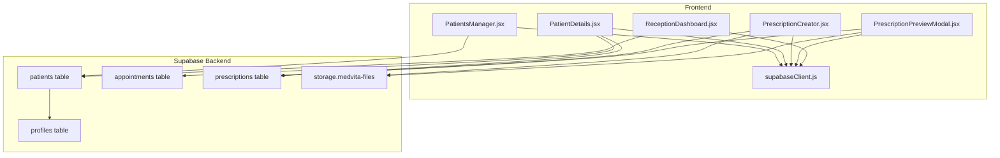
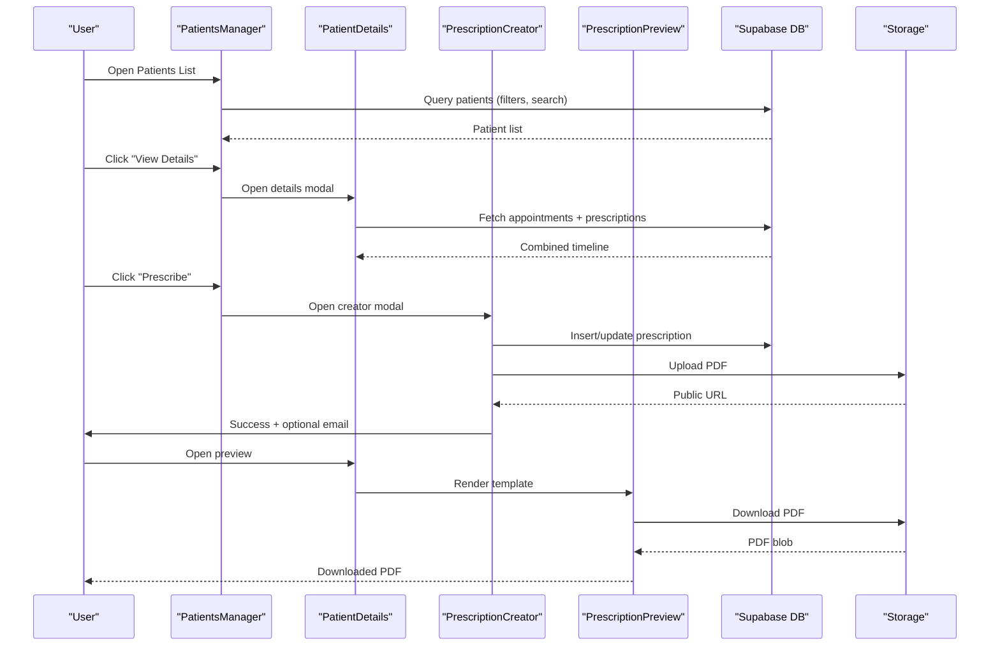
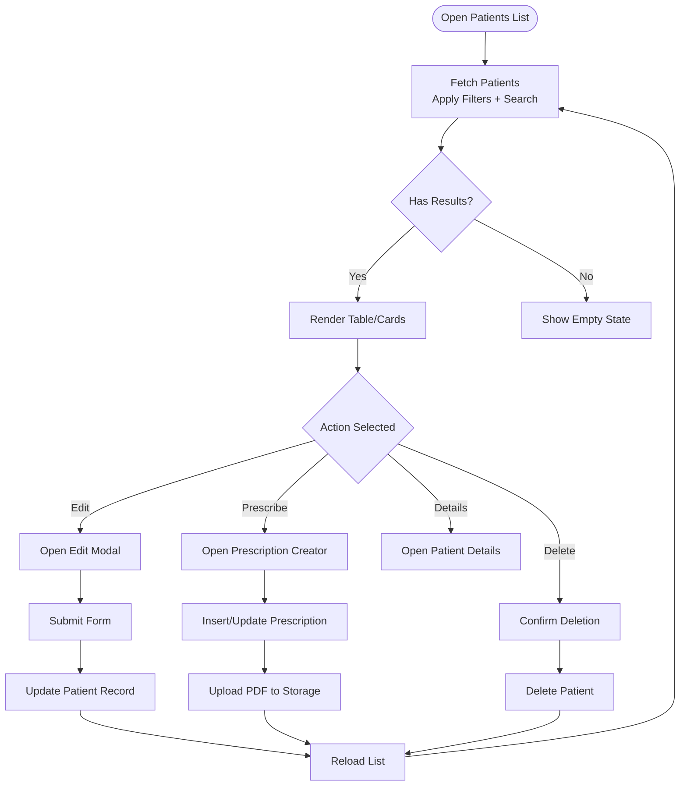
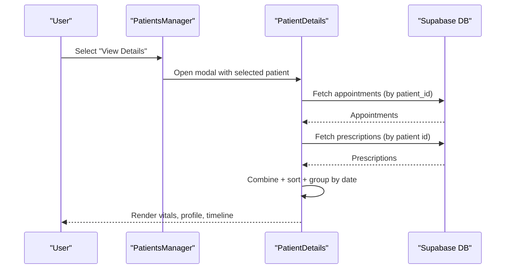
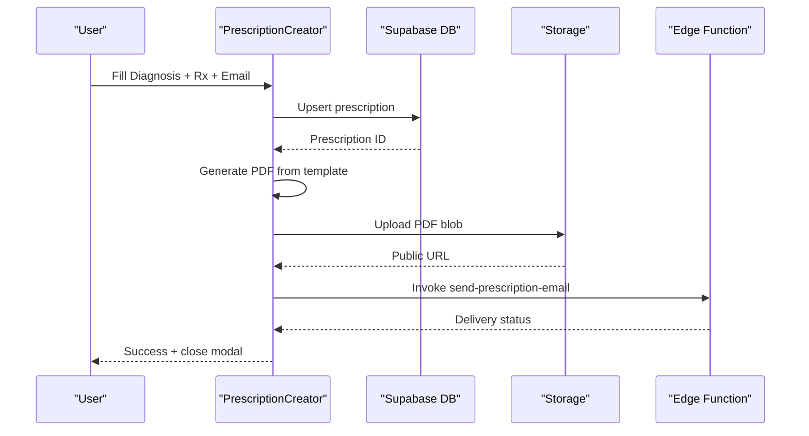
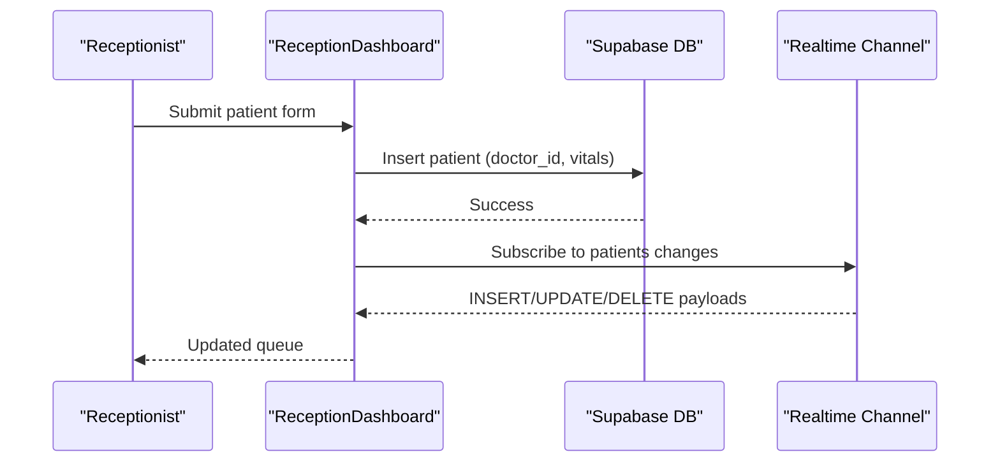
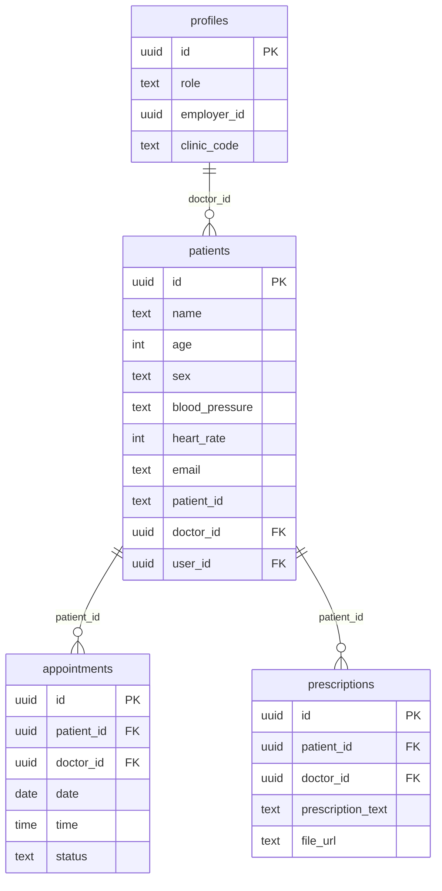
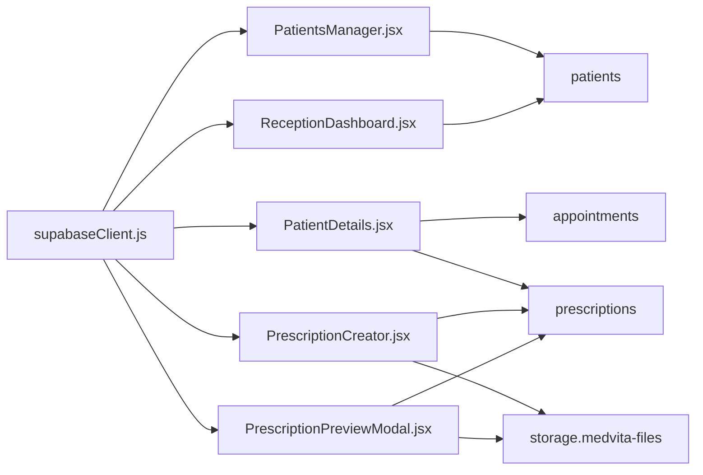

# Patient Profile Management

<cite>
**Referenced Files in This Document**
- [PatientsManager.jsx](file://frontend/src/pages/PatientsManager.jsx)
- [PatientDetails.jsx](file://frontend/src/components/PatientDetails.jsx)
- [PrescriptionCreator.jsx](file://frontend/src/components/PrescriptionCreator.jsx)
- [PrescriptionPreviewModal.jsx](file://frontend/src/components/PrescriptionPreviewModal.jsx)
- [ReceptionDashboard.jsx](file://frontend/src/pages/ReceptionDashboard.jsx)
- [supabaseClient.js](file://frontend/src/lib/supabaseClient.js)
- [schema.sql](file://backend/schema.sql)
</cite>

## Table of Contents
1. [Introduction](#introduction)
2. [Project Structure](#project-structure)
3. [Core Components](#core-components)
4. [Architecture Overview](#architecture-overview)
5. [Detailed Component Analysis](#detailed-component-analysis)
6. [Dependency Analysis](#dependency-analysis)
7. [Performance Considerations](#performance-considerations)
8. [Troubleshooting Guide](#troubleshooting-guide)
9. [Conclusion](#conclusion)

## Introduction
This document describes the patient profile management capabilities in MedVita, focusing on the end-to-end lifecycle of patient records: creation, viewing, editing, updating, and deletion. It also covers vitals tracking, the patient details modal, prescription workflows, real-time synchronization, search and filtering, and profile-related integrations. The goal is to provide both technical depth and practical guidance for developers and stakeholders.

## Project Structure
The patient profile management system spans the frontend React application and the Supabase backend:
- Frontend pages and components handle UI, state, and user interactions.
- Supabase provides real-time subscriptions, Row Level Security (RLS), and storage for documents.
- Backend schema defines tables, policies, and constraints for data integrity and access control.

**Diagram sources**
- [PatientsManager.jsx](file://frontend/src/pages/PatientsManager.jsx#L15-L667)
- [PatientDetails.jsx](file://frontend/src/components/PatientDetails.jsx#L9-L400)
- [PrescriptionCreator.jsx](file://frontend/src/components/PrescriptionCreator.jsx#L11-L303)
- [PrescriptionPreviewModal.jsx](file://frontend/src/components/PrescriptionPreviewModal.jsx#L134-L331)
- [ReceptionDashboard.jsx](file://frontend/src/pages/ReceptionDashboard.jsx#L37-L455)
- [supabaseClient.js](file://frontend/src/lib/supabaseClient.js#L1-L11)
- [schema.sql](file://backend/schema.sql#L45-L274)

**Section sources**
- [PatientsManager.jsx](file://frontend/src/pages/PatientsManager.jsx#L15-L667)
- [PatientDetails.jsx](file://frontend/src/components/PatientDetails.jsx#L9-L400)
- [PrescriptionCreator.jsx](file://frontend/src/components/PrescriptionCreator.jsx#L11-L303)
- [PrescriptionPreviewModal.jsx](file://frontend/src/components/PrescriptionPreviewModal.jsx#L134-L331)
- [ReceptionDashboard.jsx](file://frontend/src/pages/ReceptionDashboard.jsx#L37-L455)
- [supabaseClient.js](file://frontend/src/lib/supabaseClient.js#L1-L11)
- [schema.sql](file://backend/schema.sql#L45-L274)

## Core Components
- Patients Manager: Lists patients, supports search and date-range filtering, and provides quick actions (edit, prescribe, view details).
- Patient Details Modal: Displays vitals, medical profile placeholders, and timeline of appointments and prescriptions.
- Prescription Creator: Creates or updates prescriptions, generates PDFs, uploads to storage, and emails to patients.
- Prescription Preview Modal: Renders and downloads/print A4-format prescriptions.
- Reception Dashboard: Adds patients to the queue with vitals and enables real-time updates.
- Supabase Client: Centralized Supabase connection and environment configuration.
- Backend Schema: Defines tables, RLS policies, and storage permissions.

**Section sources**
- [PatientsManager.jsx](file://frontend/src/pages/PatientsManager.jsx#L15-L667)
- [PatientDetails.jsx](file://frontend/src/components/PatientDetails.jsx#L9-L400)
- [PrescriptionCreator.jsx](file://frontend/src/components/PrescriptionCreator.jsx#L11-L303)
- [PrescriptionPreviewModal.jsx](file://frontend/src/components/PrescriptionPreviewModal.jsx#L134-L331)
- [ReceptionDashboard.jsx](file://frontend/src/pages/ReceptionDashboard.jsx#L37-L455)
- [supabaseClient.js](file://frontend/src/lib/supabaseClient.js#L1-L11)
- [schema.sql](file://backend/schema.sql#L45-L274)

## Architecture Overview
The system integrates frontend UI with Supabase for data persistence, real-time updates, and secure file storage. RLS ensures that users only access data relevant to their role. The prescription workflow leverages HTML-to-PDF generation and Supabase Storage for document management.

**Diagram sources**
- [PatientsManager.jsx](file://frontend/src/pages/PatientsManager.jsx#L56-L111)
- [PatientDetails.jsx](file://frontend/src/components/PatientDetails.jsx#L44-L90)
- [PrescriptionCreator.jsx](file://frontend/src/components/PrescriptionCreator.jsx#L100-L188)
- [PrescriptionPreviewModal.jsx](file://frontend/src/components/PrescriptionPreviewModal.jsx#L186-L230)
- [schema.sql](file://backend/schema.sql#L200-L237)

## Detailed Component Analysis

### Patients Manager (CRUD + Search + Filters)
- CRUD operations:
  - Create: Opens add modal, submits form, inserts into patients with doctor linkage.
  - Read: Fetches patients with optional date range and search filters.
  - Update: Opens edit modal, submits changes, updates patient record.
  - Delete: Confirms and deletes patient record.
- Search and filters:
  - Debounced search across name and patient_id.
  - Date filters: today, week, month, all.
- Vitals display: Shows BP and HR when present.
- Status indicators: Active badge; “Prescribed Today” indicator derived from prescriptions created today.
- Actions: Prescribe, Edit, Delete; Details view opens modal.

**Diagram sources**
- [PatientsManager.jsx](file://frontend/src/pages/PatientsManager.jsx#L56-L175)
- [PatientsManager.jsx](file://frontend/src/pages/PatientsManager.jsx#L177-L205)

**Section sources**
- [PatientsManager.jsx](file://frontend/src/pages/PatientsManager.jsx#L15-L667)

### Patient Details Modal (Vitals + Timeline + Prescriptions)
- Vitals card: Displays recent vitals (BP, HR, Temp, Weight) using a default medical profile.
- Medical profile card: Shows allergies, chronic conditions, and blood type (placeholders).
- Timeline: Combines appointments and prescriptions, grouped by date, sorted descending.
- Prescription actions: View, download PDF, and preview.

**Diagram sources**
- [PatientDetails.jsx](file://frontend/src/components/PatientDetails.jsx#L44-L90)

**Section sources**
- [PatientDetails.jsx](file://frontend/src/components/PatientDetails.jsx#L9-L400)

### Prescription Creator (Creation + PDF Generation + Email)
- Inputs: Diagnosis, Rx/Treatment, Patient Email.
- Workflow:
  - Optionally update patient email.
  - Insert or update prescription record.
  - Generate PDF from template, upload to Supabase Storage, capture public URL.
  - Invoke Supabase Edge Function to email the PDF.
  - Success state closes modal and clears form.

**Diagram sources**
- [PrescriptionCreator.jsx](file://frontend/src/components/PrescriptionCreator.jsx#L100-L188)
- [PrescriptionPreviewModal.jsx](file://frontend/src/components/PrescriptionPreviewModal.jsx#L186-L230)

**Section sources**
- [PrescriptionCreator.jsx](file://frontend/src/components/PrescriptionCreator.jsx#L11-L303)
- [PrescriptionPreviewModal.jsx](file://frontend/src/components/PrescriptionPreviewModal.jsx#L134-L331)

### Reception Dashboard (Real-time Queue + Vitals Entry)
- Adds patients to today’s queue with vitals and auto-generates patient_id.
- Subscribes to real-time events for the doctor’s patients and updates the queue accordingly.
- Enforces RLS via doctor_id filter.

**Diagram sources**
- [ReceptionDashboard.jsx](file://frontend/src/pages/ReceptionDashboard.jsx#L149-L189)
- [ReceptionDashboard.jsx](file://frontend/src/pages/ReceptionDashboard.jsx#L76-L113)

**Section sources**
- [ReceptionDashboard.jsx](file://frontend/src/pages/ReceptionDashboard.jsx#L37-L455)

### Supabase Integration and Data Model
- Tables:
  - patients: core patient record with vitals, doctor_id, and optional user_id.
  - profiles: extended auth with role, employer_id, and clinic metadata.
  - appointments and prescriptions: linked to patients and doctors.
  - storage.buckets: medvita-files for PDFs.
- Policies:
  - Patients: selective access by doctor or receptionist linked to doctor; insert/update/delete controlled by doctor; select by patient email.
  - Prescriptions: managed by doctor; patients can view their own.
  - Storage: authenticated users can upload/view files in medvita-files.

**Diagram sources**
- [schema.sql](file://backend/schema.sql#L45-L237)

**Section sources**
- [schema.sql](file://backend/schema.sql#L45-L274)

## Dependency Analysis
- Frontend depends on Supabase client for queries, mutations, and real-time channels.
- Components coordinate around shared data:
  - PatientsManager drives list state and triggers modals.
  - PatientDetails composes data from appointments and prescriptions.
  - PrescriptionCreator coordinates DB writes, storage uploads, and function invocation.
- Backend enforces access control via RLS policies and manages storage permissions.

**Diagram sources**
- [supabaseClient.js](file://frontend/src/lib/supabaseClient.js#L1-L11)
- [PatientsManager.jsx](file://frontend/src/pages/PatientsManager.jsx#L1-L11)
- [PatientDetails.jsx](file://frontend/src/components/PatientDetails.jsx#L1-L8)
- [PrescriptionCreator.jsx](file://frontend/src/components/PrescriptionCreator.jsx#L1-L10)
- [PrescriptionPreviewModal.jsx](file://frontend/src/components/PrescriptionPreviewModal.jsx#L1-L8)
- [ReceptionDashboard.jsx](file://frontend/src/pages/ReceptionDashboard.jsx#L1-L4)
- [schema.sql](file://backend/schema.sql#L226-L237)

**Section sources**
- [supabaseClient.js](file://frontend/src/lib/supabaseClient.js#L1-L11)
- [PatientsManager.jsx](file://frontend/src/pages/PatientsManager.jsx#L1-L11)
- [PatientDetails.jsx](file://frontend/src/components/PatientDetails.jsx#L1-L8)
- [PrescriptionCreator.jsx](file://frontend/src/components/PrescriptionCreator.jsx#L1-L10)
- [PrescriptionPreviewModal.jsx](file://frontend/src/components/PrescriptionPreviewModal.jsx#L1-L8)
- [ReceptionDashboard.jsx](file://frontend/src/pages/ReceptionDashboard.jsx#L1-L4)
- [schema.sql](file://backend/schema.sql#L226-L237)

## Performance Considerations
- Debounced search: The search input debounces to reduce redundant queries.
- Efficient queries: Filtering by date ranges and ILIKE search minimizes result sets.
- Real-time updates: Subscriptions avoid polling and keep lists synchronized.
- PDF generation: Uses offscreen rendering and compression to balance quality and size.
- Pagination: Not implemented; consider virtualization for very large lists.

[No sources needed since this section provides general guidance]

## Troubleshooting Guide
- Real-time errors:
  - Reception dashboard logs channel errors and falls back to manual refresh.
- Permission errors:
  - Insertions may fail with RLS violations if employer_id does not match doctor_id.
- Validation feedback:
  - Reception dashboard shows toast notifications for success/error states.
- Prescription failures:
  - Errors during PDF generation or email sending are surfaced to the user.

**Section sources**
- [ReceptionDashboard.jsx](file://frontend/src/pages/ReceptionDashboard.jsx#L76-L113)
- [ReceptionDashboard.jsx](file://frontend/src/pages/ReceptionDashboard.jsx#L172-L188)
- [PatientsManager.jsx](file://frontend/src/pages/PatientsManager.jsx#L105-L110)

## Conclusion
MedVita’s patient profile management provides a cohesive, role-aware system for managing patient records, vitals, and prescriptions. The frontend offers intuitive CRUD operations, real-time synchronization, and robust prescription workflows integrated with Supabase Storage and Edge Functions. The backend schema and RLS policies ensure secure, scalable access control across roles.