# Patient Registration

<cite>
**Referenced Files in This Document**
- [schema.sql](file://backend/schema.sql)
- [PatientsManager.jsx](file://frontend/src/pages/PatientsManager.jsx)
- [ReceptionDashboard.jsx](file://frontend/src/pages/ReceptionDashboard.jsx)
- [PatientDetails.jsx](file://frontend/src/components/PatientDetails.jsx)
- [AuthContext.jsx](file://frontend/src/context/AuthContext.jsx)
- [supabaseClient.js](file://frontend/src/lib/supabaseClient.js)
- [Login.jsx](file://frontend/src/pages/Login.jsx)
- [Signup.jsx](file://frontend/src/pages/Signup.jsx)
- [ReceptionistSignup.jsx](file://frontend/src/pages/ReceptionistSignup.jsx)
- [SettingsModal.jsx](file://frontend/src/components/SettingsModal.jsx)
- [PrescriptionCreator.jsx](file://frontend/src/components/PrescriptionCreator.jsx)
- [SUPABASE_SETUP.md](file://_trash/SUPABASE_SETUP.md)
- [BACKEND_FIX.md](file://_trash/BACKEND_FIX.md)
</cite>

## Table of Contents
1. [Introduction](#introduction)
2. [Project Structure](#project-structure)
3. [Core Components](#core-components)
4. [Architecture Overview](#architecture-overview)
5. [Detailed Component Analysis](#detailed-component-analysis)
6. [Dependency Analysis](#dependency-analysis)
7. [Performance Considerations](#performance-considerations)
8. [Troubleshooting Guide](#troubleshooting-guide)
9. [Conclusion](#conclusion)
10. [Appendices](#appendices)

## Introduction
This document explains the patient registration functionality in MedVita, focusing on the end-to-end onboarding process: form collection, validation, data persistence, and profile creation. It covers the fields captured (name, age, sex, contact information, vitals), validation rules, error handling, integration with doctor profiles, patient-doctor relationship establishment, unique patient ID generation, automatic timestamping, and data sanitization. It also includes examples of successful registration flows, common validation errors, troubleshooting steps, and security/compliance considerations.

## Project Structure
The patient registration spans the frontend React application and the Supabase backend schema. The frontend collects and validates user input, persists data to Supabase tables, and enforces Row Level Security (RLS) policies. The backend schema defines the patients table, unique identifiers, timestamps, and doctor-patient relationships.

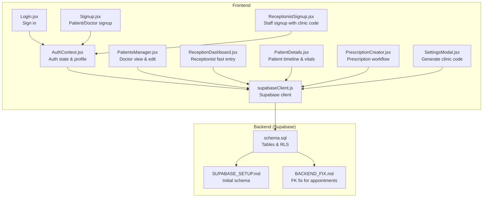

**Diagram sources**
- [AuthContext.jsx](file://frontend/src/context/AuthContext.jsx#L1-L108)
- [Login.jsx](file://frontend/src/pages/Login.jsx#L1-L204)
- [Signup.jsx](file://frontend/src/pages/Signup.jsx#L1-L224)
- [ReceptionistSignup.jsx](file://frontend/src/pages/ReceptionistSignup.jsx#L1-L245)
- [PatientsManager.jsx](file://frontend/src/pages/PatientsManager.jsx#L1-L667)
- [ReceptionDashboard.jsx](file://frontend/src/pages/ReceptionDashboard.jsx#L1-L455)
- [PatientDetails.jsx](file://frontend/src/components/PatientDetails.jsx#L1-L400)
- [PrescriptionCreator.jsx](file://frontend/src/components/PrescriptionCreator.jsx#L1-L200)
- [SettingsModal.jsx](file://frontend/src/components/SettingsModal.jsx#L120-L350)
- [supabaseClient.js](file://frontend/src/lib/supabaseClient.js#L1-L11)
- [schema.sql](file://backend/schema.sql#L1-L274)
- [SUPABASE_SETUP.md](file://_trash/SUPABASE_SETUP.md#L1-L163)
- [BACKEND_FIX.md](file://_trash/BACKEND_FIX.md#L1-L22)

**Section sources**
- [schema.sql](file://backend/schema.sql#L1-L274)
- [PatientsManager.jsx](file://frontend/src/pages/PatientsManager.jsx#L1-L667)
- [ReceptionDashboard.jsx](file://frontend/src/pages/ReceptionDashboard.jsx#L1-L455)
- [AuthContext.jsx](file://frontend/src/context/AuthContext.jsx#L1-L108)
- [supabaseClient.js](file://frontend/src/lib/supabaseClient.js#L1-L11)

## Core Components
- Frontend forms collect patient data and submit to Supabase.
- Backend schema defines the patients table, unique identifiers, timestamps, and doctor relationships.
- Authentication and profiles integrate with Supabase Auth and RLS policies.
- Real-time updates and prescriptions tie into the patient record lifecycle.

Key responsibilities:
- Form collection and validation (frontend)
- Unique ID generation and timestamping (backend)
- Doctor-patient relationship enforcement (RLS)
- Error handling and user feedback (frontend)

**Section sources**
- [PatientsManager.jsx](file://frontend/src/pages/PatientsManager.jsx#L34-L160)
- [ReceptionDashboard.jsx](file://frontend/src/pages/ReceptionDashboard.jsx#L44-L189)
- [schema.sql](file://backend/schema.sql#L46-L58)
- [AuthContext.jsx](file://frontend/src/context/AuthContext.jsx#L63-L90)

## Architecture Overview
The patient registration architecture connects user actions to Supabase tables through React components and Supabase client libraries. Authentication determines role-based access, and RLS ensures data isolation.

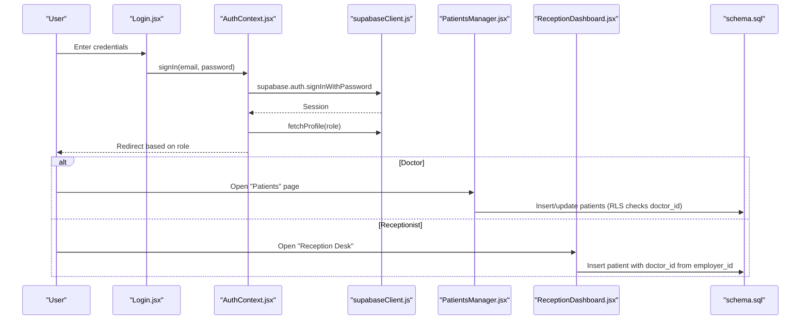

**Diagram sources**
- [Login.jsx](file://frontend/src/pages/Login.jsx#L20-L75)
- [AuthContext.jsx](file://frontend/src/context/AuthContext.jsx#L63-L90)
- [supabaseClient.js](file://frontend/src/lib/supabaseClient.js#L1-L11)
- [PatientsManager.jsx](file://frontend/src/pages/PatientsManager.jsx#L123-L160)
- [ReceptionDashboard.jsx](file://frontend/src/pages/ReceptionDashboard.jsx#L149-L189)
- [schema.sql](file://backend/schema.sql#L74-L111)

## Detailed Component Analysis

### Backend Schema: Patients, Profiles, and RLS
- The patients table stores personal and vitals data, a unique patient_id, and links to a doctor via doctor_id. It includes automatic timestamps and optional user_id linkage.
- Unique patient_id is generated server-side using a deterministic pattern.
- RLS policies restrict access to authorized users (doctors, receptionists linked to the doctor, patients themselves).
- Profiles table extends Supabase Auth with role and employer_id for receptionists.

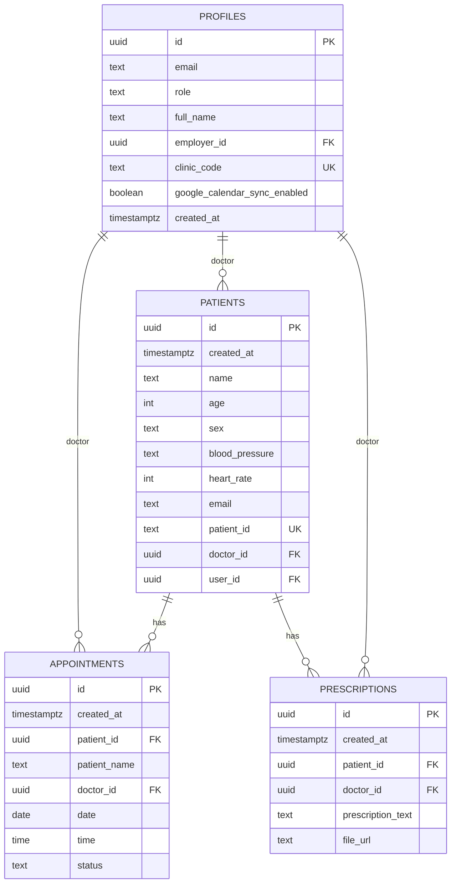

**Diagram sources**
- [schema.sql](file://backend/schema.sql#L46-L58)
- [schema.sql](file://backend/schema.sql#L118-L147)
- [schema.sql](file://backend/schema.sql#L201-L208)
- [schema.sql](file://backend/schema.sql#L5-L14)

**Section sources**
- [schema.sql](file://backend/schema.sql#L46-L58)
- [schema.sql](file://backend/schema.sql#L74-L111)
- [schema.sql](file://backend/schema.sql#L118-L147)
- [schema.sql](file://backend/schema.sql#L201-L208)
- [SUPABASE_SETUP.md](file://_trash/SUPABASE_SETUP.md#L43-L54)

### Doctor Onboarding and Profile Creation
- Authentication creates a user in Supabase Auth.
- A database trigger auto-creates a profile with role and optional employer_id for receptionists.
- Profiles include clinic_code for doctor staff onboarding.

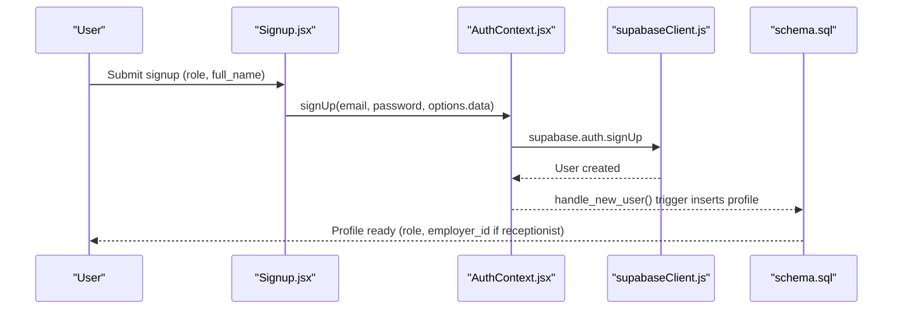

**Diagram sources**
- [Signup.jsx](file://frontend/src/pages/Signup.jsx#L26-L57)
- [AuthContext.jsx](file://frontend/src/context/AuthContext.jsx#L63-L82)
- [schema.sql](file://backend/schema.sql#L240-L274)

**Section sources**
- [Signup.jsx](file://frontend/src/pages/Signup.jsx#L26-L57)
- [AuthContext.jsx](file://frontend/src/context/AuthContext.jsx#L63-L82)
- [schema.sql](file://backend/schema.sql#L240-L274)

### Receptionist Staff Onboarding with Clinic Code
- Receptionists provide a 6-character clinic code during signup.
- The system validates the code against a doctor’s profile and sets employer_id.
- Password minimum length is enforced.

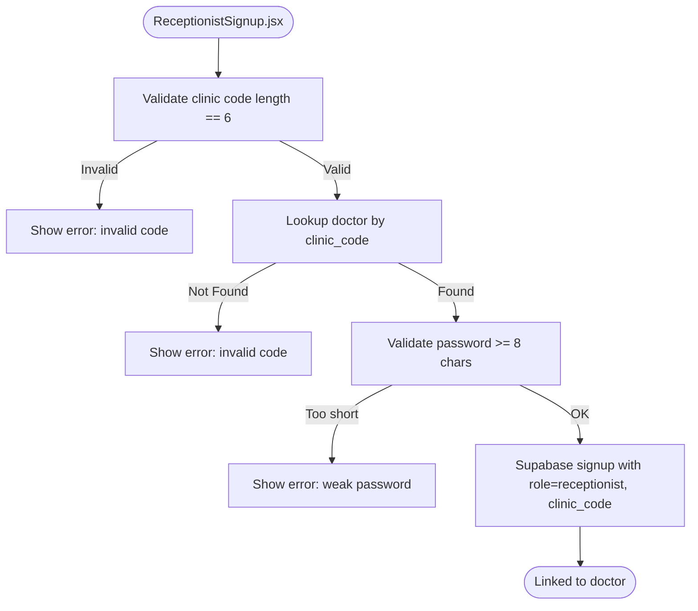

**Diagram sources**
- [ReceptionistSignup.jsx](file://frontend/src/pages/ReceptionistSignup.jsx#L17-L86)
- [schema.sql](file://backend/schema.sql#L250-L264)

**Section sources**
- [ReceptionistSignup.jsx](file://frontend/src/pages/ReceptionistSignup.jsx#L22-L32)
- [ReceptionistSignup.jsx](file://frontend/src/pages/ReceptionistSignup.jsx#L34-L46)
- [ReceptionistSignup.jsx](file://frontend/src/pages/ReceptionistSignup.jsx#L28-L32)
- [schema.sql](file://backend/schema.sql#L250-L264)

### Doctor-Patient Relationship Establishment
- Doctors create patients in the “Patients” view; the system sets doctor_id from the authenticated user.
- Receptionists add patients in the “Reception Desk”; the system sets doctor_id from employer_id.
- RLS policies ensure only authorized users can view/update/delete patients.

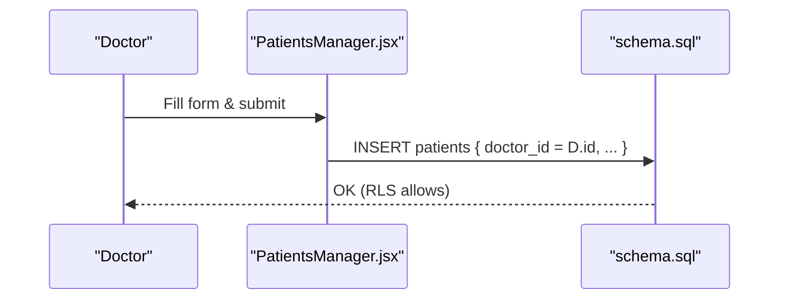

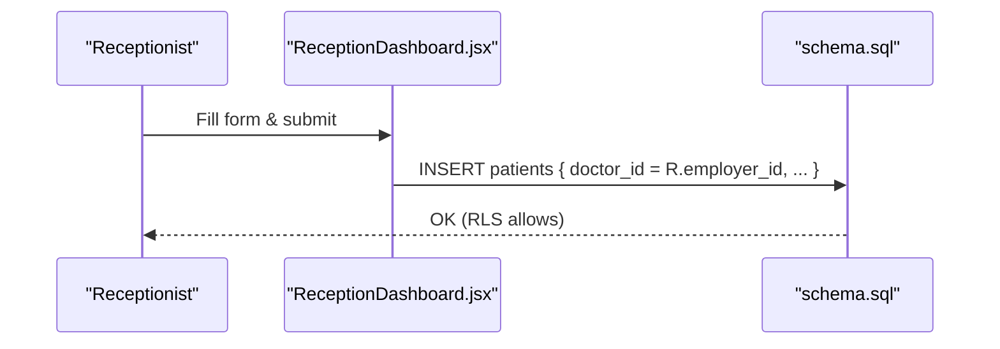

**Diagram sources**
- [PatientsManager.jsx](file://frontend/src/pages/PatientsManager.jsx#L123-L160)
- [ReceptionDashboard.jsx](file://frontend/src/pages/ReceptionDashboard.jsx#L149-L189)
- [schema.sql](file://backend/schema.sql#L89-L111)

**Section sources**
- [PatientsManager.jsx](file://frontend/src/pages/PatientsManager.jsx#L123-L160)
- [ReceptionDashboard.jsx](file://frontend/src/pages/ReceptionDashboard.jsx#L149-L189)
- [schema.sql](file://backend/schema.sql#L89-L111)

### Unique Patient ID Generation and Timestamping
- Unique patient_id is generated server-side using a deterministic pattern.
- created_at is automatically set on insert.
- Receptionists’ form also generates a random patient_id client-side for fast entry.

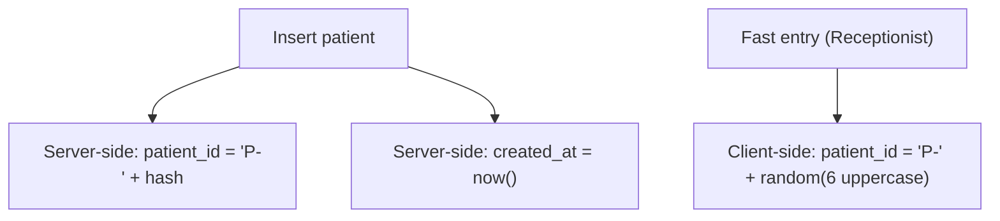

**Diagram sources**
- [schema.sql](file://backend/schema.sql#L55-L55)
- [ReceptionDashboard.jsx](file://frontend/src/pages/ReceptionDashboard.jsx#L158-L158)

**Section sources**
- [schema.sql](file://backend/schema.sql#L55-L55)
- [ReceptionDashboard.jsx](file://frontend/src/pages/ReceptionDashboard.jsx#L158-L158)

### Data Collection and Validation Rules
- Required fields: name (doctor view), name (reception view).
- Optional fields: email, phone, age, sex, blood pressure, heart rate.
- Age and heart rate are numeric; validated via parsing.
- Phone/email sanitized by trimming; lengths constrained by HTML attributes.
- Receptionist form enforces numeric bounds for age and heart rate.

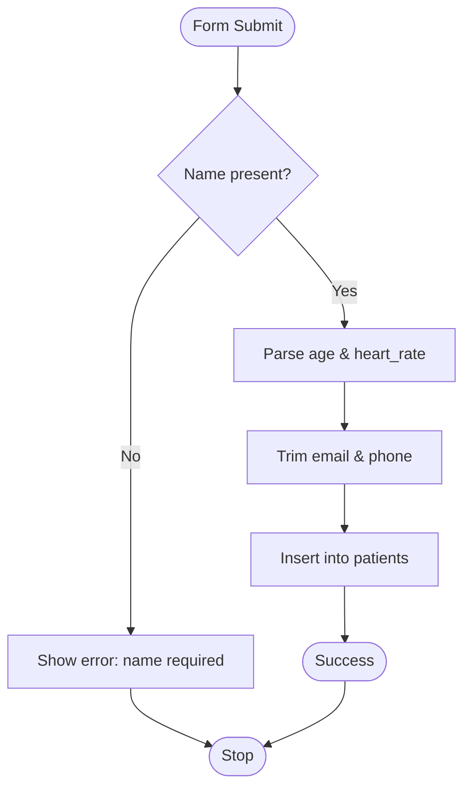

**Diagram sources**
- [PatientsManager.jsx](file://frontend/src/pages/PatientsManager.jsx#L123-L160)
- [ReceptionDashboard.jsx](file://frontend/src/pages/ReceptionDashboard.jsx#L149-L189)

**Section sources**
- [PatientsManager.jsx](file://frontend/src/pages/PatientsManager.jsx#L34-L160)
- [ReceptionDashboard.jsx](file://frontend/src/pages/ReceptionDashboard.jsx#L255-L354)

### Error Handling Mechanisms
- Frontend alerts and toasts surface errors from Supabase operations.
- RLS violations are handled with user-friendly messages.
- Login/signup pages detect common errors (invalid credentials, rate limits, email confirmation).

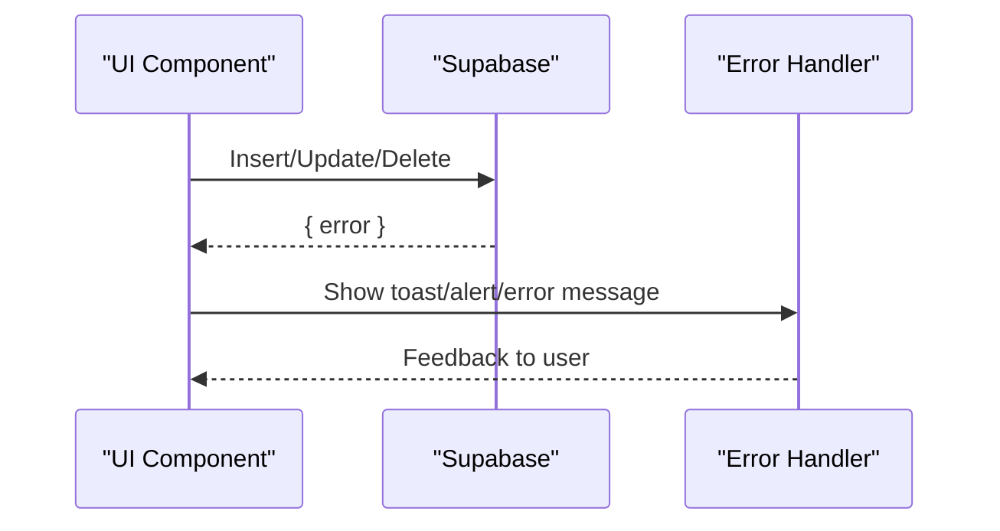

**Diagram sources**
- [PatientsManager.jsx](file://frontend/src/pages/PatientsManager.jsx#L157-L159)
- [ReceptionDashboard.jsx](file://frontend/src/pages/ReceptionDashboard.jsx#L172-L188)
- [Login.jsx](file://frontend/src/pages/Login.jsx#L59-L75)
- [ReceptionistSignup.jsx](file://frontend/src/pages/ReceptionistSignup.jsx#L72-L86)

**Section sources**
- [PatientsManager.jsx](file://frontend/src/pages/PatientsManager.jsx#L157-L159)
- [ReceptionDashboard.jsx](file://frontend/src/pages/ReceptionDashboard.jsx#L172-L188)
- [Login.jsx](file://frontend/src/pages/Login.jsx#L59-L75)
- [ReceptionistSignup.jsx](file://frontend/src/pages/ReceptionistSignup.jsx#L72-L86)

### Integration with Doctor Profiles and Clinic Codes
- Receptionists are linked to a doctor via clinic_code stored in their profile.
- Doctors can generate a unique clinic code for staff.
- The system validates the code and sets employer_id accordingly.

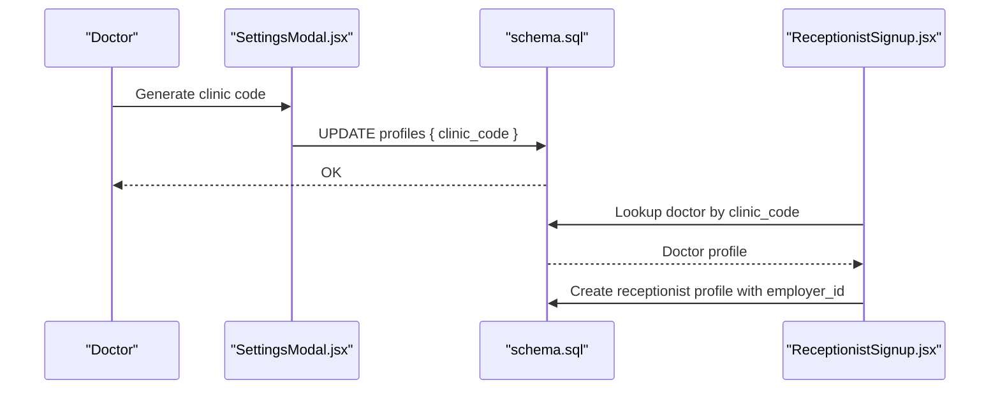

**Diagram sources**
- [SettingsModal.jsx](file://frontend/src/components/SettingsModal.jsx#L126-L152)
- [schema.sql](file://backend/schema.sql#L250-L264)
- [ReceptionistSignup.jsx](file://frontend/src/pages/ReceptionistSignup.jsx#L34-L46)

**Section sources**
- [SettingsModal.jsx](file://frontend/src/components/SettingsModal.jsx#L126-L152)
- [schema.sql](file://backend/schema.sql#L250-L264)
- [ReceptionistSignup.jsx](file://frontend/src/pages/ReceptionistSignup.jsx#L34-L46)

### Patient Timeline and Vitals Display
- The patient details panel aggregates appointments and prescriptions into a timeline.
- Vitals are shown in a dedicated card; medical profile placeholders are initialized.

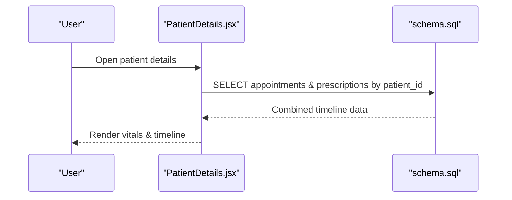

**Diagram sources**
- [PatientDetails.jsx](file://frontend/src/components/PatientDetails.jsx#L44-L90)
- [schema.sql](file://backend/schema.sql#L138-L147)
- [schema.sql](file://backend/schema.sql#L201-L208)

**Section sources**
- [PatientDetails.jsx](file://frontend/src/components/PatientDetails.jsx#L44-L90)
- [schema.sql](file://backend/schema.sql#L138-L147)
- [schema.sql](file://backend/schema.sql#L201-L208)

## Dependency Analysis
- Frontend depends on Supabase client for database operations.
- Backend depends on Supabase Auth and RLS policies for access control.
- Patient registration relies on authentication state and profile metadata.

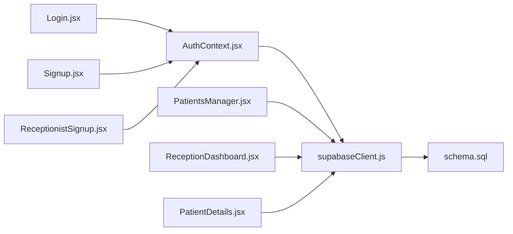

**Diagram sources**
- [AuthContext.jsx](file://frontend/src/context/AuthContext.jsx#L1-L108)
- [Login.jsx](file://frontend/src/pages/Login.jsx#L1-L204)
- [Signup.jsx](file://frontend/src/pages/Signup.jsx#L1-L224)
- [ReceptionistSignup.jsx](file://frontend/src/pages/ReceptionistSignup.jsx#L1-L245)
- [PatientsManager.jsx](file://frontend/src/pages/PatientsManager.jsx#L1-L667)
- [ReceptionDashboard.jsx](file://frontend/src/pages/ReceptionDashboard.jsx#L1-L455)
- [PatientDetails.jsx](file://frontend/src/components/PatientDetails.jsx#L1-L400)
- [supabaseClient.js](file://frontend/src/lib/supabaseClient.js#L1-L11)
- [schema.sql](file://backend/schema.sql#L1-L274)

**Section sources**
- [AuthContext.jsx](file://frontend/src/context/AuthContext.jsx#L1-L108)
- [supabaseClient.js](file://frontend/src/lib/supabaseClient.js#L1-L11)
- [schema.sql](file://backend/schema.sql#L1-L274)

## Performance Considerations
- Real-time subscriptions keep the reception queue fresh without polling.
- Debounced search reduces unnecessary queries in the patients list.
- Client-side trimming avoids storing extra whitespace.
- Numeric parsing prevents invalid entries and reduces downstream validation overhead.

[No sources needed since this section provides general guidance]

## Troubleshooting Guide
Common issues and resolutions:
- Invalid clinic code during staff signup: Verify the 6-character code matches the doctor’s profile.
- Weak password errors: Ensure password meets minimum length requirements.
- Permission denied when adding patients: Confirm the receptionist account is linked to the correct doctor (employer_id).
- Duplicate or invalid vitals: Ensure numeric fields are within reasonable ranges.
- Appointment foreign key errors: Apply the backend fix script to resolve constraints.

Actionable steps:
- Re-enter clinic code and retry staff signup.
- Adjust password length and retry.
- Refresh the reception queue; ensure employer_id is set.
- Validate numeric inputs and re-submit.
- Run the backend fix script for appointments.

**Section sources**
- [ReceptionistSignup.jsx](file://frontend/src/pages/ReceptionistSignup.jsx#L22-L32)
- [ReceptionistSignup.jsx](file://frontend/src/pages/ReceptionistSignup.jsx#L72-L86)
- [ReceptionDashboard.jsx](file://frontend/src/pages/ReceptionDashboard.jsx#L172-L188)
- [BACKEND_FIX.md](file://_trash/BACKEND_FIX.md#L1-L22)

## Conclusion
MedVita’s patient registration integrates secure authentication, robust RLS policies, and streamlined front-end forms. Unique identifiers, automatic timestamps, and real-time updates provide a reliable foundation for patient onboarding. Clear validation and error handling improve usability, while doctor-staff relationships and clinic codes support scalable clinic management.

[No sources needed since this section summarizes without analyzing specific files]

## Appendices

### Registration Form Fields and Validation Summary
- Personal Info
  - Full Name: required
  - Email: optional
  - Phone: optional
  - Age: numeric, optional
  - Gender: selection (Male/Female/Other), optional
- Vitals
  - Blood Pressure: text, optional
  - Heart Rate: numeric, optional

Validation highlights:
- Required name triggers immediate feedback.
- Numeric fields parsed safely; out-of-range values rejected by browser constraints.
- Email/Phone trimmed to remove accidental spaces.
- Receptionist form enforces numeric bounds for age and heart rate.

**Section sources**
- [PatientsManager.jsx](file://frontend/src/pages/PatientsManager.jsx#L522-L634)
- [ReceptionDashboard.jsx](file://frontend/src/pages/ReceptionDashboard.jsx#L255-L354)

### Successful Registration Flows
- Doctor adds a patient:
  - Open “Patients”, fill form, submit → RLS allows insert with doctor_id.
- Receptionist adds a patient:
  - Open “Reception Desk”, fill form, submit → RLS allows insert with employer_id.
- Staff signup with clinic code:
  - Enter code, name, email, password → RLS links receptionist to doctor.

**Section sources**
- [PatientsManager.jsx](file://frontend/src/pages/PatientsManager.jsx#L123-L160)
- [ReceptionDashboard.jsx](file://frontend/src/pages/ReceptionDashboard.jsx#L149-L189)
- [ReceptionistSignup.jsx](file://frontend/src/pages/ReceptionistSignup.jsx#L34-L46)

### Security and Compliance Notes
- Authentication via Supabase Auth with secure sign-up/sign-in.
- RLS policies enforce strict access control per role and relationship.
- Unique identifiers and timestamps aid audit trails.
- Consider HIPAA-compliant hosting and encryption at rest/in transit as per organizational policy.

[No sources needed since this section provides general guidance]