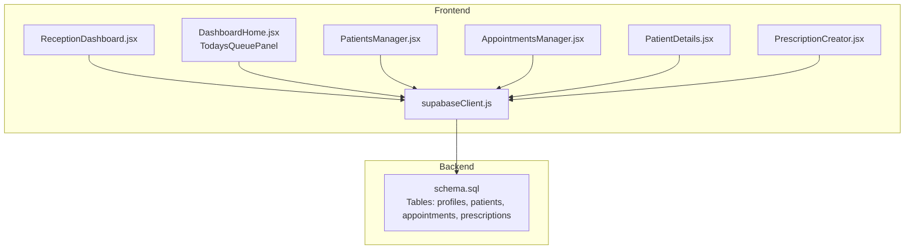
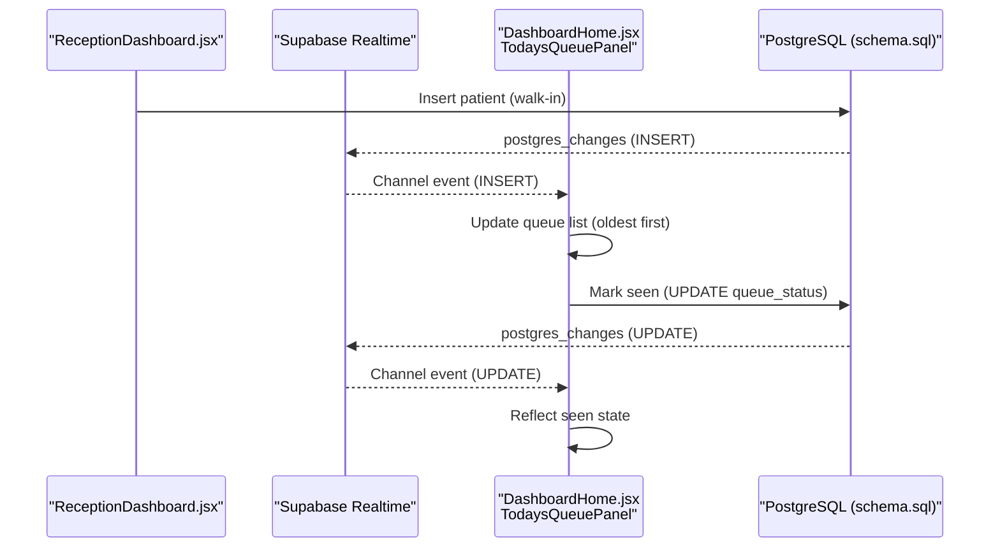
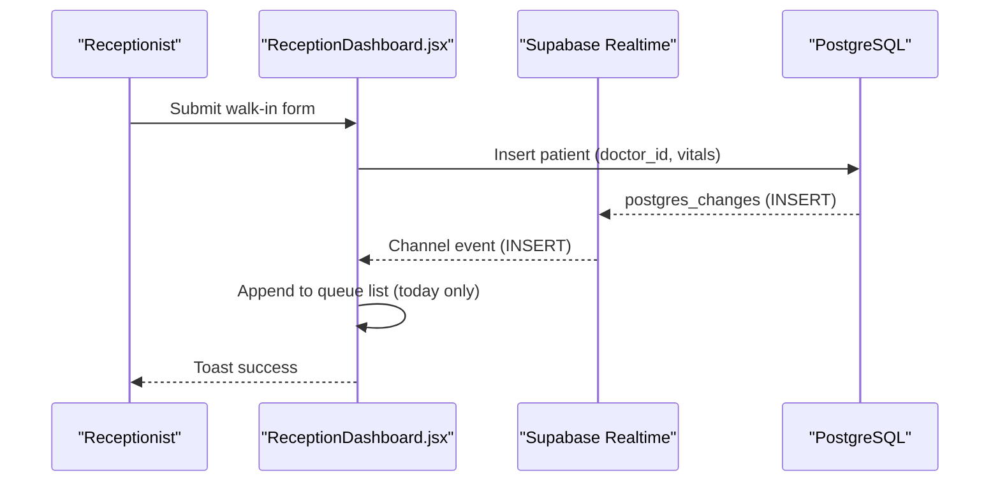
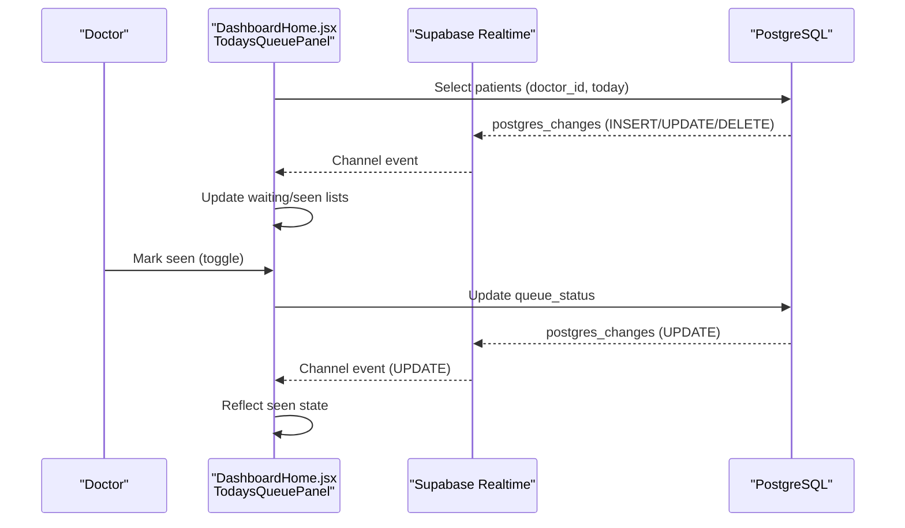
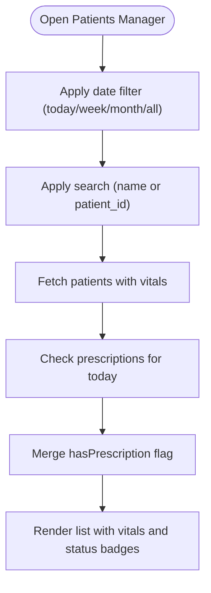
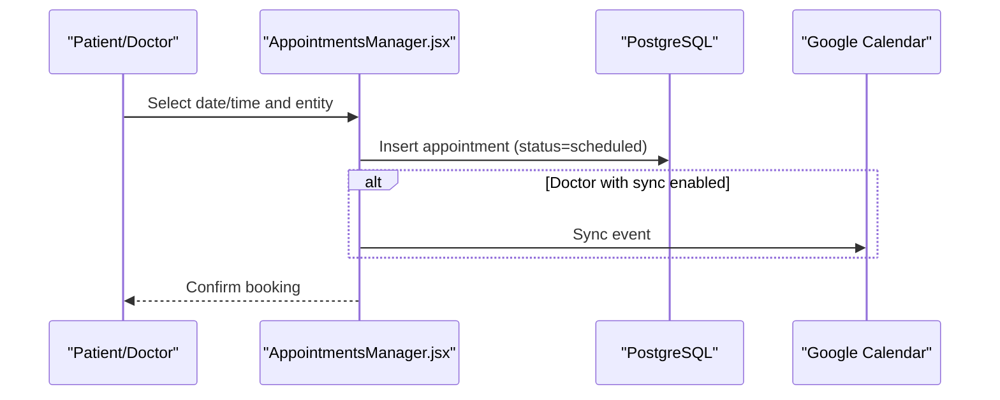
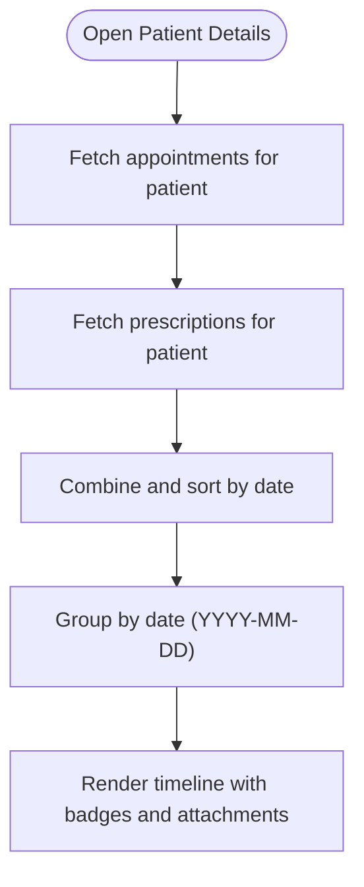
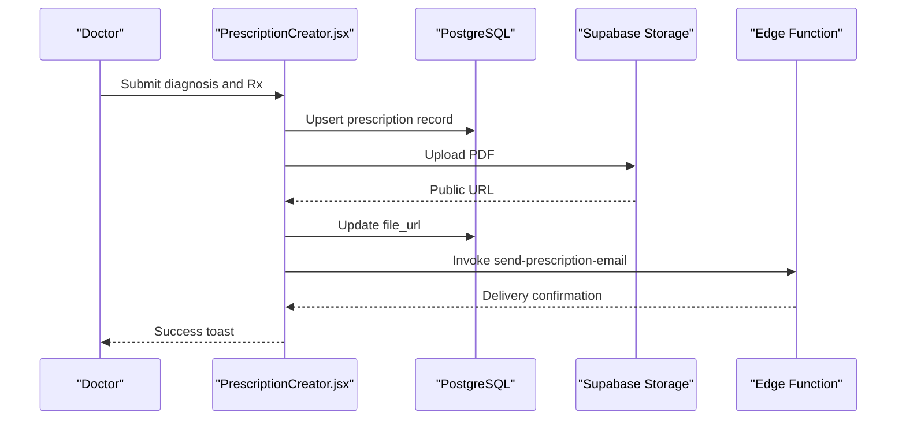
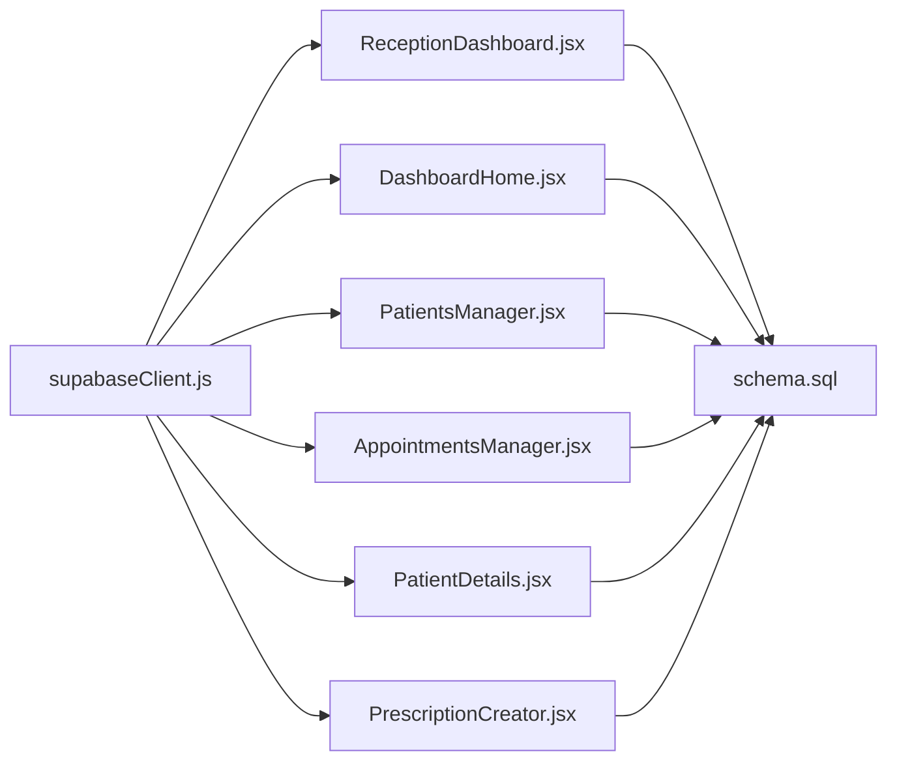

# Queue Management

<cite>
**Referenced Files in This Document**
- [ReceptionDashboard.jsx](file://frontend/src/pages/ReceptionDashboard.jsx)
- [DashboardHome.jsx](file://frontend/src/pages/DashboardHome.jsx)
- [PatientsManager.jsx](file://frontend/src/pages/PatientsManager.jsx)
- [AppointmentsManager.jsx](file://frontend/src/pages/AppointmentsManager.jsx)
- [PatientDetails.jsx](file://frontend/src/components/PatientDetails.jsx)
- [PrescriptionCreator.jsx](file://frontend/src/components/PrescriptionCreator.jsx)
- [schema.sql](file://backend/schema.sql)
- [supabaseClient.js](file://frontend/src/lib/supabaseClient.js)
- [SettingsModal.jsx](file://frontend/src/components/SettingsModal.jsx)
</cite>

## Table of Contents
1. [Introduction](#introduction)
2. [Project Structure](#project-structure)
3. [Core Components](#core-components)
4. [Architecture Overview](#architecture-overview)
5. [Detailed Component Analysis](#detailed-component-analysis)
6. [Dependency Analysis](#dependency-analysis)
7. [Performance Considerations](#performance-considerations)
8. [Troubleshooting Guide](#troubleshooting-guide)
9. [Conclusion](#conclusion)

## Introduction
This document describes the patient queue management system in MedVita’s reception workflow. It covers front desk operations including patient check-in, queue positioning, status tracking, and real-time updates. It also documents integration with appointment scheduling, walk-in handling, priority queuing, visual displays, notifications, staff assignment, analytics, wait time tracking, capacity management, billing integration touchpoints, optimization strategies, overflow handling, and performance monitoring for busy environments.

## Project Structure
The queue management spans three primary UI surfaces:
- Reception Dashboard: Front-desk check-in and live queue display for walk-ins
- Doctor Dashboard: Live queue panel with status controls and next-up highlighting
- Patients Manager: Historical queue and vitals context for staff actions

Supporting components include appointment scheduling, patient details, and prescription creation. The backend schema defines tables and policies for secure, role-based access to queue data.

**Diagram sources**
- [ReceptionDashboard.jsx](file://frontend/src/pages/ReceptionDashboard.jsx#L37-L454)
- [DashboardHome.jsx](file://frontend/src/pages/DashboardHome.jsx#L14-L272)
- [PatientsManager.jsx](file://frontend/src/pages/PatientsManager.jsx#L15-L666)
- [AppointmentsManager.jsx](file://frontend/src/pages/AppointmentsManager.jsx#L14-L576)
- [PatientDetails.jsx](file://frontend/src/components/PatientDetails.jsx#L9-L399)
- [PrescriptionCreator.jsx](file://frontend/src/components/PrescriptionCreator.jsx#L11-L302)
- [supabaseClient.js](file://frontend/src/lib/supabaseClient.js#L1-L11)
- [schema.sql](file://backend/schema.sql#L45-L224)

**Section sources**
- [ReceptionDashboard.jsx](file://frontend/src/pages/ReceptionDashboard.jsx#L37-L454)
- [DashboardHome.jsx](file://frontend/src/pages/DashboardHome.jsx#L14-L272)
- [PatientsManager.jsx](file://frontend/src/pages/PatientsManager.jsx#L15-L666)
- [AppointmentsManager.jsx](file://frontend/src/pages/AppointmentsManager.jsx#L14-L576)
- [PatientDetails.jsx](file://frontend/src/components/PatientDetails.jsx#L9-L399)
- [PrescriptionCreator.jsx](file://frontend/src/components/PrescriptionCreator.jsx#L11-L302)
- [supabaseClient.js](file://frontend/src/lib/supabaseClient.js#L1-L11)
- [schema.sql](file://backend/schema.sql#L45-L224)

## Core Components
- Reception Dashboard: Accepts walk-in patients, assigns unique IDs, and streams today’s queue in real time per doctor’s clinic.
- Doctor Dashboard Queue Panel: Displays today’s queue with positions, vitals, timestamps, seen/waiting statuses, and actions to mark seen or prescribe.
- Patients Manager: Provides historical queue context, vitals, and prescription linkage for today.
- Appointments Manager: Integrates scheduled visits with the queue by date and time, enabling capacity planning.
- Patient Details: Aggregates appointment and prescription history for clinical context.
- Prescription Creator: Creates and emails prescriptions, linking queue actions to billing workflows.

**Section sources**
- [ReceptionDashboard.jsx](file://frontend/src/pages/ReceptionDashboard.jsx#L47-L189)
- [DashboardHome.jsx](file://frontend/src/pages/DashboardHome.jsx#L26-L88)
- [PatientsManager.jsx](file://frontend/src/pages/PatientsManager.jsx#L56-L111)
- [AppointmentsManager.jsx](file://frontend/src/pages/AppointmentsManager.jsx#L67-L118)
- [PatientDetails.jsx](file://frontend/src/components/PatientDetails.jsx#L44-L90)
- [PrescriptionCreator.jsx](file://frontend/src/components/PrescriptionCreator.jsx#L100-L188)

## Architecture Overview
The system uses Supabase for real-time subscriptions and row-level security (RLS) to enforce role-based access. Receptionists add walk-in patients to a doctor’s clinic queue; the doctor’s queue panel reflects live updates. Appointments are scheduled separately and shown on the dashboard for capacity planning. Prescriptions created from queue actions integrate with storage and email functions.

**Diagram sources**
- [ReceptionDashboard.jsx](file://frontend/src/pages/ReceptionDashboard.jsx#L149-L189)
- [DashboardHome.jsx](file://frontend/src/pages/DashboardHome.jsx#L45-L76)
- [schema.sql](file://backend/schema.sql#L74-L111)

**Section sources**
- [ReceptionDashboard.jsx](file://frontend/src/pages/ReceptionDashboard.jsx#L47-L113)
- [DashboardHome.jsx](file://frontend/src/pages/DashboardHome.jsx#L26-L88)
- [schema.sql](file://backend/schema.sql#L74-L111)

## Detailed Component Analysis

### Reception Dashboard: Walk-in Check-in and Real-time Queue
- Purpose: Capture walk-in patients at the front desk and stream today’s queue per doctor’s clinic.
- Key behaviors:
  - Validates required fields and inserts a new patient record with a generated unique ID.
  - Filters queue by doctor’s clinic using employer_id and today’s date range.
  - Subscribes to a doctor-specific channel for real-time updates (insert/update/delete).
  - Displays queue with vitals, timestamps, and patient identifiers.

**Diagram sources**
- [ReceptionDashboard.jsx](file://frontend/src/pages/ReceptionDashboard.jsx#L149-L189)
- [ReceptionDashboard.jsx](file://frontend/src/pages/ReceptionDashboard.jsx#L71-L113)

**Section sources**
- [ReceptionDashboard.jsx](file://frontend/src/pages/ReceptionDashboard.jsx#L47-L113)
- [ReceptionDashboard.jsx](file://frontend/src/pages/ReceptionDashboard.jsx#L149-L189)

### Doctor Dashboard Queue Panel: Status Tracking and Actions
- Purpose: Provide live queue visibility with position, vitals, and seen/waiting status.
- Key behaviors:
  - Loads today’s queue ordered by arrival time.
  - Subscribes to a doctor-specific queue channel for live updates.
  - Supports marking next patient as seen and opening a prescription modal.
  - Highlights “Next Up” and shows counts for waiting and seen.

**Diagram sources**
- [DashboardHome.jsx](file://frontend/src/pages/DashboardHome.jsx#L26-L88)

**Section sources**
- [DashboardHome.jsx](file://frontend/src/pages/DashboardHome.jsx#L14-L272)

### Patients Manager: Queue Context and Prescription Linkage
- Purpose: Provide historical queue context, vitals, and today’s prescription linkage.
- Key behaviors:
  - Filters patients by date windows (today, week, month, all).
  - Enhances patient records with whether they had prescriptions today.
  - Supports search and filtering across name and patient ID.

**Diagram sources**
- [PatientsManager.jsx](file://frontend/src/pages/PatientsManager.jsx#L56-L111)

**Section sources**
- [PatientsManager.jsx](file://frontend/src/pages/PatientsManager.jsx#L56-L111)

### Appointments Manager: Integration with Queue Capacity
- Purpose: Schedule visits and integrate with queue capacity planning.
- Key behaviors:
  - Displays monthly and weekly views with time slots.
  - Allows booking appointments for patients or doctors.
  - Shows appointment counts per day and syncs with Google Calendar when enabled.

**Diagram sources**
- [AppointmentsManager.jsx](file://frontend/src/pages/AppointmentsManager.jsx#L134-L180)

**Section sources**
- [AppointmentsManager.jsx](file://frontend/src/pages/AppointmentsManager.jsx#L67-L118)
- [AppointmentsManager.jsx](file://frontend/src/pages/AppointmentsManager.jsx#L134-L180)

### Patient Details: Timeline and Prescription History
- Purpose: Provide a chronological timeline of appointments and prescriptions for queue-driven care.
- Key behaviors:
  - Combines appointments and prescriptions by date.
  - Groups events by date and renders status badges and attachments.

**Diagram sources**
- [PatientDetails.jsx](file://frontend/src/components/PatientDetails.jsx#L44-L90)

**Section sources**
- [PatientDetails.jsx](file://frontend/src/components/PatientDetails.jsx#L44-L90)

### Prescription Creator: Billing Integration Touchpoint
- Purpose: Create and email prescriptions, linking queue actions to billing workflows.
- Key behaviors:
  - Generates PDFs and uploads to Supabase Storage.
  - Emails the PDF to the patient.
  - Updates the prescription record with the public URL.

**Diagram sources**
- [PrescriptionCreator.jsx](file://frontend/src/components/PrescriptionCreator.jsx#L100-L188)

**Section sources**
- [PrescriptionCreator.jsx](file://frontend/src/components/PrescriptionCreator.jsx#L100-L188)

## Dependency Analysis
- Frontend-to-backend:
  - All components depend on Supabase client initialization and RLS policies.
  - Reception and Doctor queue panels subscribe to doctor-specific channels.
- Backend schema:
  - Patients table stores queue attributes (doctor_id, vitals, timestamps).
  - RLS policies restrict access by role and employer relationship.
  - Storage bucket and policies support file uploads and retrieval.

**Diagram sources**
- [supabaseClient.js](file://frontend/src/lib/supabaseClient.js#L1-L11)
- [ReceptionDashboard.jsx](file://frontend/src/pages/ReceptionDashboard.jsx#L3-L10)
- [DashboardHome.jsx](file://frontend/src/pages/DashboardHome.jsx#L4)
- [PatientsManager.jsx](file://frontend/src/pages/PatientsManager.jsx#L2-L3)
- [AppointmentsManager.jsx](file://frontend/src/pages/AppointmentsManager.jsx#L2-L3)
- [PatientDetails.jsx](file://frontend/src/components/PatientDetails.jsx#L1-L7)
- [PrescriptionCreator.jsx](file://frontend/src/components/PrescriptionCreator.jsx#L3-L4)
- [schema.sql](file://backend/schema.sql#L45-L224)

**Section sources**
- [supabaseClient.js](file://frontend/src/lib/supabaseClient.js#L1-L11)
- [schema.sql](file://backend/schema.sql#L45-L224)

## Performance Considerations
- Real-time subscriptions:
  - Use doctor-specific channels to minimize payload and reduce unnecessary re-renders.
  - Subscribe only when the doctor’s clinic context is available.
- Query optimization:
  - Filter by doctor_id and date boundaries to limit result sets.
  - Order by created_at ascending for queue positioning and descending for recent-first displays.
- Rendering:
  - Use layout animations and virtualized lists for large queues.
  - Debounce search inputs to avoid excessive queries.
- Storage and email:
  - Compress images and use appropriate PDF sizes to reduce upload times.
  - Batch operations where possible to reduce round trips.

[No sources needed since this section provides general guidance]

## Troubleshooting Guide
- Missing environment variables:
  - If Supabase URL or anonymous key is missing, a warning is logged. Ensure .env.local is configured.
- Permission denied during patient insertion:
  - RLS violations occur when the receptionist’s employer_id does not match the target doctor’s clinic. Verify clinic code sharing and account linking.
- Realtime connection issues:
  - If channel subscription fails, the UI falls back to manual refresh. Check network connectivity and Supabase service health.
- Appointment booking failures:
  - Foreign key constraints were adjusted to support flexible patient_id references. Ensure patient_name column exists if syncing with external systems.

**Section sources**
- [supabaseClient.js](file://frontend/src/lib/supabaseClient.js#L6-L8)
- [ReceptionDashboard.jsx](file://frontend/src/pages/ReceptionDashboard.jsx#L172-L178)
- [DashboardHome.jsx](file://frontend/src/pages/DashboardHome.jsx#L69-L73)
- [schema.sql](file://backend/schema.sql#L149-L156)

## Conclusion
MedVita’s queue management integrates front-desk walk-ins with doctor-side status tracking, real-time updates, and appointment capacity planning. The system leverages Supabase for secure, role-based access and real-time synchronization. By combining the Reception Dashboard, Doctor Queue Panel, and supporting components, clinics can streamline patient flow, enhance staff-patient interactions, and prepare for billing and analytics workflows.