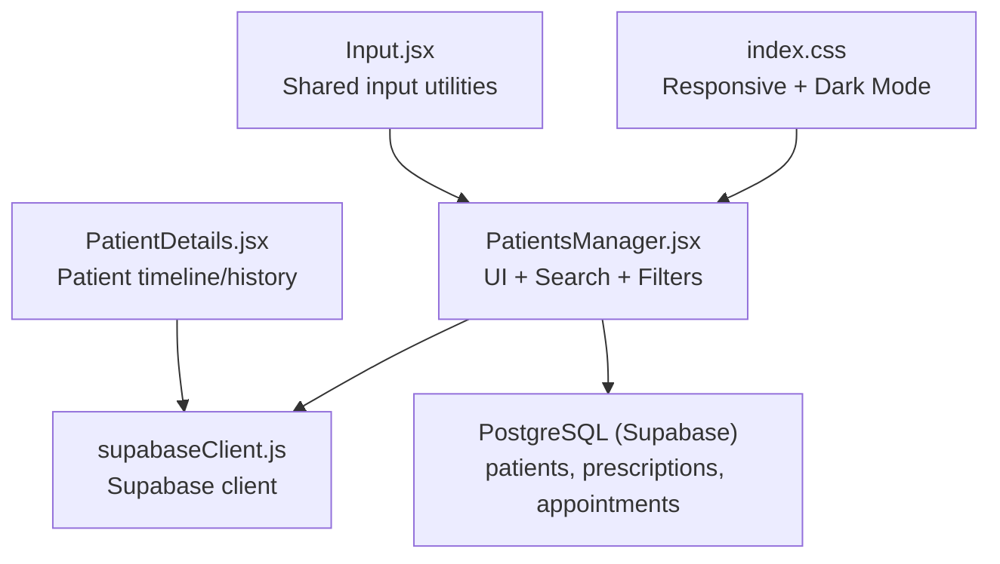
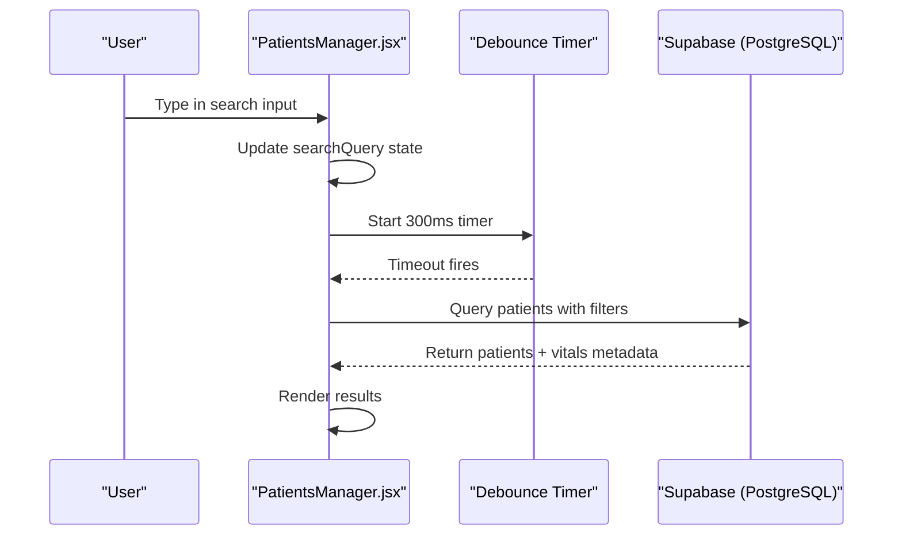
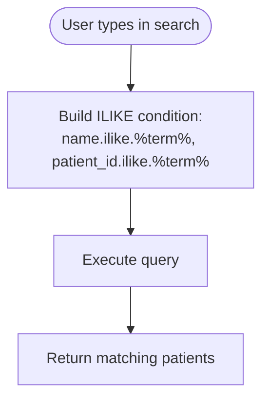
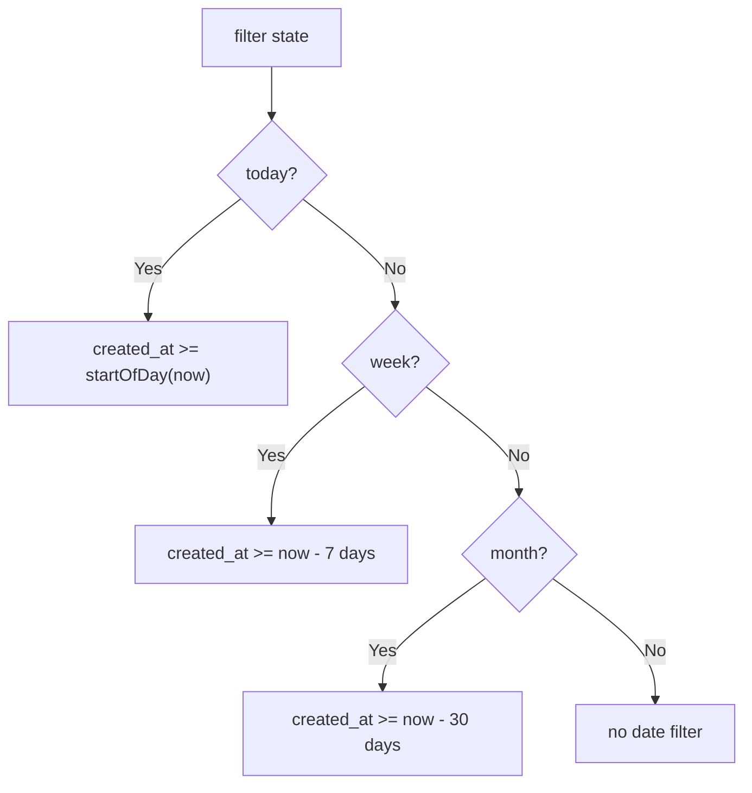
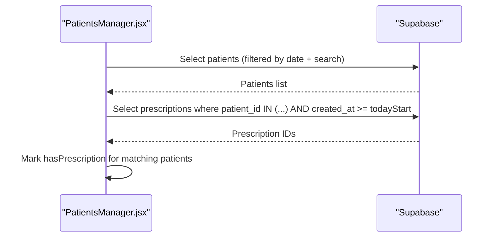
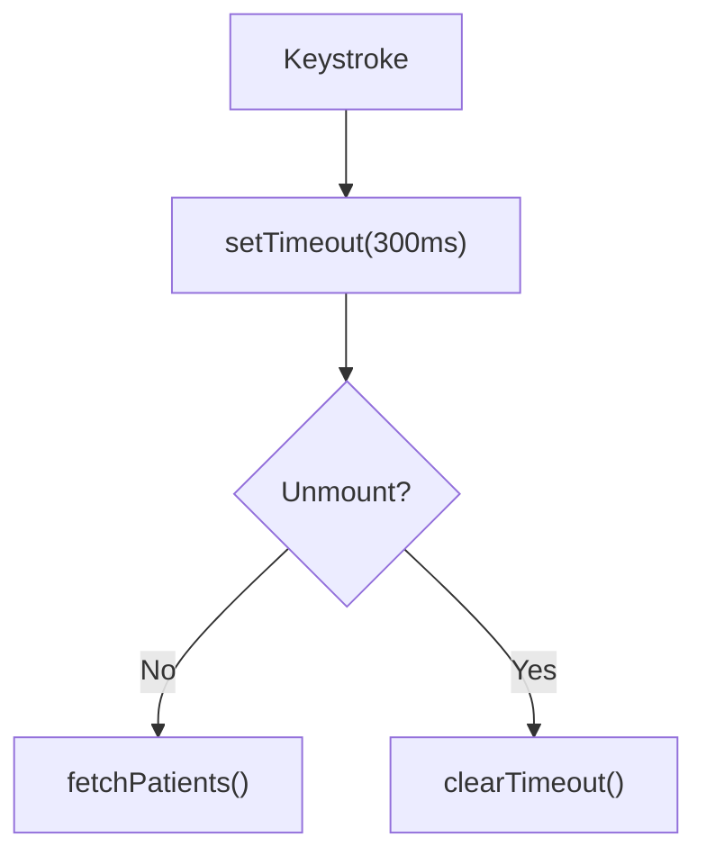
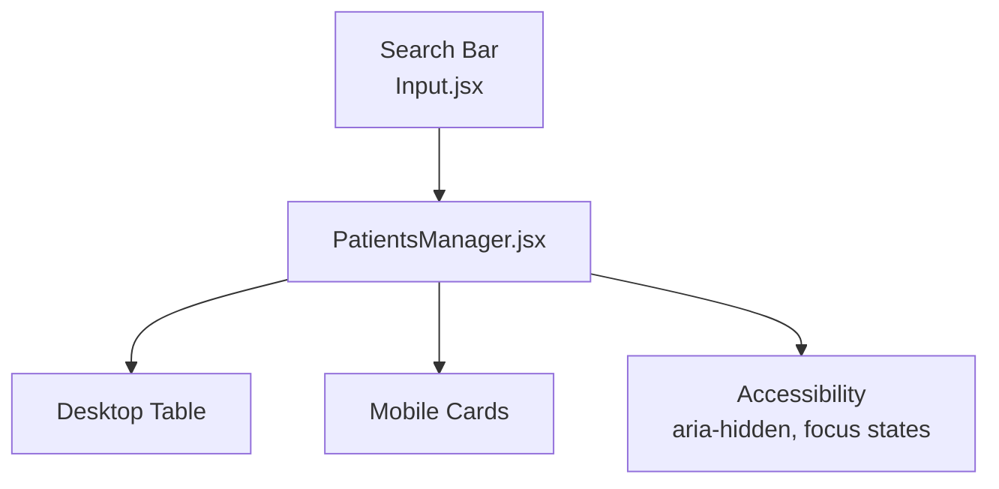
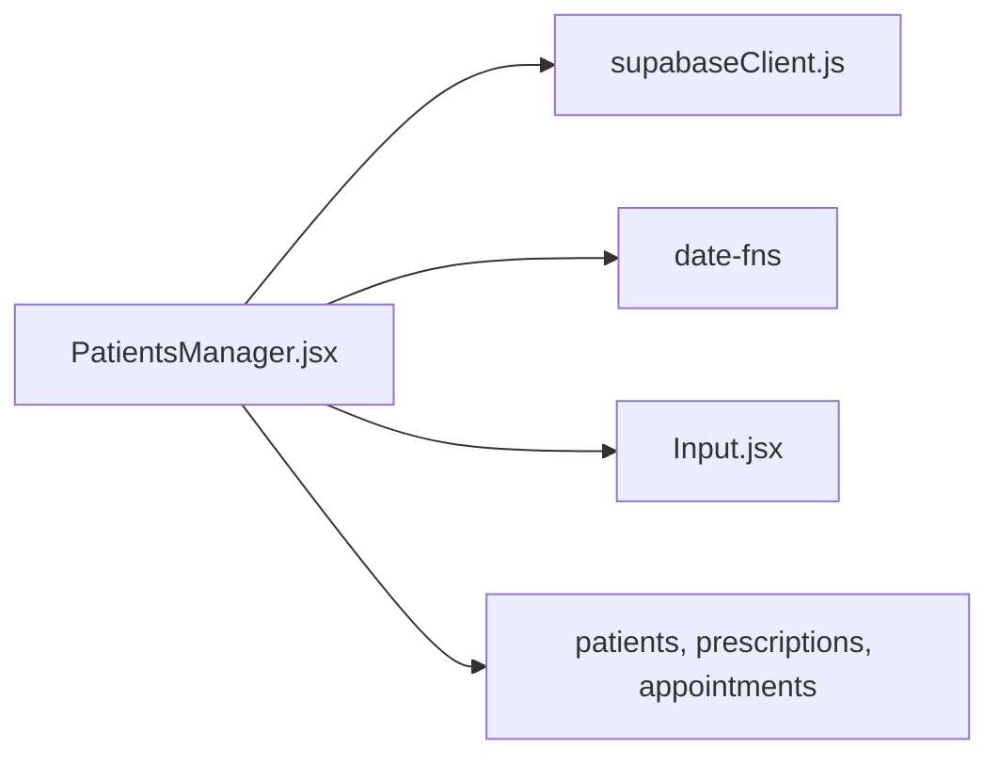

# Search & Filtering

<cite>
**Referenced Files in This Document**
- [PatientsManager.jsx](file://frontend/src/pages/PatientsManager.jsx)
- [PatientDetails.jsx](file://frontend/src/components/PatientDetails.jsx)
- [schema.sql](file://backend/schema.sql)
- [supabaseClient.js](file://frontend/src/lib/supabaseClient.js)
- [index.css](file://frontend/src/index.css)
- [Input.jsx](file://frontend/src/components/ui/Input.jsx)
</cite>

## Table of Contents
1. [Introduction](#introduction)
2. [Project Structure](#project-structure)
3. [Core Components](#core-components)
4. [Architecture Overview](#architecture-overview)
5. [Detailed Component Analysis](#detailed-component-analysis)
6. [Dependency Analysis](#dependency-analysis)
7. [Performance Considerations](#performance-considerations)
8. [Troubleshooting Guide](#troubleshooting-guide)
9. [Conclusion](#conclusion)
10. [Appendices](#appendices)

## Introduction
This document explains the patient search and filtering capabilities in MedVita. It covers multi-criteria search (name-based and patient ID lookup), vitals-based indicators, real-time search debouncing, date-range filters (today, week, month, all), and the mobile-responsive interface. It also outlines the current filter combination logic, accessibility features, and practical guidance for extending the system with advanced operators, pagination, and analytics.

## Project Structure
The search and filtering logic is primarily implemented in the Patients Manager page, with supporting UI components and database schema definitions. The Supabase client provides the database abstraction.

**Diagram sources**
- [PatientsManager.jsx](file://frontend/src/pages/PatientsManager.jsx#L1-L667)
- [supabaseClient.js](file://frontend/src/lib/supabaseClient.js#L1-L11)
- [schema.sql](file://backend/schema.sql#L46-L111)
- [index.css](file://frontend/src/index.css#L320-L520)
- [Input.jsx](file://frontend/src/components/ui/Input.jsx#L1-L63)

**Section sources**
- [PatientsManager.jsx](file://frontend/src/pages/PatientsManager.jsx#L1-L667)
- [schema.sql](file://backend/schema.sql#L46-L111)
- [supabaseClient.js](file://frontend/src/lib/supabaseClient.js#L1-L11)
- [index.css](file://frontend/src/index.css#L320-L520)
- [Input.jsx](file://frontend/src/components/ui/Input.jsx#L1-L63)

## Core Components
- Patients Manager page orchestrates search, date-range filtering, and rendering of results. It performs a single query to the patients table and augments results with a daily prescription flag.
- Patient Details panel displays timeline data combining appointments and prescriptions for a selected patient.
- Supabase client encapsulates database connectivity and is used across components.
- Shared UI input utilities support consistent search field styling.

Key implementation highlights:
- Multi-criteria search: name and patient ID are searched using a combined ILIKE condition.
- Date-range filter: applied via greater-than-or-equal comparisons against created_at timestamps.
- Debounced search: a 300 ms timeout prevents excessive requests while typing.
- Mobile-responsive UI: responsive breakpoints switch between desktop table and mobile card layouts.

**Section sources**
- [PatientsManager.jsx](file://frontend/src/pages/PatientsManager.jsx#L56-L121)
- [PatientsManager.jsx](file://frontend/src/pages/PatientsManager.jsx#L228-L259)
- [PatientsManager.jsx](file://frontend/src/pages/PatientsManager.jsx#L292-L484)
- [PatientDetails.jsx](file://frontend/src/components/PatientDetails.jsx#L44-L90)
- [supabaseClient.js](file://frontend/src/lib/supabaseClient.js#L1-L11)
- [Input.jsx](file://frontend/src/components/ui/Input.jsx#L48-L62)

## Architecture Overview
The search pipeline integrates UI events, state updates, debouncing, and database queries.

**Diagram sources**
- [PatientsManager.jsx](file://frontend/src/pages/PatientsManager.jsx#L113-L121)
- [PatientsManager.jsx](file://frontend/src/pages/PatientsManager.jsx#L56-L111)

## Detailed Component Analysis

### Multi-Criteria Search: Name and Patient ID
- Search condition: The query applies an OR condition across name and patient_id using ILIKE wildcards.
- Behavior: Partial matches are supported for both fields, enabling flexible lookups.

**Diagram sources**
- [PatientsManager.jsx](file://frontend/src/pages/PatientsManager.jsx#L75-L77)

**Section sources**
- [PatientsManager.jsx](file://frontend/src/pages/PatientsManager.jsx#L75-L77)

### Date Range Filters: Today, Week, Month, All
- Applied to created_at:
  - Today: greater-than-or-equal to start-of-day UTC.
  - Week: greater-than-or-equal to one week prior.
  - Month: greater-than-or-equal to one month prior.
  - All: no date filter.
- These filters are mutually exclusive and controlled by a single filter state.

**Diagram sources**
- [PatientsManager.jsx](file://frontend/src/pages/PatientsManager.jsx#L64-L73)

**Section sources**
- [PatientsManager.jsx](file://frontend/src/pages/PatientsManager.jsx#L64-L73)

### Vitals-Based Indicators
- The UI surfaces vitals (blood pressure and heart rate) per patient row/card.
- A daily prescription flag is computed by checking prescriptions created today for the returned patient IDs.

**Diagram sources**
- [PatientsManager.jsx](file://frontend/src/pages/PatientsManager.jsx#L82-L104)

**Section sources**
- [PatientsManager.jsx](file://frontend/src/pages/PatientsManager.jsx#L338-L354)
- [PatientsManager.jsx](file://frontend/src/pages/PatientsManager.jsx#L420-L440)
- [PatientsManager.jsx](file://frontend/src/pages/PatientsManager.jsx#L82-L104)

### Real-Time Search Debouncing
- A 300 ms debounce timer is used to avoid firing a query on every keystroke.
- On cleanup, the timer is cleared to prevent stale requests.

**Diagram sources**
- [PatientsManager.jsx](file://frontend/src/pages/PatientsManager.jsx#L113-L121)

**Section sources**
- [PatientsManager.jsx](file://frontend/src/pages/PatientsManager.jsx#L113-L121)

### Search Result Rendering and Accessibility
- Desktop: a responsive table layout with alternating row styles and hover effects.
- Mobile: a card-based layout optimized for small screens.
- Accessibility: search input includes an assistive icon element; dialogs and panels use Headless UI with appropriate focus management.

**Diagram sources**
- [PatientsManager.jsx](file://frontend/src/pages/PatientsManager.jsx#L247-L259)
- [PatientsManager.jsx](file://frontend/src/pages/PatientsManager.jsx#L292-L484)
- [Input.jsx](file://frontend/src/components/ui/Input.jsx#L48-L62)

**Section sources**
- [PatientsManager.jsx](file://frontend/src/pages/PatientsManager.jsx#L247-L259)
- [PatientsManager.jsx](file://frontend/src/pages/PatientsManager.jsx#L292-L484)
- [index.css](file://frontend/src/index.css#L320-L520)
- [Input.jsx](file://frontend/src/components/ui/Input.jsx#L48-L62)

### Status-Based Filtering
- Current implementation shows “Active” badges and a “Prescribed Today” indicator derived from daily prescriptions.
- No explicit status filter is present in the UI or query logic.

**Section sources**
- [PatientsManager.jsx](file://frontend/src/pages/PatientsManager.jsx#L356-L367)
- [PatientsManager.jsx](file://frontend/src/pages/PatientsManager.jsx#L444-L452)

### Advanced Search Operators
- The current implementation supports prefix/suffix wildcard matching via ILIKE.
- No explicit operator parsing (e.g., “>”, “<”, “=” on vitals) is implemented in the UI or query builder.

**Section sources**
- [PatientsManager.jsx](file://frontend/src/pages/PatientsManager.jsx#L75-L77)

### Mobile Responsiveness and UI Patterns
- Breakpoints switch between table and card views.
- Glass and dark mode styling is applied globally for readability and reduced eye strain.
- Input fields use shared utilities for consistent styling and focus states.

**Section sources**
- [PatientsManager.jsx](file://frontend/src/pages/PatientsManager.jsx#L292-L484)
- [index.css](file://frontend/src/index.css#L320-L520)
- [Input.jsx](file://frontend/src/components/ui/Input.jsx#L1-L63)

### Patient Timeline and History (Supporting Context)
- The Patient Details panel aggregates appointments and prescriptions for a patient and groups by date.
- While not part of the main search UI, it demonstrates how related data is fetched and presented.

**Section sources**
- [PatientDetails.jsx](file://frontend/src/components/PatientDetails.jsx#L44-L90)

## Dependency Analysis
- Patients Manager depends on:
  - Supabase client for database operations.
  - Date utilities for time window calculations.
  - UI components for inputs and cards.
- Database schema defines the patients table and related policies for secure access.

**Diagram sources**
- [PatientsManager.jsx](file://frontend/src/pages/PatientsManager.jsx#L1-L15)
- [supabaseClient.js](file://frontend/src/lib/supabaseClient.js#L1-L11)
- [schema.sql](file://backend/schema.sql#L46-L111)

**Section sources**
- [PatientsManager.jsx](file://frontend/src/pages/PatientsManager.jsx#L1-L15)
- [schema.sql](file://backend/schema.sql#L46-L111)

## Performance Considerations
Current behavior:
- Single query to patients with optional ILIKE and date filters.
- Additional query to prescriptions to compute daily prescription presence.

Recommendations for improvement (future enhancements):
- Pagination: Introduce limit and offset to reduce payload sizes for large datasets.
- Indexing: Ensure created_at, name, and patient_id are indexed in PostgreSQL for efficient filtering and sorting.
- Ranking: Implement relevance scoring (e.g., exact match boost, prefix match boost) and order by score and recency.
- Debounce tuning: Adjust debounce interval based on device/network characteristics.
- Caching: Cache recent queries and results for repeat searches.
- Analytics: Track search terms, filters, and latency to inform UX improvements.

[No sources needed since this section provides general guidance]

## Troubleshooting Guide
Common issues and resolutions:
- Empty results:
  - Verify search term length and date range.
  - Confirm that the patient records exist and match the logged-in doctor’s scope.
- Slow search:
  - Reduce search specificity or adjust debounce timing.
  - Consider adding database indexes on frequently filtered columns.
- Incorrect date boundaries:
  - Ensure local vs UTC handling is consistent; the implementation uses start-of-day comparisons.

**Section sources**
- [PatientsManager.jsx](file://frontend/src/pages/PatientsManager.jsx#L56-L111)
- [PatientsManager.jsx](file://frontend/src/pages/PatientsManager.jsx#L64-L73)

## Conclusion
MedVita’s patient search currently provides a practical, real-time experience with name/patient ID matching, date-range filtering, and vitals indicators. The UI is responsive and accessible. Extending the system with advanced operators, ranking, pagination, and analytics would further improve usability and performance at scale.

[No sources needed since this section summarizes without analyzing specific files]

## Appendices

### Example Queries and Combinations
- Name search: “john”
- Patient ID search: “P-xxxxxx”
- Combined: “john” or “P-123”
- Date range: Today, Last Week, Last Month, All
- Vitals indicators: Blood pressure and heart rate shown per patient
- Status indicators: Active badge and “Prescribed Today” flag

[No sources needed since this section provides general guidance]