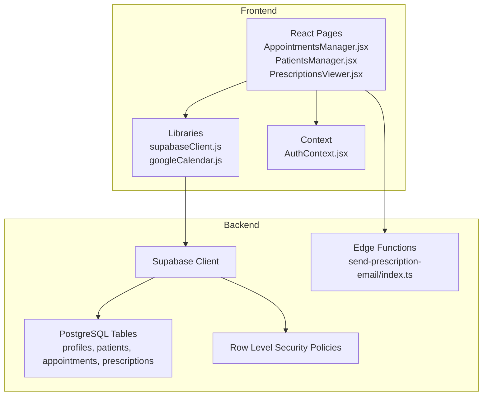
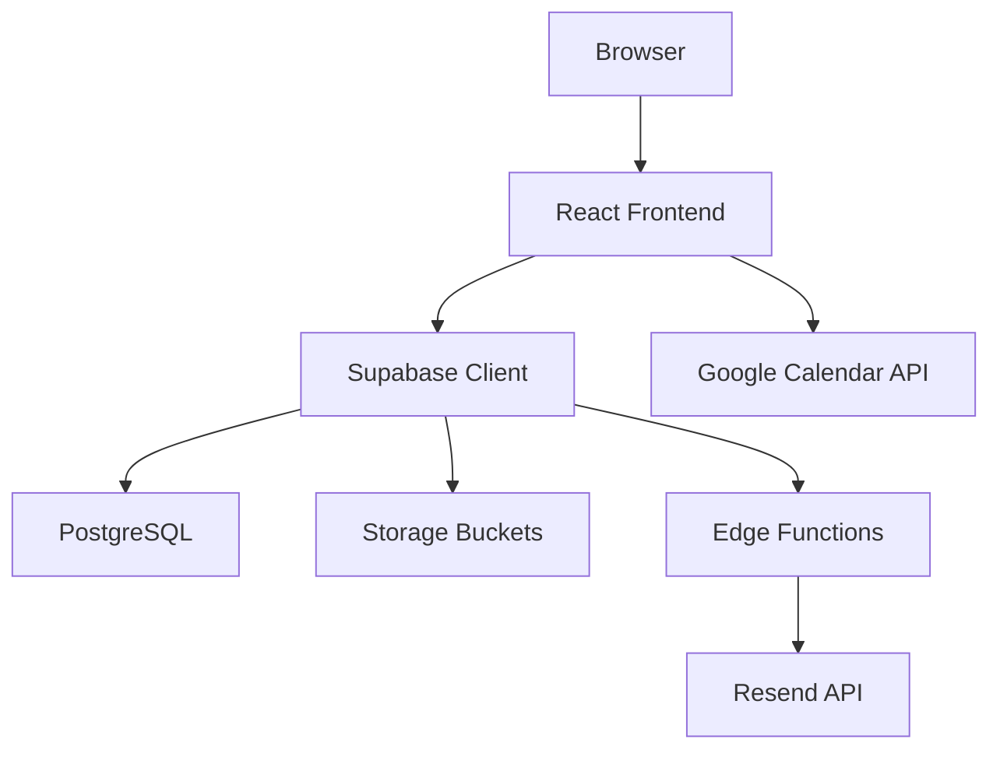
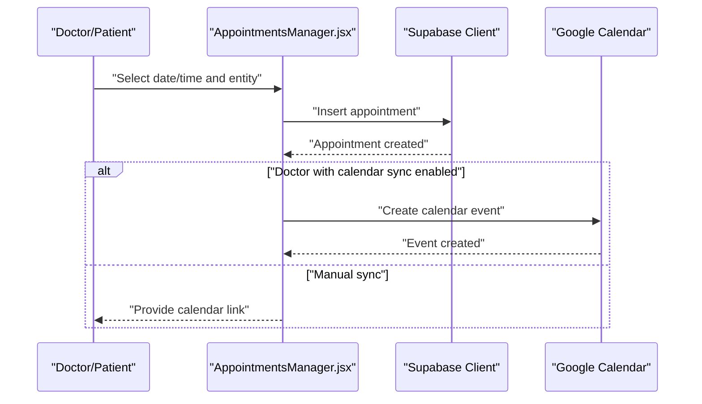
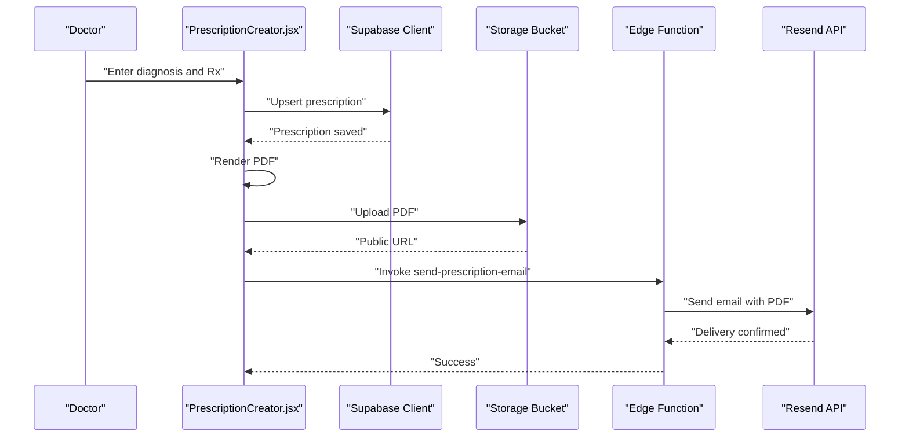
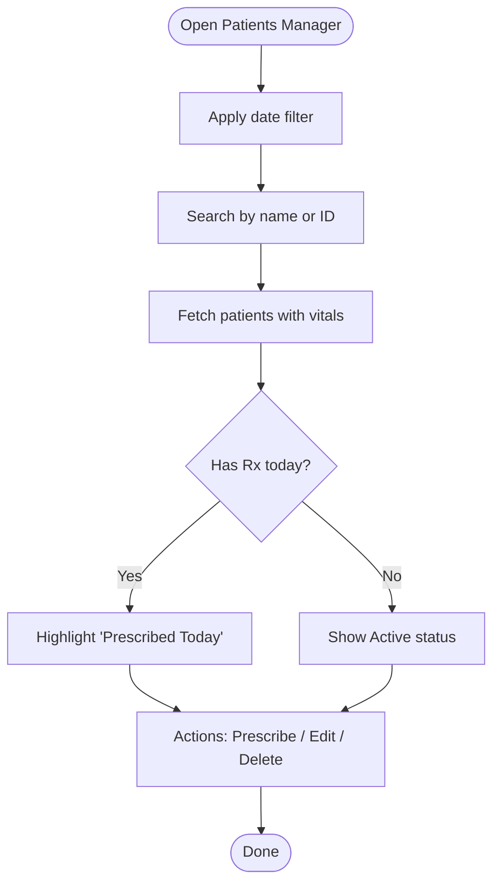
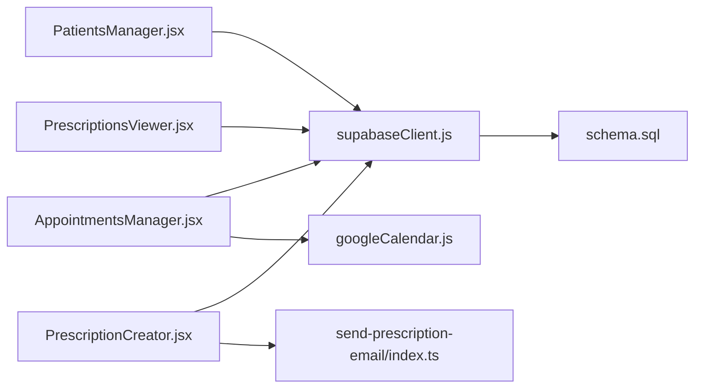
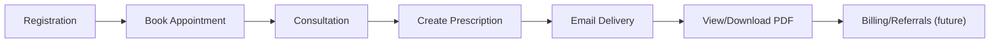

# Workflow Integration

<cite>
**Referenced Files in This Document**
- [README.md](file://README.md)
- [WIKI.md](file://WIKI.md)
- [schema.sql](file://backend/schema.sql)
- [supabaseClient.js](file://frontend/src/lib/supabaseClient.js)
- [googleCalendar.js](file://frontend/src/lib/googleCalendar.js)
- [index.ts](file://supabase/functions/send-prescription-email/index.ts)
- [AppointmentsManager.jsx](file://frontend/src/pages/AppointmentsManager.jsx)
- [PatientsManager.jsx](file://frontend/src/pages/PatientsManager.jsx)
- [PrescriptionCreator.jsx](file://frontend/src/components/PrescriptionCreator.jsx)
- [PrescriptionsViewer.jsx](file://frontend/src/pages/PrescriptionsViewer.jsx)
- [AuthContext.jsx](file://frontend/src/context/AuthContext.jsx)
</cite>

## Table of Contents
1. [Introduction](#introduction)
2. [Project Structure](#project-structure)
3. [Core Components](#core-components)
4. [Architecture Overview](#architecture-overview)
5. [Detailed Component Analysis](#detailed-component-analysis)
6. [Dependency Analysis](#dependency-analysis)
7. [Performance Considerations](#performance-considerations)
8. [Troubleshooting Guide](#troubleshooting-guide)
9. [Conclusion](#conclusion)
10. [Appendices](#appendices)

## Introduction
This document describes the patient management workflow integration within MedVita’s healthcare ecosystem. It maps the end-to-end patient journey from registration through treatment completion, detailing integrations with appointment scheduling, digital prescription creation, billing systems, and laboratory results. It also covers data synchronization, workflow automation triggers, cross-system notifications, external system integrations, insurance verification processes, and referral management. Practical workflow scenarios, failure handling, and data consistency strategies are included, alongside optimization opportunities and performance monitoring guidance tailored to complex care pathways.

## Project Structure
MedVita is a React/Vite frontend integrated with Supabase for backend-as-a-service. The frontend communicates with Supabase via a typed client, while edge functions handle asynchronous tasks such as sending prescription emails. The backend schema defines the core entities and Row Level Security (RLS) policies that govern access and data isolation.

**Diagram sources**
- [AppointmentsManager.jsx](file://frontend/src/pages/AppointmentsManager.jsx#L1-L577)
- [PatientsManager.jsx](file://frontend/src/pages/PatientsManager.jsx#L1-L667)
- [PrescriptionsViewer.jsx](file://frontend/src/pages/PrescriptionsViewer.jsx#L1-L273)
- [supabaseClient.js](file://frontend/src/lib/supabaseClient.js#L1-L11)
- [googleCalendar.js](file://frontend/src/lib/googleCalendar.js#L1-L199)
- [index.ts](file://supabase/functions/send-prescription-email/index.ts#L1-L193)
- [schema.sql](file://backend/schema.sql#L1-L274)
- [AuthContext.jsx](file://frontend/src/context/AuthContext.jsx#L1-L108)

**Section sources**
- [README.md](file://README.md#L1-L89)
- [WIKI.md](file://WIKI.md#L108-L169)

## Core Components
- Authentication and Authorization: Centralized via Supabase Auth with role-based access and automatic profile creation.
- Appointment Management: Calendar-based booking, availability, and Google Calendar sync.
- Patient Management: CRUD operations, vitals capture, and daily filters.
- Prescription Management: Structured creation, PDF generation, storage, and email delivery via edge function.
- Notifications: Prescription email delivery through Resend API invoked via Supabase Edge Functions.
- Data Integrity: RLS policies and foreign key constraints enforce data consistency.

**Section sources**
- [AuthContext.jsx](file://frontend/src/context/AuthContext.jsx#L1-L108)
- [AppointmentsManager.jsx](file://frontend/src/pages/AppointmentsManager.jsx#L1-L577)
- [PatientsManager.jsx](file://frontend/src/pages/PatientsManager.jsx#L1-L667)
- [PrescriptionCreator.jsx](file://frontend/src/components/PrescriptionCreator.jsx#L1-L303)
- [PrescriptionsViewer.jsx](file://frontend/src/pages/PrescriptionsViewer.jsx#L1-L273)
- [schema.sql](file://backend/schema.sql#L1-L274)

## Architecture Overview
The system follows a client-layer → frontend → backend/database pattern with Supabase providing authentication, database, storage, and edge functions. The architecture supports:
- Real-time data access via Supabase client
- Asynchronous workflows via Edge Functions
- External integrations (Google Calendar, Resend)
- Role-based access control with RLS

**Diagram sources**
- [WIKI.md](file://WIKI.md#L32-L68)
- [supabaseClient.js](file://frontend/src/lib/supabaseClient.js#L1-L11)
- [index.ts](file://supabase/functions/send-prescription-email/index.ts#L1-L193)
- [googleCalendar.js](file://frontend/src/lib/googleCalendar.js#L1-L199)

## Detailed Component Analysis

### Appointment Scheduling Integration
The appointment module orchestrates booking, availability, and calendar sync:
- Role-aware queries: doctors see only their appointments; patients see only theirs.
- Availability-based selection: time slots derived from doctor availability.
- Google Calendar sync: optional sync during booking; fallback manual link generation.

**Diagram sources**
- [AppointmentsManager.jsx](file://frontend/src/pages/AppointmentsManager.jsx#L134-L180)
- [googleCalendar.js](file://frontend/src/lib/googleCalendar.js#L125-L178)

**Section sources**
- [AppointmentsManager.jsx](file://frontend/src/pages/AppointmentsManager.jsx#L1-L577)
- [googleCalendar.js](file://frontend/src/lib/googleCalendar.js#L1-L199)
- [schema.sql](file://backend/schema.sql#L137-L208)

### Prescription Creation and Delivery
Prescriptions are created digitally, rendered to PDF, stored, and emailed to patients:
- PDF generation using html2canvas and jsPDF
- Storage upload to Supabase storage bucket
- Edge function sends email via Resend API with health tips
- Patient receives a styled HTML email with PDF attachment

**Diagram sources**
- [PrescriptionCreator.jsx](file://frontend/src/components/PrescriptionCreator.jsx#L100-L188)
- [index.ts](file://supabase/functions/send-prescription-email/index.ts#L25-L192)
- [PrescriptionsViewer.jsx](file://frontend/src/pages/PrescriptionsViewer.jsx#L57-L131)

**Section sources**
- [PrescriptionCreator.jsx](file://frontend/src/components/PrescriptionCreator.jsx#L1-L303)
- [index.ts](file://supabase/functions/send-prescription-email/index.ts#L1-L193)
- [PrescriptionsViewer.jsx](file://frontend/src/pages/PrescriptionsViewer.jsx#L1-L273)
- [schema.sql](file://backend/schema.sql#L200-L225)

### Patient Management and Handoffs
The patient manager supports:
- Filtering by creation date (today/week/month/all)
- Real-time search with debounced queries
- Vitals capture and “has prescription today” indicator
- Integration with prescriptions for workflow visibility

**Diagram sources**
- [PatientsManager.jsx](file://frontend/src/pages/PatientsManager.jsx#L56-L121)

**Section sources**
- [PatientsManager.jsx](file://frontend/src/pages/PatientsManager.jsx#L1-L667)
- [schema.sql](file://backend/schema.sql#L45-L116)

### Billing Systems Integration
- Current state: Not implemented in the repository.
- Recommended integration pattern:
  - Create a billing queue triggered by appointment completion or prescription issuance.
  - Use Supabase Edge Functions to call an external billing API.
  - Persist billing records and status in a dedicated table with RLS policies.
  - Emit notifications upon payment initiation and reconciliation.

[No sources needed since this section provides general guidance]

### Laboratory Results Integration
- Current state: Not implemented in the repository.
- Recommended integration pattern:
  - Establish HL7 FHIR or LOINC-based lab order workflow.
  - Use Supabase Edge Functions to ingest lab results from external LIS.
  - Attach results to patient records with timestamps and status.
  - Notify providers and patients via email/webhook.

[No sources needed since this section provides general guidance]

### Insurance Verification and Referral Management
- Current state: Not implemented in the repository.
- Recommended integration pattern:
  - Add insurance verification step during registration or visit preparation.
  - Integrate with payer APIs for eligibility checks and prior authorization status.
  - Implement referral workflow with referral codes and tracking in the patient record.
  - Enforce RLS to restrict sensitive insurance data to authorized roles.

[No sources needed since this section provides general guidance]

## Dependency Analysis
The frontend depends on Supabase for data and authentication, storage, and edge functions. The backend schema defines entities and policies that enforce access control and referential integrity.

**Diagram sources**
- [AppointmentsManager.jsx](file://frontend/src/pages/AppointmentsManager.jsx#L1-L577)
- [PatientsManager.jsx](file://frontend/src/pages/PatientsManager.jsx#L1-L667)
- [PrescriptionsViewer.jsx](file://frontend/src/pages/PrescriptionsViewer.jsx#L1-L273)
- [PrescriptionCreator.jsx](file://frontend/src/components/PrescriptionCreator.jsx#L1-L303)
- [supabaseClient.js](file://frontend/src/lib/supabaseClient.js#L1-L11)
- [index.ts](file://supabase/functions/send-prescription-email/index.ts#L1-L193)
- [schema.sql](file://backend/schema.sql#L1-L274)
- [googleCalendar.js](file://frontend/src/lib/googleCalendar.js#L1-L199)

**Section sources**
- [schema.sql](file://backend/schema.sql#L1-L274)
- [supabaseClient.js](file://frontend/src/lib/supabaseClient.js#L1-L11)

## Performance Considerations
- Client-side rendering and lazy loading minimize initial bundle size.
- Debounced search reduces redundant backend calls.
- PDF generation occurs client-side with optimized rendering parameters.
- Edge functions are stateless and auto-scaled by Supabase.
- Recommendations:
  - Monitor Supabase query latency and optimize filters.
  - Cache frequently accessed lists (e.g., recent prescriptions).
  - Use pagination for large datasets (patients/appointments).
  - Implement background indexing for high-cardinality fields.

[No sources needed since this section provides general guidance]

## Troubleshooting Guide
Common issues and resolutions:
- Missing Supabase credentials: The client logs a warning if URL or anon key are missing. Verify environment variables.
- Prescription email failures: The edge function validates the API key and returns structured errors; inspect the returned error message.
- Google Calendar sync failures: The UI attempts sync and falls back to a manual calendar link; confirm OAuth consent and token presence.
- Access denied due to RLS: Ensure the user’s role and foreign keys match the policies (e.g., doctor_id for patients and prescriptions).

**Section sources**
- [supabaseClient.js](file://frontend/src/lib/supabaseClient.js#L6-L8)
- [index.ts](file://supabase/functions/send-prescription-email/index.ts#L41-L46)
- [googleCalendar.js](file://frontend/src/lib/googleCalendar.js#L126-L178)
- [schema.sql](file://backend/schema.sql#L74-L224)

## Conclusion
MedVita integrates appointment scheduling, patient management, and digital prescriptions with robust authentication, storage, and asynchronous notifications. While billing, laboratory results, insurance verification, and referrals are not currently implemented, the architecture supports incremental additions via Supabase Edge Functions and schema extensions. By leveraging RLS, role-based routing, and resilient error handling, the system provides a secure and scalable foundation for complex care pathways.

[No sources needed since this section summarizes without analyzing specific files]

## Appendices

### Patient Journey Mapping
- Registration: Authenticated via Supabase; profile created automatically.
- Pre-visit: Patient books an appointment; optional Google Calendar sync.
- Visit: Doctor manages live queue, reviews vitals, and creates prescriptions.
- Post-visit: Patient receives email with PDF; can view/download from their dashboard.
- Discharge: Optional billing and referral workflows can be integrated.

[No sources needed since this diagram shows conceptual workflow, not actual code structure]

### Workflow Scenarios
- Scenario A: Doctor schedules a follow-up for a patient with calendar sync; patient receives a calendar link if sync fails.
- Scenario B: Doctor creates a prescription; PDF is generated, uploaded, and emailed; patient downloads from their dashboard.
- Scenario C: Receptionist registers a walk-in; doctor’s live queue updates; doctor marks as seen and proceeds to treatment.

[No sources needed since this section provides general guidance]