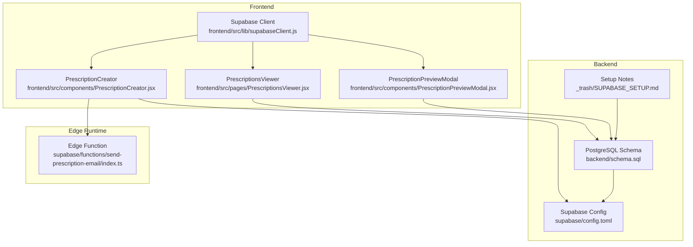
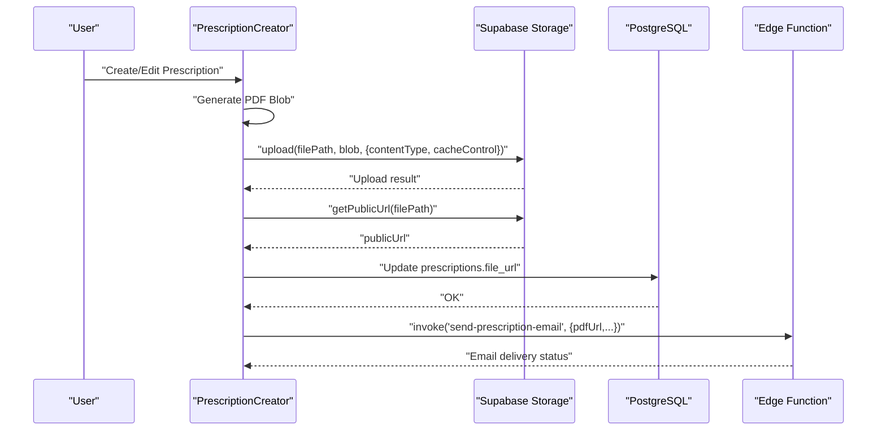
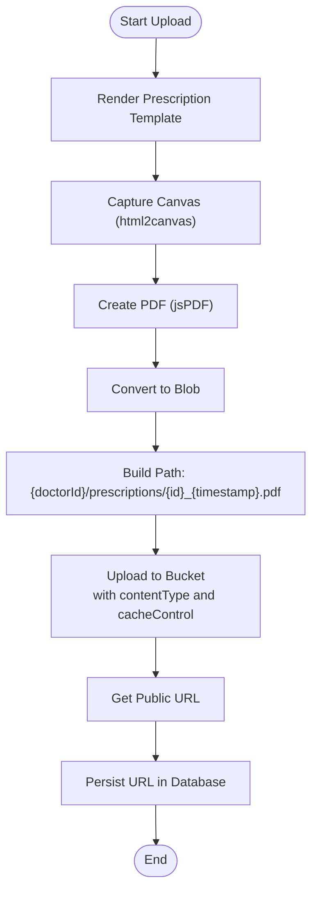
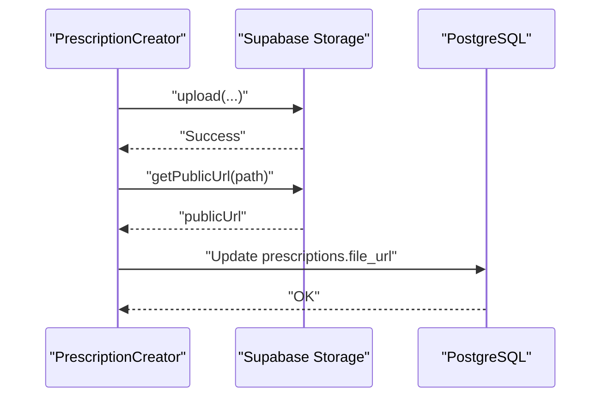
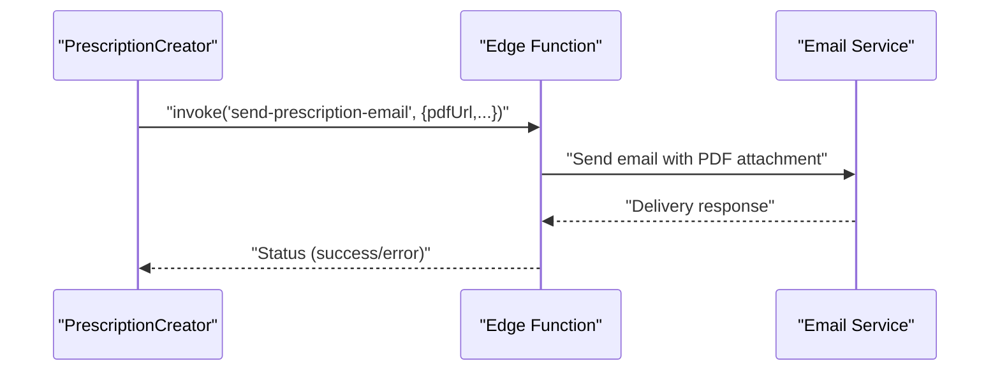
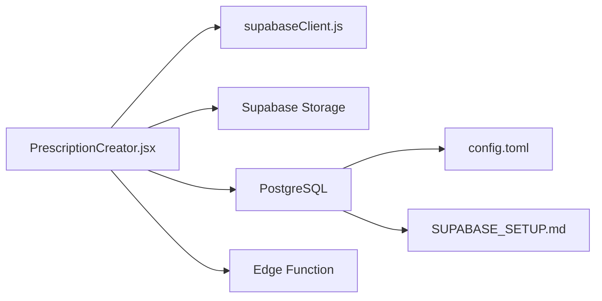

# Cloud Storage Integration

<cite>
**Referenced Files in This Document**
- [supabaseClient.js](file://frontend/src/lib/supabaseClient.js)
- [config.toml](file://supabase/config.toml)
- [PrescriptionCreator.jsx](file://frontend/src/components/PrescriptionCreator.jsx)
- [PrescriptionsViewer.jsx](file://frontend/src/pages/PrescriptionsViewer.jsx)
- [PrescriptionPreviewModal.jsx](file://frontend/src/components/PrescriptionPreviewModal.jsx)
- [schema.sql](file://backend/schema.sql)
- [SUPABASE_SETUP.md](file://_trash/SUPABASE_SETUP.md)
- [index.ts](file://supabase/functions/send-prescription-email/index.ts)
</cite>

## Table of Contents
1. [Introduction](#introduction)
2. [Project Structure](#project-structure)
3. [Core Components](#core-components)
4. [Architecture Overview](#architecture-overview)
5. [Detailed Component Analysis](#detailed-component-analysis)
6. [Dependency Analysis](#dependency-analysis)
7. [Performance Considerations](#performance-considerations)
8. [Troubleshooting Guide](#troubleshooting-guide)
9. [Conclusion](#conclusion)
10. [Appendices](#appendices)

## Introduction
This document explains the cloud storage integration with Supabase Storage in the MedVita project. It covers the end-to-end file upload process for medical prescriptions, including MIME type specification, cache control headers, and content security considerations. It also documents the file path structure organized by doctor ID and timestamp-based naming, the public URL generation process, access control mechanisms, storage bucket configuration, file size limits, and security considerations. Practical guidance is provided for upload error handling, retry mechanisms, and file cleanup procedures, along with optimization strategies, backup considerations, and compliance requirements for medical document retention.

## Project Structure
The cloud storage integration spans three main areas:
- Frontend client initialization and storage operations
- Backend Supabase configuration and Row Level Security (RLS)
- Edge Functions for downstream processing (e.g., email delivery)

**Diagram sources**
- [supabaseClient.js](file://frontend/src/lib/supabaseClient.js#L1-L11)
- [PrescriptionCreator.jsx](file://frontend/src/components/PrescriptionCreator.jsx#L1-L303)
- [PrescriptionsViewer.jsx](file://frontend/src/pages/PrescriptionsViewer.jsx#L1-L273)
- [PrescriptionPreviewModal.jsx](file://frontend/src/components/PrescriptionPreviewModal.jsx#L1-L331)
- [config.toml](file://supabase/config.toml#L105-L120)
- [schema.sql](file://backend/schema.sql#L226-L237)
- [SUPABASE_SETUP.md](file://_trash/SUPABASE_SETUP.md#L150-L163)
- [index.ts](file://supabase/functions/send-prescription-email/index.ts#L1-L193)

**Section sources**
- [supabaseClient.js](file://frontend/src/lib/supabaseClient.js#L1-L11)
- [config.toml](file://supabase/config.toml#L105-L120)
- [schema.sql](file://backend/schema.sql#L226-L237)
- [SUPABASE_SETUP.md](file://_trash/SUPABASE_SETUP.md#L150-L163)

## Core Components
- Supabase client initialization with environment variables for secure access.
- Prescription creation flow generating a PDF, uploading to a Supabase Storage bucket, and retrieving a public URL.
- Access control enforced via Supabase Storage RLS policies and bucket configuration.
- Edge function invoked to deliver the PDF via email using a third-party service.

Key implementation references:
- Supabase client creation and environment checks
- PDF generation and upload with MIME type and cache control
- Public URL retrieval and database updates
- Storage bucket configuration and RLS policies
- Edge function for email delivery

**Section sources**
- [supabaseClient.js](file://frontend/src/lib/supabaseClient.js#L1-L11)
- [PrescriptionCreator.jsx](file://frontend/src/components/PrescriptionCreator.jsx#L53-L98)
- [schema.sql](file://backend/schema.sql#L226-L237)
- [index.ts](file://supabase/functions/send-prescription-email/index.ts#L152-L170)

## Architecture Overview
The system integrates the frontend, backend, and edge runtime to securely store and share medical documents.

**Diagram sources**
- [PrescriptionCreator.jsx](file://frontend/src/components/PrescriptionCreator.jsx#L53-L98)
- [PrescriptionCreator.jsx](file://frontend/src/components/PrescriptionCreator.jsx#L100-L188)
- [index.ts](file://supabase/functions/send-prescription-email/index.ts#L152-L170)

## Detailed Component Analysis

### Supabase Client Initialization
- Creates a Supabase client using Vite environment variables for URL and anonymous key.
- Validates presence of required environment variables and logs a warning if missing.

Implementation highlights:
- Environment variable usage for client creation
- Early validation and warning for missing credentials

**Section sources**
- [supabaseClient.js](file://frontend/src/lib/supabaseClient.js#L1-L11)

### Prescription Upload Pipeline
- Generates a PDF from a rendered template using html2canvas and jsPDF.
- Names files using a path pattern combining doctor ID and a timestamp-based suffix.
- Uploads to the configured bucket with explicit MIME type and cache control.
- Retrieves a public URL and persists it in the database.

Processing logic:
- PDF rendering with fixed A4 dimensions
- Blob conversion and upload with metadata
- Public URL generation and database update
- Optional email delivery via edge function

**Diagram sources**
- [PrescriptionCreator.jsx](file://frontend/src/components/PrescriptionCreator.jsx#L53-L98)

**Section sources**
- [PrescriptionCreator.jsx](file://frontend/src/components/PrescriptionCreator.jsx#L53-L98)

### Public URL Generation and Access Control
- Public URL retrieval is performed after successful upload.
- Access control relies on:
  - Supabase Storage bucket configuration (public bucket)
  - Row Level Security policies on storage.objects for authenticated access
  - Application-level checks ensuring only authorized users can view or modify related records

**Diagram sources**
- [PrescriptionCreator.jsx](file://frontend/src/components/PrescriptionCreator.jsx#L84-L97)
- [schema.sql](file://backend/schema.sql#L231-L237)

**Section sources**
- [PrescriptionCreator.jsx](file://frontend/src/components/PrescriptionCreator.jsx#L84-L97)
- [schema.sql](file://backend/schema.sql#L231-L237)

### Storage Bucket Configuration and Policies
- Bucket configuration:
  - Bucket ID: medvita-files
  - Public: true
  - File size limit: 50 MiB
- Storage RLS policies:
  - Insert: authenticated users can upload to medvita-files
  - Select: authenticated users can view objects in medvita-files

These policies ensure that only authenticated users can upload and access files within the bucket.

**Section sources**
- [config.toml](file://supabase/config.toml#L105-L120)
- [schema.sql](file://backend/schema.sql#L226-L237)
- [SUPABASE_SETUP.md](file://_trash/SUPABASE_SETUP.md#L150-L163)

### Edge Function for Email Delivery
- Invoked after a successful upload to deliver the PDF to the patient’s email.
- Fetches the PDF, encodes it, and sends it via a third-party email service.
- Returns success or error responses with appropriate handling.

**Diagram sources**
- [PrescriptionCreator.jsx](file://frontend/src/components/PrescriptionCreator.jsx#L152-L167)
- [index.ts](file://supabase/functions/send-prescription-email/index.ts#L152-L170)

**Section sources**
- [PrescriptionCreator.jsx](file://frontend/src/components/PrescriptionCreator.jsx#L152-L167)
- [index.ts](file://supabase/functions/send-prescription-email/index.ts#L1-L193)

## Dependency Analysis
The upload pipeline depends on:
- Supabase client for authenticated operations
- Supabase Storage for file persistence and public URL generation
- PostgreSQL for storing document metadata and enforcing access controls
- Edge Functions for downstream processing (email delivery)

**Diagram sources**
- [PrescriptionCreator.jsx](file://frontend/src/components/PrescriptionCreator.jsx#L1-L303)
- [supabaseClient.js](file://frontend/src/lib/supabaseClient.js#L1-L11)
- [config.toml](file://supabase/config.toml#L105-L120)
- [SUPABASE_SETUP.md](file://_trash/SUPABASE_SETUP.md#L150-L163)

**Section sources**
- [PrescriptionCreator.jsx](file://frontend/src/components/PrescriptionCreator.jsx#L1-L303)
- [supabaseClient.js](file://frontend/src/lib/supabaseClient.js#L1-L11)
- [config.toml](file://supabase/config.toml#L105-L120)
- [SUPABASE_SETUP.md](file://_trash/SUPABASE_SETUP.md#L150-L163)

## Performance Considerations
- Optimize PDF generation:
  - Use appropriate canvas scale and image quality to balance fidelity and file size.
  - Prefer JPEG compression for images embedded in PDFs to reduce payload.
- Cache control:
  - Set cacheControl to a reasonable TTL to improve CDN performance while ensuring freshness.
- Network resilience:
  - Implement retry logic with exponential backoff for transient failures during upload or email delivery.
- Storage efficiency:
  - Consider archiving older documents to lower-cost storage tiers if retention policies permit.
- Database queries:
  - Batch related operations (e.g., update metadata after upload) to minimize round trips.

[No sources needed since this section provides general guidance]

## Troubleshooting Guide
Common issues and remedies:
- Missing environment variables:
  - Ensure VITE_SUPABASE_URL and VITE_SUPABASE_ANON_KEY are present in the frontend environment.
- Upload failures:
  - Validate file size against the bucket limit (50 MiB).
  - Confirm authenticated user context and bucket permissions.
- Public URL access denied:
  - Verify RLS policies and that the bucket is configured as public.
- Email delivery errors:
  - Check edge function configuration and third-party service credentials.
  - Inspect returned error messages for actionable diagnostics.

**Section sources**
- [supabaseClient.js](file://frontend/src/lib/supabaseClient.js#L6-L8)
- [config.toml](file://supabase/config.toml#L107-L108)
- [schema.sql](file://backend/schema.sql#L231-L237)
- [index.ts](file://supabase/functions/send-prescription-email/index.ts#L41-L46)

## Conclusion
The MedVita project implements a secure, authenticated, and efficient cloud storage integration with Supabase Storage. The upload pipeline generates PDFs, enforces access control via RLS, and exposes public URLs for authorized users. Edge functions enable downstream automation such as email delivery. Adhering to the documented practices ensures reliable operation, scalability, and compliance readiness for medical document retention.

[No sources needed since this section summarizes without analyzing specific files]

## Appendices

### File Path Structure and Naming Conventions
- Path pattern: `{doctorId}/prescriptions/{prescriptionId}_{timestamp}.pdf`
- Ensures organization by doctor and uniqueness via timestamp.

**Section sources**
- [PrescriptionCreator.jsx](file://frontend/src/components/PrescriptionCreator.jsx#L81-L82)

### MIME Types and Cache Control
- MIME type: application/pdf
- Cache control: 3600 seconds

**Section sources**
- [PrescriptionCreator.jsx](file://frontend/src/components/PrescriptionCreator.jsx#L86-L89)

### Access Control Mechanisms
- Authenticated users only
- Public bucket with RLS policies for insert/select
- Application-level checks for doctor/patient roles

**Section sources**
- [schema.sql](file://backend/schema.sql#L231-L237)
- [SUPABASE_SETUP.md](file://_trash/SUPABASE_SETUP.md#L156-L162)

### Storage Bucket Configuration
- Bucket ID: medvita-files
- Public: true
- File size limit: 50 MiB
- S3 protocol enabled

**Section sources**
- [config.toml](file://supabase/config.toml#L105-L120)

### Compliance and Retention Considerations
- Retention policies should define how long documents are kept and when they are archived or deleted.
- Audit trails and access logs should be maintained for compliance.
- Secure deletion of files should follow compliance guidelines (e.g., GDPR, HIPAA).
- Regular backups of both database and storage are essential for disaster recovery.

[No sources needed since this section provides general guidance]