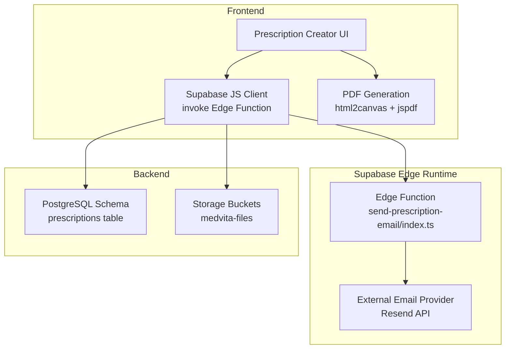
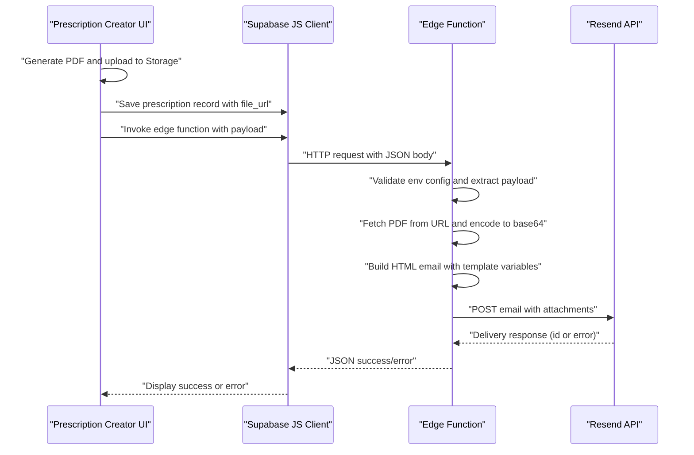
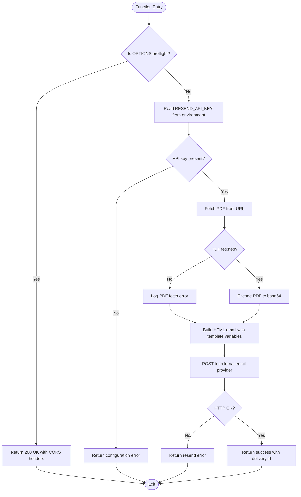
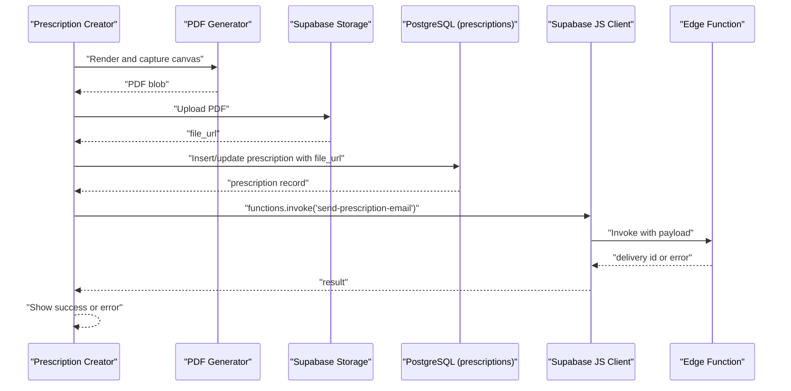
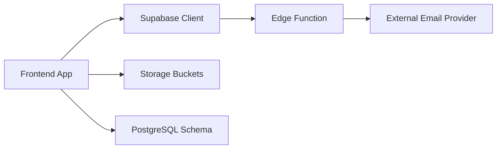

# Email Delivery System

<cite>
**Referenced Files in This Document**
- [index.ts](file://supabase/functions/send-prescription-email/index.ts)
- [config.toml](file://supabase/config.toml)
- [supabaseClient.js](file://frontend/src/lib/supabaseClient.js)
- [PrescriptionCreator.jsx](file://frontend/src/components/PrescriptionCreator.jsx)
- [schema.sql](file://backend/schema.sql)
- [.env.example](file://frontend/.env.example)
- [package.json](file://frontend/package.json)
- [vercel.json](file://frontend/vercel.json)
</cite>

## Table of Contents
1. [Introduction](#introduction)
2. [Project Structure](#project-structure)
3. [Core Components](#core-components)
4. [Architecture Overview](#architecture-overview)
5. [Detailed Component Analysis](#detailed-component-analysis)
6. [Dependency Analysis](#dependency-analysis)
7. [Performance Considerations](#performance-considerations)
8. [Troubleshooting Guide](#troubleshooting-guide)
9. [Conclusion](#conclusion)
10. [Appendices](#appendices)

## Introduction
This document describes the email delivery system powered by Supabase Edge Functions. It covers the edge function architecture, TypeScript implementation, environment variable configuration, email template system, recipient handling, delivery confirmation, external service integration, error handling, and retry logic. It also explains how the frontend invokes the edge function, passes parameters, and handles responses. Finally, it addresses security, rate limiting, and compliance considerations for transmitting medical information.

## Project Structure
The email delivery system spans three main areas:
- Supabase Edge Function: Implements the email sending logic and integrates with an external email provider.
- Frontend Application: Generates a PDF, uploads it to storage, persists metadata, and triggers the edge function.
- Backend Schema: Defines the prescriptions table and storage policies used by the frontend.

**Diagram sources**
- [index.ts](file://supabase/functions/send-prescription-email/index.ts#L25-L192)
- [PrescriptionCreator.jsx](file://frontend/src/components/PrescriptionCreator.jsx#L53-L188)
- [schema.sql](file://backend/schema.sql#L200-L225)

**Section sources**
- [index.ts](file://supabase/functions/send-prescription-email/index.ts#L1-L193)
- [PrescriptionCreator.jsx](file://frontend/src/components/PrescriptionCreator.jsx#L1-L192)
- [schema.sql](file://backend/schema.sql#L200-L225)

## Core Components
- Edge Function: Receives a JSON payload, validates environment configuration, downloads the PDF from a URL, builds an HTML email, and sends it via the external email provider. It returns structured success or error responses.
- Frontend Integration: Generates a PDF, uploads it to Supabase Storage, saves a prescription record with the file URL, and invokes the edge function with recipient and document metadata.
- Backend Schema: Defines the prescriptions table and storage policies enabling authenticated uploads and secure retrieval.

Key implementation references:
- Edge function entrypoint and CORS handling: [index.ts](file://supabase/functions/send-prescription-email/index.ts#L25-L28)
- Environment variable access and validation: [index.ts](file://supabase/functions/send-prescription-email/index.ts#L31-L46)
- PDF download and base64 encoding: [index.ts](file://supabase/functions/send-prescription-email/index.ts#L48-L58)
- HTML email construction: [index.ts](file://supabase/functions/send-prescription-email/index.ts#L60-L149)
- External email provider integration: [index.ts](file://supabase/functions/send-prescription-email/index.ts#L151-L170)
- Response handling and error reporting: [index.ts](file://supabase/functions/send-prescription-email/index.ts#L172-L191)
- Frontend invocation and payload composition: [PrescriptionCreator.jsx](file://frontend/src/components/PrescriptionCreator.jsx#L152-L167)
- Storage and prescriptions schema: [schema.sql](file://backend/schema.sql#L200-L225)

**Section sources**
- [index.ts](file://supabase/functions/send-prescription-email/index.ts#L25-L192)
- [PrescriptionCreator.jsx](file://frontend/src/components/PrescriptionCreator.jsx#L114-L167)
- [schema.sql](file://backend/schema.sql#L200-L225)

## Architecture Overview
The system follows a serverless pattern:
- The frontend prepares the document and metadata.
- The edge function securely accesses environment secrets, constructs the email, and delivers it to the recipient.
- Delivery confirmation is returned to the frontend for UI feedback.

**Diagram sources**
- [PrescriptionCreator.jsx](file://frontend/src/components/PrescriptionCreator.jsx#L152-L167)
- [index.ts](file://supabase/functions/send-prescription-email/index.ts#L30-L191)

## Detailed Component Analysis

### Edge Function: send-prescription-email
The edge function is implemented in a single TypeScript module with the following responsibilities:
- CORS handling for preflight and regular requests.
- Environment variable validation for the external email provider key.
- PDF retrieval and base64 encoding.
- HTML email templating with dynamic variables.
- External provider integration and response parsing.
- Structured error handling and success confirmation.

**Diagram sources**
- [index.ts](file://supabase/functions/send-prescription-email/index.ts#L25-L192)

Implementation highlights:
- CORS headers and preflight handling: [index.ts](file://supabase/functions/send-prescription-email/index.ts#L3-L6)
- Request parsing and payload extraction: [index.ts](file://supabase/functions/send-prescription-email/index.ts#L32-L37)
- PDF fetch and base64 encoding: [index.ts](file://supabase/functions/send-prescription-email/index.ts#L48-L58)
- HTML template construction: [index.ts](file://supabase/functions/send-prescription-email/index.ts#L60-L149)
- External provider integration: [index.ts](file://supabase/functions/send-prescription-email/index.ts#L151-L170)
- Response handling: [index.ts](file://supabase/functions/send-prescription-email/index.ts#L172-L191)

**Section sources**
- [index.ts](file://supabase/functions/send-prescription-email/index.ts#L25-L192)

### Frontend Integration: Prescription Creation and Email Invocation
The frontend composes the email payload and triggers the edge function:
- Generates and uploads a PDF to Supabase Storage.
- Persists a prescription record containing the file URL.
- Invokes the edge function with recipient and document metadata.
- Handles success and error responses to update the UI.

**Diagram sources**
- [PrescriptionCreator.jsx](file://frontend/src/components/PrescriptionCreator.jsx#L53-L188)
- [schema.sql](file://backend/schema.sql#L200-L225)

Key references:
- PDF generation and upload: [PrescriptionCreator.jsx](file://frontend/src/components/PrescriptionCreator.jsx#L53-L144)
- Prescription persistence: [PrescriptionCreator.jsx](file://frontend/src/components/PrescriptionCreator.jsx#L123-L149)
- Edge function invocation: [PrescriptionCreator.jsx](file://frontend/src/components/PrescriptionCreator.jsx#L152-L167)

**Section sources**
- [PrescriptionCreator.jsx](file://frontend/src/components/PrescriptionCreator.jsx#L53-L188)
- [schema.sql](file://backend/schema.sql#L200-L225)

### Email Template System and Variables
The edge function constructs an HTML email using template variables derived from the request payload:
- Recipient name and email
- Doctor name and clinic name
- PDF URL for viewing/download
- Optional PDF attachment encoded as base64

Template variables and rendering:
- Safe defaults for names and clinic name: [index.ts](file://supabase/functions/send-prescription-email/index.ts#L35-L37)
- HTML template construction with variables: [index.ts](file://supabase/functions/send-prescription-email/index.ts#L60-L149)
- Attachment inclusion logic: [index.ts](file://supabase/functions/send-prescription-email/index.ts#L162-L168)

Customization examples (conceptual):
- Add dynamic content blocks based on payload fields.
- Modify subject line and sender identity.
- Include additional attachments conditionally.

**Section sources**
- [index.ts](file://supabase/functions/send-prescription-email/index.ts#L35-L37)
- [index.ts](file://supabase/functions/send-prescription-email/index.ts#L60-L149)
- [index.ts](file://supabase/functions/send-prescription-email/index.ts#L162-L168)

### Delivery Confirmation Mechanisms
The edge function reports delivery outcomes:
- On successful provider response, returns a success flag and delivery identifier.
- On provider error, returns a structured error message.
- On internal crashes, returns a crash error with details.

References:
- Success response: [index.ts](file://supabase/functions/send-prescription-email/index.ts#L181-L184)
- Resend error handling: [index.ts](file://supabase/functions/send-prescription-email/index.ts#L174-L179)
- Crash error handling: [index.ts](file://supabase/functions/send-prescription-email/index.ts#L186-L191)

**Section sources**
- [index.ts](file://supabase/functions/send-prescription-email/index.ts#L172-L191)

### Integration with External Email Services
The edge function integrates with an external email provider via a standard HTTP API:
- Authorization header uses a bearer token from environment variables.
- Request body includes sender, recipient, subject, HTML content, and optional attachments.

References:
- Provider endpoint and headers: [index.ts](file://supabase/functions/send-prescription-email/index.ts#L151-L157)
- Request body composition: [index.ts](file://supabase/functions/send-prescription-email/index.ts#L158-L169)

**Section sources**
- [index.ts](file://supabase/functions/send-prescription-email/index.ts#L151-L169)

### Error Handling Strategies
Robust error handling is implemented at multiple layers:
- Environment configuration validation.
- PDF fetch failure logging and graceful continuation without attachment.
- External provider error propagation.
- Unhandled exception wrapping and user-friendly messaging.

References:
- Configuration error: [index.ts](file://supabase/functions/send-prescription-email/index.ts#L41-L46)
- PDF fetch error: [index.ts](file://supabase/functions/send-prescription-email/index.ts#L56-L58)
- Provider error: [index.ts](file://supabase/functions/send-prescription-email/index.ts#L174-L179)
- Crash error: [index.ts](file://supabase/functions/send-prescription-email/index.ts#L186-L191)

**Section sources**
- [index.ts](file://supabase/functions/send-prescription-email/index.ts#L41-L46)
- [index.ts](file://supabase/functions/send-prescription-email/index.ts#L56-L58)
- [index.ts](file://supabase/functions/send-prescription-email/index.ts#L174-L179)
- [index.ts](file://supabase/functions/send-prescription-email/index.ts#L186-L191)

### Retry Logic for Failed Deliveries
The current implementation does not implement automatic retries within the edge function. To add retry logic:
- Introduce exponential backoff and bounded retries around the provider call.
- Persist retry attempts and outcomes in the database for auditability.
- Consider idempotency keys to avoid duplicate deliveries.

Note: This is a recommended enhancement and is not currently implemented.

**Section sources**
- [index.ts](file://supabase/functions/send-prescription-email/index.ts#L151-L170)

### Function Invocation Process from the Frontend
The frontend orchestrates the entire flow:
- Generates and uploads the PDF.
- Saves the prescription record with the file URL.
- Invokes the edge function with a JSON payload containing recipient and document metadata.
- Handles the response to update the UI.

References:
- PDF generation and upload: [PrescriptionCreator.jsx](file://frontend/src/components/PrescriptionCreator.jsx#L53-L144)
- Prescription save/update: [PrescriptionCreator.jsx](file://frontend/src/components/PrescriptionCreator.jsx#L123-L149)
- Edge function invocation: [PrescriptionCreator.jsx](file://frontend/src/components/PrescriptionCreator.jsx#L152-L167)

**Section sources**
- [PrescriptionCreator.jsx](file://frontend/src/components/PrescriptionCreator.jsx#L53-L167)

### Parameter Passing and Response Handling
- Payload fields: patientName, patientEmail, pdfUrl, doctorName, clinicName.
- Response fields: success flag and delivery identifier on success; error message on failure.

References:
- Payload composition: [PrescriptionCreator.jsx](file://frontend/src/components/PrescriptionCreator.jsx#L155-L161)
- Response handling: [PrescriptionCreator.jsx](file://frontend/src/components/PrescriptionCreator.jsx#L164-L167)

**Section sources**
- [PrescriptionCreator.jsx](file://frontend/src/components/PrescriptionCreator.jsx#L152-L167)

### Examples of Email Content Customization
- Subject line customization: [index.ts](file://supabase/functions/send-prescription-email/index.ts#L161-L161)
- Sender identity: [index.ts](file://supabase/functions/send-prescription-email/index.ts#L159-L159)
- Dynamic content blocks: [index.ts](file://supabase/functions/send-prescription-email/index.ts#L86-L91), [index.ts](file://supabase/functions/send-prescription-email/index.ts#L107-L123)
- Attachment filename: [index.ts](file://supabase/functions/send-prescription-email/index.ts#L165-L165)

**Section sources**
- [index.ts](file://supabase/functions/send-prescription-email/index.ts#L159-L165)
- [index.ts](file://supabase/functions/send-prescription-email/index.ts#L86-L91)
- [index.ts](file://supabase/functions/send-prescription-email/index.ts#L107-L123)

### Delivery Tracking
- The edge function returns a delivery identifier upon successful provider acceptance.
- The frontend logs and surfaces this information to the user.

References:
- Success response with id: [index.ts](file://supabase/functions/send-prescription-email/index.ts#L181-L184)
- Frontend handling: [PrescriptionCreator.jsx](file://frontend/src/components/PrescriptionCreator.jsx#L167-L167)

**Section sources**
- [index.ts](file://supabase/functions/send-prescription-email/index.ts#L181-L184)
- [PrescriptionCreator.jsx](file://frontend/src/components/PrescriptionCreator.jsx#L167-L167)

## Dependency Analysis
The system exhibits clear separation of concerns:
- Frontend depends on Supabase JS client and PDF generation libraries.
- Edge function depends on the external email provider API and environment configuration.
- Backend schema supports secure storage and access control.

**Diagram sources**
- [PrescriptionCreator.jsx](file://frontend/src/components/PrescriptionCreator.jsx#L152-L167)
- [index.ts](file://supabase/functions/send-prescription-email/index.ts#L151-L170)
- [schema.sql](file://backend/schema.sql#L226-L238)

**Section sources**
- [PrescriptionCreator.jsx](file://frontend/src/components/PrescriptionCreator.jsx#L152-L167)
- [index.ts](file://supabase/functions/send-prescription-email/index.ts#L151-L170)
- [schema.sql](file://backend/schema.sql#L226-L238)

## Performance Considerations
- PDF fetch and base64 encoding: Keep PDF sizes reasonable to minimize memory and CPU usage in the edge runtime.
- HTML template complexity: Prefer lightweight templates to reduce processing overhead.
- Network latency: External provider calls can dominate total latency; consider caching provider responses where appropriate.
- Concurrency: Limit simultaneous invocations to avoid resource exhaustion; consider queueing if needed.

[No sources needed since this section provides general guidance]

## Troubleshooting Guide
Common issues and resolutions:
- Missing environment variable: Ensure the provider API key is configured in the edge runtime environment.
  - Reference: [index.ts](file://supabase/functions/send-prescription-email/index.ts#L41-L46)
- PDF fetch failures: Verify the file URL and storage permissions; the function logs and continues without an attachment.
  - Reference: [index.ts](file://supabase/functions/send-prescription-email/index.ts#L56-L58)
- Provider errors: Inspect the returned error message and provider status.
  - Reference: [index.ts](file://supabase/functions/send-prescription-email/index.ts#L174-L179)
- Frontend invocation errors: Check the Supabase client configuration and function name.
  - Reference: [PrescriptionCreator.jsx](file://frontend/src/components/PrescriptionCreator.jsx#L152-L167)
- Supabase client configuration: Confirm URL and anonymous key are present.
  - Reference: [supabaseClient.js](file://frontend/src/lib/supabaseClient.js#L3-L8)

**Section sources**
- [index.ts](file://supabase/functions/send-prescription-email/index.ts#L41-L46)
- [index.ts](file://supabase/functions/send-prescription-email/index.ts#L56-L58)
- [index.ts](file://supabase/functions/send-prescription-email/index.ts#L174-L179)
- [PrescriptionCreator.jsx](file://frontend/src/components/PrescriptionCreator.jsx#L152-L167)
- [supabaseClient.js](file://frontend/src/lib/supabaseClient.js#L3-L8)

## Conclusion
The email delivery system leverages Supabase Edge Functions to securely and reliably send clinical documents to patients. The edge function encapsulates environment configuration, PDF handling, HTML templating, and external provider integration, returning structured responses for the frontend. The frontend composes the payload, manages document lifecycle, and triggers the edge function. While the current implementation focuses on correctness and simplicity, enhancements such as retry logic and delivery tracking can further improve robustness.

[No sources needed since this section summarizes without analyzing specific files]

## Appendices

### Environment Variable Configuration
- External email provider API key: Provided to the edge runtime via environment variables.
  - Reference: [index.ts](file://supabase/functions/send-prescription-email/index.ts#L31-L31)
- Supabase client configuration for the frontend:
  - References: [supabaseClient.js](file://frontend/src/lib/supabaseClient.js#L3-L10), [.env.example](file://frontend/.env.example#L6-L9)

**Section sources**
- [index.ts](file://supabase/functions/send-prescription-email/index.ts#L31-L31)
- [supabaseClient.js](file://frontend/src/lib/supabaseClient.js#L3-L10)
- [.env.example](file://frontend/.env.example#L6-L9)

### Rate Limiting and Compliance
- Rate limiting: Supabase Auth includes rate limits for email-related operations; consult the configuration for applicable limits.
  - Reference: [config.toml](file://supabase/config.toml#L176-L190)
- Compliance for medical information:
  - Enforce encryption at rest and in transit.
  - Restrict access via RLS and storage policies.
  - Audit sensitive actions and maintain logs.
  - Consider HIPAA-compliant hosting and data handling practices.

**Section sources**
- [config.toml](file://supabase/config.toml#L176-L190)
- [schema.sql](file://backend/schema.sql#L226-L238)

### Deployment and Routing
- Frontend routing: Single-page application routing via Vercel rewrites.
  - Reference: [vercel.json](file://frontend/vercel.json#L1-L8)
- Dependencies: Frontend packages include Supabase client and PDF generation utilities.
  - Reference: [package.json](file://frontend/package.json#L13-L31)

**Section sources**
- [vercel.json](file://frontend/vercel.json#L1-L8)
- [package.json](file://frontend/package.json#L13-L31)