# PDF Generation System

<cite>
**Referenced Files in This Document**
- [PrescriptionCreator.jsx](file://frontend/src/components/PrescriptionCreator.jsx)
- [PrescriptionPreviewModal.jsx](file://frontend/src/components/PrescriptionPreviewModal.jsx)
- [PrescriptionsViewer.jsx](file://frontend/src/pages/PrescriptionsViewer.jsx)
- [index.ts](file://supabase/functions/send-prescription-email/index.ts)
- [supabaseClient.js](file://frontend/src/lib/supabaseClient.js)
- [.env.local](file://frontend/.env.local)
- [package.json](file://frontend/package.json)
</cite>

## Table of Contents
1. [Introduction](#introduction)
2. [System Architecture](#system-architecture)
3. [Core Components](#core-components)
4. [HTML Rendering Pipeline](#html-rendering-pipeline)
5. [Canvas Generation Configuration](#canvas-generation-configuration)
6. [PDF Conversion Process](#pdf-conversion-process)
7. [Cloud Storage Integration](#cloud-storage-integration)
8. [Hidden Mirror Technique](#hidden-mirror-technique)
9. [File Naming and Path Structure](#file-naming-and-path-structure)
10. [Metadata Handling](#metadata-handling)
11. [Performance Considerations](#performance-considerations)
12. [Error Handling and Fallbacks](#error-handling-and-fallbacks)
13. [Security Considerations](#security-considerations)
14. [Troubleshooting Guide](#troubleshooting-guide)
15. [Conclusion](#conclusion)

## Introduction

The PDF generation system in MedVita is designed to create professional, printable prescriptions with precise A4 dimensions and high-quality output. The system integrates html2canvas for HTML-to-canvas rendering, jsPDF for PDF creation, and Supabase for cloud storage and email delivery. This comprehensive solution ensures accurate prescription formatting while maintaining excellent user experience and reliability.

The system supports two primary use cases: automatic PDF generation during prescription creation and manual PDF export through a preview modal. Both workflows utilize the same underlying technology stack but differ in their integration points and user interaction patterns.

## System Architecture

The PDF generation system follows a modular architecture with clear separation of concerns:

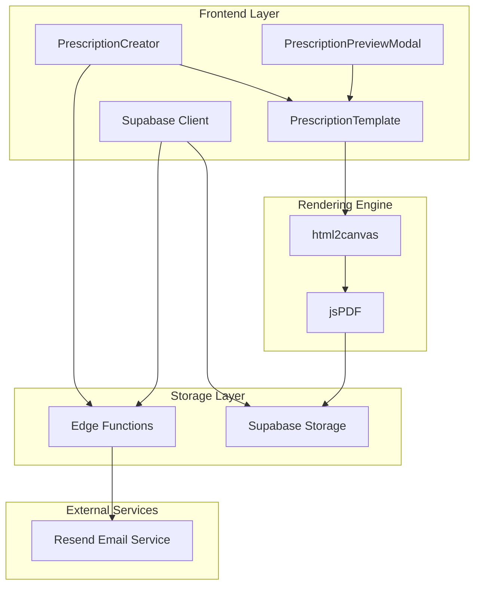

**Diagram sources**
- [PrescriptionCreator.jsx](file://frontend/src/components/PrescriptionCreator.jsx#L1-L303)
- [PrescriptionPreviewModal.jsx](file://frontend/src/components/PrescriptionPreviewModal.jsx#L1-L331)
- [index.ts](file://supabase/functions/send-prescription-email/index.ts#L1-L193)

The architecture consists of four main layers:

1. **Frontend Components**: Handle user interaction and orchestrate the PDF generation workflow
2. **Rendering Engine**: Converts HTML templates to canvas and PDF format
3. **Storage Layer**: Manages cloud storage and file retrieval
4. **External Services**: Provides email delivery capabilities

## Core Components

### Prescription Creator Component

The Prescription Creator serves as the primary workflow controller for automated PDF generation during prescription creation. It manages the complete lifecycle from form submission to PDF upload and email delivery.

**Key Responsibilities:**
- Form validation and data preparation
- Automatic PDF generation using hidden mirror technique
- Cloud storage integration for PDF files
- Email delivery via Supabase Edge Functions
- Status tracking and user feedback

**Section sources**
- [PrescriptionCreator.jsx](file://frontend/src/components/PrescriptionCreator.jsx#L1-L303)

### Prescription Preview Modal

The Prescription Preview Modal provides manual PDF export capabilities with interactive controls and real-time preview functionality.

**Key Features:**
- Interactive PDF export button
- Print-to-A4 functionality
- Auto-download capability for seamless user experience
- Hidden mirror rendering for accurate capture
- Responsive design with scaling controls

**Section sources**
- [PrescriptionPreviewModal.jsx](file://frontend/src/components/PrescriptionPreviewModal.jsx#L1-L331)

### Prescription Template

The Prescription Template defines the visual structure and styling for all generated prescriptions, ensuring consistent formatting across different use cases.

**Design Specifications:**
- A4 dimensions (210mm × 297mm)
- Professional typography and spacing
- Doctor and patient information layout
- Signature and footer positioning
- Responsive design considerations

**Section sources**
- [PrescriptionPreviewModal.jsx](file://frontend/src/components/PrescriptionPreviewModal.jsx#L24-L132)

## HTML Rendering Pipeline

The HTML rendering pipeline transforms React components into printable, high-quality PDF documents through a multi-stage process:

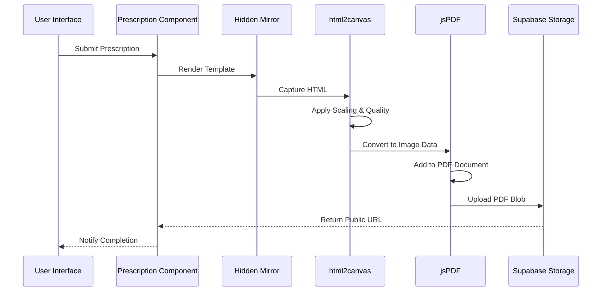

**Diagram sources**
- [PrescriptionCreator.jsx](file://frontend/src/components/PrescriptionCreator.jsx#L53-L98)
- [PrescriptionPreviewModal.jsx](file://frontend/src/components/PrescriptionPreviewModal.jsx#L186-L224)

### Rendering Workflow

The system employs a sophisticated rendering workflow that ensures accurate capture of prescription content:

1. **Template Preparation**: React components are rendered to a hidden mirror element
2. **Canvas Capture**: html2canvas captures the exact dimensions and styling
3. **Quality Processing**: Image data is processed with compression settings
4. **PDF Creation**: jsPDF creates the final A4-compliant document
5. **Storage Upload**: PDF is uploaded to cloud storage with metadata

**Section sources**
- [PrescriptionCreator.jsx](file://frontend/src/components/PrescriptionCreator.jsx#L194-L207)
- [PrescriptionPreviewModal.jsx](file://frontend/src/components/PrescriptionPreviewModal.jsx#L236-L248)

## Canvas Generation Configuration

The canvas generation process utilizes html2canvas with carefully tuned configuration parameters to achieve optimal quality and performance:

### Scale Factors and Resolution

| Use Case | Scale Factor | Purpose |
|----------|--------------|---------|
| Email Attachments | 2x | Balanced quality and file size |
| Manual Downloads | 3x | Highest quality for print |
| Initial Rendering | 2x | Stable capture before processing |

### Canvas Configuration Parameters

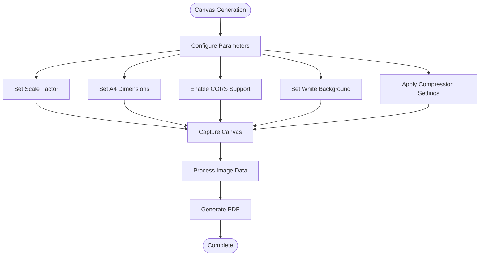

**Diagram sources**
- [PrescriptionCreator.jsx](file://frontend/src/components/PrescriptionCreator.jsx#L60-L68)
- [PrescriptionPreviewModal.jsx](file://frontend/src/components/PrescriptionPreviewModal.jsx#L194-L204)

### Dimension Specifications

The system uses precise A4 dimension calculations based on 96 DPI:

- **Width**: 210mm = 794 pixels
- **Height**: 297mm = 1123 pixels
- **Aspect Ratio**: 1:1.414 (A4 ratio)
- **Pixel Density**: 96 DPI for web rendering

**Section sources**
- [PrescriptionCreator.jsx](file://frontend/src/components/PrescriptionCreator.jsx#L64-L65)
- [PrescriptionPreviewModal.jsx](file://frontend/src/components/PrescriptionPreviewModal.jsx#L198-L199)

## PDF Conversion Process

The PDF conversion process transforms captured canvas images into professional A4 documents with precise formatting:

### Image Compression Techniques

| Use Case | Compression Level | File Size Impact | Quality Preservation |
|----------|-------------------|------------------|---------------------|
| Email Attachments | 0.8 (JPEG) | ~40% reduction | Excellent for documents |
| Manual Downloads | 0.98 (High Quality) | Minimal reduction | Maximum fidelity |
| Cloud Storage | 0.8 (Optimized) | Balanced compression | Suitable for PDF |

### PDF Creation Parameters

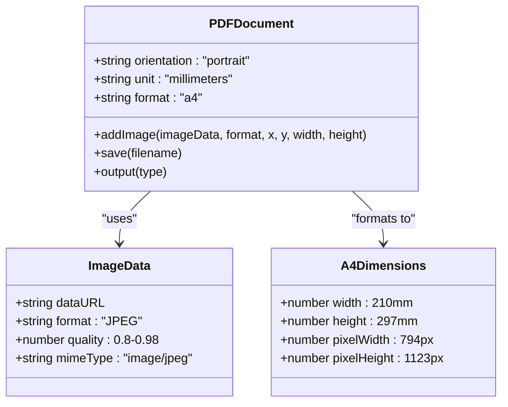

**Diagram sources**
- [PrescriptionCreator.jsx](file://frontend/src/components/PrescriptionCreator.jsx#L72-L77)
- [PrescriptionPreviewModal.jsx](file://frontend/src/components/PrescriptionPreviewModal.jsx#L207-L211)

### Blob Generation for Cloud Storage

The system converts PDF objects to Blob format for efficient cloud storage:

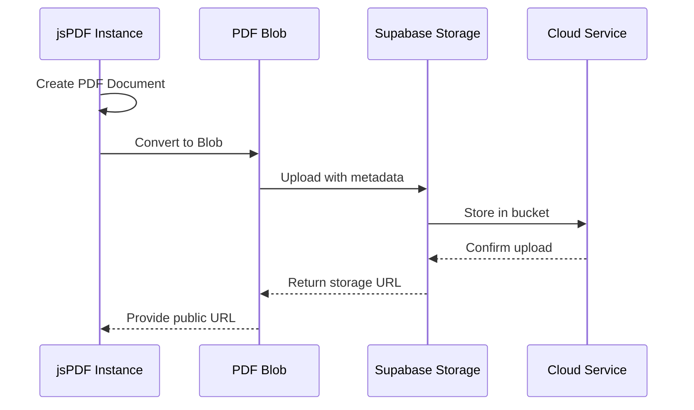

**Diagram sources**
- [PrescriptionCreator.jsx](file://frontend/src/components/PrescriptionCreator.jsx#L79-L97)

**Section sources**
- [PrescriptionCreator.jsx](file://frontend/src/components/PrescriptionCreator.jsx#L70-L97)
- [PrescriptionPreviewModal.jsx](file://frontend/src/components/PrescriptionPreviewModal.jsx#L206-L215)

## Cloud Storage Integration

The cloud storage integration provides robust file management and accessibility for generated PDFs:

### Storage Configuration

| Parameter | Value | Purpose |
|-----------|-------|---------|
| Bucket Name | `medvita-files` | Dedicated storage for medical documents |
| Content Type | `application/pdf` | Proper MIME type handling |
| Cache Control | `3600` seconds | CDN caching for performance |
| File Path Pattern | `{userId}/prescriptions/{filename}` | Organized storage structure |

### File Path Structure

The system organizes PDF files in a hierarchical structure:

```
medvita-files/
├── user_id_123/
│   ├── prescriptions/
│   │   ├── prescription_456_1699123456789.pdf
│   │   └── prescription_457_1699123500123.pdf
│   └── reports/
└── user_id_456/
    └── prescriptions/
```

### Public URL Generation

The system generates secure, time-limited URLs for accessing stored PDFs:

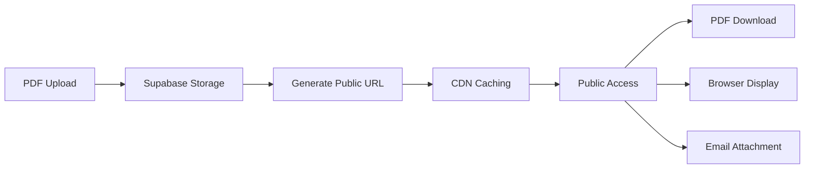

**Diagram sources**
- [PrescriptionCreator.jsx](file://frontend/src/components/PrescriptionCreator.jsx#L93-L97)

**Section sources**
- [PrescriptionCreator.jsx](file://frontend/src/components/PrescriptionCreator.jsx#L84-L97)
- [supabaseClient.js](file://frontend/src/lib/supabaseClient.js#L1-L11)

## Hidden Mirror Technique

The hidden mirror technique is a sophisticated approach to capturing HTML content without affecting the main user interface:

### Implementation Strategy

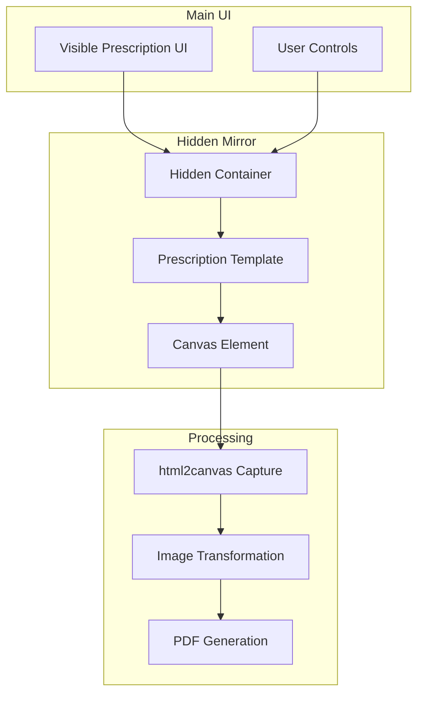

**Diagram sources**
- [PrescriptionCreator.jsx](file://frontend/src/components/PrescriptionCreator.jsx#L194-L207)
- [PrescriptionPreviewModal.jsx](file://frontend/src/components/PrescriptionPreviewModal.jsx#L236-L248)

### Positioning and Visibility

The hidden mirror elements use strategic positioning to remain invisible while maintaining full functionality:

| Property | Value | Purpose |
|----------|-------|---------|
| Position | `fixed` | Removes from normal document flow |
| Left Offset | `-15000px` | Moves far off-screen |
| Top Offset | `-15000px` | Ensures visibility for rendering |
| Z-Index | `-1` | Places behind main content |
| Visibility | `hidden` | Prevents visual interference |

### Rendering Benefits

The hidden mirror technique provides several advantages:

1. **Accurate Capture**: Renders HTML exactly as it appears in the main UI
2. **Performance**: Separates rendering concerns from user interface updates
3. **Reliability**: Eliminates interference with main page interactions
4. **Consistency**: Ensures identical output regardless of UI state

**Section sources**
- [PrescriptionCreator.jsx](file://frontend/src/components/PrescriptionCreator.jsx#L194-L207)
- [PrescriptionPreviewModal.jsx](file://frontend/src/components/PrescriptionPreviewModal.jsx#L236-L248)

## File Naming and Path Structure

The system implements a structured file naming convention that ensures organization, uniqueness, and traceability:

### File Naming Convention

```
prescriptions/{prescription_id}_{timestamp}.pdf
```

**Components:**
- **Directory**: `prescriptions/` - Logical grouping
- **Prescription ID**: Unique identifier for database linkage
- **Timestamp**: Millisecond precision for ordering
- **Extension**: `.pdf` - Standard file type

### Path Construction Logic

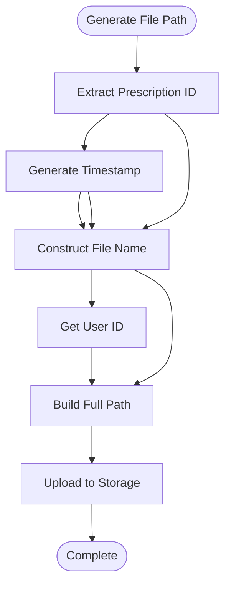

**Diagram sources**
- [PrescriptionCreator.jsx](file://frontend/src/components/PrescriptionCreator.jsx#L81-L82)

### Metadata Preservation

The file naming system preserves important metadata through the filename structure:

| Metadata Component | Location | Purpose |
|-------------------|----------|---------|
| Prescription ID | First part | Database linkage |
| Timestamp | Second part | Creation order |
| User ID | Path prefix | User organization |
| File extension | Suffix | Format identification |

**Section sources**
- [PrescriptionCreator.jsx](file://frontend/src/components/PrescriptionCreator.jsx#L81-L82)

## Metadata Handling

The system maintains comprehensive metadata throughout the PDF generation and storage process:

### Doctor Information Integration

The system automatically incorporates doctor profile information into generated prescriptions:

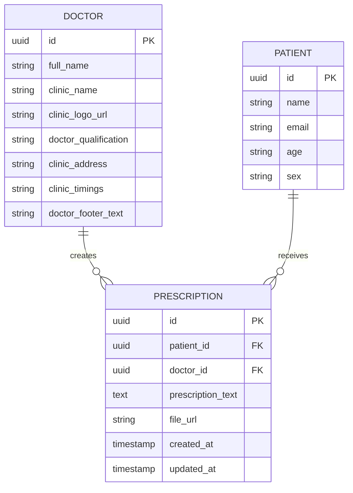

**Diagram sources**
- [PrescriptionCreator.jsx](file://frontend/src/components/PrescriptionCreator.jsx#L116-L121)
- [PrescriptionPreviewModal.jsx](file://frontend/src/components/PrescriptionPreviewModal.jsx#L54-L84)

### Dynamic Content Generation

The system dynamically generates content based on available data:

1. **Doctor Information**: Automatically populated from user profile
2. **Patient Details**: Extracted from patient records
3. **Timestamps**: Generated during creation process
4. **Unique Identifiers**: Created for tracking and organization

**Section sources**
- [PrescriptionCreator.jsx](file://frontend/src/components/PrescriptionCreator.jsx#L116-L121)
- [PrescriptionPreviewModal.jsx](file://frontend/src/components/PrescriptionPreviewModal.jsx#L95-L102)

## Performance Considerations

The PDF generation system is optimized for performance across multiple dimensions:

### Memory Management Strategies

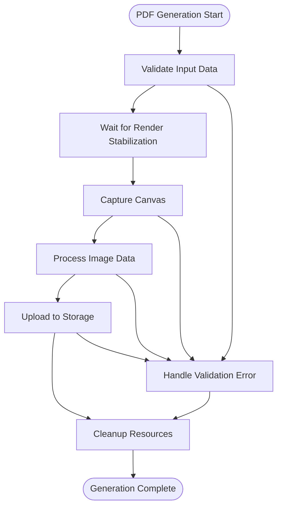

**Diagram sources**
- [PrescriptionCreator.jsx](file://frontend/src/components/PrescriptionCreator.jsx#L56-L58)
- [PrescriptionPreviewModal.jsx](file://frontend/src/components/PrescriptionPreviewModal.jsx#L192-L193)

### Optimization Techniques

| Technique | Implementation | Benefit |
|-----------|----------------|---------|
| Render Stabilization | 800ms delay before capture | Ensures complete rendering |
| Scale Factor Tuning | 2x for email, 3x for downloads | Balances quality vs performance |
| Compression Settings | 0.8 for attachments, 0.98 for exports | Optimizes file size |
| Hidden Rendering | Separate DOM tree | Reduces main UI impact |
| Blob Processing | Direct PDF to blob conversion | Minimizes memory overhead |

### Large Image Processing

The system handles large image processing efficiently:

1. **Progressive Loading**: Images are processed in chunks
2. **Memory Pooling**: Canvas resources are reused when possible
3. **Garbage Collection**: Explicit cleanup after processing
4. **Timeout Handling**: Prevents infinite processing loops

**Section sources**
- [PrescriptionCreator.jsx](file://frontend/src/components/PrescriptionCreator.jsx#L56-L58)
- [PrescriptionPreviewModal.jsx](file://frontend/src/components/PrescriptionPreviewModal.jsx#L192-L193)

## Error Handling and Fallbacks

The system implements comprehensive error handling with graceful fallback mechanisms:

### Error Categories and Responses

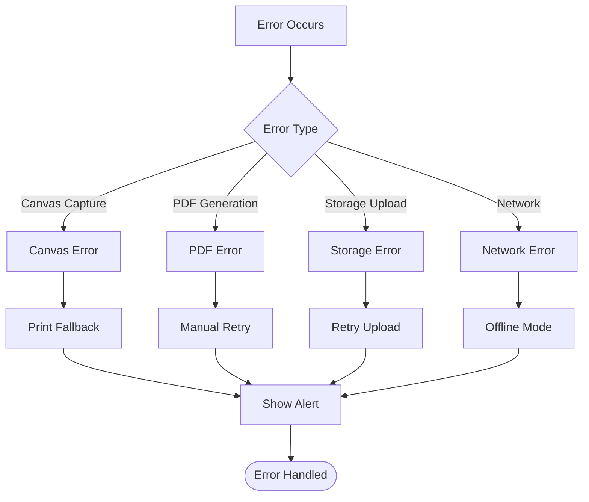

**Diagram sources**
- [PrescriptionPreviewModal.jsx](file://frontend/src/components/PrescriptionPreviewModal.jsx#L217-L223)

### Specific Error Handling

| Error Scenario | Detection Method | Fallback Action | User Notification |
|----------------|------------------|-----------------|-------------------|
| Missing Render Target | Null reference check | Print to browser | Alert message |
| Canvas Capture Failure | Promise rejection | Print fallback | User-friendly alert |
| PDF Generation Error | Exception catch | Manual retry option | Error log entry |
| Storage Upload Failure | API error response | Retry mechanism | Status indicator |
| Network Timeout | Request timeout | Offline processing | Retry suggestion |

### Recovery Mechanisms

The system provides multiple recovery pathways:

1. **Automatic Retry**: Limited retry attempts for transient errors
2. **Manual Intervention**: User-triggered regeneration
3. **Print Fallback**: Immediate alternative output method
4. **Database Rollback**: Maintains data consistency
5. **Logging**: Comprehensive error tracking for debugging

**Section sources**
- [PrescriptionPreviewModal.jsx](file://frontend/src/components/PrescriptionPreviewModal.jsx#L217-L223)
- [PrescriptionCreator.jsx](file://frontend/src/components/PrescriptionCreator.jsx#L181-L187)

## Security Considerations

The PDF generation system implements multiple security measures to protect sensitive medical information:

### Data Protection Measures

1. **Secure Storage**: All PDFs stored in encrypted cloud buckets
2. **Access Control**: Generated URLs with appropriate permissions
3. **Content Validation**: Sanitization of user-provided content
4. **Transport Security**: HTTPS encryption for all data transmission
5. **Audit Logging**: Comprehensive tracking of PDF generation activities

### Privacy Compliance

The system adheres to healthcare privacy regulations:

- **HIPAA Compliance**: Secure handling of protected health information
- **Data Minimization**: Only necessary information included in PDFs
- **Retention Policies**: Automated cleanup of temporary files
- **Access Logging**: Complete audit trail of PDF access and distribution

### Email Security

The email delivery system includes additional security measures:

- **Encrypted Transmission**: Secure email transport via Resend API
- **Attachment Validation**: PDF validation before sending
- **Rate Limiting**: Prevention of abuse through automated systems
- **Content Filtering**: Protection against malicious attachments

**Section sources**
- [index.ts](file://supabase/functions/send-prescription-email/index.ts#L48-L58)
- [PrescriptionCreator.jsx](file://frontend/src/components/PrescriptionCreator.jsx#L152-L167)

## Troubleshooting Guide

### Common Issues and Solutions

#### Canvas Capture Problems

**Symptoms**: Blank or incomplete PDF output
**Causes**: 
- Insufficient render stabilization time
- CSS conflicts affecting visibility
- Cross-origin resource restrictions
- Large image loading delays

**Solutions**:
1. Increase stabilization delay (currently 800ms)
2. Verify CSS compatibility with html2canvas
3. Configure CORS headers for external resources
4. Preload large images before capture

#### PDF Quality Issues

**Symptoms**: Low-resolution or compressed output
**Causes**:
- Insufficient scale factor
- Compression level too high
- Incorrect DPI settings
- Browser rendering differences

**Solutions**:
1. Adjust scale factor based on use case
2. Optimize compression settings (0.8-0.98)
3. Verify A4 dimension calculations
4. Test across different browsers

#### Storage Upload Failures

**Symptoms**: PDF generation succeeds but upload fails
**Causes**:
- Network connectivity issues
- Supabase service unavailability
- File size limits exceeded
- Authentication problems

**Solutions**:
1. Implement retry logic with exponential backoff
2. Monitor Supabase service status
3. Validate file size compliance (max 5MB)
4. Check authentication credentials

#### Email Delivery Problems

**Symptoms**: PDF generated but email not sent
**Causes**:
- Missing Resend API key
- Invalid recipient email address
- Email service rate limiting
- Network connectivity issues

**Solutions**:
1. Verify environment variable configuration
2. Validate email format and existence
3. Implement rate limiting and retry logic
4. Monitor email service health

### Debugging Tools and Techniques

1. **Console Logging**: Extensive logging throughout the generation process
2. **Error Boundaries**: Comprehensive error catching and reporting
3. **Performance Monitoring**: Track generation time and resource usage
4. **User Feedback**: Clear status indicators and progress information
5. **Test Cases**: Automated testing for critical workflows

**Section sources**
- [PrescriptionCreator.jsx](file://frontend/src/components/PrescriptionCreator.jsx#L181-L187)
- [PrescriptionPreviewModal.jsx](file://frontend/src/components/PrescriptionPreviewModal.jsx#L217-L223)

## Conclusion

The PDF generation system in MedVita represents a comprehensive solution for creating professional, compliant medical prescriptions. Through careful integration of html2canvas, jsPDF, and cloud storage technologies, the system delivers reliable, high-quality PDF output while maintaining excellent user experience.

Key strengths of the system include:

- **Precision Rendering**: Accurate A4 capture using hidden mirror technique
- **Performance Optimization**: Balanced quality and speed through intelligent configuration
- **Robust Error Handling**: Comprehensive fallback mechanisms and recovery strategies
- **Security Focus**: HIPAA-compliant handling of sensitive medical information
- **Scalable Architecture**: Modular design supporting future enhancements

The system successfully addresses the complex requirements of medical document generation while providing flexibility for various use cases and integration scenarios. Its thoughtful implementation of performance considerations, security measures, and user experience design makes it suitable for production deployment in healthcare environments.

Future enhancements could include advanced PDF form generation, batch processing capabilities, and enhanced analytics for tracking document distribution and usage patterns.