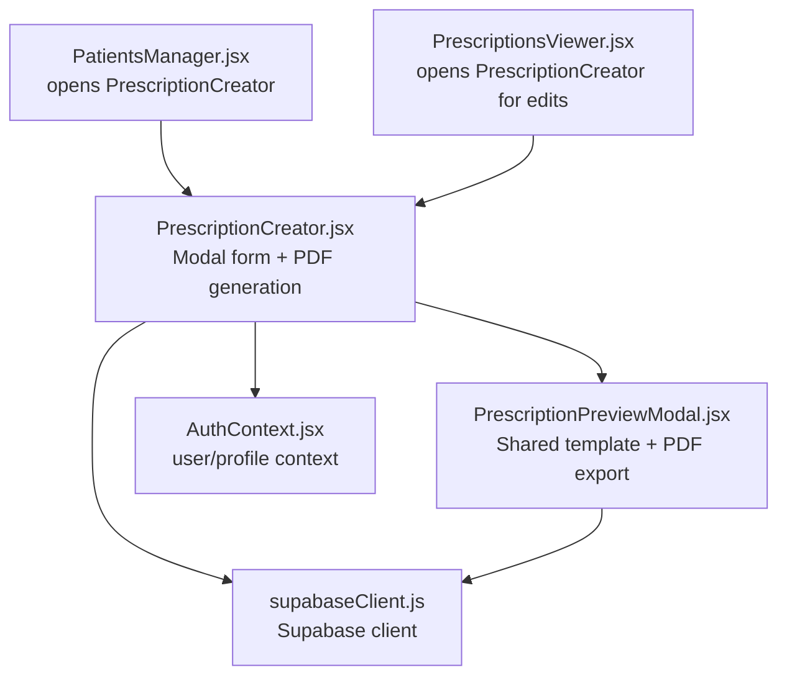
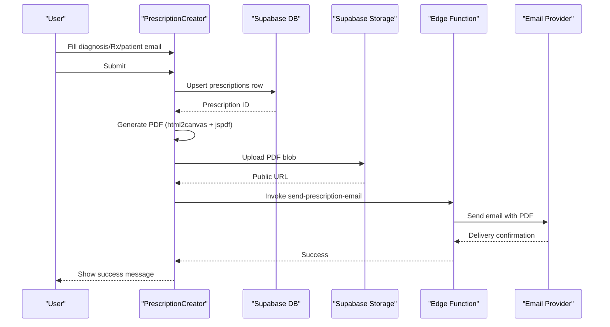
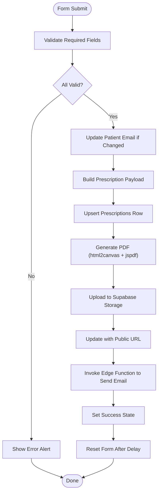
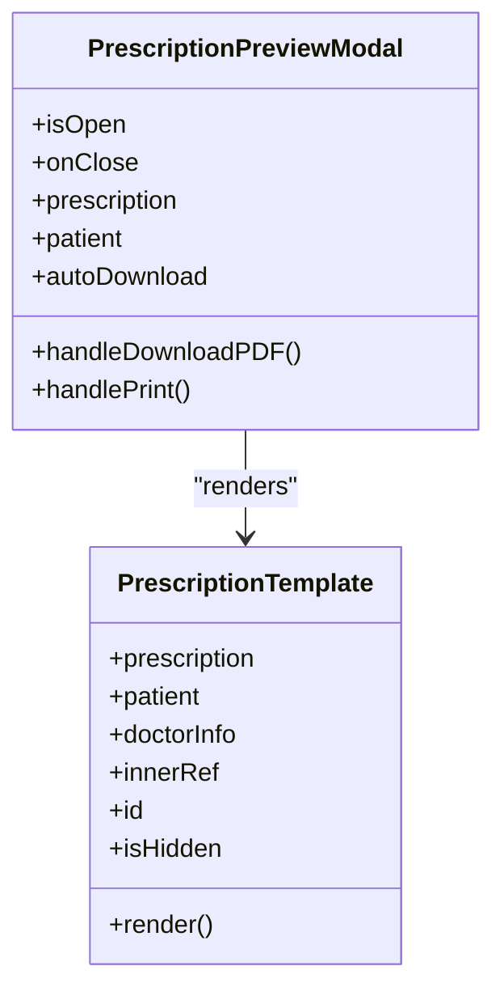
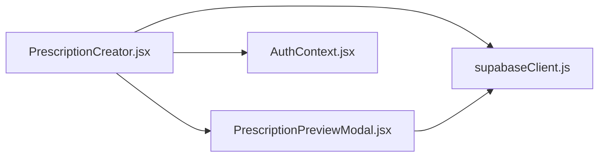

# Prescription Creation Interface

<cite>
**Referenced Files in This Document**
- [PrescriptionCreator.jsx](file://frontend/src/components/PrescriptionCreator.jsx)
- [PrescriptionPreviewModal.jsx](file://frontend/src/components/PrescriptionPreviewModal.jsx)
- [PatientsManager.jsx](file://frontend/src/pages/PatientsManager.jsx)
- [PrescriptionsViewer.jsx](file://frontend/src/pages/PrescriptionsViewer.jsx)
- [AuthContext.jsx](file://frontend/src/context/AuthContext.jsx)
- [supabaseClient.js](file://frontend/src/lib/supabaseClient.js)
- [index.css](file://frontend/src/index.css)
</cite>

## Table of Contents
1. [Introduction](#introduction)
2. [Project Structure](#project-structure)
3. [Core Components](#core-components)
4. [Architecture Overview](#architecture-overview)
5. [Detailed Component Analysis](#detailed-component-analysis)
6. [Dependency Analysis](#dependency-analysis)
7. [Performance Considerations](#performance-considerations)
8. [Troubleshooting Guide](#troubleshooting-guide)
9. [Conclusion](#conclusion)

## Introduction
This document describes the Prescription Creation Interface component responsible for capturing diagnosis and treatment information, generating a printable PDF, and sending it to a patient via email. It covers the user interface design, state management, auto-filling mechanisms, edit mode, form validation, submission workflow, real-time status indicators, accessibility and responsive design considerations, and error handling.

## Project Structure
The Prescription Creation Interface is implemented as a modal component that integrates with Supabase for data persistence and email delivery via an Edge Function. It reuses a shared Prescription Template for consistent PDF rendering.

**Diagram sources**
- [PatientsManager.jsx](file://frontend/src/pages/PatientsManager.jsx#L642-L650)
- [PrescriptionsViewer.jsx](file://frontend/src/pages/PrescriptionsViewer.jsx#L246-L255)
- [PrescriptionCreator.jsx](file://frontend/src/components/PrescriptionCreator.jsx#L1-L303)
- [PrescriptionPreviewModal.jsx](file://frontend/src/components/PrescriptionPreviewModal.jsx#L1-L331)
- [AuthContext.jsx](file://frontend/src/context/AuthContext.jsx#L1-L108)
- [supabaseClient.js](file://frontend/src/lib/supabaseClient.js#L1-L11)

**Section sources**
- [PrescriptionCreator.jsx](file://frontend/src/components/PrescriptionCreator.jsx#L1-L303)
- [PrescriptionPreviewModal.jsx](file://frontend/src/components/PrescriptionPreviewModal.jsx#L1-L331)
- [PatientsManager.jsx](file://frontend/src/pages/PatientsManager.jsx#L642-L650)
- [PrescriptionsViewer.jsx](file://frontend/src/pages/PrescriptionsViewer.jsx#L246-L255)
- [AuthContext.jsx](file://frontend/src/context/AuthContext.jsx#L1-L108)
- [supabaseClient.js](file://frontend/src/lib/supabaseClient.js#L1-L11)

## Core Components
- PrescriptionCreator: The main modal form for creating or editing prescriptions. Manages diagnosis and treatment text, patient email, PDF generation, and email dispatch.
- PrescriptionPreviewModal: Shared template and utilities for rendering and exporting prescriptions as PDFs.
- AuthContext: Provides authenticated user and profile data used for doctor identity and clinic branding.
- Supabase client: Centralized Supabase client initialization and configuration.

Key responsibilities:
- UI: Diagnosis input, Rx/treatment textarea, patient email field, submit/cancel actions.
- State: Tracks diagnosis, Rx text, patient email, file selection, upload status, success state.
- Validation: Required fields for diagnosis, Rx, and patient email.
- Submission: Persists to Supabase, generates PDF, uploads to Supabase Storage, triggers email via Edge Function.
- Status: Real-time feedback for saving, generating, uploading, and emailing.

**Section sources**
- [PrescriptionCreator.jsx](file://frontend/src/components/PrescriptionCreator.jsx#L11-L303)
- [PrescriptionPreviewModal.jsx](file://frontend/src/components/PrescriptionPreviewModal.jsx#L24-L132)
- [AuthContext.jsx](file://frontend/src/context/AuthContext.jsx#L9-L107)
- [supabaseClient.js](file://frontend/src/lib/supabaseClient.js#L1-L11)

## Architecture Overview
The component orchestrates a multi-stage workflow: form capture, database persistence, PDF generation, file upload, and email dispatch.

**Diagram sources**
- [PrescriptionCreator.jsx](file://frontend/src/components/PrescriptionCreator.jsx#L100-L188)
- [PrescriptionCreator.jsx](file://frontend/src/components/PrescriptionCreator.jsx#L53-L98)

## Detailed Component Analysis

### PrescriptionCreator Modal
- Purpose: Create or edit a prescription with diagnosis and Rx text, capture patient email, and submit to Supabase.
- Inputs:
  - Diagnosis: Text input with required validation.
  - Rx/Treatment: Textarea with required validation.
  - Patient Email: Email input with required validation.
- State:
  - diagnosis: Current diagnosis text.
  - prescriptionText: Current Rx text.
  - patientEmail: Patient’s email address.
  - file: Optional file attachment.
  - uploading: Submission in progress flag.
  - status: Current phase ("saving", "generating", "uploading", "emailing").
  - success: Success indicator after completion.
- Auto-fill:
  - On mount, if a patient object is provided, the patient email is auto-filled.
- Edit mode:
  - When initialData is provided, the form parses existing text into diagnosis and Rx sections and enables update flow.
- Submission workflow:
  - Update patient email if changed.
  - Build payload with patient_id, doctor_id, and formatted prescription_text.
  - Insert/update prescriptions row.
  - Generate PDF using a hidden template mirror and upload to Supabase Storage.
  - Update the prescriptions row with the generated file URL.
  - Invoke Supabase Edge Function to send email.
  - Show success state and reset form after delay.
- Real-time status indicators:
  - status reflects current operation phase.
  - Uploading disables UI controls to prevent concurrent submissions.
- Accessibility and UX:
  - Disabled states during uploads.
  - Clear labels and placeholders.
  - Responsive layout via shared CSS utilities.

**Diagram sources**
- [PrescriptionCreator.jsx](file://frontend/src/components/PrescriptionCreator.jsx#L100-L188)
- [PrescriptionCreator.jsx](file://frontend/src/components/PrescriptionCreator.jsx#L53-L98)

**Section sources**
- [PrescriptionCreator.jsx](file://frontend/src/components/PrescriptionCreator.jsx#L11-L303)

### PrescriptionPreviewModal (Shared Template)
- Purpose: Provide a reusable template for rendering and exporting prescriptions as PDFs.
- Features:
  - PrescriptionTemplate renders a branded A4 layout with doctor and patient metadata.
  - Export utilities for PDF download and print.
  - Hidden mirror technique for precise A4 capture using html2canvas and jspdf.
- Constants:
  - A4_WIDTH_MM, A4_HEIGHT_MM, COLORS exported for consistent metrics and styling.

**Diagram sources**
- [PrescriptionPreviewModal.jsx](file://frontend/src/components/PrescriptionPreviewModal.jsx#L24-L132)
- [PrescriptionPreviewModal.jsx](file://frontend/src/components/PrescriptionPreviewModal.jsx#L134-L331)

**Section sources**
- [PrescriptionPreviewModal.jsx](file://frontend/src/components/PrescriptionPreviewModal.jsx#L1-L331)

### Integration Points
- AuthContext: Provides user and profile data for doctor identity and clinic branding.
- Supabase client: Centralized client initialization and environment configuration.
- Edge Function: send-prescription-email invoked to deliver the PDF.

**Section sources**
- [AuthContext.jsx](file://frontend/src/context/AuthContext.jsx#L1-L108)
- [supabaseClient.js](file://frontend/src/lib/supabaseClient.js#L1-L11)

### Usage Scenarios
- From Patients Manager:
  - Opens the modal with a selected patient and passes onSuccess to refresh patient list.
- From Prescriptions Viewer (edit):
  - Opens the modal pre-filled with existing prescription data for editing.

**Section sources**
- [PatientsManager.jsx](file://frontend/src/pages/PatientsManager.jsx#L642-L650)
- [PrescriptionsViewer.jsx](file://frontend/src/pages/PrescriptionsViewer.jsx#L246-L255)

## Dependency Analysis
- Internal dependencies:
  - PrescriptionCreator depends on PrescriptionPreviewModal for PDF generation.
  - Both components depend on AuthContext for doctor profile and on Supabase client for database operations.
- External libraries:
  - html2canvas and jspdf for PDF generation.
  - date-fns for date formatting.
  - lucide-react icons for UI affordances.
- Supabase operations:
  - patients.update for email updates.
  - prescriptions.insert/update for saving.
  - storage.upload/getPublicUrl for PDF storage.
  - functions.invoke for email dispatch.

**Diagram sources**
- [PrescriptionCreator.jsx](file://frontend/src/components/PrescriptionCreator.jsx#L1-L9)
- [PrescriptionPreviewModal.jsx](file://frontend/src/components/PrescriptionPreviewModal.jsx#L1-L7)
- [AuthContext.jsx](file://frontend/src/context/AuthContext.jsx#L1-L2)
- [supabaseClient.js](file://frontend/src/lib/supabaseClient.js#L1-L2)

**Section sources**
- [PrescriptionCreator.jsx](file://frontend/src/components/PrescriptionCreator.jsx#L1-L9)
- [PrescriptionPreviewModal.jsx](file://frontend/src/components/PrescriptionPreviewModal.jsx#L1-L7)
- [AuthContext.jsx](file://frontend/src/context/AuthContext.jsx#L1-L2)
- [supabaseClient.js](file://frontend/src/lib/supabaseClient.js#L1-L2)

## Performance Considerations
- PDF generation:
  - Uses html2canvas with a fixed A4 capture size and a short stabilization delay to ensure rendered content is ready.
  - Compression via JPEG quality setting reduces attachment size.
- Rendering:
  - Hidden mirror technique isolates the template rendering for accurate capture.
- Network:
  - Single upsert operation followed by a single upload and function invocation minimizes round trips.
- UI responsiveness:
  - Uploading flag disables controls to prevent duplicate submissions and reduce race conditions.

[No sources needed since this section provides general guidance]

## Troubleshooting Guide
Common issues and resolutions:
- Missing Supabase credentials:
  - The client logs a warning if VITE_SUPABASE_URL or VITE_SUPABASE_ANON_KEY are missing. Ensure environment variables are configured.
- PDF generation failures:
  - The component throws an error if the hidden mirror element is missing during generation.
  - Fallback alerts are shown if PDF export fails.
- Email delivery errors:
  - The component checks for function invocation errors and blocks/delivered errors, displaying a descriptive alert.
- Form submission errors:
  - Errors are caught and surfaced via an alert; the uploading flag resets to allow retry.

**Section sources**
- [supabaseClient.js](file://frontend/src/lib/supabaseClient.js#L6-L8)
- [PrescriptionCreator.jsx](file://frontend/src/components/PrescriptionCreator.jsx#L53-L58)
- [PrescriptionCreator.jsx](file://frontend/src/components/PrescriptionCreator.jsx#L181-L187)

## Conclusion
The Prescription Creation Interface provides a streamlined, accessible, and responsive workflow for capturing diagnosis and treatment details, generating a professional PDF, and delivering it to patients. Its modular design leverages shared templates and centralized Supabase integration, while real-time status indicators and robust error handling enhance reliability and user confidence.