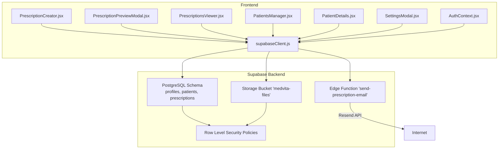
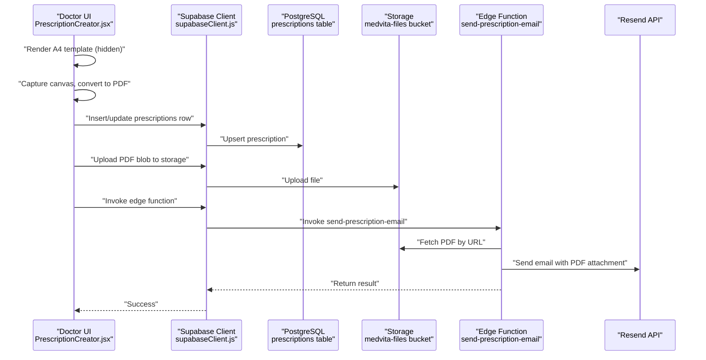
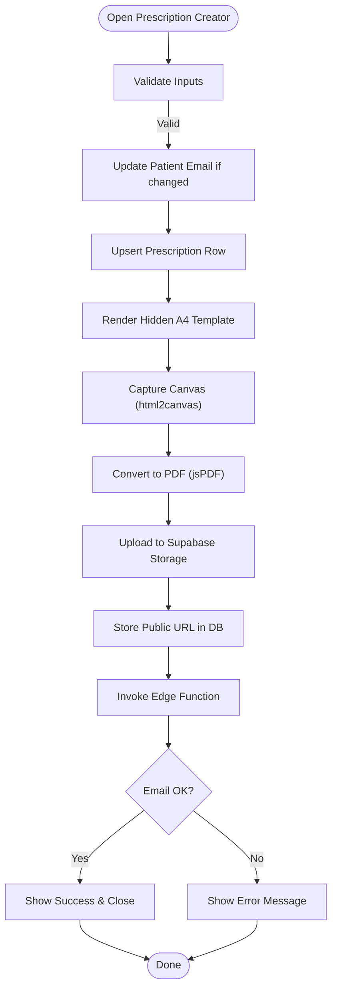
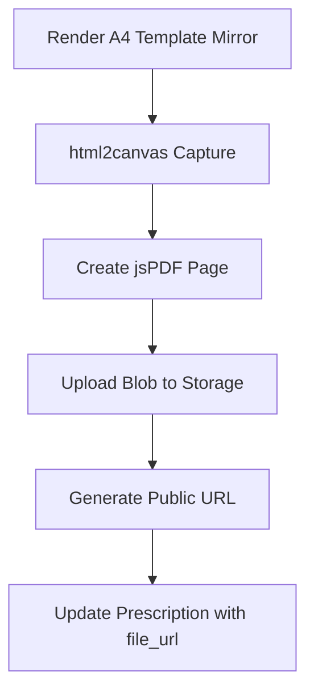
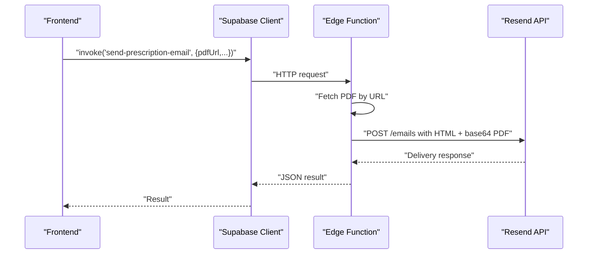
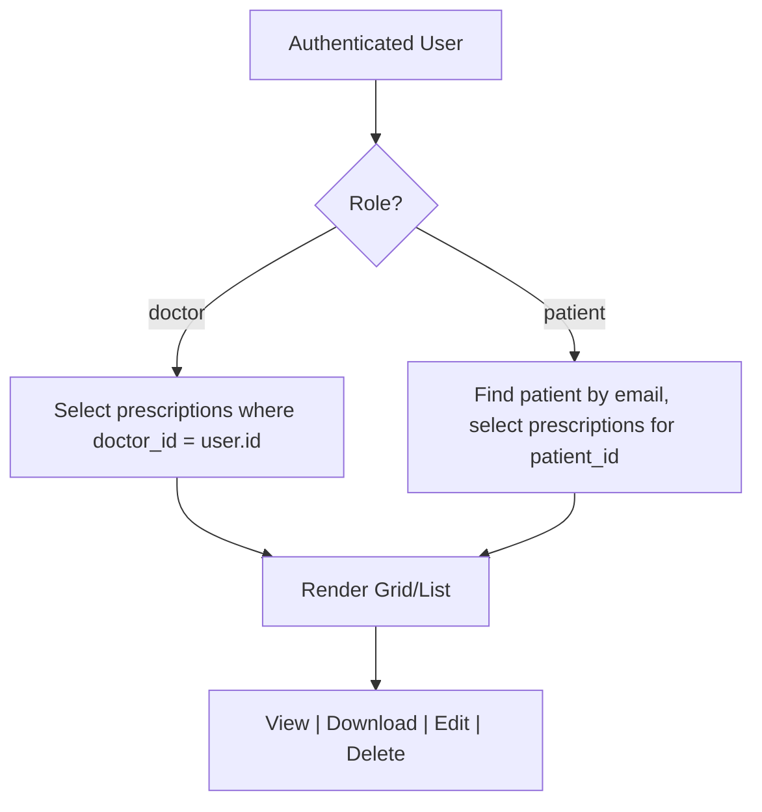
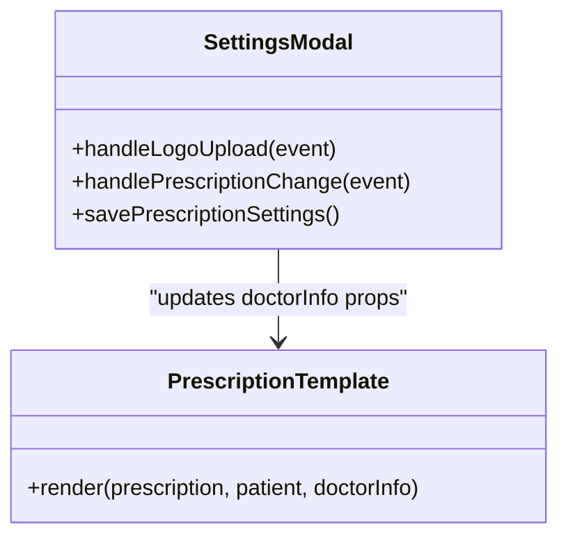
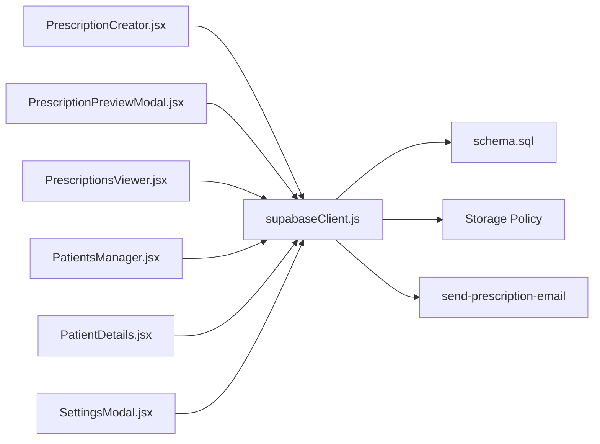
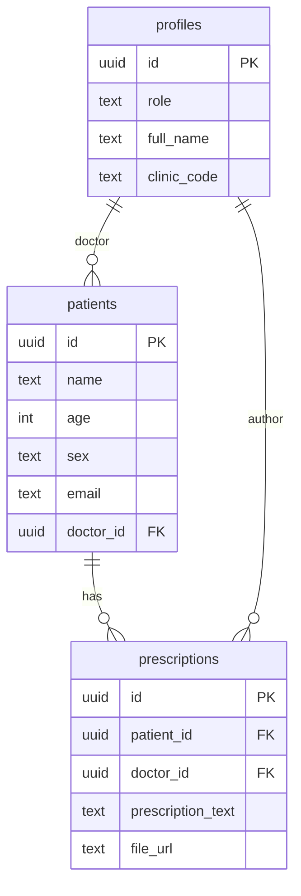

# Prescription Management

<cite>
**Referenced Files in This Document**
- [PrescriptionsViewer.jsx](file://frontend/src/pages/PrescriptionsViewer.jsx)
- [PrescriptionCreator.jsx](file://frontend/src/components/PrescriptionCreator.jsx)
- [PrescriptionPreviewModal.jsx](file://frontend/src/components/PrescriptionPreviewModal.jsx)
- [PatientsManager.jsx](file://frontend/src/pages/PatientsManager.jsx)
- [PatientDetails.jsx](file://frontend/src/components/PatientDetails.jsx)
- [AuthContext.jsx](file://frontend/src/context/AuthContext.jsx)
- [supabaseClient.js](file://frontend/src/lib/supabaseClient.js)
- [schema.sql](file://backend/schema.sql)
- [send-prescription-email/index.ts](file://supabase/functions/send-prescription-email/index.ts)
- [App.jsx](file://frontend/src/App.jsx)
- [SettingsModal.jsx](file://frontend/src/components/SettingsModal.jsx)
</cite>

## Table of Contents
1. [Introduction](#introduction)
2. [Project Structure](#project-structure)
3. [Core Components](#core-components)
4. [Architecture Overview](#architecture-overview)
5. [Detailed Component Analysis](#detailed-component-analysis)
6. [Dependency Analysis](#dependency-analysis)
7. [Performance Considerations](#performance-considerations)
8. [Troubleshooting Guide](#troubleshooting-guide)
9. [Conclusion](#conclusion)
10. [Appendices](#appendices)

## Introduction
This document describes MedVita’s digital prescription management system. It covers how prescriptions are created, previewed, and delivered; how PDFs are generated and stored; how emails are sent via Supabase edge functions; how patients can view and download their prescriptions; and how the system integrates with Supabase for authentication, data, storage, and row-level security. It also outlines customization options for prescription templates and discusses security and audit considerations.

## Project Structure
The prescription management feature spans three layers:
- Frontend (React/Vite): UI for creating, previewing, and viewing prescriptions; patient history; and settings.
- Supabase Backend: PostgreSQL schema, Row Level Security (RLS), storage buckets, and edge functions.
- Integration: Supabase client SDK for database and storage operations; edge functions for email delivery.

**Diagram sources**
- [PrescriptionCreator.jsx](file://frontend/src/components/PrescriptionCreator.jsx#L1-L303)
- [PrescriptionPreviewModal.jsx](file://frontend/src/components/PrescriptionPreviewModal.jsx#L1-L331)
- [PrescriptionsViewer.jsx](file://frontend/src/pages/PrescriptionsViewer.jsx#L1-L273)
- [PatientsManager.jsx](file://frontend/src/pages/PatientsManager.jsx#L1-L667)
- [PatientDetails.jsx](file://frontend/src/components/PatientDetails.jsx#L1-L400)
- [SettingsModal.jsx](file://frontend/src/components/SettingsModal.jsx#L350-L650)
- [AuthContext.jsx](file://frontend/src/context/AuthContext.jsx#L1-L108)
- [supabaseClient.js](file://frontend/src/lib/supabaseClient.js#L1-L11)
- [schema.sql](file://backend/schema.sql#L1-L274)
- [send-prescription-email/index.ts](file://supabase/functions/send-prescription-email/index.ts#L1-L193)

**Section sources**
- [App.jsx](file://frontend/src/App.jsx#L1-L62)
- [supabaseClient.js](file://frontend/src/lib/supabaseClient.js#L1-L11)
- [schema.sql](file://backend/schema.sql#L1-L274)

## Core Components
- Prescription Creation UI: Collects diagnosis, treatment notes, and patient email; generates a PDF; uploads to Supabase Storage; triggers email delivery.
- Prescription Preview and PDF Generation: Renders a printable A4 template, captures it as an image, converts to PDF, and offers download/print.
- Email Delivery via Edge Function: Downloads the PDF, attaches it, and sends via Resend.
- Prescription Viewer: Lists prescriptions per role (doctor/patient), integrates with patient history, and supports actions (download, view, edit, delete).
- Patient History: Aggregates appointments and prescriptions for timeline view.
- Customization: Allows doctors to customize clinic branding and footer text for prescriptions.

**Section sources**
- [PrescriptionCreator.jsx](file://frontend/src/components/PrescriptionCreator.jsx#L1-L303)
- [PrescriptionPreviewModal.jsx](file://frontend/src/components/PrescriptionPreviewModal.jsx#L1-L331)
- [PrescriptionsViewer.jsx](file://frontend/src/pages/PrescriptionsViewer.jsx#L1-L273)
- [PatientsManager.jsx](file://frontend/src/pages/PatientsManager.jsx#L1-L667)
- [PatientDetails.jsx](file://frontend/src/components/PatientDetails.jsx#L1-L400)
- [SettingsModal.jsx](file://frontend/src/components/SettingsModal.jsx#L350-L650)

## Architecture Overview
End-to-end flow for creating and delivering a prescription:

**Diagram sources**
- [PrescriptionCreator.jsx](file://frontend/src/components/PrescriptionCreator.jsx#L53-L98)
- [PrescriptionCreator.jsx](file://frontend/src/components/PrescriptionCreator.jsx#L100-L188)
- [PrescriptionPreviewModal.jsx](file://frontend/src/components/PrescriptionPreviewModal.jsx#L186-L224)
- [supabaseClient.js](file://frontend/src/lib/supabaseClient.js#L1-L11)
- [schema.sql](file://backend/schema.sql#L200-L225)
- [send-prescription-email/index.ts](file://supabase/functions/send-prescription-email/index.ts#L48-L191)

## Detailed Component Analysis

### Prescription Creation Interface
- Inputs:
  - Diagnosis (optional)
  - Treatment/Rx notes
  - Patient email (required for sending)
- Workflow:
  - Validates inputs and updates patient email if changed.
  - Upserts the prescription row with text content.
  - Generates a PDF from a hidden A4 template mirror, uploads to Supabase Storage, and stores the public URL.
  - Invokes the edge function to email the PDF to the patient.
  - On success, closes modal and refreshes lists.

**Diagram sources**
- [PrescriptionCreator.jsx](file://frontend/src/components/PrescriptionCreator.jsx#L100-L188)
- [PrescriptionCreator.jsx](file://frontend/src/components/PrescriptionCreator.jsx#L53-L98)

**Section sources**
- [PrescriptionCreator.jsx](file://frontend/src/components/PrescriptionCreator.jsx#L11-L36)
- [PrescriptionCreator.jsx](file://frontend/src/components/PrescriptionCreator.jsx#L100-L188)

### PDF Generation and Cloud Storage
- A4 template rendering:
  - Hidden DOM mirror ensures precise A4 metrics (width/height in mm).
  - Captures the DOM at a higher DPI for quality.
- Conversion and upload:
  - Converts to JPEG for smaller attachment size, then to PDF.
  - Uploads to Supabase Storage bucket with public URL generation.
- Storage policy:
  - Only authenticated users can upload/view files in the bucket.
  - Public URL is stored in the prescriptions row for later retrieval.

**Diagram sources**
- [PrescriptionPreviewModal.jsx](file://frontend/src/components/PrescriptionPreviewModal.jsx#L186-L224)
- [PrescriptionCreator.jsx](file://frontend/src/components/PrescriptionCreator.jsx#L53-L98)
- [schema.sql](file://backend/schema.sql#L226-L238)

**Section sources**
- [PrescriptionPreviewModal.jsx](file://frontend/src/components/PrescriptionPreviewModal.jsx#L186-L224)
- [PrescriptionCreator.jsx](file://frontend/src/components/PrescriptionCreator.jsx#L53-L98)
- [schema.sql](file://backend/schema.sql#L226-L238)

### Email Delivery via Supabase Edge Function
- Edge function responsibilities:
  - Accepts patient name, email, PDF URL, doctor name, and clinic name.
  - Fetches the PDF from the URL and base64-encodes it.
  - Builds a modern HTML email with embedded tips and a link to view/download.
  - Sends via Resend API using a bearer token from environment variables.
- Error handling:
  - Returns structured errors for missing keys or delivery failures.
  - Logs PDF fetch failures gracefully.

**Diagram sources**
- [PrescriptionCreator.jsx](file://frontend/src/components/PrescriptionCreator.jsx#L151-L168)
- [send-prescription-email/index.ts](file://supabase/functions/send-prescription-email/index.ts#L30-L191)

**Section sources**
- [PrescriptionCreator.jsx](file://frontend/src/components/PrescriptionCreator.jsx#L151-L168)
- [send-prescription-email/index.ts](file://supabase/functions/send-prescription-email/index.ts#L1-L193)

### Prescription Viewing and History Tracking
- Doctor view:
  - Lists prescriptions authored by the logged-in doctor.
  - Joins with patients to display patient names.
- Patient view:
  - Finds the patient record by the authenticated user’s email.
  - Shows prescriptions authored by any doctor for that patient.
- History aggregation:
  - PatientDetails compiles appointments and prescriptions into a timeline.
  - Supports quick actions: view, download PDF, and open the preview modal.

**Diagram sources**
- [PrescriptionsViewer.jsx](file://frontend/src/pages/PrescriptionsViewer.jsx#L57-L131)
- [PatientDetails.jsx](file://frontend/src/components/PatientDetails.jsx#L44-L90)

**Section sources**
- [PrescriptionsViewer.jsx](file://frontend/src/pages/PrescriptionsViewer.jsx#L57-L131)
- [PatientDetails.jsx](file://frontend/src/components/PatientDetails.jsx#L44-L90)

### Prescription Templates and Customization
- Template structure:
  - Header with clinic logo/name/qualifications/timings/address.
  - Patient metadata (name, age/sex, date, patient ID).
  - Body for Rx text.
  - Signature area and footer text.
- Customization:
  - Doctors can set clinic logo, name, qualification, timings, address, and footer text via Settings.
  - These values are applied to the template during rendering.

**Diagram sources**
- [PrescriptionPreviewModal.jsx](file://frontend/src/components/PrescriptionPreviewModal.jsx#L24-L132)
- [SettingsModal.jsx](file://frontend/src/components/SettingsModal.jsx#L508-L650)

**Section sources**
- [PrescriptionPreviewModal.jsx](file://frontend/src/components/PrescriptionPreviewModal.jsx#L24-L132)
- [SettingsModal.jsx](file://frontend/src/components/SettingsModal.jsx#L508-L650)

### Integration with Pharmacy Systems, Insurance, and Electronic Networks
- Current scope:
  - The system focuses on internal digital prescriptions, PDF generation, storage, and email delivery.
  - No explicit integrations with external pharmacy systems, insurance verification, or electronic prescribing networks are present in the current codebase.
- Recommendations:
  - Extend the prescriptions table with fields for pharmacy ID, insurance info, and eRx identifiers.
  - Add gateway-specific APIs and webhooks for external systems.
  - Implement audit logs for eRx submissions and acknowledgments.

[No sources needed since this section provides general guidance]

### Security, Tamper-Proofing, and Audit Trails
- Authentication and Authorization:
  - Supabase Auth handles sessions; roles (doctor, patient, receptionist) govern access.
- Row Level Security:
  - Prescriptions: doctors can manage; patients can view their own.
  - Patients: doctors/receptionists can view/manage; patients can view by email.
  - Storage: authenticated users can upload/view files in the bucket.
- Audit considerations:
  - Track creation/update timestamps and user IDs in the prescriptions table.
  - Log edge function invocations and email delivery statuses.
  - Consider cryptographic signatures or immutable storage for tamper-evidence.

**Section sources**
- [schema.sql](file://backend/schema.sql#L210-L225)
- [schema.sql](file://backend/schema.sql#L231-L237)
- [AuthContext.jsx](file://frontend/src/context/AuthContext.jsx#L14-L61)

## Dependency Analysis
- Frontend depends on:
  - Supabase client for DB and storage operations.
  - html2canvas and jsPDF for PDF generation.
  - AuthContext for user/profile data.
- Backend depends on:
  - PostgreSQL schema and policies.
  - Supabase Storage bucket.
  - Edge function for email delivery.

**Diagram sources**
- [PrescriptionCreator.jsx](file://frontend/src/components/PrescriptionCreator.jsx#L1-L10)
- [PrescriptionPreviewModal.jsx](file://frontend/src/components/PrescriptionPreviewModal.jsx#L1-L7)
- [PrescriptionsViewer.jsx](file://frontend/src/pages/PrescriptionsViewer.jsx#L1-L8)
- [PatientsManager.jsx](file://frontend/src/pages/PatientsManager.jsx#L1-L9)
- [PatientDetails.jsx](file://frontend/src/components/PatientDetails.jsx#L1-L7)
- [SettingsModal.jsx](file://frontend/src/components/SettingsModal.jsx#L350-L363)
- [supabaseClient.js](file://frontend/src/lib/supabaseClient.js#L1-L11)
- [schema.sql](file://backend/schema.sql#L200-L238)
- [send-prescription-email/index.ts](file://supabase/functions/send-prescription-email/index.ts#L1-L10)

**Section sources**
- [supabaseClient.js](file://frontend/src/lib/supabaseClient.js#L1-L11)
- [schema.sql](file://backend/schema.sql#L200-L238)

## Performance Considerations
- PDF generation:
  - Use appropriate canvas scale to balance quality and file size.
  - Debounce repeated generation attempts.
- Network calls:
  - Batch queries where possible (e.g., fetching patient list and Rx status together).
- Edge function:
  - Cache PDF fetches if URLs are static to reduce latency.
- Rendering:
  - Hide mirrors off-screen to avoid layout thrashing.
  - Avoid unnecessary re-renders by memoizing derived values.

[No sources needed since this section provides general guidance]

## Troubleshooting Guide
- PDF generation fails:
  - Ensure the hidden A4 mirror renders before capture.
  - Verify html2canvas and jsPDF versions are compatible.
- Email not delivered:
  - Confirm the edge function has the Resend API key.
  - Check that the PDF URL is accessible and downloadable.
- Storage upload errors:
  - Verify bucket permissions and authenticated session.
- Patient cannot see prescriptions:
  - Confirm the patient record matches the authenticated user’s email.

**Section sources**
- [PrescriptionCreator.jsx](file://frontend/src/components/PrescriptionCreator.jsx#L53-L98)
- [PrescriptionPreviewModal.jsx](file://frontend/src/components/PrescriptionPreviewModal.jsx#L186-L224)
- [send-prescription-email/index.ts](file://supabase/functions/send-prescription-email/index.ts#L31-L46)
- [schema.sql](file://backend/schema.sql#L231-L237)

## Conclusion
MedVita’s prescription management system provides a secure, role-aware workflow for creating, previewing, storing, and emailing digital prescriptions. It leverages Supabase for authentication, data, storage, and serverless email delivery. While the current implementation focuses on internal functionality, it can be extended to integrate with external systems and strengthen audit and tamper-proofing measures.

## Appendices

### Data Model Overview

**Diagram sources**
- [schema.sql](file://backend/schema.sql#L4-L14)
- [schema.sql](file://backend/schema.sql#L46-L58)
- [schema.sql](file://backend/schema.sql#L200-L208)

### Example Workflows
- Doctor creates a prescription:
  - Open “Prescribe” from the patient list.
  - Enter diagnosis and Rx notes.
  - Provide patient email.
  - Submit; PDF uploaded; email sent; list refreshed.
- Patient views history:
  - Navigate to “My Prescriptions.”
  - View timeline of appointments and prescriptions.
  - Download or preview PDFs.

**Section sources**
- [PatientsManager.jsx](file://frontend/src/pages/PatientsManager.jsx#L197-L200)
- [PrescriptionsViewer.jsx](file://frontend/src/pages/PrescriptionsViewer.jsx#L57-L131)
- [PatientDetails.jsx](file://frontend/src/components/PatientDetails.jsx#L44-L90)