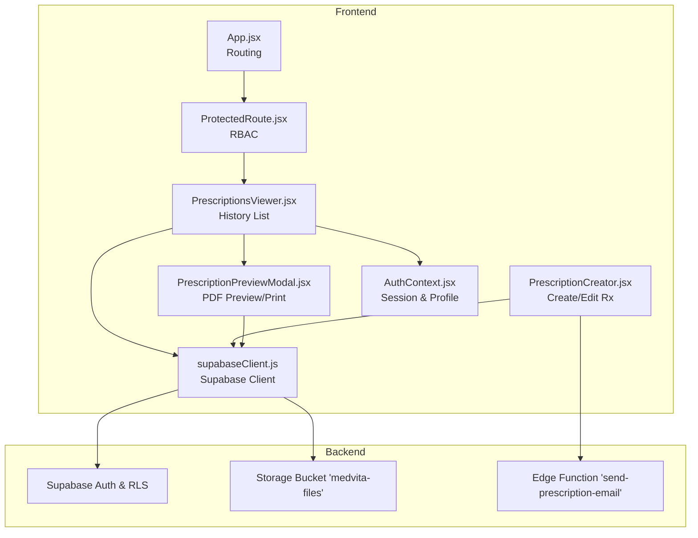
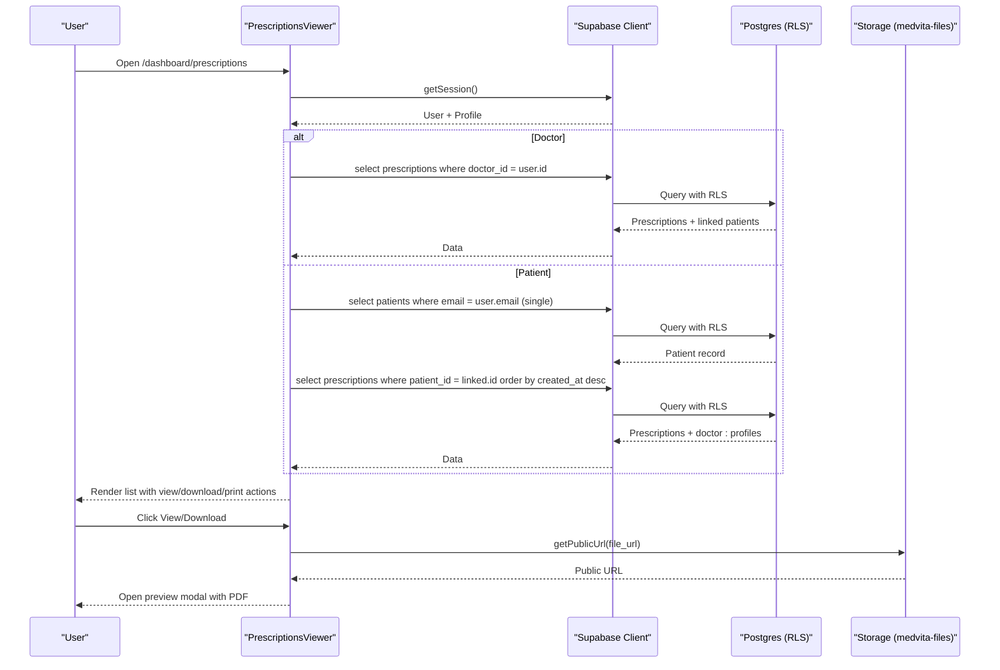
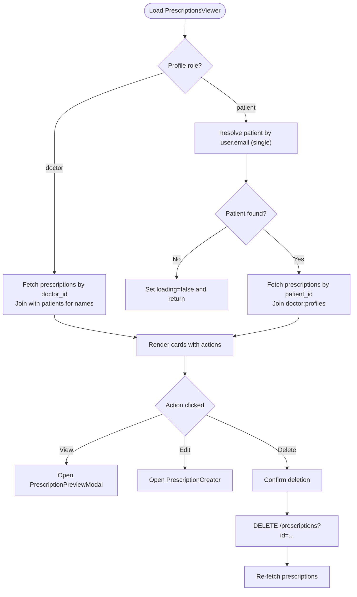
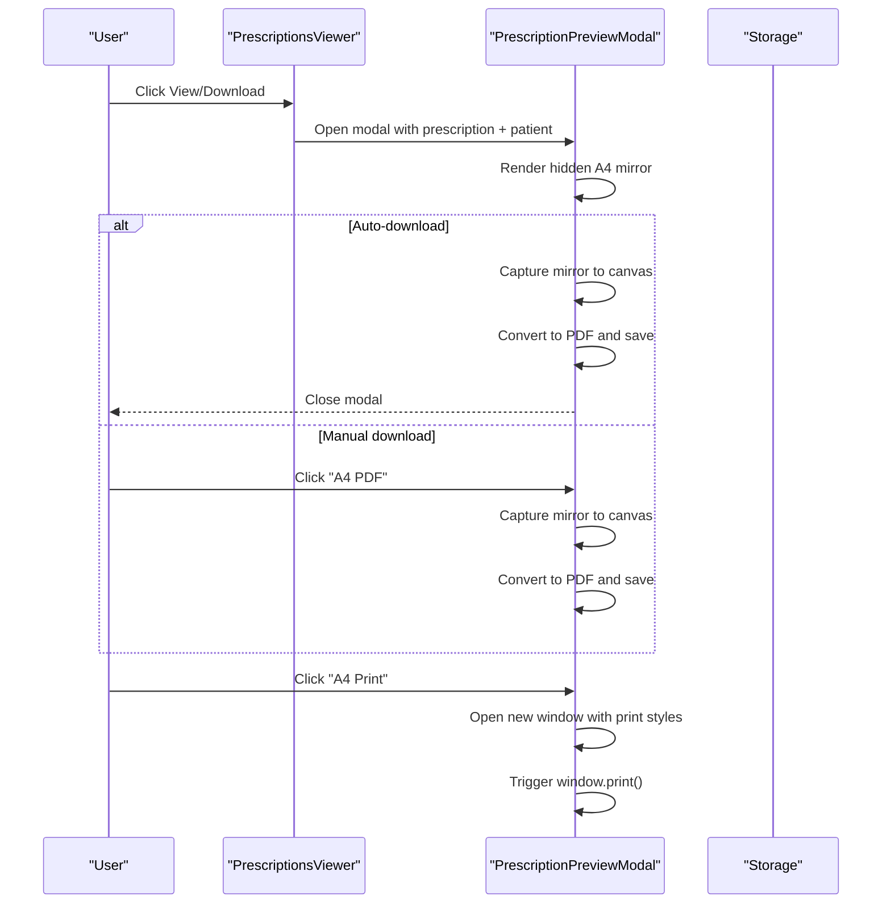
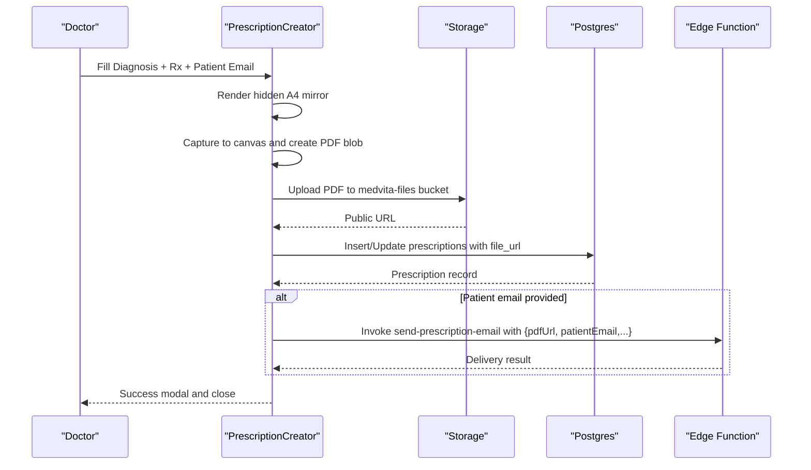
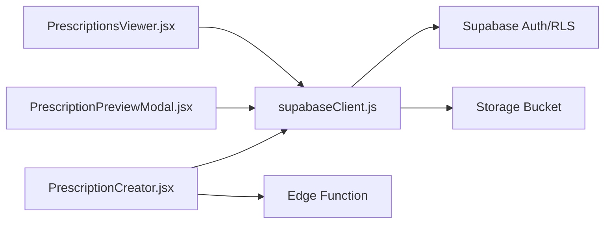

# Prescription Viewer and History

<cite>
**Referenced Files in This Document**
- [PrescriptionsViewer.jsx](file://frontend/src/pages/PrescriptionsViewer.jsx)
- [PrescriptionCreator.jsx](file://frontend/src/components/PrescriptionCreator.jsx)
- [PrescriptionPreviewModal.jsx](file://frontend/src/components/PrescriptionPreviewModal.jsx)
- [schema.sql](file://backend/schema.sql)
- [supabaseClient.js](file://frontend/src/lib/supabaseClient.js)
- [AuthContext.jsx](file://frontend/src/context/AuthContext.jsx)
- [ProtectedRoute.jsx](file://frontend/src/components/ProtectedRoute.jsx)
- [App.jsx](file://frontend/src/App.jsx)
- [index.ts](file://supabase/functions/send-prescription-email/index.ts)
- [WIKI.md](file://WIKI.md)
</cite>

## Table of Contents
1. [Introduction](#introduction)
2. [Project Structure](#project-structure)
3. [Core Components](#core-components)
4. [Architecture Overview](#architecture-overview)
5. [Detailed Component Analysis](#detailed-component-analysis)
6. [Dependency Analysis](#dependency-analysis)
7. [Performance Considerations](#performance-considerations)
8. [Troubleshooting Guide](#troubleshooting-guide)
9. [Security and Audit](#security-and-audit)
10. [Conclusion](#conclusion)

## Introduction
This document describes the Prescription Viewer and History system, focusing on the patient-facing interface for viewing prescription history, filtering and search capabilities, pagination controls, data retrieval patterns from Supabase, role-based access restrictions, and patient record associations. It also covers prescription display formatting, diagnosis and treatment sections, doctor information, timestamps, cloud storage integration for PDF access and downloads, print capabilities, and examples of status tracking and pharmacy integration patterns. Security measures and audit trail considerations are included to protect patient medical information.

## Project Structure
The Prescription Viewer is implemented as a React page component integrated into the protected routing system. It interacts with Supabase for data retrieval and uses Supabase Storage for PDF access. The system leverages Supabase Edge Functions for sending prescriptions via email and uses Row Level Security (RLS) policies to enforce access control.

**Diagram sources**
- [App.jsx](file://frontend/src/App.jsx#L26-L58)
- [ProtectedRoute.jsx](file://frontend/src/components/ProtectedRoute.jsx#L53-L106)
- [PrescriptionsViewer.jsx](file://frontend/src/pages/PrescriptionsViewer.jsx#L9-L272)
- [PrescriptionPreviewModal.jsx](file://frontend/src/components/PrescriptionPreviewModal.jsx#L134-L330)
- [PrescriptionCreator.jsx](file://frontend/src/components/PrescriptionCreator.jsx#L11-L302)
- [AuthContext.jsx](file://frontend/src/context/AuthContext.jsx#L9-L107)
- [supabaseClient.js](file://frontend/src/lib/supabaseClient.js#L1-L11)
- [schema.sql](file://backend/schema.sql#L200-L238)
- [index.ts](file://supabase/functions/send-prescription-email/index.ts#L25-L192)

**Section sources**
- [App.jsx](file://frontend/src/App.jsx#L26-L58)
- [ProtectedRoute.jsx](file://frontend/src/components/ProtectedRoute.jsx#L53-L106)
- [PrescriptionsViewer.jsx](file://frontend/src/pages/PrescriptionsViewer.jsx#L9-L272)
- [PrescriptionPreviewModal.jsx](file://frontend/src/components/PrescriptionPreviewModal.jsx#L134-L330)
- [PrescriptionCreator.jsx](file://frontend/src/components/PrescriptionCreator.jsx#L11-L302)
- [AuthContext.jsx](file://frontend/src/context/AuthContext.jsx#L9-L107)
- [supabaseClient.js](file://frontend/src/lib/supabaseClient.js#L1-L11)
- [schema.sql](file://backend/schema.sql#L200-L238)
- [index.ts](file://supabase/functions/send-prescription-email/index.ts#L25-L192)

## Core Components
- PrescriptionsViewer: Loads and displays the user’s prescription history, supports viewing, editing, and deletion for doctors, and supports auto-download and manual PDF generation for patients.
- PrescriptionPreviewModal: Renders a printable and downloadable A4-format prescription with doctor and patient details.
- PrescriptionCreator: Creates or updates prescriptions, generates PDFs, uploads to Supabase Storage, and emails the PDF via an Edge Function.
- Supabase Client: Provides the Supabase client instance configured from environment variables.
- AuthContext: Manages authentication session and profile data.
- ProtectedRoute: Enforces role-based access control for routes.
- Edge Function: Sends the prescription PDF to the patient via email.

**Section sources**
- [PrescriptionsViewer.jsx](file://frontend/src/pages/PrescriptionsViewer.jsx#L9-L272)
- [PrescriptionPreviewModal.jsx](file://frontend/src/components/PrescriptionPreviewModal.jsx#L134-L330)
- [PrescriptionCreator.jsx](file://frontend/src/components/PrescriptionCreator.jsx#L11-L302)
- [supabaseClient.js](file://frontend/src/lib/supabaseClient.js#L1-L11)
- [AuthContext.jsx](file://frontend/src/context/AuthContext.jsx#L9-L107)
- [ProtectedRoute.jsx](file://frontend/src/components/ProtectedRoute.jsx#L53-L106)
- [index.ts](file://supabase/functions/send-prescription-email/index.ts#L25-L192)

## Architecture Overview
The system follows a client-server model with Supabase as the backend:
- Frontend: React SPA with protected routes and role-aware UI.
- Backend: Supabase Auth, Postgres tables with RLS, Storage bucket, and Edge Functions.
- Data flow: Components query Supabase based on user role and record associations; PDFs are stored in Supabase Storage and accessed via signed URLs.

**Diagram sources**
- [PrescriptionsViewer.jsx](file://frontend/src/pages/PrescriptionsViewer.jsx#L57-L131)
- [schema.sql](file://backend/schema.sql#L200-L224)
- [supabaseClient.js](file://frontend/src/lib/supabaseClient.js#L1-L11)

## Detailed Component Analysis

### PrescriptionsViewer: Patient-Facing History and Controls
- Role-aware rendering:
  - Doctors see “Prescriptions Management” and can edit/delete.
  - Patients see “My Prescriptions” and can view/download.
- Data retrieval:
  - Doctors: query prescriptions by doctor_id and enrich with patient names.
  - Patients: resolve their patient record by email, then query prescriptions by patient_id.
- Actions:
  - View opens a preview modal with PDF download and print.
  - Edit triggers the PrescriptionCreator modal.
  - Delete removes the prescription record.

**Diagram sources**
- [PrescriptionsViewer.jsx](file://frontend/src/pages/PrescriptionsViewer.jsx#L57-L131)
- [PrescriptionPreviewModal.jsx](file://frontend/src/components/PrescriptionPreviewModal.jsx#L134-L330)
- [PrescriptionCreator.jsx](file://frontend/src/components/PrescriptionCreator.jsx#L11-L302)

**Section sources**
- [PrescriptionsViewer.jsx](file://frontend/src/pages/PrescriptionsViewer.jsx#L9-L272)

### PrescriptionPreviewModal: PDF Rendering, Download, and Print
- A4 template rendering:
  - Uses a hidden DOM mirror sized to A4 dimensions for precise capture.
  - Captures the visible content via html2canvas and converts to PDF with jsPDF.
- Print mode:
  - Opens a new window with embedded styles and triggers the browser print dialog.
- Auto-download:
  - When invoked with autoDownload=true, initiates PDF download automatically upon modal open.

**Diagram sources**
- [PrescriptionsViewer.jsx](file://frontend/src/pages/PrescriptionsViewer.jsx#L51-L55)
- [PrescriptionPreviewModal.jsx](file://frontend/src/components/PrescriptionPreviewModal.jsx#L134-L330)

**Section sources**
- [PrescriptionPreviewModal.jsx](file://frontend/src/components/PrescriptionPreviewModal.jsx#L134-L330)

### PrescriptionCreator: Create/Edit Prescriptions, PDF Generation, and Email
- Input fields:
  - Diagnosis and Rx/Treatment sections; optional file upload field.
- PDF generation:
  - Renders a hidden A4 template mirror, captures to canvas, creates PDF, and uploads to Supabase Storage.
- Database update:
  - Inserts or updates the prescriptions record with the generated file_url.
- Email delivery:
  - Invokes the Edge Function to send the PDF to the patient’s email address.

**Diagram sources**
- [PrescriptionCreator.jsx](file://frontend/src/components/PrescriptionCreator.jsx#L11-L302)
- [index.ts](file://supabase/functions/send-prescription-email/index.ts#L25-L192)

**Section sources**
- [PrescriptionCreator.jsx](file://frontend/src/components/PrescriptionCreator.jsx#L11-L302)
- [index.ts](file://supabase/functions/send-prescription-email/index.ts#L25-L192)

### Data Retrieval Patterns and Filtering
- Filtering and search:
  - The current PrescriptionsViewer does not implement explicit filters or search on the page itself. However, the backend schema supports robust filtering and search patterns for related modules (e.g., PatientsManager demonstrates date filters and ILIKE search).
- Pagination:
  - No pagination is implemented in PrescriptionsViewer. For large histories, consider offset/limit queries or infinite scrolling with Supabase’s select ordering and limits.

**Section sources**
- [schema.sql](file://backend/schema.sql#L200-L224)
- [PatientsManager.jsx](file://frontend/src/pages/PatientsManager.jsx#L56-L121)

### Prescription Display Formatting
- Sections:
  - Diagnosis and Rx/Treatment are rendered from the stored prescription_text.
  - Doctor information is pulled from profiles via foreign key joins.
  - Timestamps are formatted for display.
- PDF template:
  - Includes clinic branding, doctor details, patient demographics, Rx content, and signature area.

**Section sources**
- [PrescriptionsViewer.jsx](file://frontend/src/pages/PrescriptionsViewer.jsx#L171-L242)
- [PrescriptionPreviewModal.jsx](file://frontend/src/components/PrescriptionPreviewModal.jsx#L24-L132)

### Cloud Storage Integration (PDF Access, Download, Print)
- Storage bucket:
  - medvita-files is configured as public for authenticated users.
- Access patterns:
  - Public URL resolution via Supabase Storage client.
  - PDFs are generated client-side and uploaded to user-specific paths under the bucket.
- Print and download:
  - Download uses jsPDF to save a local PDF.
  - Print opens a new window with A4 styles and triggers the browser print dialog.

**Section sources**
- [schema.sql](file://backend/schema.sql#L226-L238)
- [PrescriptionCreator.jsx](file://frontend/src/components/PrescriptionCreator.jsx#L84-L98)
- [PrescriptionPreviewModal.jsx](file://frontend/src/components/PrescriptionPreviewModal.jsx#L186-L224)

### Status Tracking, Refill Requests, and Pharmacy Integration
- Status tracking:
  - The prescriptions table does not include a status field. To implement status tracking, add a status column with allowed values and update UI to reflect statuses (e.g., issued, pending, dispensed).
- Refill requests:
  - Implement a refill_requests table linked to prescriptions and patients, with status and timestamps. UI can expose a “Request Refill” action that posts to a backend endpoint.
- Pharmacy integration:
  - Provide a shared view or export format consumable by pharmacies. Consider adding a “Send to Pharmacy” action that emails or exports structured data.

[No sources needed since this section proposes enhancements not currently implemented]

## Dependency Analysis
- Frontend dependencies:
  - Supabase client for auth, database, storage, and Edge Functions.
  - html2canvas and jsPDF for PDF generation.
  - date-fns for formatting.
- Backend dependencies:
  - RLS policies on profiles, patients, appointments, and prescriptions.
  - Storage bucket policies for authenticated uploads/downloads.
  - Edge Function for email delivery.

**Diagram sources**
- [PrescriptionCreator.jsx](file://frontend/src/components/PrescriptionCreator.jsx#L11-L302)
- [PrescriptionPreviewModal.jsx](file://frontend/src/components/PrescriptionPreviewModal.jsx#L134-L330)
- [PrescriptionsViewer.jsx](file://frontend/src/pages/PrescriptionsViewer.jsx#L9-L272)
- [supabaseClient.js](file://frontend/src/lib/supabaseClient.js#L1-L11)
- [schema.sql](file://backend/schema.sql#L200-L238)
- [index.ts](file://supabase/functions/send-prescription-email/index.ts#L25-L192)

**Section sources**
- [PrescriptionCreator.jsx](file://frontend/src/components/PrescriptionCreator.jsx#L11-L302)
- [PrescriptionPreviewModal.jsx](file://frontend/src/components/PrescriptionPreviewModal.jsx#L134-L330)
- [PrescriptionsViewer.jsx](file://frontend/src/pages/PrescriptionsViewer.jsx#L9-L272)
- [supabaseClient.js](file://frontend/src/lib/supabaseClient.js#L1-L11)
- [schema.sql](file://backend/schema.sql#L200-L238)
- [index.ts](file://supabase/functions/send-prescription-email/index.ts#L25-L192)

## Performance Considerations
- Client-side rendering:
  - For large prescription histories, consider virtualized lists or pagination to reduce DOM nodes.
- PDF generation:
  - Debounce repeated PDF generation calls; pre-render mirrors only when needed.
- Network efficiency:
  - Batch queries where possible (e.g., fetching all patient names once per doctor view).
- Storage:
  - Use appropriate cache-control headers and CDN distribution for public URLs.

[No sources needed since this section provides general guidance]

## Troubleshooting Guide
- Missing Supabase credentials:
  - Ensure VITE_SUPABASE_URL and VITE_SUPABASE_ANON_KEY are present in the environment.
- Auth/session issues:
  - Verify AuthContext fetches profile after session detection; ProtectedRoute handles redirects and unauthorized access.
- PDF generation failures:
  - Check that the hidden A4 mirror renders before capture; confirm html2canvas and jsPDF are imported correctly.
- Email delivery:
  - Confirm RESEND_API_KEY is configured in the Edge Function environment; verify patient email is provided.

**Section sources**
- [supabaseClient.js](file://frontend/src/lib/supabaseClient.js#L6-L8)
- [AuthContext.jsx](file://frontend/src/context/AuthContext.jsx#L14-L61)
- [ProtectedRoute.jsx](file://frontend/src/components/ProtectedRoute.jsx#L53-L106)
- [PrescriptionPreviewModal.jsx](file://frontend/src/components/PrescriptionPreviewModal.jsx#L186-L224)
- [PrescriptionCreator.jsx](file://frontend/src/components/PrescriptionCreator.jsx#L152-L167)
- [index.ts](file://supabase/functions/send-prescription-email/index.ts#L31-L46)

## Security and Audit
- Role-based access control:
  - ProtectedRoute enforces allowed roles per route.
  - RLS policies restrict prescriptions to owners and authorized viewers.
- Data isolation:
  - Patients access prescriptions only via their linked email or user_id; doctors access only their authored prescriptions.
- Audit considerations:
  - Track creation/update timestamps in prescriptions.
  - Log sensitive actions (deletion, edits) at the application level for audit trails.
- Compliance:
  - Store only necessary identifiers in logs; avoid retaining PHI longer than required.

**Section sources**
- [ProtectedRoute.jsx](file://frontend/src/components/ProtectedRoute.jsx#L53-L106)
- [schema.sql](file://backend/schema.sql#L212-L224)
- [WIKI.md](file://WIKI.md#L750-L760)

## Conclusion
The Prescription Viewer and History system provides a secure, role-aware interface for managing and accessing prescriptions. It leverages Supabase for authentication, RLS, storage, and Edge Functions to deliver a seamless experience for both doctors and patients. While the current implementation focuses on viewing and basic actions, extending it with filtering/search, pagination, status tracking, and refill workflows would further enhance usability and integrate with pharmacy systems.