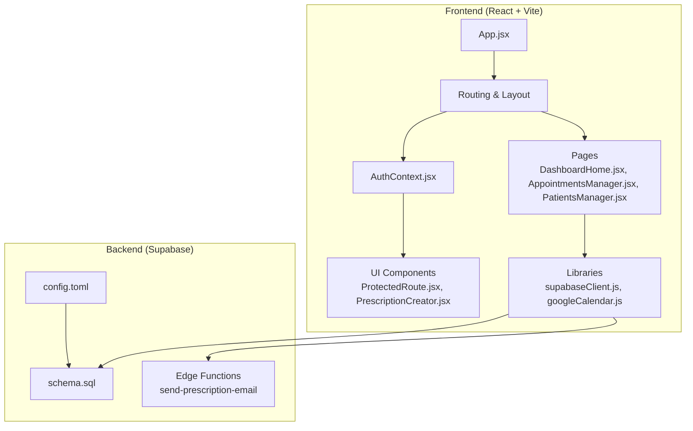
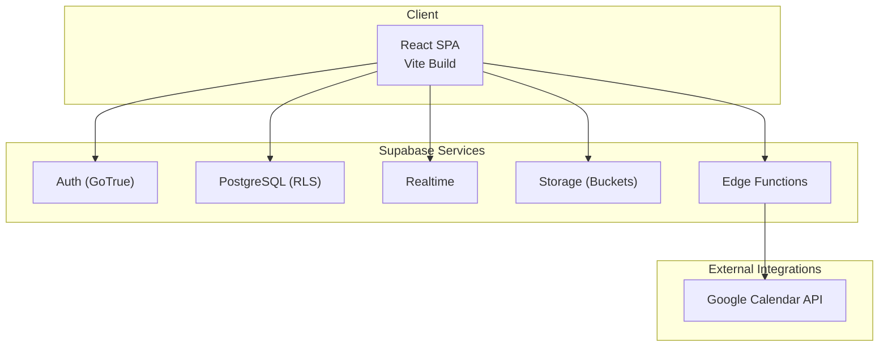
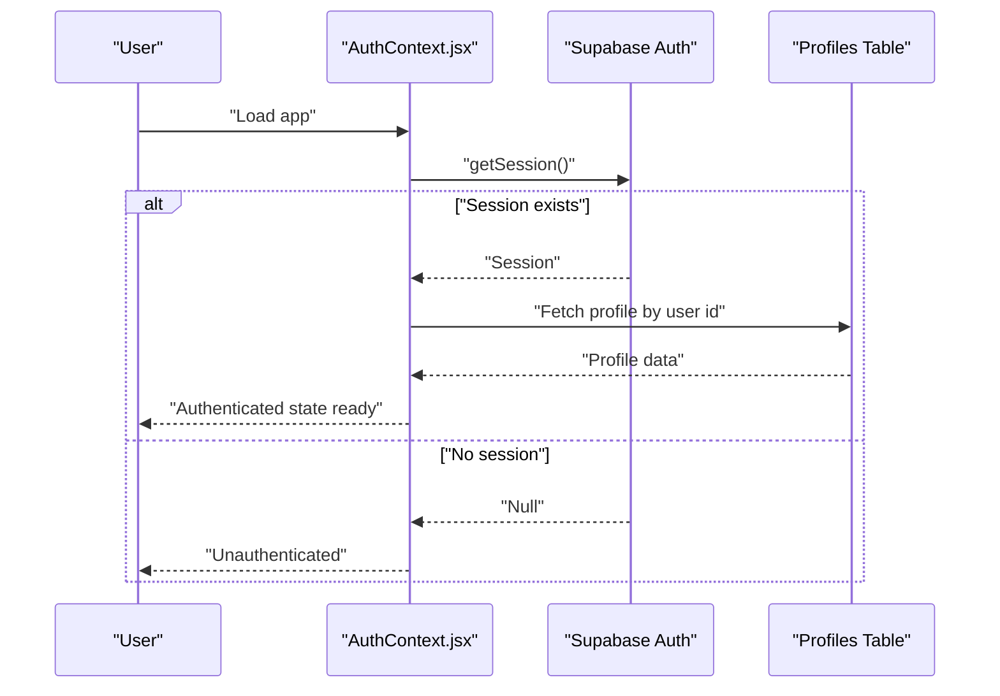
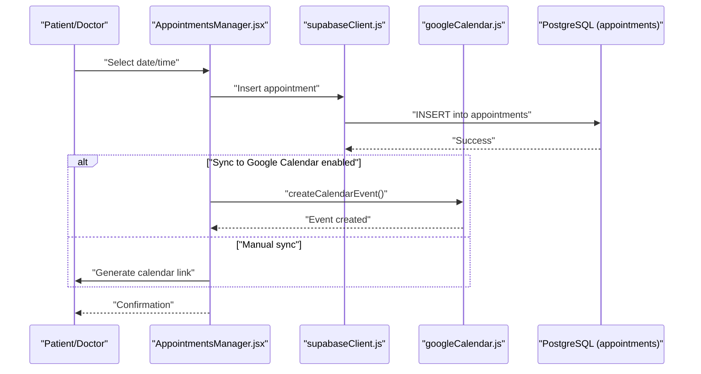
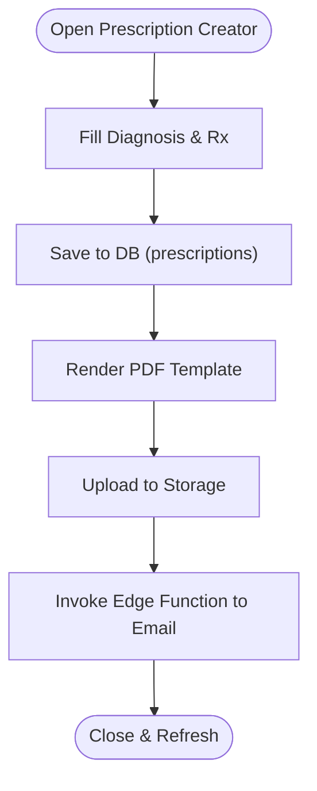
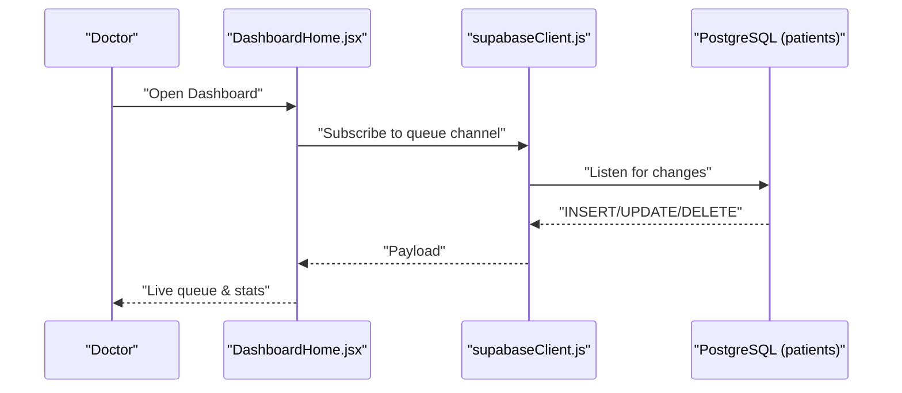
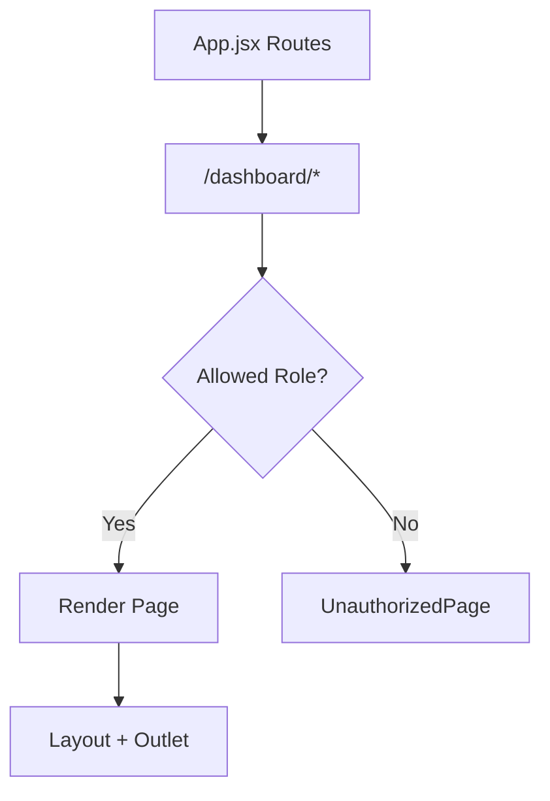
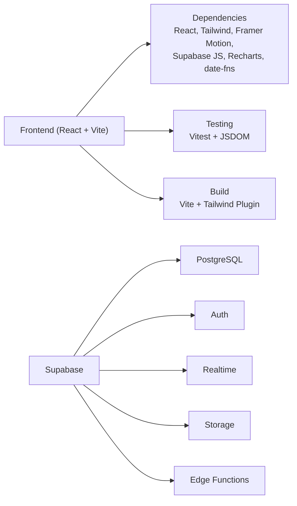

# Project Overview

<cite>
**Referenced Files in This Document**
- [README.md](file://README.md)
- [package.json](file://frontend/package.json)
- [vite.config.js](file://frontend/vite.config.js)
- [App.jsx](file://frontend/src/App.jsx)
- [main.jsx](file://frontend/src/main.jsx)
- [AuthContext.jsx](file://frontend/src/context/AuthContext.jsx)
- [ProtectedRoute.jsx](file://frontend/src/components/ProtectedRoute.jsx)
- [supabaseClient.js](file://frontend/src/lib/supabaseClient.js)
- [DashboardHome.jsx](file://frontend/src/pages/DashboardHome.jsx)
- [AppointmentsManager.jsx](file://frontend/src/pages/AppointmentsManager.jsx)
- [PatientsManager.jsx](file://frontend/src/pages/PatientsManager.jsx)
- [PrescriptionCreator.jsx](file://frontend/src/components/PrescriptionCreator.jsx)
- [googleCalendar.js](file://frontend/src/lib/googleCalendar.js)
- [schema.sql](file://backend/schema.sql)
- [config.toml](file://supabase/config.toml)
</cite>

## Table of Contents
1. [Introduction](#introduction)
2. [Project Structure](#project-structure)
3. [Core Components](#core-components)
4. [Architecture Overview](#architecture-overview)
5. [Detailed Component Analysis](#detailed-component-analysis)
6. [Dependency Analysis](#dependency-analysis)
7. [Performance Considerations](#performance-considerations)
8. [Troubleshooting Guide](#troubleshooting-guide)
9. [Conclusion](#conclusion)

## Introduction
MedVita is a modern healthcare management platform designed to streamline clinical workflows for doctors, patients, and administrative staff. Built with React and Vite, and powered by Supabase for backend and real-time capabilities, the platform delivers role-based access control, appointment scheduling, digital prescription creation, and patient record management. Its responsive, accessible UI supports both light and dark themes, and integrates with Google Calendar for seamless scheduling.

The platform addresses common healthcare industry challenges such as fragmented patient data, inefficient appointment workflows, and paper-based or manual prescription processes. By centralizing operations in a secure, real-time environment, MedVita improves care coordination, reduces administrative burden, and enhances the patient experience.

## Project Structure
The repository follows a clear separation of concerns:
- Frontend: React application with routing, context-based authentication, and UI components
- Backend: Supabase-managed PostgreSQL with Row Level Security (RLS) policies and edge functions
- Database: Schema and policies defined in SQL for profiles, patients, availability, appointments, and prescriptions
- Supabase configuration: Local development settings and service integrations

**Diagram sources**
- [App.jsx](file://frontend/src/App.jsx#L26-L59)
- [AuthContext.jsx](file://frontend/src/context/AuthContext.jsx#L9-L107)
- [ProtectedRoute.jsx](file://frontend/src/components/ProtectedRoute.jsx#L53-L106)
- [DashboardHome.jsx](file://frontend/src/pages/DashboardHome.jsx#L275-L486)
- [AppointmentsManager.jsx](file://frontend/src/pages/AppointmentsManager.jsx#L14-L577)
- [PatientsManager.jsx](file://frontend/src/pages/PatientsManager.jsx#L15-L667)
- [PrescriptionCreator.jsx](file://frontend/src/components/PrescriptionCreator.jsx#L11-L303)
- [supabaseClient.js](file://frontend/src/lib/supabaseClient.js#L1-L11)
- [googleCalendar.js](file://frontend/src/lib/googleCalendar.js#L1-L199)
- [schema.sql](file://backend/schema.sql#L1-L274)
- [config.toml](file://supabase/config.toml#L1-L385)

**Section sources**
- [README.md](file://README.md#L1-L89)
- [package.json](file://frontend/package.json#L1-L50)
- [vite.config.js](file://frontend/vite.config.js#L1-L33)

## Core Components
- Authentication and Authorization
  - Supabase-based authentication with role-aware routing and protected routes
  - Real-time session and profile synchronization
- Role-Based Access Control
  - Roles: doctor, patient, receptionist
  - ProtectedRoute enforces allowed roles and redirects unauthorized users
- Appointment Management
  - Calendar and list views, time-slot selection, and Google Calendar integration
- Patient Management
  - Search, filtering, vitals capture, and real-time updates
- Prescription Creation
  - Rich text editor, PDF generation, cloud storage, and email delivery
- Real-Time Dashboards
  - Live queue panel for doctors and analytics cards for insights

**Section sources**
- [AuthContext.jsx](file://frontend/src/context/AuthContext.jsx#L9-L107)
- [ProtectedRoute.jsx](file://frontend/src/components/ProtectedRoute.jsx#L53-L106)
- [AppointmentsManager.jsx](file://frontend/src/pages/AppointmentsManager.jsx#L14-L577)
- [PatientsManager.jsx](file://frontend/src/pages/PatientsManager.jsx#L15-L667)
- [PrescriptionCreator.jsx](file://frontend/src/components/PrescriptionCreator.jsx#L11-L303)
- [DashboardHome.jsx](file://frontend/src/pages/DashboardHome.jsx#L275-L486)

## Architecture Overview
MedVita’s architecture centers on a React SPA with Vite for fast builds, Supabase for authentication, database, storage, and edge functions, and optional Google Calendar integration.

**Diagram sources**
- [README.md](file://README.md#L7-L14)
- [supabaseClient.js](file://frontend/src/lib/supabaseClient.js#L1-L11)
- [googleCalendar.js](file://frontend/src/lib/googleCalendar.js#L1-L199)
- [config.toml](file://supabase/config.toml#L1-L385)

## Detailed Component Analysis

### Authentication and Role-Based Access
- AuthContext manages session retrieval, profile fetching, sign-up/sign-in/sign-out, and loading states
- ProtectedRoute validates user session, checks profile role against allowed roles, and handles unauthorized access with a tailored UI
- ROLE_HOME mapping ensures users land on appropriate dashboards

**Diagram sources**
- [AuthContext.jsx](file://frontend/src/context/AuthContext.jsx#L14-L61)
- [supabaseClient.js](file://frontend/src/lib/supabaseClient.js#L1-L11)

**Section sources**
- [AuthContext.jsx](file://frontend/src/context/AuthContext.jsx#L9-L107)
- [ProtectedRoute.jsx](file://frontend/src/components/ProtectedRoute.jsx#L53-L106)

### Appointment Management Workflow
- AppointmentsManager provides month/week/list views, time-slot selection, and booking flows
- Google Calendar integration supports OAuth-based event creation and manual links
- Real-time updates via Supabase channels for synchronized schedules

**Diagram sources**
- [AppointmentsManager.jsx](file://frontend/src/pages/AppointmentsManager.jsx#L134-L180)
- [googleCalendar.js](file://frontend/src/lib/googleCalendar.js#L126-L178)
- [supabaseClient.js](file://frontend/src/lib/supabaseClient.js#L1-L11)

**Section sources**
- [AppointmentsManager.jsx](file://frontend/src/pages/AppointmentsManager.jsx#L14-L577)
- [googleCalendar.js](file://frontend/src/lib/googleCalendar.js#L1-L199)

### Prescription Creation and Delivery
- PrescriptionCreator captures diagnosis and treatment notes, generates a PDF, uploads to Supabase Storage, and triggers an email via an edge function
- Real-time updates and PDF rendering are handled client-side with html2canvas and jsPDF

**Diagram sources**
- [PrescriptionCreator.jsx](file://frontend/src/components/PrescriptionCreator.jsx#L100-L188)
- [schema.sql](file://backend/schema.sql#L200-L225)

**Section sources**
- [PrescriptionCreator.jsx](file://frontend/src/components/PrescriptionCreator.jsx#L11-L303)
- [schema.sql](file://backend/schema.sql#L200-L225)

### Real-Time Dashboard for Doctors
- DashboardHome.jsx aggregates stats, today’s appointments, and live queue updates
- Uses Supabase Realtime channels to subscribe to queue changes and update UI instantly

**Diagram sources**
- [DashboardHome.jsx](file://frontend/src/pages/DashboardHome.jsx#L41-L76)
- [supabaseClient.js](file://frontend/src/lib/supabaseClient.js#L1-L11)

**Section sources**
- [DashboardHome.jsx](file://frontend/src/pages/DashboardHome.jsx#L14-L272)

### Routing and Protected Access
- App.jsx defines nested routes with shared layouts and role-scoped pages
- ProtectedRoute enforces allowed roles and redirects appropriately

**Diagram sources**
- [App.jsx](file://frontend/src/App.jsx#L35-L55)
- [ProtectedRoute.jsx](file://frontend/src/components/ProtectedRoute.jsx#L53-L106)

**Section sources**
- [App.jsx](file://frontend/src/App.jsx#L26-L59)
- [ProtectedRoute.jsx](file://frontend/src/components/ProtectedRoute.jsx#L53-L106)

## Dependency Analysis
- Technology Stack
  - Frontend: React, Vite, Tailwind CSS v4, Framer Motion, Recharts, Lucide React
  - Backend/Auth: Supabase (PostgreSQL, Auth, Realtime, Storage, Edge Functions)
  - Utilities: date-fns, html2canvas, jspdf, clsx, tailwind-merge
- Build and Testing
  - Vite plugins for React and Tailwind
  - Vitest with JSDOM for unit testing
- Supabase Configuration
  - Local CLI configuration, database ports, Studio, Inbucket, Storage, Auth policies, and edge runtime

**Diagram sources**
- [package.json](file://frontend/package.json#L13-L31)
- [vite.config.js](file://frontend/vite.config.js#L7-L26)
- [config.toml](file://supabase/config.toml#L1-L385)

**Section sources**
- [package.json](file://frontend/package.json#L1-L50)
- [vite.config.js](file://frontend/vite.config.js#L1-L33)
- [config.toml](file://supabase/config.toml#L1-L385)

## Performance Considerations
- Bundle Splitting and Vendor Chunks
  - Manual chunks separate React, charts, motion, PDF libraries, and Supabase to optimize caching and load times
- Lazy Initialization
  - Google Calendar API is loaded on demand to reduce initial payload
- Real-Time Subscriptions
  - Subscribe only to relevant channels and filters to minimize unnecessary updates
- Client-Side Rendering
  - Use optimistic UI updates with proper error handling and fallbacks

[No sources needed since this section provides general guidance]

## Troubleshooting Guide
- Authentication Issues
  - Verify Supabase URL and anon key environment variables are present
  - Check AuthContext for session retrieval and profile fetch errors
- ProtectedRoute Failures
  - Confirm profile role is populated and allowedRoles match route configuration
- Google Calendar Sync
  - Ensure OAuth client ID and API key are configured; handle token persistence and prompt consent
- Database Policies
  - Validate RLS policies for profiles, patients, appointments, and prescriptions; confirm foreign keys and triggers

**Section sources**
- [supabaseClient.js](file://frontend/src/lib/supabaseClient.js#L6-L8)
- [AuthContext.jsx](file://frontend/src/context/AuthContext.jsx#L14-L61)
- [ProtectedRoute.jsx](file://frontend/src/components/ProtectedRoute.jsx#L82-L93)
- [googleCalendar.js](file://frontend/src/lib/googleCalendar.js#L6-L9)
- [schema.sql](file://backend/schema.sql#L30-L274)

## Conclusion
MedVita modernizes healthcare administration by combining a responsive React frontend with Supabase’s real-time backend. Its role-based access, integrated appointment and prescription workflows, and optional Google Calendar sync deliver tangible benefits for medical professionals and patients alike. The platform’s modular architecture, clear routing, and robust authentication provide a solid foundation for scalable enhancements and compliance-focused deployments.