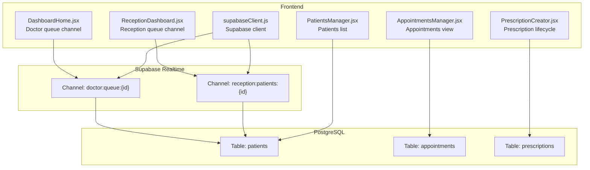
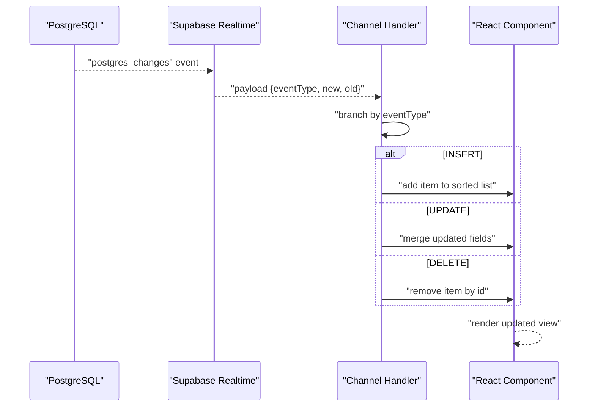
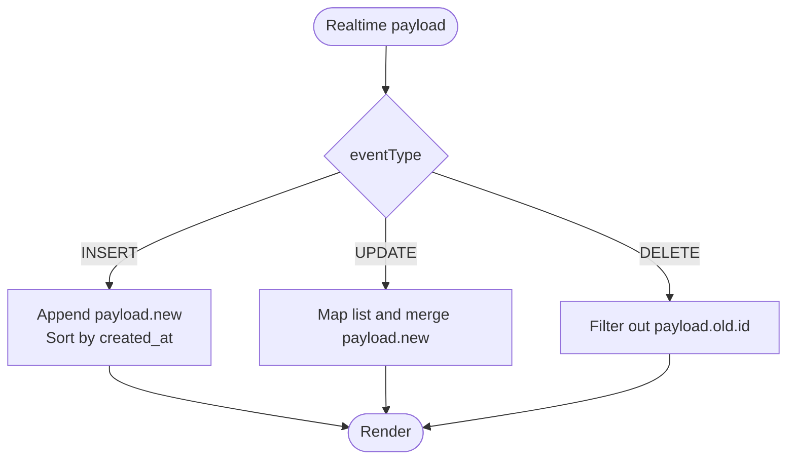
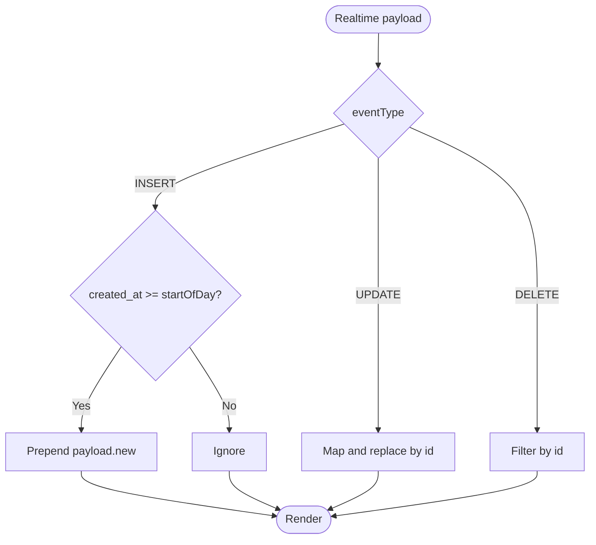
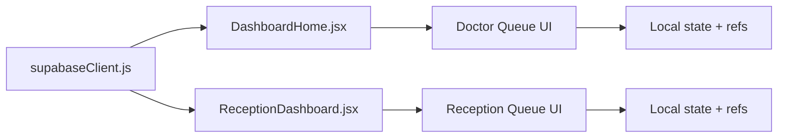

# Event Handling Patterns

<cite>
**Referenced Files in This Document**
- [DashboardHome.jsx](file://frontend/src/pages/DashboardHome.jsx)
- [ReceptionDashboard.jsx](file://frontend/src/pages/ReceptionDashboard.jsx)
- [supabaseClient.js](file://frontend/src/lib/supabaseClient.js)
- [AppointmentsManager.jsx](file://frontend/src/pages/AppointmentsManager.jsx)
- [PatientsManager.jsx](file://frontend/src/pages/PatientsManager.jsx)
- [PrescriptionCreator.jsx](file://frontend/src/components/PrescriptionCreator.jsx)
- [DEBUG_DISABLE_RLS.sql](file://_trash/DEBUG_DISABLE_RLS.sql)
</cite>

## Table of Contents
1. [Introduction](#introduction)
2. [Project Structure](#project-structure)
3. [Core Components](#core-components)
4. [Architecture Overview](#architecture-overview)
5. [Detailed Component Analysis](#detailed-component-analysis)
6. [Dependency Analysis](#dependency-analysis)
7. [Performance Considerations](#performance-considerations)
8. [Troubleshooting Guide](#troubleshooting-guide)
9. [Conclusion](#conclusion)

## Introduction
This document explains the event-driven architecture used in MedVita for real-time updates across patient records, queue modifications, and appointment status changes. It covers the payload processing pipeline, event type discrimination, state update strategies, and practical patterns for stable references, event filtering, and integration with React state. It also addresses ordering guarantees, conflict resolution, and debugging techniques for complex event sequences.

## Project Structure
MedVita’s frontend uses Supabase Realtime channels to subscribe to PostgreSQL table changes and update React components in real time. Key areas:
- Realtime subscriptions for patient queues and reception dashboards
- Local state updates driven by Supabase payload events
- Filtering by user context (doctor or receptionist) using channel filters
- Integration with React hooks for state and effects

**Diagram sources**
- [DashboardHome.jsx](file://frontend/src/pages/DashboardHome.jsx#L45-L76)
- [ReceptionDashboard.jsx](file://frontend/src/pages/ReceptionDashboard.jsx#L76-L113)
- [supabaseClient.js](file://frontend/src/lib/supabaseClient.js#L1-L11)

**Section sources**
- [DashboardHome.jsx](file://frontend/src/pages/DashboardHome.jsx#L45-L76)
- [ReceptionDashboard.jsx](file://frontend/src/pages/ReceptionDashboard.jsx#L76-L113)
- [supabaseClient.js](file://frontend/src/lib/supabaseClient.js#L1-L11)

## Core Components
- Realtime Channels: Two primary channels handle queue and reception updates.
- Payload Discrimination: Handlers branch on eventType to apply appropriate state updates.
- Stable References: Use of refs for consistent state access inside callbacks.
- Filtering: Channel filters restrict events to the current user’s scope.
- React Integration: Local state updates and UI reactivity synchronized with database changes.

**Section sources**
- [DashboardHome.jsx](file://frontend/src/pages/DashboardHome.jsx#L45-L76)
- [ReceptionDashboard.jsx](file://frontend/src/pages/ReceptionDashboard.jsx#L76-L113)

## Architecture Overview
The system subscribes to Supabase Realtime channels configured for specific tables and filters. On each change, the handler discriminates the event type and updates local state accordingly. This pattern applies to:
- Patient queue updates (INSERT/UPDATE/DELETE) for doctors and receptionists
- Patient vitals and queue status changes
- Appointment status and calendar views

**Diagram sources**
- [DashboardHome.jsx](file://frontend/src/pages/DashboardHome.jsx#L55-L67)
- [ReceptionDashboard.jsx](file://frontend/src/pages/ReceptionDashboard.jsx#L86-L101)

## Detailed Component Analysis

### Doctor Queue Realtime (DashboardHome)
- Channel: doctor:queue:{doctorId}
- Table: patients
- Filters: doctor_id=eq.{doctorId}
- Events: INSERT, UPDATE, DELETE
- Behavior:
  - INSERT: append and sort by created_at
  - UPDATE: merge fields into existing record
  - DELETE: remove by id
- Stability: Uses a ref to maintain current queue during updates.

**Diagram sources**
- [DashboardHome.jsx](file://frontend/src/pages/DashboardHome.jsx#L55-L67)

**Section sources**
- [DashboardHome.jsx](file://frontend/src/pages/DashboardHome.jsx#L45-L76)

### Reception Queue Realtime (ReceptionDashboard)
- Channel: reception:patients:{employer_id}
- Table: patients
- Filters: doctor_id=eq.{employer_id}
- Events: INSERT, UPDATE, DELETE
- Behavior:
  - INSERT: only add if created_at is today
  - UPDATE: replace by id
  - DELETE: remove by id
- Stability: Uses a ref to keep current list stable across renders.

**Diagram sources**
- [ReceptionDashboard.jsx](file://frontend/src/pages/ReceptionDashboard.jsx#L86-L101)

**Section sources**
- [ReceptionDashboard.jsx](file://frontend/src/pages/ReceptionDashboard.jsx#L76-L113)

### Appointments Manager (Contextual Updates)
- While not a direct Realtime queue, the Appointments Manager demonstrates event-like state updates when booking or modifying appointments.
- It fetches and augments data locally, then relies on Supabase for persistence and eventual consistency.

**Section sources**
- [AppointmentsManager.jsx](file://frontend/src/pages/AppointmentsManager.jsx#L67-L118)

### Patients Manager (Search and Debounce)
- Implements a debounced search that triggers re-fetches.
- Demonstrates local state management and UI responsiveness.

**Section sources**
- [PatientsManager.jsx](file://frontend/src/pages/PatientsManager.jsx#L113-L121)

### Prescription Lifecycle (Integration Points)
- Creates prescriptions and integrates with Supabase Storage and Edge Functions.
- While not a Realtime channel, it illustrates end-to-end event-like flows from creation to distribution.

**Section sources**
- [PrescriptionCreator.jsx](file://frontend/src/components/PrescriptionCreator.jsx#L100-L188)

## Dependency Analysis
- Supabase client initialization shared across components.
- Realtime channels depend on user context (doctorId or employer_id).
- Event handlers depend on payload shape (eventType, new, old).
- UI components depend on local state and refs for stability.

**Diagram sources**
- [supabaseClient.js](file://frontend/src/lib/supabaseClient.js#L1-L11)
- [DashboardHome.jsx](file://frontend/src/pages/DashboardHome.jsx#L45-L76)
- [ReceptionDashboard.jsx](file://frontend/src/pages/ReceptionDashboard.jsx#L76-L113)

**Section sources**
- [supabaseClient.js](file://frontend/src/lib/supabaseClient.js#L1-L11)
- [DashboardHome.jsx](file://frontend/src/pages/DashboardHome.jsx#L45-L76)
- [ReceptionDashboard.jsx](file://frontend/src/pages/ReceptionDashboard.jsx#L76-L113)

## Performance Considerations
- Event Batching: React state updates are batched by default. For high-frequency updates, consider:
  - Defer heavy computations until after updates settle
  - Use refs to avoid unnecessary re-renders during rapid updates
- Sorting and Filtering:
  - Keep sorting minimal (e.g., sort on INSERT only) and avoid deep merges on every UPDATE
- Debouncing:
  - Use debounced search to reduce fetch frequency
- Network Efficiency:
  - Subscribe only to relevant channels and tables
  - Use precise filters to limit event volume

## Troubleshooting Guide
- Realtime Subscription Status:
  - Log subscription status to detect connection issues
  - Fallback to manual refresh when CHANNEL_ERROR occurs
- Event Ordering:
  - Supabase Realtime guarantees per-channel ordering. If multiple channels are involved, coordinate state updates to avoid inconsistent UI
- Conflict Resolution:
  - Prefer optimistic updates with server reconciliation on errors
  - Use ids to merge updates and avoid duplicate entries
- Debugging Row Level Security:
  - Temporarily disable RLS to verify data visibility and policy correctness

**Section sources**
- [DashboardHome.jsx](file://frontend/src/pages/DashboardHome.jsx#L69-L73)
- [ReceptionDashboard.jsx](file://frontend/src/pages/ReceptionDashboard.jsx#L104-L110)
- [DEBUG_DISABLE_RLS.sql](file://_trash/DEBUG_DISABLE_RLS.sql#L1-L8)

## Conclusion
MedVita’s event handling leverages Supabase Realtime to synchronize UI state with database changes efficiently. By discriminating event types, applying stable references, and filtering events by user context, the system maintains responsive and accurate dashboards for both doctors and receptionists. Robust fallbacks, careful state updates, and debugging aids ensure reliability under real-world loads.