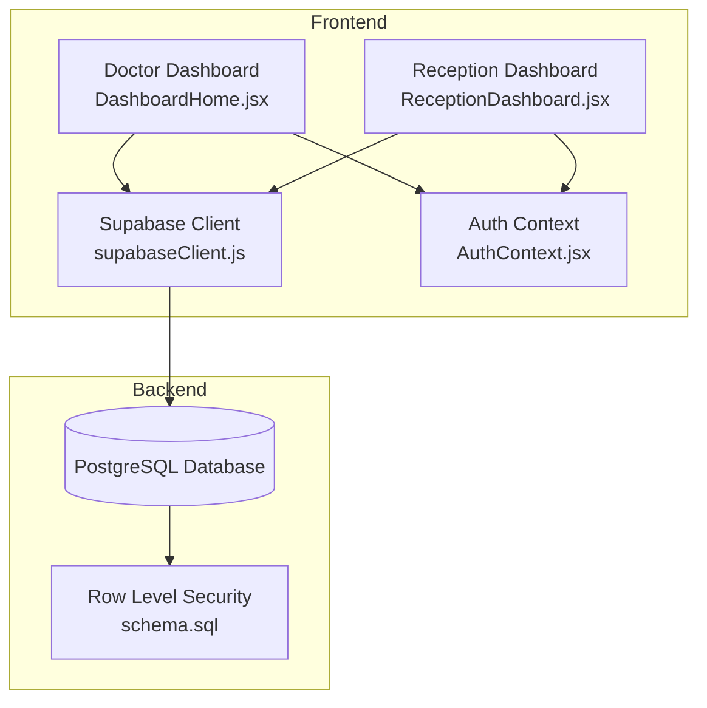
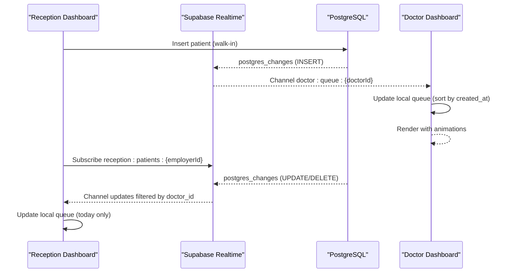
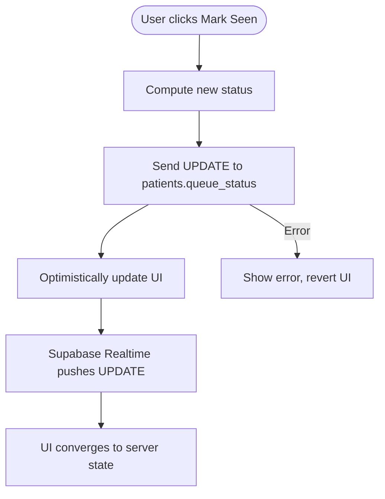
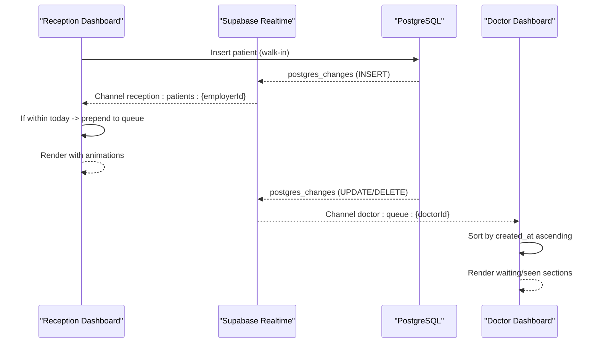
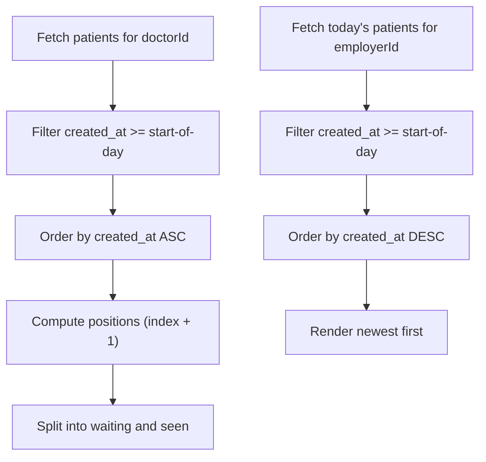
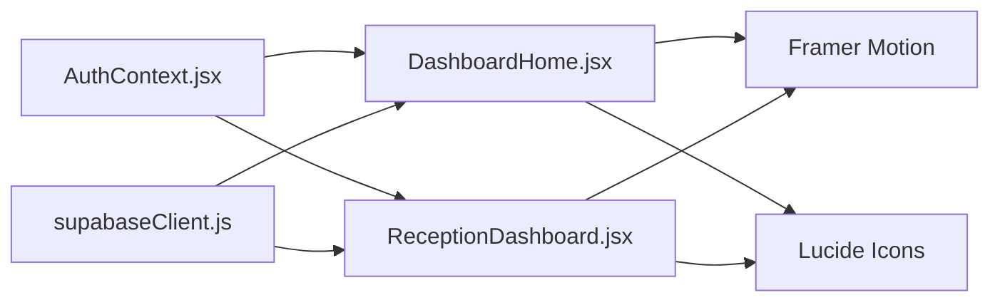

# Live Queue Management

<cite>
**Referenced Files in This Document**
- [DashboardHome.jsx](file://frontend/src/pages/DashboardHome.jsx)
- [ReceptionDashboard.jsx](file://frontend/src/pages/ReceptionDashboard.jsx)
- [supabaseClient.js](file://frontend/src/lib/supabaseClient.js)
- [AuthContext.jsx](file://frontend/src/context/AuthContext.jsx)
- [schema.sql](file://backend/schema.sql)
- [package.json](file://frontend/package.json)
- [document.md](file://frontend/testsprite_tests/tmp/prd_files/document.md)
</cite>

## Table of Contents
1. [Introduction](#introduction)
2. [Project Structure](#project-structure)
3. [Core Components](#core-components)
4. [Architecture Overview](#architecture-overview)
5. [Detailed Component Analysis](#detailed-component-analysis)
6. [Dependency Analysis](#dependency-analysis)
7. [Performance Considerations](#performance-considerations)
8. [Troubleshooting Guide](#troubleshooting-guide)
9. [Conclusion](#conclusion)

## Introduction
This document explains the live queue management system powering MedVita’s doctor and receptionist dashboards. It covers real-time patient tracking, status updates, visual indicators, queue sorting logic, animation system, mark-as-seen functionality with optimistic updates, vitals integration, and operational considerations for large patient volumes.

## Project Structure
The live queue spans two primary UI components:
- Doctor Dashboard: Live queue panel with real-time updates, status toggling, vitals display, and animations.
- Reception Dashboard: Walk-in registration form and live queue preview for today’s arrivals.

Both components subscribe to Supabase Realtime channels on the patients table and rely on Supabase authentication and Row Level Security (RLS) for isolation.

**Diagram sources**
- [DashboardHome.jsx](file://frontend/src/pages/DashboardHome.jsx#L15-L272)
- [ReceptionDashboard.jsx](file://frontend/src/pages/ReceptionDashboard.jsx#L37-L455)
- [supabaseClient.js](file://frontend/src/lib/supabaseClient.js#L1-L11)
- [AuthContext.jsx](file://frontend/src/context/AuthContext.jsx#L9-L107)
- [schema.sql](file://backend/schema.sql#L45-L116)

**Section sources**
- [DashboardHome.jsx](file://frontend/src/pages/DashboardHome.jsx#L1-L487)
- [ReceptionDashboard.jsx](file://frontend/src/pages/ReceptionDashboard.jsx#L1-L455)
- [supabaseClient.js](file://frontend/src/lib/supabaseClient.js#L1-L11)
- [AuthContext.jsx](file://frontend/src/context/AuthContext.jsx#L1-L108)
- [schema.sql](file://backend/schema.sql#L1-L274)

## Core Components
- Doctor Live Queue Panel: Displays today’s walk-ins, sorts by arrival time, shows vitals, and allows marking patients as seen with optimistic UI feedback.
- Reception Queue Preview: Shows today’s arrivals in reverse chronological order, with vitals and arrival time.
- Realtime Channels: Separate channels per role to ensure isolation and reduce cross-clinic data leakage.
- Animation System: Uses Framer Motion for smooth list transitions and layout animations.
- Optimistic Updates: Immediate UI changes on mark-as-seen, with automatic rollback if backend fails.

**Section sources**
- [DashboardHome.jsx](file://frontend/src/pages/DashboardHome.jsx#L15-L272)
- [ReceptionDashboard.jsx](file://frontend/src/pages/ReceptionDashboard.jsx#L37-L455)
- [document.md](file://frontend/testsprite_tests/tmp/prd_files/document.md#L417-L461)

## Architecture Overview
The system uses Supabase Realtime to push patient changes to subscribed clients. The doctor dashboard listens to a doctor-scoped channel, while the reception dashboard listens to a receptionist-scoped channel. Both components filter by doctor_id to ensure data isolation.

**Diagram sources**
- [DashboardHome.jsx](file://frontend/src/pages/DashboardHome.jsx#L45-L76)
- [ReceptionDashboard.jsx](file://frontend/src/pages/ReceptionDashboard.jsx#L76-L113)
- [document.md](file://frontend/testsprite_tests/tmp/prd_files/document.md#L740-L747)

## Detailed Component Analysis

### Doctor Live Queue Panel
- Data source: patients table filtered by doctor_id and created_at >= start-of-day, ordered by created_at ascending to compute positions.
- Realtime: Subscribes to doctor:queue:{doctorId} and reacts to INSERT/UPDATE/DELETE events.
- Sorting logic: On INSERT, appends and re-sorts by created_at to reflect current position; seen vs waiting split for display.
- Visual indicators: Live dot, counts for waiting and seen, next-up highlight, and per-item badges for vitals and arrival time.
- Animations: Framer Motion layout animations for smooth entry/exit and updates.
- Optimistic updates: markSeen toggles queue_status immediately; Supabase Realtime ensures UI convergence.

**Diagram sources**
- [DashboardHome.jsx](file://frontend/src/pages/DashboardHome.jsx#L78-L88)
- [DashboardHome.jsx](file://frontend/src/pages/DashboardHome.jsx#L55-L67)

**Section sources**
- [DashboardHome.jsx](file://frontend/src/pages/DashboardHome.jsx#L15-L272)

### Reception Queue Preview
- Data source: patients table filtered by doctor_id and created_at >= start-of-day, ordered by created_at descending to show newest arrivals first.
- Realtime: Subscribes to reception:patients:{employerId} and filters by doctor_id to avoid cross-clinic updates.
- Today-only logic: Only inserts patients whose created_at is within today’s bounds.
- Visual indicators: Count badge, vitals cards (BP/HR), initials avatar, and arrival time.
- Animations: Framer Motion layout animations with staggered delays for batched entries.

**Diagram sources**
- [ReceptionDashboard.jsx](file://frontend/src/pages/ReceptionDashboard.jsx#L76-L113)
- [DashboardHome.jsx](file://frontend/src/pages/DashboardHome.jsx#L45-L76)

**Section sources**
- [ReceptionDashboard.jsx](file://frontend/src/pages/ReceptionDashboard.jsx#L37-L455)

### Patient Positioning and Queue Sorting Logic
- Doctor queue: Ordered by created_at ascending to compute positions; the first waiting patient is “Next Up.”
- Reception queue: Ordered by created_at descending to show newest arrivals first; today-only insertion logic prevents off-day entries from appearing in the preview.

**Diagram sources**
- [DashboardHome.jsx](file://frontend/src/pages/DashboardHome.jsx#L26-L39)
- [ReceptionDashboard.jsx](file://frontend/src/pages/ReceptionDashboard.jsx#L48-L69)

**Section sources**
- [DashboardHome.jsx](file://frontend/src/pages/DashboardHome.jsx#L26-L39)
- [ReceptionDashboard.jsx](file://frontend/src/pages/ReceptionDashboard.jsx#L48-L69)

### Real-Time Status Synchronization
- Channels: doctor:queue:{doctorId} and reception:patients:{employerId}.
- Filters: doctor_id equality to ensure isolation.
- Event handling: INSERT adds new patients; UPDATE refreshes details; DELETE removes departed patients.
- Error handling: CHANNEL_ERROR logs a warning; UI remains functional with manual refresh fallback.

**Section sources**
- [DashboardHome.jsx](file://frontend/src/pages/DashboardHome.jsx#L45-L76)
- [ReceptionDashboard.jsx](file://frontend/src/pages/ReceptionDashboard.jsx#L76-L113)
- [document.md](file://frontend/testsprite_tests/tmp/prd_files/document.md#L740-L747)

### Animation System with Framer Motion
- Layout animations: layout prop on motion.div enables smooth reordering and height adjustments.
- Entry/exit: initial/exit animations for fade and scale effects.
- Staggered animations: transition delays for batched renders.
- Presence container: AnimatePresence wraps lists to animate in/out.

**Section sources**
- [DashboardHome.jsx](file://frontend/src/pages/DashboardHome.jsx#L167-L254)
- [ReceptionDashboard.jsx](file://frontend/src/pages/ReceptionDashboard.jsx#L391-L447)
- [package.json](file://frontend/package.json#L20)

### Mark-as-Seen with Optimistic Updates
- UI immediate feedback: Spinner and disabled state during update.
- Backend update: Single field update to queue_status.
- Automatic convergence: Supabase Realtime propagates the change; UI reflects server state.

**Section sources**
- [DashboardHome.jsx](file://frontend/src/pages/DashboardHome.jsx#L78-L88)

### Vitals Monitoring Integration
- Data fields: blood_pressure and heart_rate are stored on the patients table.
- Display: Both dashboards render vitals when present; absence is handled gracefully.
- Input: Reception form collects vitals on submission.

**Section sources**
- [schema.sql](file://backend/schema.sql#L46-L58)
- [ReceptionDashboard.jsx](file://frontend/src/pages/ReceptionDashboard.jsx#L330-L354)
- [DashboardHome.jsx](file://frontend/src/pages/DashboardHome.jsx#L193-L194)

## Dependency Analysis
- Supabase client: Centralized initialization and environment variables.
- Authentication: AuthContext provides user and profile state; doctorId/employer_id derived from profile.
- Realtime channels: Role-scoped channels with doctor_id filters.
- UI libraries: Framer Motion for animations; Tailwind for styling; Lucide icons for UI.

**Diagram sources**
- [AuthContext.jsx](file://frontend/src/context/AuthContext.jsx#L9-L107)
- [DashboardHome.jsx](file://frontend/src/pages/DashboardHome.jsx#L1-L14)
- [ReceptionDashboard.jsx](file://frontend/src/pages/ReceptionDashboard.jsx#L1-L11)
- [supabaseClient.js](file://frontend/src/lib/supabaseClient.js#L1-L11)
- [package.json](file://frontend/package.json#L13-L31)

**Section sources**
- [AuthContext.jsx](file://frontend/src/context/AuthContext.jsx#L1-L108)
- [DashboardHome.jsx](file://frontend/src/pages/DashboardHome.jsx#L1-L14)
- [ReceptionDashboard.jsx](file://frontend/src/pages/ReceptionDashboard.jsx#L1-L11)
- [supabaseClient.js](file://frontend/src/lib/supabaseClient.js#L1-L11)
- [package.json](file://frontend/package.json#L13-L31)

## Performance Considerations
- Realtime latency: Supabase Realtime aims for sub-300ms propagation as documented.
- Initial load: Dashboard data loads quickly; queue queries filter by doctor_id and date to minimize scans.
- Rendering: AnimatePresence and layout animations are efficient for moderate queue sizes; consider virtualization for very large queues.
- Network resilience: CHANNEL_ERROR logs warnings; manual refresh button provides fallback.

**Section sources**
- [document.md](file://frontend/testsprite_tests/tmp/prd_files/document.md#L661-L671)
- [ReceptionDashboard.jsx](file://frontend/src/pages/ReceptionDashboard.jsx#L104-L110)

## Troubleshooting Guide
- Missing environment variables: Supabase client warns if URL or anon key are missing.
- Cross-clinic access: RLS policies enforce doctor_id isolation; ensure correct user session and profile.
- Offline scenarios: CHANNEL_ERROR triggers a console warning; UI remains usable with manual refresh.
- Permission errors: Submission errors may indicate employer_id mismatch; verify receptionist clinic code linkage.

**Section sources**
- [supabaseClient.js](file://frontend/src/lib/supabaseClient.js#L6-L8)
- [schema.sql](file://backend/schema.sql#L72-L116)
- [ReceptionDashboard.jsx](file://frontend/src/pages/ReceptionDashboard.jsx#L104-L110)
- [ReceptionDashboard.jsx](file://frontend/src/pages/ReceptionDashboard.jsx#L172-L178)

## Conclusion
MedVita’s live queue system combines Supabase Realtime, role-scoped channels, and React with Framer Motion to deliver a responsive, secure, and visually coherent queue experience for both doctors and receptionists. The design emphasizes real-time synchronization, optimistic UI updates, and clear visual indicators for status and vitals, with robust isolation via RLS and practical fallbacks for offline scenarios.