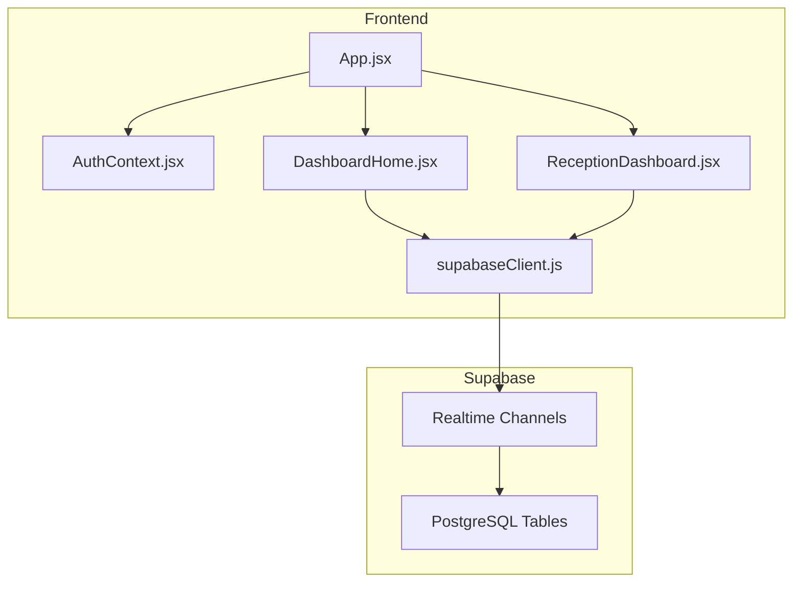
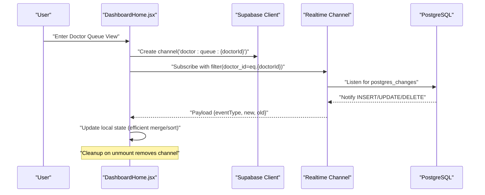
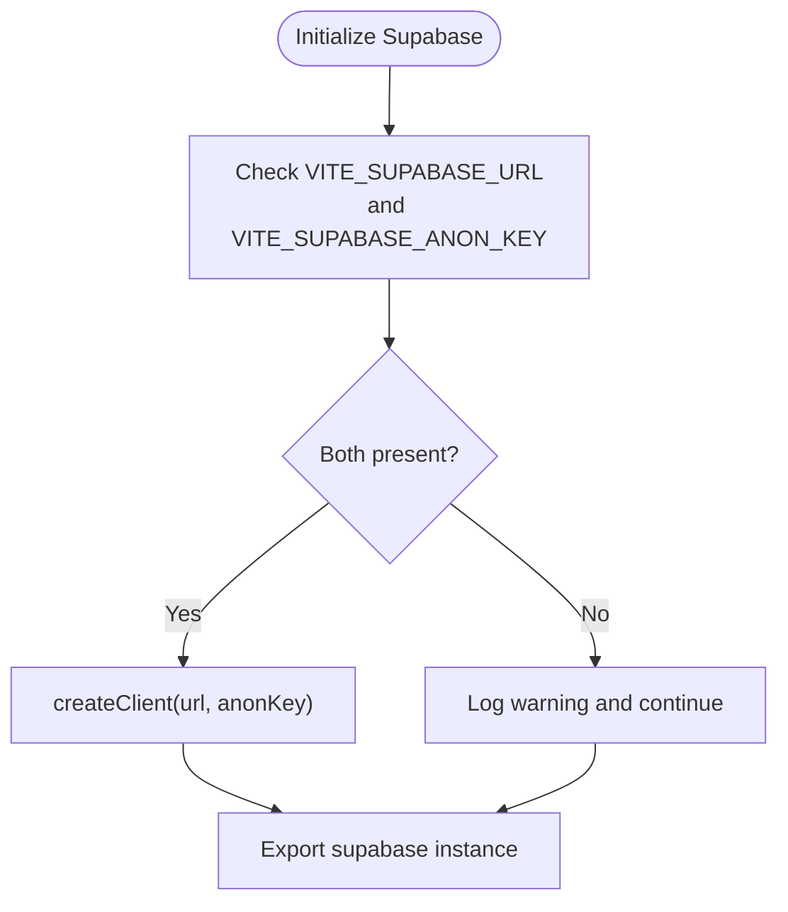
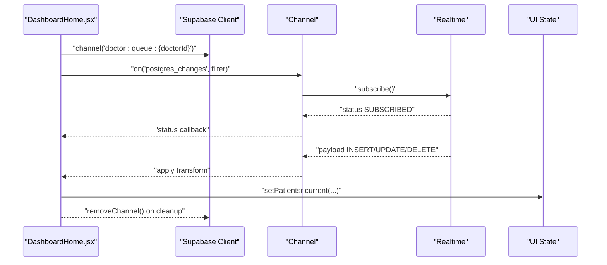
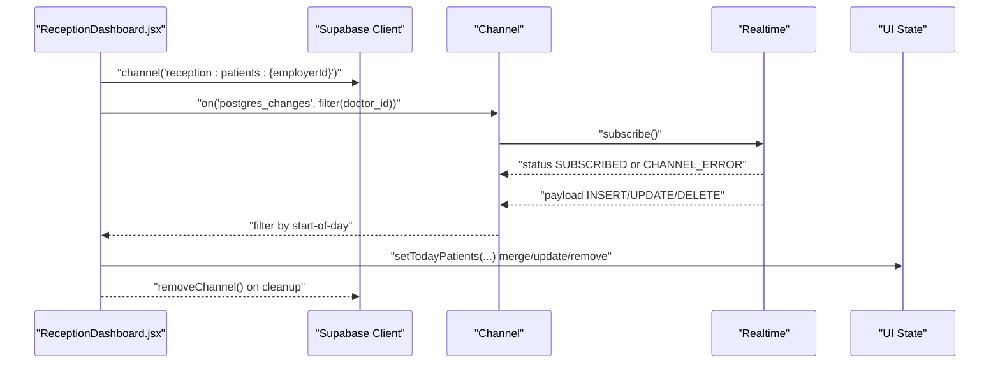
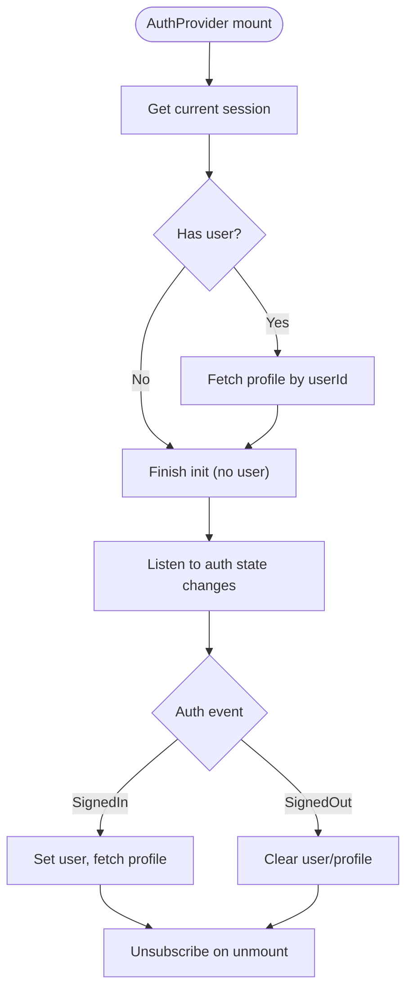
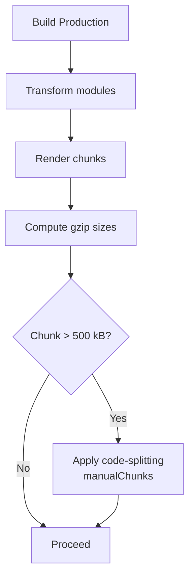
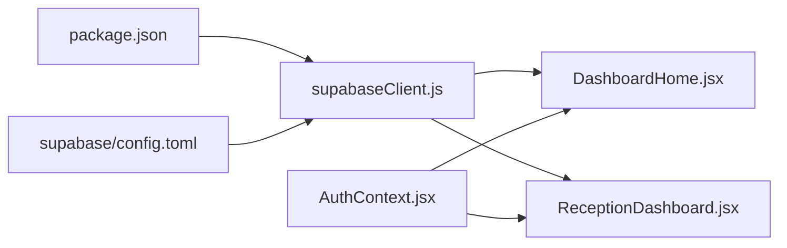

# Performance Optimization

<cite>
**Referenced Files in This Document**
- [supabaseClient.js](file://frontend/src/lib/supabaseClient.js)
- [DashboardHome.jsx](file://frontend/src/pages/DashboardHome.jsx)
- [ReceptionDashboard.jsx](file://frontend/src/pages/ReceptionDashboard.jsx)
- [AuthContext.jsx](file://frontend/src/context/AuthContext.jsx)
- [App.jsx](file://frontend/src/App.jsx)
- [package.json](file://frontend/package.json)
- [config.toml](file://supabase/config.toml)
- [.env.example](file://frontend/.env.example)
- [build-report-final.txt](file://frontend/build-report-final.txt)
</cite>

## Table of Contents
1. [Introduction](#introduction)
2. [Project Structure](#project-structure)
3. [Core Components](#core-components)
4. [Architecture Overview](#architecture-overview)
5. [Detailed Component Analysis](#detailed-component-analysis)
6. [Dependency Analysis](#dependency-analysis)
7. [Performance Considerations](#performance-considerations)
8. [Troubleshooting Guide](#troubleshooting-guide)
9. [Conclusion](#conclusion)
10. [Appendices](#appendices)

## Introduction
This document focuses on real-time communication performance optimization in MedVita. It covers connection pooling strategies, subscription lifecycle management, memory leak prevention, event throttling, data transformation optimization, efficient state updates for high-frequency real-time data, network resilience patterns, automatic reconnection logic, fallback mechanisms, metrics collection, connection health checks, load balancing considerations, scaling for concurrent users, database query optimization for real-time filters, and client-side caching strategies to reduce bandwidth usage.

## Project Structure
MedVita’s frontend integrates Supabase for real-time subscriptions and authentication. Real-time channels are established in page components, and the Supabase client is initialized centrally. Authentication state changes drive UI updates and lifecycle cleanup. Build reports indicate bundle size characteristics relevant to runtime performance.

**Diagram sources**
- [App.jsx](file://frontend/src/App.jsx#L1-L62)
- [AuthContext.jsx](file://frontend/src/context/AuthContext.jsx#L1-L108)
- [DashboardHome.jsx](file://frontend/src/pages/DashboardHome.jsx#L26-L76)
- [ReceptionDashboard.jsx](file://frontend/src/pages/ReceptionDashboard.jsx#L1-L141)
- [supabaseClient.js](file://frontend/src/lib/supabaseClient.js#L1-L11)

**Section sources**
- [App.jsx](file://frontend/src/App.jsx#L1-L62)
- [package.json](file://frontend/package.json#L1-L50)

## Core Components
- Supabase client initialization and environment configuration
- Real-time channels for doctor queues and reception patient lists
- Authentication state management with lifecycle cleanup
- Build-time bundle size characteristics impacting runtime performance

Key implementation references:
- Supabase client creation and environment validation
- Real-time channel creation, filtering, and subscription lifecycle
- Auth state change listener and cleanup
- Build report indicating chunk sizes and optimization opportunities

**Section sources**
- [supabaseClient.js](file://frontend/src/lib/supabaseClient.js#L1-L11)
- [DashboardHome.jsx](file://frontend/src/pages/DashboardHome.jsx#L26-L76)
- [ReceptionDashboard.jsx](file://frontend/src/pages/ReceptionDashboard.jsx#L44-L113)
- [AuthContext.jsx](file://frontend/src/context/AuthContext.jsx#L14-L41)
- [build-report-final.txt](file://frontend/build-report-final.txt#L14-L18)

## Architecture Overview
The real-time architecture relies on Supabase’s Postgres changes to Pub/Sub bridge. Components subscribe to channels scoped by user roles and identifiers, apply server-side filters, and update local state efficiently. Authentication drives lifecycle events and cleanup.

**Diagram sources**
- [DashboardHome.jsx](file://frontend/src/pages/DashboardHome.jsx#L45-L75)

## Detailed Component Analysis

### Supabase Client Initialization
- Centralized client creation with environment validation
- Ensures required keys are present before connecting

**Diagram sources**
- [supabaseClient.js](file://frontend/src/lib/supabaseClient.js#L3-L10)
- [.env.example](file://frontend/.env.example#L6-L9)

**Section sources**
- [supabaseClient.js](file://frontend/src/lib/supabaseClient.js#L1-L11)
- [.env.example](file://frontend/.env.example#L1-L9)

### Real-Time Subscription Lifecycle (Doctor Queue)
- Creates a scoped channel per doctor
- Applies server-side filter to minimize payload
- Handles INSERT/UPDATE/DELETE efficiently
- Subscribes and cleans up on unmount

**Diagram sources**
- [DashboardHome.jsx](file://frontend/src/pages/DashboardHome.jsx#L45-L75)

**Section sources**
- [DashboardHome.jsx](file://frontend/src/pages/DashboardHome.jsx#L26-L76)

### Real-Time Subscription Lifecycle (Reception Dashboard)
- Creates a reception channel scoped by employer ID
- Filters by doctor_id to restrict events
- Applies date-based filtering to limit visible records
- Subscribes and cleans up on unmount

**Diagram sources**
- [ReceptionDashboard.jsx](file://frontend/src/pages/ReceptionDashboard.jsx#L76-L113)

**Section sources**
- [ReceptionDashboard.jsx](file://frontend/src/pages/ReceptionDashboard.jsx#L44-L113)

### Authentication State Management and Cleanup
- Initializes session and listens for auth state changes
- Fetches profile on login and clears on logout
- Unsubscribes from auth state changes on unmount

**Diagram sources**
- [AuthContext.jsx](file://frontend/src/context/AuthContext.jsx#L14-L41)

**Section sources**
- [AuthContext.jsx](file://frontend/src/context/AuthContext.jsx#L1-L108)

### Build and Bundle Size Considerations
- Large client-side bundles impact initial load and runtime responsiveness
- Recommendations include code splitting and manual chunking to reduce payload sizes

**Diagram sources**
- [build-report-final.txt](file://frontend/build-report-final.txt#L14-L18)

**Section sources**
- [build-report-final.txt](file://frontend/build-report-final.txt#L1-L18)

## Dependency Analysis
- Real-time components depend on the centralized Supabase client
- Authentication state influences when and how real-time subscriptions are created and cleaned up
- Build toolchain affects runtime performance through bundle size and chunk composition

**Diagram sources**
- [supabaseClient.js](file://frontend/src/lib/supabaseClient.js#L1-L11)
- [DashboardHome.jsx](file://frontend/src/pages/DashboardHome.jsx#L1-L39)
- [ReceptionDashboard.jsx](file://frontend/src/pages/ReceptionDashboard.jsx#L1-L12)
- [AuthContext.jsx](file://frontend/src/context/AuthContext.jsx#L1-L10)
- [package.json](file://frontend/package.json#L13-L31)
- [config.toml](file://supabase/config.toml#L176-L196)

**Section sources**
- [package.json](file://frontend/package.json#L1-L50)
- [config.toml](file://supabase/config.toml#L176-L196)

## Performance Considerations

### Connection Pooling Strategies
- Reuse a single Supabase client instance across the app to leverage internal pooling
- Avoid creating multiple clients to prevent redundant connections and increased overhead
- Keep environment variables consistent and validated to avoid repeated reconnection attempts

Implementation references:
- Single client export and environment checks

**Section sources**
- [supabaseClient.js](file://frontend/src/lib/supabaseClient.js#L1-L11)

### Subscription Lifecycle Management
- Create channels inside component effects with stable dependencies
- Remove channels on unmount to prevent leaks and unnecessary traffic
- Use server-side filters to reduce payload volume

Implementation references:
- Channel creation and removal in doctor queue and reception dashboards

**Section sources**
- [DashboardHome.jsx](file://frontend/src/pages/DashboardHome.jsx#L45-L75)
- [ReceptionDashboard.jsx](file://frontend/src/pages/ReceptionDashboard.jsx#L76-L113)

### Memory Leak Prevention
- Always clean up real-time channels and auth listeners on component unmount
- Avoid closures capturing stale props/state; rely on current refs for mutable data during transforms

Implementation references:
- Cleanup in effect return and auth subscription unsubscribe

**Section sources**
- [DashboardHome.jsx](file://frontend/src/pages/DashboardHome.jsx#L75-L76)
- [ReceptionDashboard.jsx](file://frontend/src/pages/ReceptionDashboard.jsx#L112-L113)
- [AuthContext.jsx](file://frontend/src/context/AuthContext.jsx#L40-L41)

### Event Throttling and Data Transformation Optimization
- Apply server-side filters to minimize event volume
- Perform minimal client-side transformations (merge, sort, filter) and avoid deep copies when unnecessary
- For high-frequency updates, consider batching UI updates or using stable references to prevent re-renders

Implementation references:
- Server-side filters and client-side merges/sorts

**Section sources**
- [DashboardHome.jsx](file://frontend/src/pages/DashboardHome.jsx#L48-L67)
- [ReceptionDashboard.jsx](file://frontend/src/pages/ReceptionDashboard.jsx#L79-L102)

### Efficient State Updates for High-Frequency Real-Time Data
- Use functional state updates to ensure latest state is applied
- Maintain sorted order efficiently (insertion sort or precompute order) to avoid heavy recomputations
- Prefer immutable updates with spread operators for small arrays; consider identity checks to avoid re-renders

Implementation references:
- Functional updates and sorting logic

**Section sources**
- [DashboardHome.jsx](file://frontend/src/pages/DashboardHome.jsx#L56-L66)

### Network Resilience Patterns and Automatic Reconnection
- Monitor subscription status and handle errors gracefully
- Fall back to periodic polling when real-time fails to maintain UX continuity
- Validate environment configuration to prevent silent failures

Implementation references:
- Status callbacks and warnings on channel errors

**Section sources**
- [ReceptionDashboard.jsx](file://frontend/src/pages/ReceptionDashboard.jsx#L104-L110)
- [supabaseClient.js](file://frontend/src/lib/supabaseClient.js#L6-L8)

### Fallback Mechanisms for Unreliable Connections
- On channel errors, switch to manual refresh intervals
- Ensure critical UI remains usable even when real-time is unavailable

Implementation references:
- Fallback behavior on channel error

**Section sources**
- [ReceptionDashboard.jsx](file://frontend/src/pages/ReceptionDashboard.jsx#L107-L109)

### Metrics Collection and Connection Health Checks
- Track subscription status transitions and error rates
- Measure latency between database changes and UI updates
- Monitor bundle sizes and render times to correlate with perceived performance

Implementation references:
- Status logs and build report metrics

**Section sources**
- [DashboardHome.jsx](file://frontend/src/pages/DashboardHome.jsx#L69-L72)
- [ReceptionDashboard.jsx](file://frontend/src/pages/ReceptionDashboard.jsx#L105-L107)
- [build-report-final.txt](file://frontend/build-report-final.txt#L10-L18)

### Load Balancing Considerations
- Distribute users across channels by role and scope (doctorId, employerId)
- Ensure database indexes support server-side filters for optimal query performance

Implementation references:
- Role-scoped channels and server-side filters

**Section sources**
- [DashboardHome.jsx](file://frontend/src/pages/DashboardHome.jsx#L46-L54)
- [ReceptionDashboard.jsx](file://frontend/src/pages/ReceptionDashboard.jsx#L77-L85)

### Scaling Challenges for Concurrent Users
- Use server-side filtering to reduce event fan-out
- Implement pagination or time-windowed queries for large datasets
- Monitor Supabase rate limits and adjust client behavior accordingly

Implementation references:
- Rate limiting configuration and server-side filters

**Section sources**
- [config.toml](file://supabase/config.toml#L176-L196)
- [DashboardHome.jsx](file://frontend/src/pages/DashboardHome.jsx#L30-L35)

### Database Query Optimization for Real-Time Filters
- Add appropriate indexes on filtered columns (e.g., doctor_id, created_at)
- Use selective projections to limit returned fields
- Apply time-based bounds to reduce result sets

Implementation references:
- Selective field retrieval and time-bound queries

**Section sources**
- [DashboardHome.jsx](file://frontend/src/pages/DashboardHome.jsx#L30-L35)

### Client-Side Caching Strategies for Reduced Bandwidth
- Cache recent data in component refs to avoid repeated network fetches
- Use server-side filters to minimize payload size
- Debounce or throttle UI updates for rapid-fire events

Implementation references:
- Ref-based caching and server-side filtering

**Section sources**
- [DashboardHome.jsx](file://frontend/src/pages/DashboardHome.jsx#L26-L39)
- [DashboardHome.jsx](file://frontend/src/pages/DashboardHome.jsx#L48-L54)

## Troubleshooting Guide
- Missing environment variables cause warnings and potential connection failures
- Real-time channel errors trigger fallback behavior; monitor logs for status transitions
- Authentication state changes require proper cleanup to avoid leaks
- Large bundle sizes can degrade perceived performance; address via code splitting

Common issues and resolutions:
- Environment validation warnings
- Channel subscription status logs
- Auth listener cleanup
- Build-size warnings and mitigation steps

**Section sources**
- [supabaseClient.js](file://frontend/src/lib/supabaseClient.js#L6-L8)
- [ReceptionDashboard.jsx](file://frontend/src/pages/ReceptionDashboard.jsx#L104-L110)
- [AuthContext.jsx](file://frontend/src/context/AuthContext.jsx#L40-L41)
- [build-report-final.txt](file://frontend/build-report-final.txt#L14-L18)

## Conclusion
MedVita’s real-time performance hinges on disciplined lifecycle management, server-side filtering, efficient client-side transformations, and robust fallbacks. By reusing a single Supabase client, cleaning up subscriptions and auth listeners, applying filters, and optimizing builds, the system can scale to concurrent users while maintaining responsive UI updates.

## Appendices

### Appendix A: Real-Time Channel Reference Map
- Doctor queue channel: scoped by doctorId with server-side filter on doctor_id
- Reception patient channel: scoped by employerId with server-side filter on doctor_id and time-based filtering

**Section sources**
- [DashboardHome.jsx](file://frontend/src/pages/DashboardHome.jsx#L45-L54)
- [ReceptionDashboard.jsx](file://frontend/src/pages/ReceptionDashboard.jsx#L76-L85)