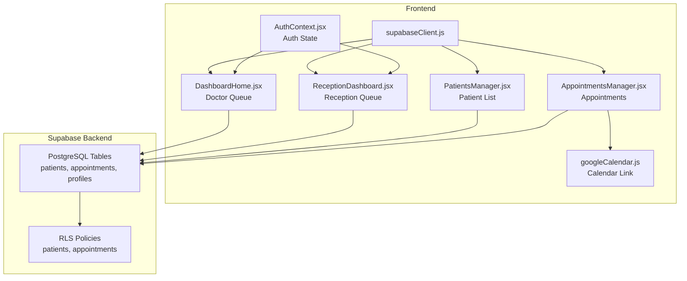
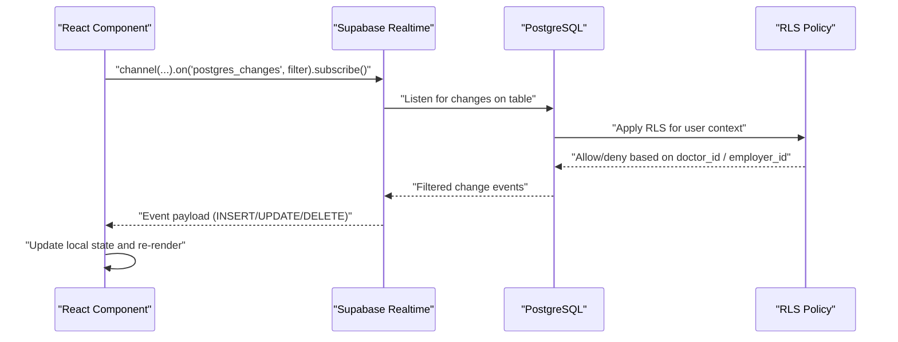
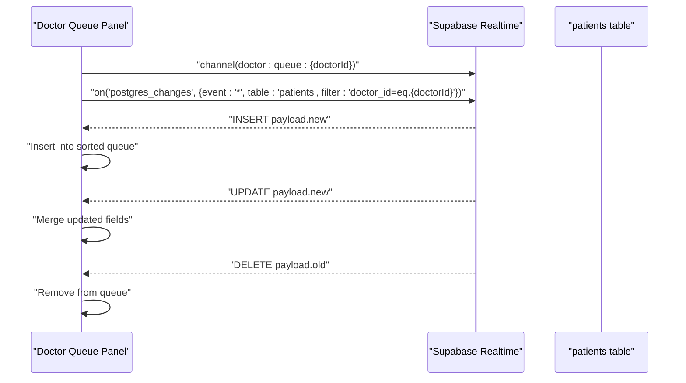
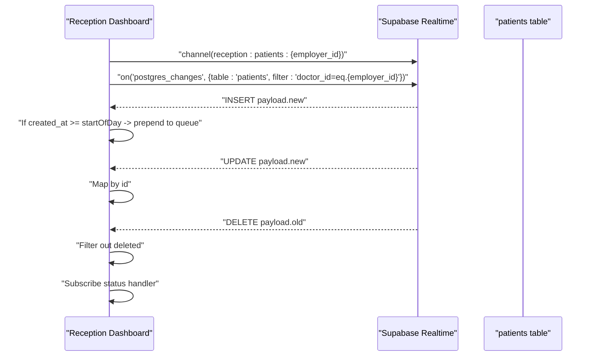
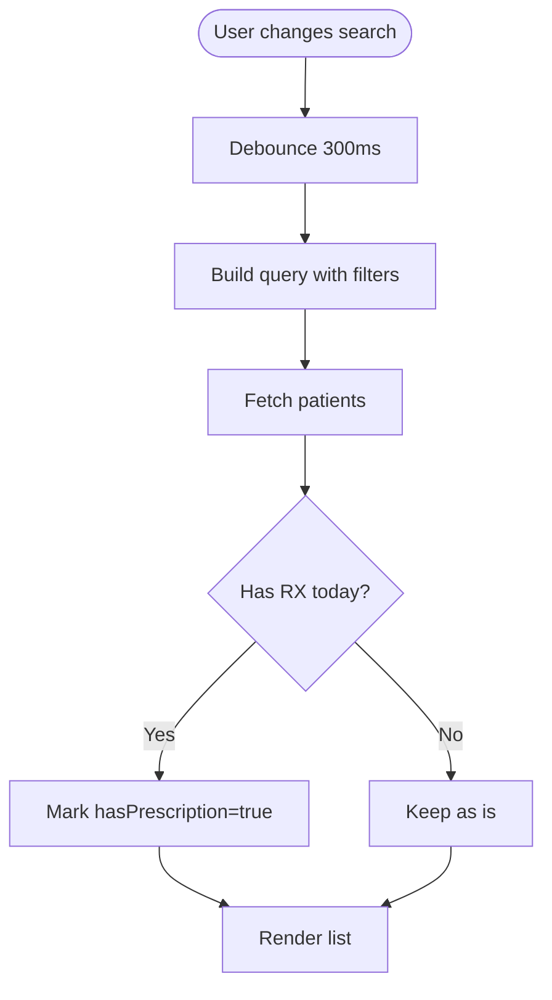
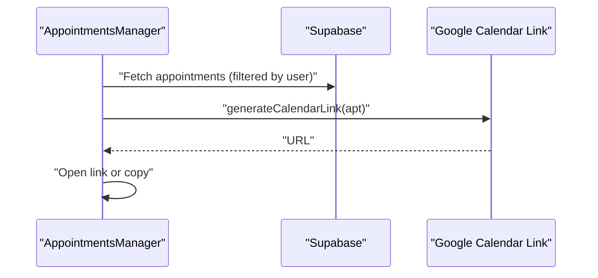
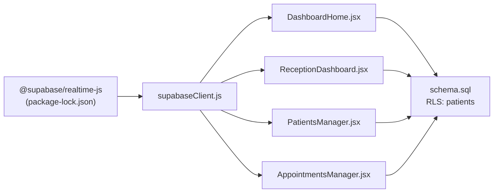

# Real-time Communication

<cite>
**Referenced Files in This Document**
- [supabaseClient.js](file://frontend/src/lib/supabaseClient.js)
- [DashboardHome.jsx](file://frontend/src/pages/DashboardHome.jsx)
- [ReceptionDashboard.jsx](file://frontend/src/pages/ReceptionDashboard.jsx)
- [PatientsManager.jsx](file://frontend/src/pages/PatientsManager.jsx)
- [AppointmentsManager.jsx](file://frontend/src/pages/AppointmentsManager.jsx)
- [schema.sql](file://backend/schema.sql)
- [AuthContext.jsx](file://frontend/src/context/AuthContext.jsx)
- [googleCalendar.js](file://frontend/src/lib/googleCalendar.js)
- [package-lock.json](file://frontend/package-lock.json)
</cite>

## Table of Contents
1. [Introduction](#introduction)
2. [Project Structure](#project-structure)
3. [Core Components](#core-components)
4. [Architecture Overview](#architecture-overview)
5. [Detailed Component Analysis](#detailed-component-analysis)
6. [Dependency Analysis](#dependency-analysis)
7. [Performance Considerations](#performance-considerations)
8. [Troubleshooting Guide](#troubleshooting-guide)
9. [Conclusion](#conclusion)
10. [Appendices](#appendices)

## Introduction
This document explains MedVita’s real-time communication system built on Supabase Realtime. It covers live queue updates, appointment status changes, and patient monitoring dashboards. It documents subscription management, event handling, data consistency patterns, and cross-module synchronization. It also provides guidance on performance optimization, connection management, fallback mechanisms, and integration touchpoints with push notifications, email alerts, and SMS messaging systems.

## Project Structure
The real-time system spans the frontend React application and the Supabase backend:
- Frontend client initialization and real-time subscriptions
- Dashboard components subscribing to Supabase channels
- Backend Row Level Security (RLS) policies ensuring correct scoping
- Optional integrations for calendar sync and notifications

**Diagram sources**
- [supabaseClient.js](file://frontend/src/lib/supabaseClient.js#L1-L11)
- [DashboardHome.jsx](file://frontend/src/pages/DashboardHome.jsx#L1-L487)
- [ReceptionDashboard.jsx](file://frontend/src/pages/ReceptionDashboard.jsx#L1-L455)
- [PatientsManager.jsx](file://frontend/src/pages/PatientsManager.jsx#L1-L667)
- [AppointmentsManager.jsx](file://frontend/src/pages/AppointmentsManager.jsx#L1-L577)
- [schema.sql](file://backend/schema.sql#L46-L224)
- [AuthContext.jsx](file://frontend/src/context/AuthContext.jsx#L1-L108)
- [googleCalendar.js](file://frontend/src/lib/googleCalendar.js#L180-L198)

**Section sources**
- [supabaseClient.js](file://frontend/src/lib/supabaseClient.js#L1-L11)
- [DashboardHome.jsx](file://frontend/src/pages/DashboardHome.jsx#L14-L76)
- [ReceptionDashboard.jsx](file://frontend/src/pages/ReceptionDashboard.jsx#L47-L113)
- [PatientsManager.jsx](file://frontend/src/pages/PatientsManager.jsx#L44-L121)
- [AppointmentsManager.jsx](file://frontend/src/pages/AppointmentsManager.jsx#L67-L118)
- [schema.sql](file://backend/schema.sql#L46-L224)
- [AuthContext.jsx](file://frontend/src/context/AuthContext.jsx#L9-L61)
- [googleCalendar.js](file://frontend/src/lib/googleCalendar.js#L180-L198)

## Core Components
- Supabase client initialization and environment configuration
- Doctor dashboard queue panel with real-time patient updates
- Reception dashboard queue panel with real-time patient updates
- Patient list with real-time search debounced fetch
- Appointments manager with calendar sync integration
- Authentication context managing user/session/profile state
- Backend schema and RLS policies governing access to patients and appointments

**Section sources**
- [supabaseClient.js](file://frontend/src/lib/supabaseClient.js#L1-L11)
- [DashboardHome.jsx](file://frontend/src/pages/DashboardHome.jsx#L14-L76)
- [ReceptionDashboard.jsx](file://frontend/src/pages/ReceptionDashboard.jsx#L47-L113)
- [PatientsManager.jsx](file://frontend/src/pages/PatientsManager.jsx#L44-L121)
- [AppointmentsManager.jsx](file://frontend/src/pages/AppointmentsManager.jsx#L67-L118)
- [schema.sql](file://backend/schema.sql#L46-L224)
- [AuthContext.jsx](file://frontend/src/context/AuthContext.jsx#L9-L61)

## Architecture Overview
MedVita uses Supabase Realtime to subscribe to PostgreSQL table changes and propagate updates to the UI. Subscriptions are scoped by user roles and relationships:
- Doctors receive live updates for their patients’ queue
- Receptionists receive live updates for patients under their employer (doctor)
- Appointments and calendar sync are managed separately but integrated with UI

**Diagram sources**
- [DashboardHome.jsx](file://frontend/src/pages/DashboardHome.jsx#L45-L73)
- [ReceptionDashboard.jsx](file://frontend/src/pages/ReceptionDashboard.jsx#L76-L110)
- [schema.sql](file://backend/schema.sql#L74-L115)

## Detailed Component Analysis

### Supabase Client Initialization
- Initializes the Supabase client using environment variables for URL and anonymous key
- Validates presence of keys and logs warnings if missing

**Section sources**
- [supabaseClient.js](file://frontend/src/lib/supabaseClient.js#L1-L11)

### Doctor Dashboard Queue (Real-time)
- Subscribes to a channel scoped by doctor ID
- Filters events to the doctor’s patients
- Handles INSERT/UPDATE/DELETE to maintain a live queue
- Uses a stable ref to ensure callbacks always see the latest setter

**Diagram sources**
- [DashboardHome.jsx](file://frontend/src/pages/DashboardHome.jsx#L45-L73)

**Section sources**
- [DashboardHome.jsx](file://frontend/src/pages/DashboardHome.jsx#L14-L76)

### Reception Dashboard Queue (Real-time)
- Subscribes to a channel scoped by employer (doctor) ID
- Filters events to patients under the receptionist’s employer
- Adds only today’s patients to the queue
- Provides manual refresh fallback on channel errors

**Diagram sources**
- [ReceptionDashboard.jsx](file://frontend/src/pages/ReceptionDashboard.jsx#L76-L110)

**Section sources**
- [ReceptionDashboard.jsx](file://frontend/src/pages/ReceptionDashboard.jsx#L47-L113)

### Patient List with Real-time Search
- Debounces search queries to reduce fetch frequency
- Fetches patients with optional date filters and search terms
- Enhances data with prescription status for today

**Diagram sources**
- [PatientsManager.jsx](file://frontend/src/pages/PatientsManager.jsx#L114-L121)
- [PatientsManager.jsx](file://frontend/src/pages/PatientsManager.jsx#L56-L111)

**Section sources**
- [PatientsManager.jsx](file://frontend/src/pages/PatientsManager.jsx#L44-L121)

### Appointments Manager and Calendar Sync
- Loads appointments filtered by user role and date range
- Generates Google Calendar links for quick sync
- Integrates calendar sync toggles and fallbacks

**Diagram sources**
- [AppointmentsManager.jsx](file://frontend/src/pages/AppointmentsManager.jsx#L67-L118)
- [googleCalendar.js](file://frontend/src/lib/googleCalendar.js#L180-L198)

**Section sources**
- [AppointmentsManager.jsx](file://frontend/src/pages/AppointmentsManager.jsx#L67-L118)
- [googleCalendar.js](file://frontend/src/lib/googleCalendar.js#L180-L198)

### Authentication and Role-based Access
- Maintains user session and profile
- Ensures real-time subscriptions only operate when profile is available
- RLS policies enforce doctor_id or employer_id scoping

**Section sources**
- [AuthContext.jsx](file://frontend/src/context/AuthContext.jsx#L9-L61)
- [schema.sql](file://backend/schema.sql#L74-L115)

## Dependency Analysis
- Frontend depends on @supabase/realtime-js for WebSocket-based real-time subscriptions
- Real-time subscriptions rely on Supabase credentials and environment configuration
- Backend enforces RLS policies to scope data access per role and relationship

**Diagram sources**
- [package-lock.json](file://frontend/package-lock.json#L1788-L1802)
- [supabaseClient.js](file://frontend/src/lib/supabaseClient.js#L1-L11)
- [DashboardHome.jsx](file://frontend/src/pages/DashboardHome.jsx#L45-L73)
- [ReceptionDashboard.jsx](file://frontend/src/pages/ReceptionDashboard.jsx#L76-L110)
- [PatientsManager.jsx](file://frontend/src/pages/PatientsManager.jsx#L114-L121)
- [AppointmentsManager.jsx](file://frontend/src/pages/AppointmentsManager.jsx#L67-L118)
- [schema.sql](file://backend/schema.sql#L74-L115)

**Section sources**
- [package-lock.json](file://frontend/package-lock.json#L1788-L1802)
- [supabaseClient.js](file://frontend/src/lib/supabaseClient.js#L1-L11)
- [schema.sql](file://backend/schema.sql#L74-L115)

## Performance Considerations
- Subscription scoping: Use precise filters (e.g., doctor_id or employer_id) to minimize event volume
- Event handling: Apply minimal state updates per event; batch UI animations where appropriate
- Debouncing: Use debounced search to reduce unnecessary fetches
- Sorting and ordering: Prefer server-side ordering to keep client lists predictable
- Connection lifecycle: Remove channels on unmount to prevent memory leaks
- Fallbacks: Implement manual refresh fallbacks when channels report errors

[No sources needed since this section provides general guidance]

## Troubleshooting Guide
- Missing credentials: Ensure Supabase URL and anonymous key are present in environment variables
- Channel errors: On receiving channel errors, fall back to manual refresh and log warnings
- Permission denials: RLS violations can occur if accounts are not linked to the correct employer
- Calendar sync failures: Provide manual link generation as a fallback

**Section sources**
- [supabaseClient.js](file://frontend/src/lib/supabaseClient.js#L6-L8)
- [ReceptionDashboard.jsx](file://frontend/src/pages/ReceptionDashboard.jsx#L104-L110)
- [ReceptionDashboard.jsx](file://frontend/src/pages/ReceptionDashboard.jsx#L172-L178)
- [AppointmentsManager.jsx](file://frontend/src/pages/AppointmentsManager.jsx#L163-L171)

## Conclusion
MedVita’s real-time system leverages Supabase Realtime to deliver live updates across queues, appointments, and patient records. By scoping subscriptions to user roles and relationships, and combining RLS policies with efficient event handling, the system achieves responsive dashboards with predictable data consistency. The architecture supports graceful fallbacks, integrates with calendar services, and provides a foundation for future enhancements such as push notifications and SMS.

[No sources needed since this section summarizes without analyzing specific files]

## Appendices

### Real-time Channels and Filters
- Doctor queue channel: doctor:queue:{doctorId}
- Reception queue channel: reception:patients:{employer_id}
- Filters:
  - doctor_id=eq.{doctorId}
  - doctor_id=eq.{employer_id}

**Section sources**
- [DashboardHome.jsx](file://frontend/src/pages/DashboardHome.jsx#L45-L54)
- [ReceptionDashboard.jsx](file://frontend/src/pages/ReceptionDashboard.jsx#L76-L84)

### Data Consistency Patterns
- INSERT: Prepend or append to lists depending on sort order
- UPDATE: Merge fields by id
- DELETE: Remove by id
- Today-only filtering: Compare created_at with start-of-day boundary

**Section sources**
- [DashboardHome.jsx](file://frontend/src/pages/DashboardHome.jsx#L55-L67)
- [ReceptionDashboard.jsx](file://frontend/src/pages/ReceptionDashboard.jsx#L86-L102)

### Cross-module Synchronization
- Appointments and calendar sync: Generate links for quick addition to Google Calendar
- Push notifications: UI switch exists for enabling push notifications in settings

**Section sources**
- [googleCalendar.js](file://frontend/src/lib/googleCalendar.js#L180-L198)
- [AppointmentsManager.jsx](file://frontend/src/pages/AppointmentsManager.jsx#L163-L171)
- [AppointmentsManager.jsx](file://frontend/src/pages/AppointmentsManager.jsx#L267-L271)

### Scalability and Network Resilience
- Use targeted filters to reduce broadcast volume
- Implement retry and exponential backoff for reconnection attempts
- Monitor channel status and degrade gracefully to polling if needed
- Ensure RLS remains strict to prevent unauthorized data exposure

[No sources needed since this section provides general guidance]