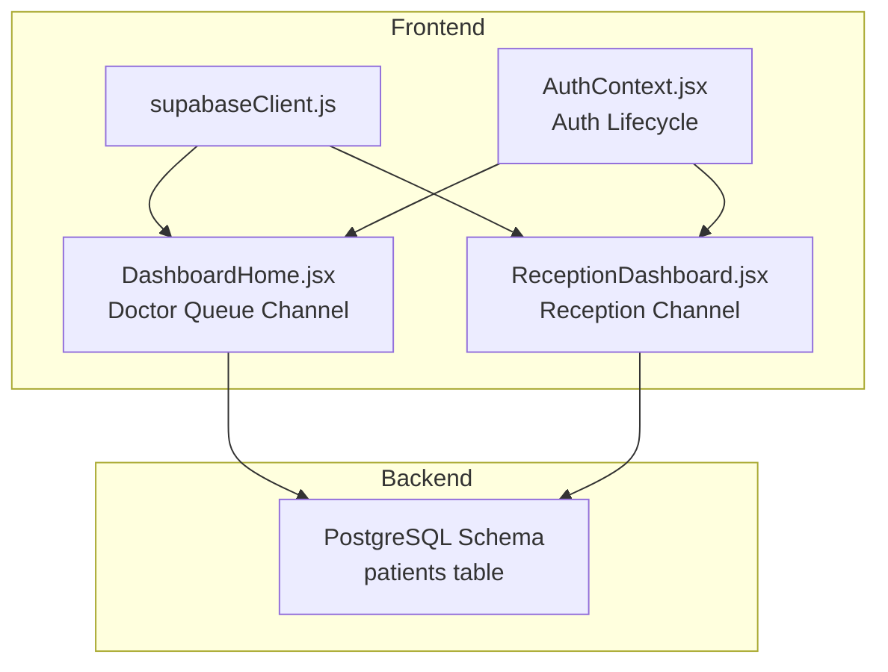
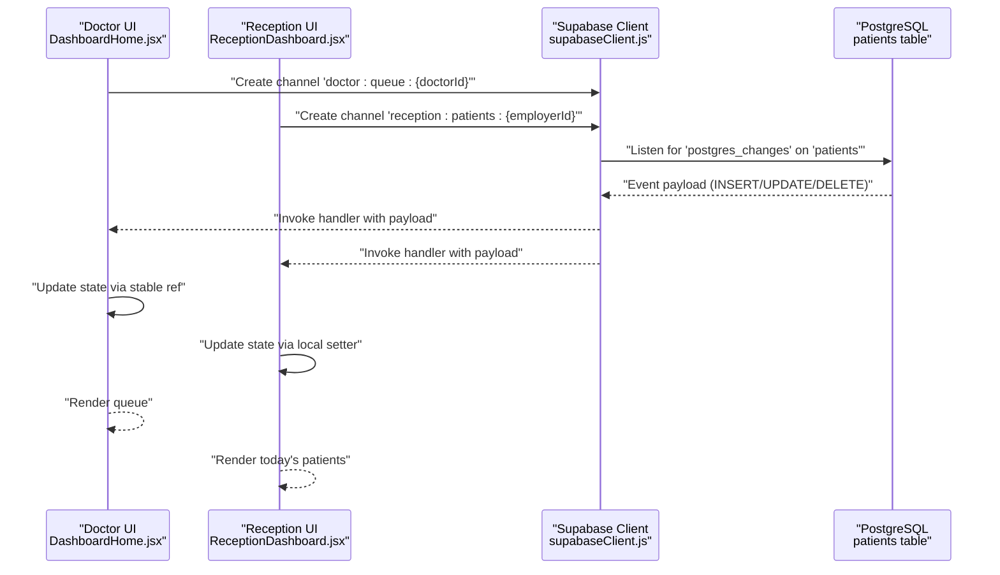
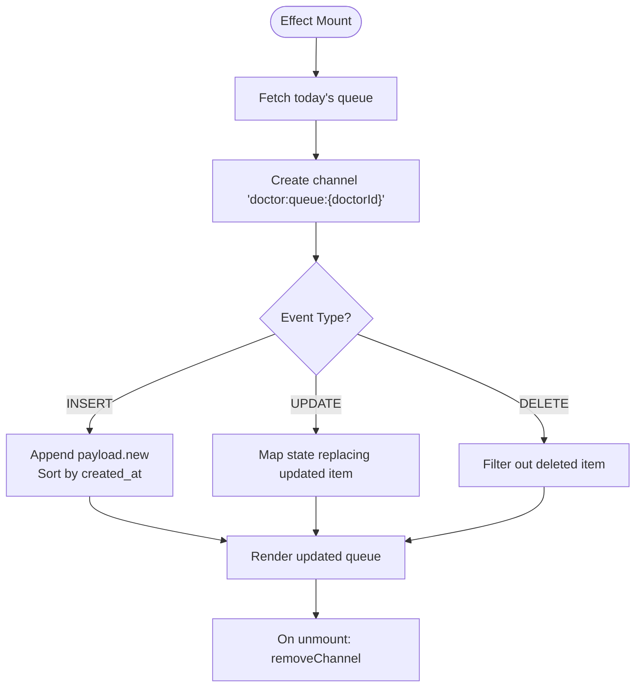
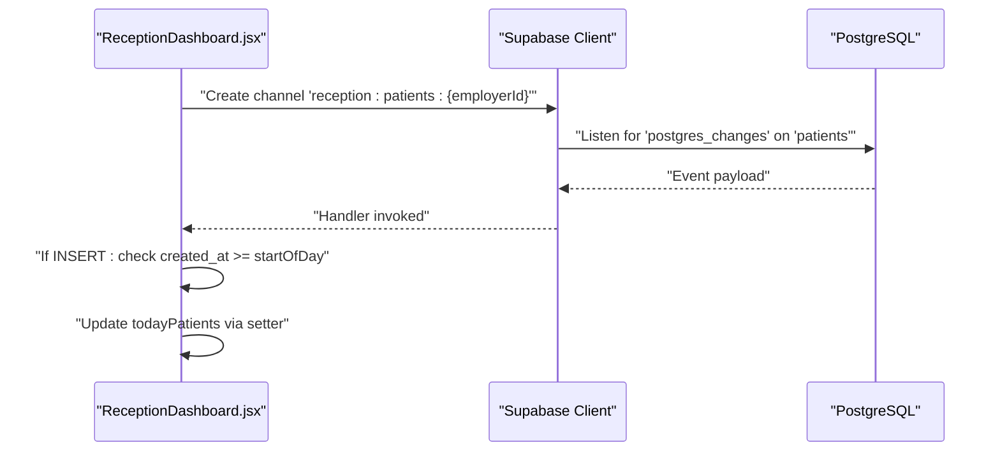
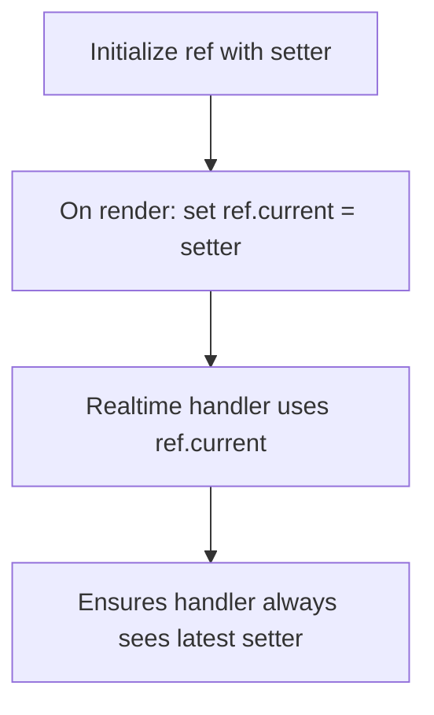
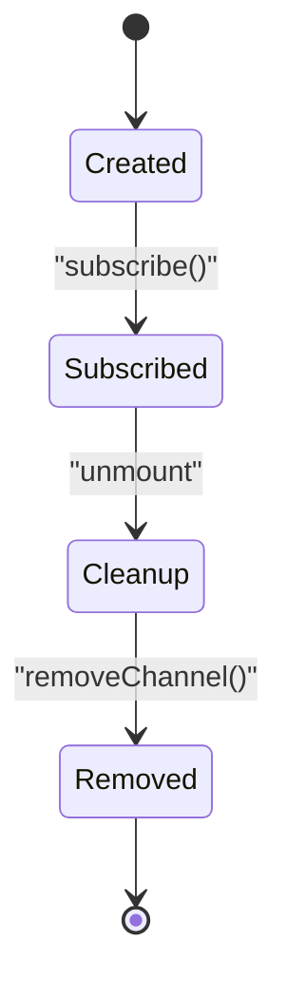
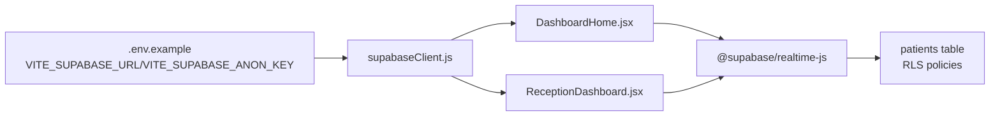

# Supabase Realtime Integration

<cite>
**Referenced Files in This Document**
- [supabaseClient.js](file://frontend/src/lib/supabaseClient.js)
- [DashboardHome.jsx](file://frontend/src/pages/DashboardHome.jsx)
- [ReceptionDashboard.jsx](file://frontend/src/pages/ReceptionDashboard.jsx)
- [AuthContext.jsx](file://frontend/src/context/AuthContext.jsx)
- [schema.sql](file://backend/schema.sql)
- [.env.example](file://frontend/.env.example)
</cite>

## Table of Contents
1. [Introduction](#introduction)
2. [Project Structure](#project-structure)
3. [Core Components](#core-components)
4. [Architecture Overview](#architecture-overview)
5. [Detailed Component Analysis](#detailed-component-analysis)
6. [Dependency Analysis](#dependency-analysis)
7. [Performance Considerations](#performance-considerations)
8. [Troubleshooting Guide](#troubleshooting-guide)
9. [Conclusion](#conclusion)

## Introduction
This document explains how MedVita integrates Supabase Realtime to synchronize PostgreSQL data in real time. It focuses on:
- Channel creation and naming conventions
- Event filtering for doctor-specific queues
- Subscription management and lifecycle
- Stable ref pattern for updating UI from realtime callbacks
- Real-time UI updates for INSERT, UPDATE, DELETE
- Error handling, fallbacks, and debugging
- Performance optimization and best practices

## Project Structure
MedVita’s realtime integration spans three main areas:
- Supabase client initialization
- Doctor dashboard with a doctor-specific queue channel
- Reception dashboard with a reception-specific channel

**Diagram sources**
- [supabaseClient.js](file://frontend/src/lib/supabaseClient.js#L1-L11)
- [DashboardHome.jsx](file://frontend/src/pages/DashboardHome.jsx#L45-L76)
- [ReceptionDashboard.jsx](file://frontend/src/pages/ReceptionDashboard.jsx#L76-L113)
- [AuthContext.jsx](file://frontend/src/context/AuthContext.jsx#L14-L41)
- [schema.sql](file://backend/schema.sql#L46-L58)

**Section sources**
- [supabaseClient.js](file://frontend/src/lib/supabaseClient.js#L1-L11)
- [DashboardHome.jsx](file://frontend/src/pages/DashboardHome.jsx#L45-L76)
- [ReceptionDashboard.jsx](file://frontend/src/pages/ReceptionDashboard.jsx#L76-L113)
- [AuthContext.jsx](file://frontend/src/context/AuthContext.jsx#L14-L41)
- [schema.sql](file://backend/schema.sql#L46-L58)

## Core Components
- Supabase client initialization with environment variables
- Doctor queue channel with doctor-specific filter
- Reception channel with employer-specific filter
- Stable ref pattern to keep realtime callbacks current
- Cleanup on unmount to remove channels

Key implementation references:
- Client initialization: [supabaseClient.js](file://frontend/src/lib/supabaseClient.js#L1-L11)
- Doctor queue channel: [DashboardHome.jsx](file://frontend/src/pages/DashboardHome.jsx#L45-L76)
- Reception channel: [ReceptionDashboard.jsx](file://frontend/src/pages/ReceptionDashboard.jsx#L76-L113)
- Stable ref pattern: [DashboardHome.jsx](file://frontend/src/pages/DashboardHome.jsx#L22-L24)
- Cleanup: [DashboardHome.jsx](file://frontend/src/pages/DashboardHome.jsx#L75), [ReceptionDashboard.jsx](file://frontend/src/pages/ReceptionDashboard.jsx#L112)

**Section sources**
- [supabaseClient.js](file://frontend/src/lib/supabaseClient.js#L1-L11)
- [DashboardHome.jsx](file://frontend/src/pages/DashboardHome.jsx#L22-L24)
- [DashboardHome.jsx](file://frontend/src/pages/DashboardHome.jsx#L45-L76)
- [ReceptionDashboard.jsx](file://frontend/src/pages/ReceptionDashboard.jsx#L76-L113)

## Architecture Overview
Realtime channels subscribe to PostgreSQL changes and push updates to the UI. Channels are scoped by role and entity:
- Doctor queue channel: doctor-specific
- Reception channel: employer-specific

**Diagram sources**
- [DashboardHome.jsx](file://frontend/src/pages/DashboardHome.jsx#L45-L76)
- [ReceptionDashboard.jsx](file://frontend/src/pages/ReceptionDashboard.jsx#L76-L113)
- [supabaseClient.js](file://frontend/src/lib/supabaseClient.js#L1-L11)
- [schema.sql](file://backend/schema.sql#L46-L58)

## Detailed Component Analysis

### Doctor Queue Channel
- Channel name: doctor-specific
- Filter: doctor_id equals current doctor
- Events: INSERT, UPDATE, DELETE
- Handler logic: maintains sorted order by created_at and updates state via a stable ref

**Diagram sources**
- [DashboardHome.jsx](file://frontend/src/pages/DashboardHome.jsx#L26-L76)

**Section sources**
- [DashboardHome.jsx](file://frontend/src/pages/DashboardHome.jsx#L45-L76)

### Reception Channel
- Channel name: reception-specific
- Filter: doctor_id equals employer_id of the logged-in receptionist
- Events: INSERT, UPDATE, DELETE
- Handler logic: adds only today’s patients and updates state

**Diagram sources**
- [ReceptionDashboard.jsx](file://frontend/src/pages/ReceptionDashboard.jsx#L76-L113)

**Section sources**
- [ReceptionDashboard.jsx](file://frontend/src/pages/ReceptionDashboard.jsx#L76-L113)

### Stable Ref Pattern for Realtime Callbacks
- Problem: Realtime callbacks close over props/state that can change; stale closures cause outdated UI updates.
- Solution: Store the latest setter in a ref and update the ref on render to always point to the newest setter.

**Diagram sources**
- [DashboardHome.jsx](file://frontend/src/pages/DashboardHome.jsx#L22-L24)

**Section sources**
- [DashboardHome.jsx](file://frontend/src/pages/DashboardHome.jsx#L22-L24)

### Connection Lifecycle Management and Cleanup
- Channels are created inside a React effect and removed on unmount.
- Auth state changes also unsubscribe from auth state subscription to prevent leaks.

**Diagram sources**
- [DashboardHome.jsx](file://frontend/src/pages/DashboardHome.jsx#L75)
- [ReceptionDashboard.jsx](file://frontend/src/pages/ReceptionDashboard.jsx#L112)
- [AuthContext.jsx](file://frontend/src/context/AuthContext.jsx#L40)

**Section sources**
- [DashboardHome.jsx](file://frontend/src/pages/DashboardHome.jsx#L75)
- [ReceptionDashboard.jsx](file://frontend/src/pages/ReceptionDashboard.jsx#L112)
- [AuthContext.jsx](file://frontend/src/context/AuthContext.jsx#L40)

### Channel Naming Conventions
- Doctor queue: doctor:queue:{doctorId}
- Reception patients: reception:patients:{employerId}

These names clearly identify the role and target resource, aiding debugging and maintenance.

**Section sources**
- [DashboardHome.jsx](file://frontend/src/pages/DashboardHome.jsx#L46)
- [ReceptionDashboard.jsx](file://frontend/src/pages/ReceptionDashboard.jsx#L77)

### Event Filtering
- Both channels use a filter on the doctor_id column to scope events to the current user’s responsibility.
- Doctor channel: doctor_id=eq.{doctorId}
- Reception channel: doctor_id=eq.{employerId}

This ensures minimal payload and reduces unnecessary UI updates.

**Section sources**
- [DashboardHome.jsx](file://frontend/src/pages/DashboardHome.jsx#L53)
- [ReceptionDashboard.jsx](file://frontend/src/pages/ReceptionDashboard.jsx#L84)

### Real-Time UI Updates
- Doctor queue: inserts append and sort by created_at; updates merge; deletes remove.
- Reception queue: inserts only today’s entries; updates merge; deletes remove.

These patterns keep the UI consistent with database changes.

**Section sources**
- [DashboardHome.jsx](file://frontend/src/pages/DashboardHome.jsx#L55-L67)
- [ReceptionDashboard.jsx](file://frontend/src/pages/ReceptionDashboard.jsx#L89-L101)

## Dependency Analysis
- Frontend depends on @supabase/realtime-js for WebSocket transport.
- Realtime relies on the Supabase client initialized with VITE_SUPABASE_URL and VITE_SUPABASE_ANON_KEY.
- Backend schema defines the patients table and RLS policies that govern who can see which rows.

**Diagram sources**
- [.env.example](file://frontend/.env.example#L6-L9)
- [supabaseClient.js](file://frontend/src/lib/supabaseClient.js#L1-L11)
- [DashboardHome.jsx](file://frontend/src/pages/DashboardHome.jsx#L45-L76)
- [ReceptionDashboard.jsx](file://frontend/src/pages/ReceptionDashboard.jsx#L76-L113)
- [schema.sql](file://backend/schema.sql#L46-L58)

**Section sources**
- [.env.example](file://frontend/.env.example#L6-L9)
- [supabaseClient.js](file://frontend/src/lib/supabaseClient.js#L1-L11)
- [schema.sql](file://backend/schema.sql#L46-L58)

## Performance Considerations
- Use targeted filters (e.g., doctor_id) to minimize event volume.
- Scope queries to “today” where appropriate to reduce payload size.
- Prefer stable refs for setters in realtime handlers to avoid stale closures and extra renders.
- Debounce UI actions that trigger writes to reduce churn.
- Keep channel subscriptions granular per role and entity to avoid cross-channel noise.

[No sources needed since this section provides general guidance]

## Troubleshooting Guide
Common issues and remedies:
- Missing environment variables
  - Symptom: Warning about missing Supabase URL or Anon Key.
  - Action: Set VITE_SUPABASE_URL and VITE_SUPABASE_ANON_KEY in .env.local.
  - Reference: [supabaseClient.js](file://frontend/src/lib/supabaseClient.js#L6-L8), [.env.example](file://frontend/.env.example#L6-L9)

- Permission errors when inserting/updating
  - Symptom: RLS violation error when adding a patient.
  - Cause: employer_id mismatch for the current user.
  - Action: Ensure the receptionist is linked to the correct doctor (employer_id).
  - Reference: [ReceptionDashboard.jsx](file://frontend/src/pages/ReceptionDashboard.jsx#L172-L178)

- Realtime channel errors
  - Symptom: CHANNEL_ERROR logs; UI falls back to manual refresh.
  - Action: Inspect network connectivity and server logs; verify filters and table names.
  - Reference: [ReceptionDashboard.jsx](file://frontend/src/pages/ReceptionDashboard.jsx#L104-L110)

- Stale UI after realtime updates
  - Symptom: Outdated queue list after INSERT/UPDATE.
  - Cause: Using a stale setter in the handler closure.
  - Action: Use the stable ref pattern to always reference the latest setter.
  - Reference: [DashboardHome.jsx](file://frontend/src/pages/DashboardHome.jsx#L22-L24)

- Cleanup leaks
  - Symptom: Memory leaks or duplicate handlers after navigation.
  - Action: Remove channels on unmount and unsubscribe from auth state changes.
  - References: [DashboardHome.jsx](file://frontend/src/pages/DashboardHome.jsx#L75), [ReceptionDashboard.jsx](file://frontend/src/pages/ReceptionDashboard.jsx#L112), [AuthContext.jsx](file://frontend/src/context/AuthContext.jsx#L40)

**Section sources**
- [supabaseClient.js](file://frontend/src/lib/supabaseClient.js#L6-L8)
- [.env.example](file://frontend/.env.example#L6-L9)
- [ReceptionDashboard.jsx](file://frontend/src/pages/ReceptionDashboard.jsx#L172-L178)
- [ReceptionDashboard.jsx](file://frontend/src/pages/ReceptionDashboard.jsx#L104-L110)
- [DashboardHome.jsx](file://frontend/src/pages/DashboardHome.jsx#L22-L24)
- [DashboardHome.jsx](file://frontend/src/pages/DashboardHome.jsx#L75)
- [ReceptionDashboard.jsx](file://frontend/src/pages/ReceptionDashboard.jsx#L112)
- [AuthContext.jsx](file://frontend/src/context/AuthContext.jsx#L40)

## Conclusion
MedVita’s Supabase Realtime integration leverages role-scoped channels, precise filters, and a stable ref pattern to deliver responsive, accurate UI updates. By cleaning up channels and subscriptions, handling errors gracefully, and optimizing payloads, the system remains robust and performant. Extending these patterns to other entities follows the same blueprint: create a channel, apply a strong filter, update state via stable refs, and clean up on unmount.