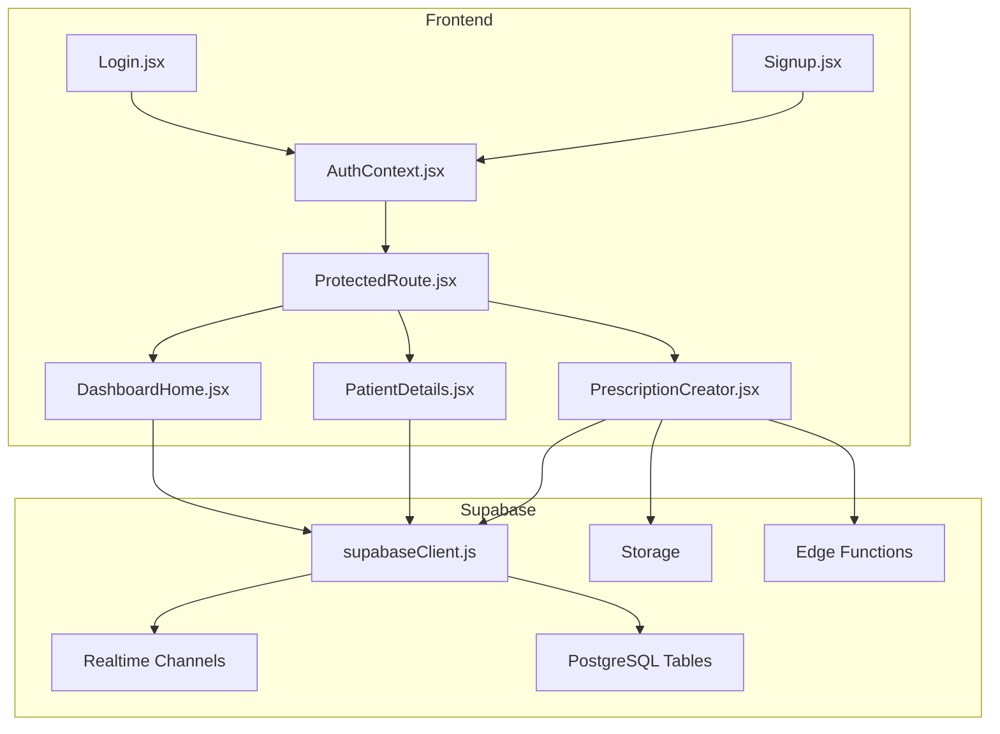
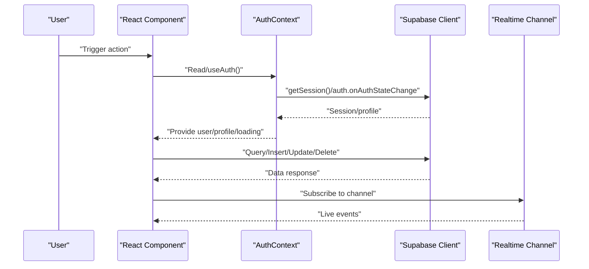
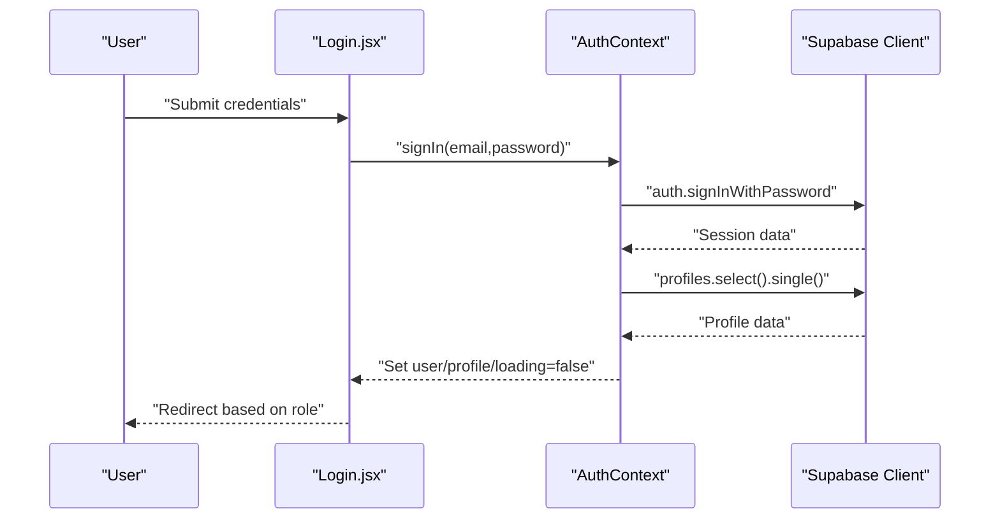
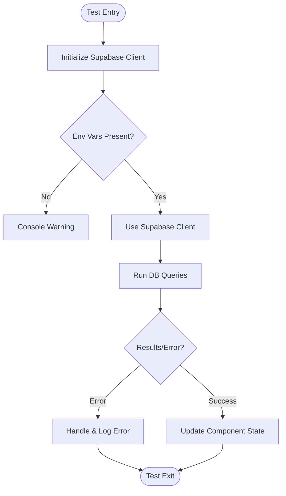
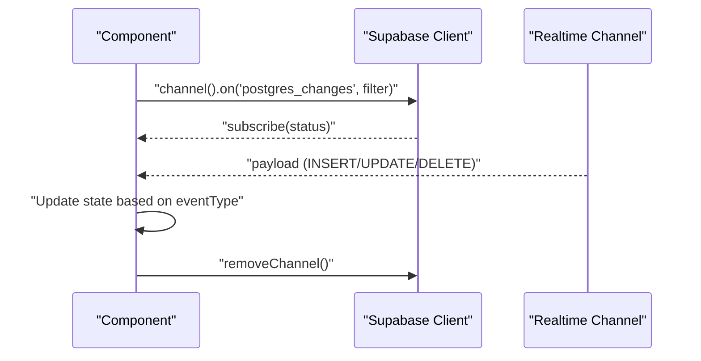
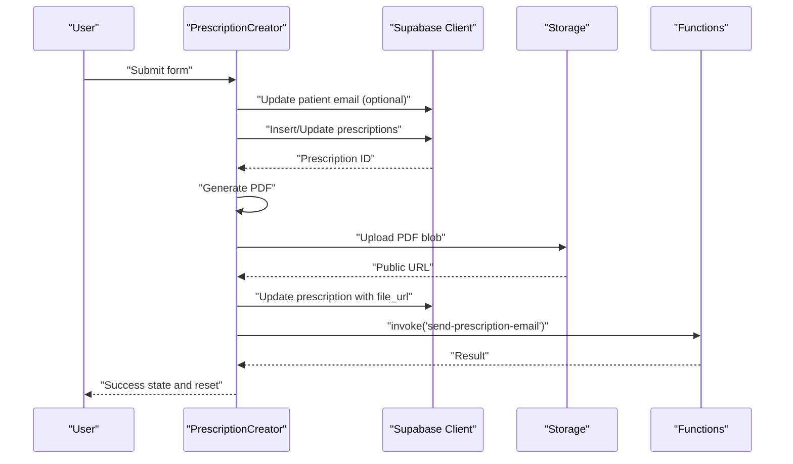
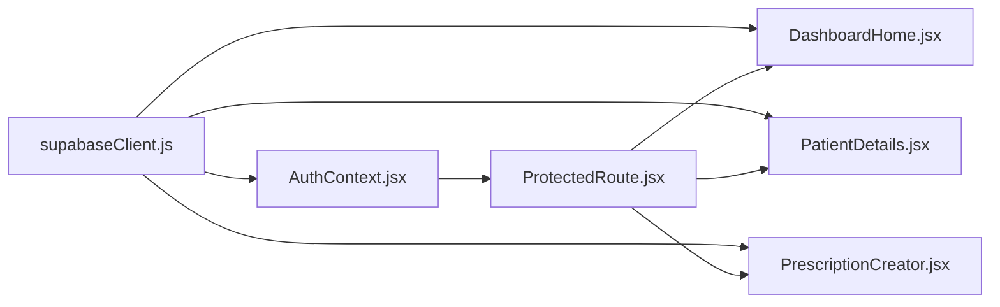

# Integration Testing

<cite>
**Referenced Files in This Document**
- [supabaseClient.js](file://frontend/src/lib/supabaseClient.js)
- [AuthContext.jsx](file://frontend/src/context/AuthContext.jsx)
- [Login.jsx](file://frontend/src/pages/Login.jsx)
- [Signup.jsx](file://frontend/src/pages/Signup.jsx)
- [ProtectedRoute.jsx](file://frontend/src/components/ProtectedRoute.jsx)
- [DashboardHome.jsx](file://frontend/src/pages/DashboardHome.jsx)
- [PatientDetails.jsx](file://frontend/src/components/PatientDetails.jsx)
- [PrescriptionCreator.jsx](file://frontend/src/components/PrescriptionCreator.jsx)
- [setup.js](file://frontend/src/test/setup.js)
- [vitest.config.js](file://frontend/vitest.config.js)
- [package.json](file://frontend/package.json)
- [testsprite_frontend_test_plan.json](file://frontend/testsprite_tests/testsprite_frontend_test_plan.json)
</cite>

## Table of Contents
1. [Introduction](#introduction)
2. [Project Structure](#project-structure)
3. [Core Components](#core-components)
4. [Architecture Overview](#architecture-overview)
5. [Detailed Component Analysis](#detailed-component-analysis)
6. [Dependency Analysis](#dependency-analysis)
7. [Performance Considerations](#performance-considerations)
8. [Troubleshooting Guide](#troubleshooting-guide)
9. [Conclusion](#conclusion)
10. [Appendices](#appendices)

## Introduction
This document provides a comprehensive guide to integration testing for MedVita’s full-stack components. It focuses on:
- Supabase database operations and real-time synchronization
- Authentication flows and middleware behavior
- Context providers and custom hooks
- Component integration patterns and multi-component workflows
- Cross-module interactions and external service integrations (Supabase Storage and Functions)
- Critical healthcare workflows, error handling, and edge cases
- Test environment setup, database seeding, and cleanup procedures

The goal is to enable reliable, repeatable integration tests that validate end-to-end behavior across React components, Supabase client operations, and Supabase real-time channels.

## Project Structure
MedVita’s frontend integrates tightly with Supabase for authentication, database queries, storage uploads, and real-time events. The integration surface includes:
- Supabase client initialization and environment configuration
- Authentication provider managing session lifecycle and profile hydration
- Protected routing enforcing role-based access control
- Dashboard and clinical components performing database reads/writes and real-time subscriptions
- Prescription creation workflow integrating PDF generation, storage upload, and edge function invocation

**Diagram sources**
- [AuthContext.jsx](file://frontend/src/context/AuthContext.jsx#L1-L108)
- [ProtectedRoute.jsx](file://frontend/src/components/ProtectedRoute.jsx#L1-L108)
- [DashboardHome.jsx](file://frontend/src/pages/DashboardHome.jsx#L1-L487)
- [PatientDetails.jsx](file://frontend/src/components/PatientDetails.jsx#L1-L400)
- [PrescriptionCreator.jsx](file://frontend/src/components/PrescriptionCreator.jsx#L1-L303)
- [Login.jsx](file://frontend/src/pages/Login.jsx#L1-L204)
- [Signup.jsx](file://frontend/src/pages/Signup.jsx#L1-L224)
- [supabaseClient.js](file://frontend/src/lib/supabaseClient.js#L1-L11)

**Section sources**
- [supabaseClient.js](file://frontend/src/lib/supabaseClient.js#L1-L11)
- [AuthContext.jsx](file://frontend/src/context/AuthContext.jsx#L1-L108)
- [ProtectedRoute.jsx](file://frontend/src/components/ProtectedRoute.jsx#L1-L108)
- [DashboardHome.jsx](file://frontend/src/pages/DashboardHome.jsx#L1-L487)
- [PatientDetails.jsx](file://frontend/src/components/PatientDetails.jsx#L1-L400)
- [PrescriptionCreator.jsx](file://frontend/src/components/PrescriptionCreator.jsx#L1-L303)
- [Login.jsx](file://frontend/src/pages/Login.jsx#L1-L204)
- [Signup.jsx](file://frontend/src/pages/Signup.jsx#L1-L224)

## Core Components
- Supabase client initialization and environment validation
- Authentication provider handling session retrieval, profile hydration, and auth state change subscriptions
- Protected route enforcement with role-based access control and redirection logic
- Dashboard components orchestrating database queries and real-time subscriptions
- Clinical components aggregating data from multiple tables and rendering timelines
- Prescription workflow integrating PDF generation, storage upload, and edge function invocation

Key integration touchpoints:
- AuthContext depends on Supabase client for session and profile operations
- ProtectedRoute depends on AuthContext for user/profile state and loading flags
- DashboardHome subscribes to Supabase real-time channels for live updates
- PatientDetails aggregates data from appointments and prescriptions tables
- PrescriptionCreator performs inserts/updates, storage uploads, and function invocations

**Section sources**
- [supabaseClient.js](file://frontend/src/lib/supabaseClient.js#L1-L11)
- [AuthContext.jsx](file://frontend/src/context/AuthContext.jsx#L1-L108)
- [ProtectedRoute.jsx](file://frontend/src/components/ProtectedRoute.jsx#L1-L108)
- [DashboardHome.jsx](file://frontend/src/pages/DashboardHome.jsx#L1-L487)
- [PatientDetails.jsx](file://frontend/src/components/PatientDetails.jsx#L1-L400)
- [PrescriptionCreator.jsx](file://frontend/src/components/PrescriptionCreator.jsx#L1-L303)

## Architecture Overview
The integration architecture centers on Supabase as the single source of truth for identity, data, and real-time events. Frontend components depend on:
- Supabase client for Postgres queries, auth operations, storage, and functions
- Real-time channels for live updates to queues, patient lists, and shared data
- Context providers for global auth state and profile data
- Protected routes for role-based access control

**Diagram sources**
- [AuthContext.jsx](file://frontend/src/context/AuthContext.jsx#L14-L41)
- [DashboardHome.jsx](file://frontend/src/pages/DashboardHome.jsx#L45-L76)
- [ProtectedRoute.jsx](file://frontend/src/components/ProtectedRoute.jsx#L54-L105)

## Detailed Component Analysis

### Authentication Integration Testing
Testing approach:
- Validate session retrieval and profile hydration on app mount
- Verify auth state change subscriptions update context state
- Test sign-up and sign-in flows with role-specific redirection
- Validate protected route behavior for unauthenticated and unauthorized users
- Simulate auth errors and edge cases (missing profile, invalid credentials)

Recommended test scenarios:
- Successful sign-in followed by immediate profile fetch and redirection
- Role-based redirection logic for doctor, patient, receptionist
- Protected route loading state and fallback to login when unauthenticated
- Access denial page for mismatched roles
- Auth error handling for invalid credentials, rate limits, and unconfirmed emails

**Diagram sources**
- [Login.jsx](file://frontend/src/pages/Login.jsx#L20-L75)
- [AuthContext.jsx](file://frontend/src/context/AuthContext.jsx#L14-L61)

**Section sources**
- [Login.jsx](file://frontend/src/pages/Login.jsx#L1-L204)
- [Signup.jsx](file://frontend/src/pages/Signup.jsx#L1-L224)
- [AuthContext.jsx](file://frontend/src/context/AuthContext.jsx#L1-L108)
- [ProtectedRoute.jsx](file://frontend/src/components/ProtectedRoute.jsx#L1-L108)

### Supabase Client Operations Testing
Testing approach:
- Validate client initialization with environment variables
- Mock Supabase client for unit-level isolation of component logic
- Test database queries for appointments, prescriptions, patients, and profiles
- Validate error propagation and loading states in components

Recommended test scenarios:
- Supabase client creation and environment validation warnings
- Query composition for timeline aggregation (appointments + prescriptions)
- Insert/update operations for prescriptions and patient metadata
- Profile hydration on auth state change

**Diagram sources**
- [supabaseClient.js](file://frontend/src/lib/supabaseClient.js#L1-L11)
- [PatientDetails.jsx](file://frontend/src/components/PatientDetails.jsx#L44-L90)
- [PrescriptionCreator.jsx](file://frontend/src/components/PrescriptionCreator.jsx#L100-L188)

**Section sources**
- [supabaseClient.js](file://frontend/src/lib/supabaseClient.js#L1-L11)
- [PatientDetails.jsx](file://frontend/src/components/PatientDetails.jsx#L1-L400)
- [PrescriptionCreator.jsx](file://frontend/src/components/PrescriptionCreator.jsx#L1-L303)

### Real-Time Data Synchronization Testing
Testing approach:
- Subscribe to Supabase real-time channels and assert event handling
- Validate insertion, update, and deletion behaviors for live queues and patient lists
- Simulate connection errors and fallback to polling/manual refresh
- Verify stable refs and subscription cleanup

Recommended test scenarios:
- Doctor queue channel receives INSERT/UPDATE/DELETE events and updates UI accordingly
- Reception dashboard channel filters by doctor and updates today’s patients
- Channel subscription lifecycle and removal on unmount

**Diagram sources**
- [DashboardHome.jsx](file://frontend/src/pages/DashboardHome.jsx#L45-L76)
- [PatientDetails.jsx](file://frontend/src/components/PatientDetails.jsx#L27-L42)

**Section sources**
- [DashboardHome.jsx](file://frontend/src/pages/DashboardHome.jsx#L1-L487)
- [PatientDetails.jsx](file://frontend/src/components/PatientDetails.jsx#L1-L400)

### Prescription Workflow Integration Testing
Testing approach:
- Validate PDF generation and storage upload pipeline
- Test edge function invocation for email delivery
- Assert success states and cleanup/reset behavior
- Simulate failures during saving, generating, uploading, and emailing

Recommended test scenarios:
- New prescription creation with diagnosis and treatment text
- Edit existing prescription and re-upload PDF
- Patient email update and subsequent email dispatch
- Error handling for storage upload failures and function invocation errors

**Diagram sources**
- [PrescriptionCreator.jsx](file://frontend/src/components/PrescriptionCreator.jsx#L100-L188)

**Section sources**
- [PrescriptionCreator.jsx](file://frontend/src/components/PrescriptionCreator.jsx#L1-L303)

### Multi-Component Workflows and Cross-Module Interactions
Testing approach:
- Validate coordinated behavior across AuthContext, ProtectedRoute, and dashboard components
- Test timeline aggregation combining appointments and prescriptions
- Verify role-based navigation and redirection logic
- Ensure real-time updates propagate across components subscribed to the same channels

Recommended test scenarios:
- Authenticated user with doctor role navigates to dashboard, sees queue and appointments
- Receptionist role redirected to reception dashboard
- Timeline grouping and sorting by date across multiple data sources
- Real-time updates reflected in both queue and patient details panels

**Section sources**
- [ProtectedRoute.jsx](file://frontend/src/components/ProtectedRoute.jsx#L1-L108)
- [DashboardHome.jsx](file://frontend/src/pages/DashboardHome.jsx#L1-L487)
- [PatientDetails.jsx](file://frontend/src/components/PatientDetails.jsx#L1-L400)

## Dependency Analysis
Supabase client is a central dependency across components. The dependency graph highlights tight coupling between:
- AuthContext and Supabase client for session and profile operations
- Dashboard components and Supabase client for database queries and real-time channels
- Prescription workflow and Supabase Storage and Functions for PDF handling and email dispatch

**Diagram sources**
- [supabaseClient.js](file://frontend/src/lib/supabaseClient.js#L1-L11)
- [AuthContext.jsx](file://frontend/src/context/AuthContext.jsx#L1-L108)
- [ProtectedRoute.jsx](file://frontend/src/components/ProtectedRoute.jsx#L1-L108)
- [DashboardHome.jsx](file://frontend/src/pages/DashboardHome.jsx#L1-L487)
- [PatientDetails.jsx](file://frontend/src/components/PatientDetails.jsx#L1-L400)
- [PrescriptionCreator.jsx](file://frontend/src/components/PrescriptionCreator.jsx#L1-L303)

**Section sources**
- [supabaseClient.js](file://frontend/src/lib/supabaseClient.js#L1-L11)
- [AuthContext.jsx](file://frontend/src/context/AuthContext.jsx#L1-L108)
- [ProtectedRoute.jsx](file://frontend/src/components/ProtectedRoute.jsx#L1-L108)
- [DashboardHome.jsx](file://frontend/src/pages/DashboardHome.jsx#L1-L487)
- [PatientDetails.jsx](file://frontend/src/components/PatientDetails.jsx#L1-L400)
- [PrescriptionCreator.jsx](file://frontend/src/components/PrescriptionCreator.jsx#L1-L303)

## Performance Considerations
- Minimize redundant queries by leveraging real-time channels for live updates
- Batch database operations where possible to reduce round trips
- Debounce or throttle real-time event handlers to prevent excessive re-renders
- Use stable refs for callbacks in real-time subscriptions to avoid stale closures
- Cache frequently accessed profile and user data in context to avoid repeated fetches

## Troubleshooting Guide
Common integration issues and resolutions:
- Missing Supabase environment variables cause initialization warnings; ensure .env.local is configured
- Auth state change subscriptions must be unsubscribed to prevent memory leaks
- Real-time channel subscriptions require proper filtering and cleanup on component unmount
- Prescription workflow failures often stem from storage upload or function invocation errors; implement robust error handling and user feedback
- Protected route loading states must accurately reflect auth and profile readiness to avoid redirect loops

**Section sources**
- [supabaseClient.js](file://frontend/src/lib/supabaseClient.js#L6-L8)
- [AuthContext.jsx](file://frontend/src/context/AuthContext.jsx#L40-L41)
- [DashboardHome.jsx](file://frontend/src/pages/DashboardHome.jsx#L75-L76)
- [PrescriptionCreator.jsx](file://frontend/src/components/PrescriptionCreator.jsx#L181-L188)
- [ProtectedRoute.jsx](file://frontend/src/components/ProtectedRoute.jsx#L57-L74)

## Conclusion
MedVita’s integration testing strategy should emphasize end-to-end validation of authentication, database operations, real-time synchronization, and cross-component workflows. By focusing on Supabase client initialization, auth provider behavior, protected routing, and the core clinical workflows (dashboard, patient timeline, and prescription creation), teams can ensure reliable operation across roles and critical healthcare scenarios. Robust error handling, environment configuration, and real-time channel lifecycle management are essential for production stability.

## Appendices

### Test Environment Setup
- Install dependencies and configure Vitest with JSDOM environment
- Add test setup for DOM assertions
- Configure environment variables for Supabase URL and anon key
- Use Vitest configuration to exclude build artifacts and trash directories

**Section sources**
- [vitest.config.js](file://frontend/vitest.config.js#L1-L19)
- [setup.js](file://frontend/src/test/setup.js#L1-L2)
- [package.json](file://frontend/package.json#L1-L50)

### Database Seeding and Cleanup
- Seed test data for profiles, patients, appointments, and prescriptions
- Use Supabase SQL migrations and test fixtures to initialize known states
- Clean up test records after integration tests to maintain isolation

Note: Specific seed/cleanup scripts are not present in the provided files; implement them using Supabase CLI or migration files aligned with the schema.

### Example Test Plan References
- Frontend test plan includes authentication and dashboard assertions for roles and navigation

**Section sources**
- [testsprite_frontend_test_plan.json](file://frontend/testsprite_tests/testsprite_frontend_test_plan.json#L626-L647)
- [testsprite_frontend_test_plan.json](file://frontend/testsprite_tests/testsprite_frontend_test_plan.json#L3391-L3430)