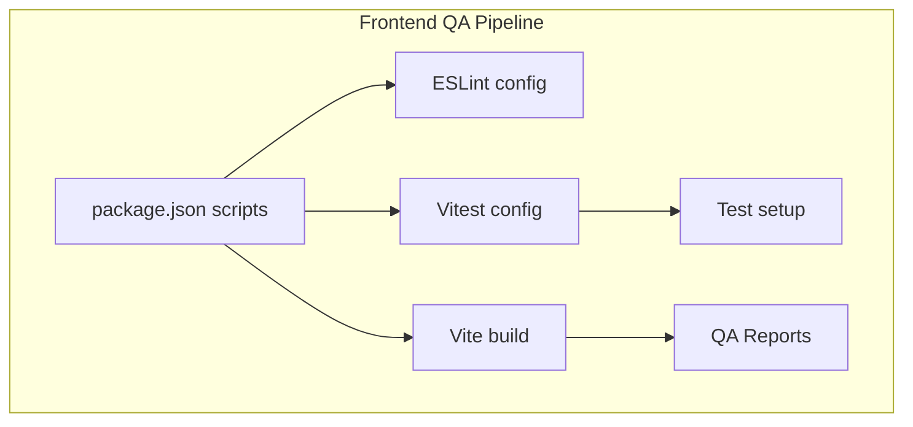
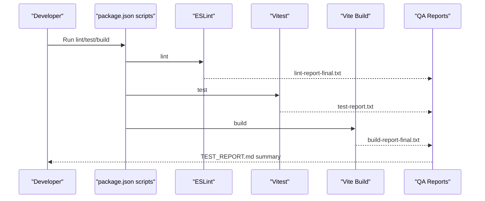
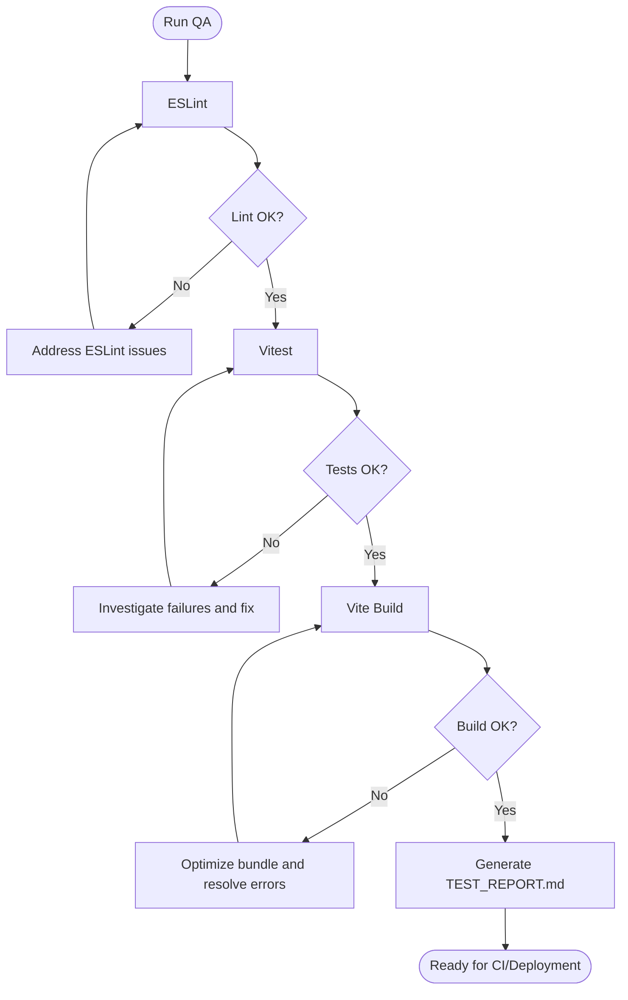
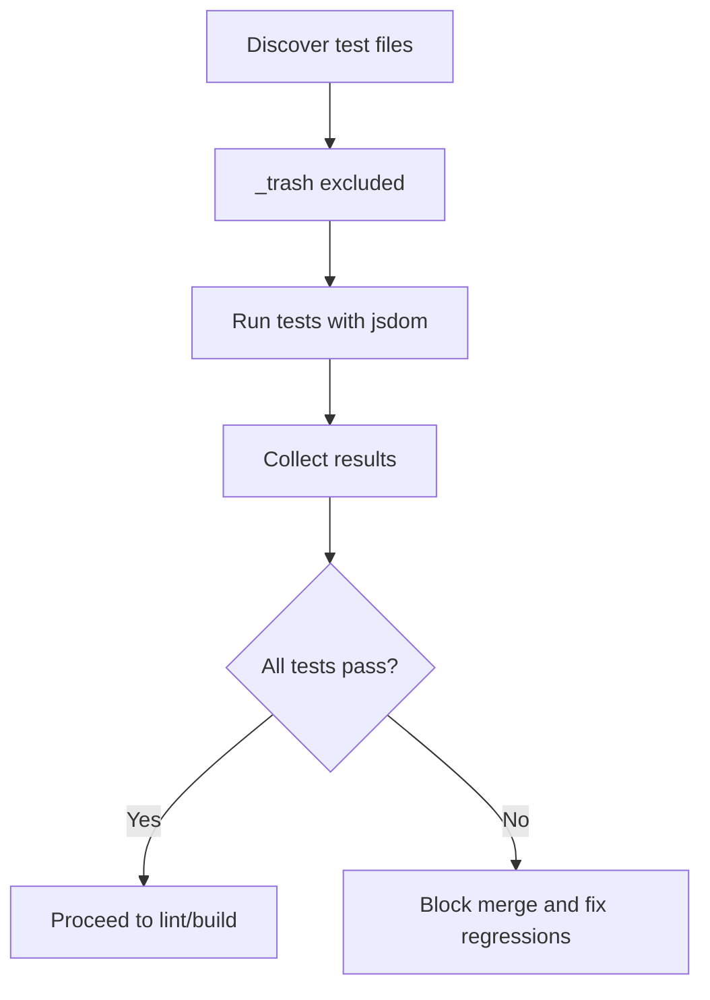
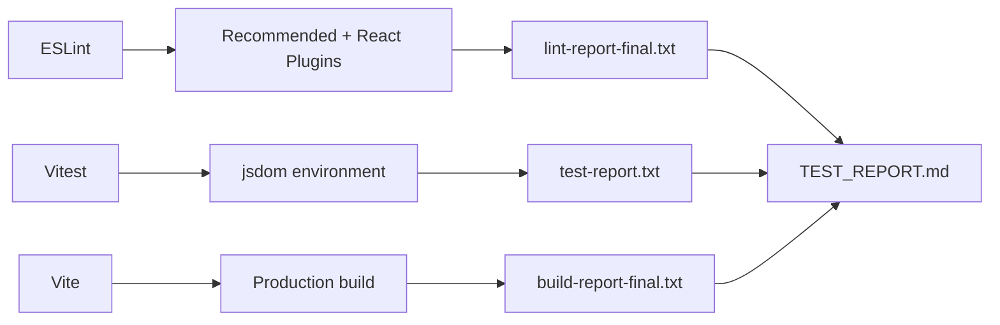

# Quality Assurance

<cite>
**Referenced Files in This Document**
- [TEST_REPORT.md](file://frontend/TEST_REPORT.md)
- [build-report-final.txt](file://frontend/build-report-final.txt)
- [lint-report-final.txt](file://frontend/lint-report-final.txt)
- [test-report.txt](file://frontend/test-report.txt)
- [package.json](file://frontend/package.json)
- [vitest.config.js](file://frontend/vitest.config.js)
- [eslint.config.js](file://frontend/eslint.config.js)
- [.gitignore](file://frontend/.gitignore)
- [setup.js](file://frontend/src/test/setup.js)
- [Header.jsx](file://frontend/src/components/Header.jsx)
- [Sidebar.jsx](file://frontend/src/components/Sidebar.jsx)
- [PatientDetails.jsx](file://frontend/src/components/PatientDetails.jsx)
- [DashboardHome.jsx](file://frontend/src/pages/DashboardHome.jsx)
- [Login.jsx](file://frontend/src/pages/Login.jsx)
- [Signup.jsx](file://frontend/src/pages/Signup.jsx)
- [AvailabilityManager.jsx](file://frontend/src/pages/AvailabilityManager.jsx)
</cite>

## Table of Contents
1. [Introduction](#introduction)
2. [Project Structure](#project-structure)
3. [Core Components](#core-components)
4. [Architecture Overview](#architecture-overview)
5. [Detailed Component Analysis](#detailed-component-analysis)
6. [Dependency Analysis](#dependency-analysis)
7. [Performance Considerations](#performance-considerations)
8. [Troubleshooting Guide](#troubleshooting-guide)
9. [Conclusion](#conclusion)
10. [Appendices](#appendices)

## Introduction
This document describes MedVita’s quality assurance processes and metrics, focusing on testing report analysis, code quality metrics, and performance testing outcomes. It explains the continuous integration testing pipeline, automated quality checks, and regression testing strategies. It also covers test coverage analysis, code quality reports, and build verification processes. Guidance is provided on interpreting test reports, identifying quality issues, and tracking improvement metrics, along with best practices for healthcare applications.

## Project Structure
The frontend quality pipeline centers around three pillars:
- Testing: Vitest-based unit/integration testing with React Testing Library setup
- Linting: ESLint with React Hooks and React Refresh plugins
- Build and Reporting: Vite-based build with post-build bundle insights

**Diagram sources**
- [package.json](file://frontend/package.json#L6-L12)
- [eslint.config.js](file://frontend/eslint.config.js#L1-L30)
- [vitest.config.js](file://frontend/vitest.config.js#L1-L19)
- [setup.js](file://frontend/src/test/setup.js#L1-L2)
- [build-report-final.txt](file://frontend/build-report-final.txt#L1-L19)

**Section sources**
- [package.json](file://frontend/package.json#L6-L12)
- [eslint.config.js](file://frontend/eslint.config.js#L1-L30)
- [vitest.config.js](file://frontend/vitest.config.js#L1-L19)
- [setup.js](file://frontend/src/test/setup.js#L1-L2)
- [build-report-final.txt](file://frontend/build-report-final.txt#L1-L19)

## Core Components
- Testing framework: Vitest with jsdom environment and React Testing Library setup
- Linting: ESLint with recommended rules, React Hooks plugin, and React Refresh plugin
- Build: Vite producing optimized bundles with gzip sizes and chunk size warnings
- Reporting: Markdown-based test report, terminal logs for lint and test, and build summaries

Key outcomes documented:
- Zero linting errors achieved
- Build successful with low-level warnings for large chunks
- Test configuration excludes trash directories and resolves prior import issues

**Section sources**
- [TEST_REPORT.md](file://frontend/TEST_REPORT.md#L1-L186)
- [lint-report-final.txt](file://frontend/lint-report-final.txt#L1-L5)
- [test-report.txt](file://frontend/test-report.txt#L1-L13)
- [build-report-final.txt](file://frontend/build-report-final.txt#L1-L19)

## Architecture Overview
The QA architecture integrates scripts, configurations, and artifacts to form a cohesive verification loop.

**Diagram sources**
- [package.json](file://frontend/package.json#L6-L12)
- [lint-report-final.txt](file://frontend/lint-report-final.txt#L1-L5)
- [test-report.txt](file://frontend/test-report.txt#L1-L13)
- [build-report-final.txt](file://frontend/build-report-final.txt#L1-L19)
- [TEST_REPORT.md](file://frontend/TEST_REPORT.md#L1-L186)

## Detailed Component Analysis

### Test Report Analysis
The test report consolidates:
- Test runner status and configuration
- Linting pass with zero issues
- Build success with explicit fixes and warnings
- Code quality improvements across React Hooks, variable usage, and CSS architecture
- Files modified and recommendations for performance, testing, and code quality

Interpretation guidelines:
- Status indicators (checkmarks and warnings) reflect health of the pipeline
- Exclusions for trash directories prevent false positives
- Build warnings prompt code-splitting and chunk-size tuning

**Section sources**
- [TEST_REPORT.md](file://frontend/TEST_REPORT.md#L1-L186)

### Automated Quality Checks
- ESLint configuration enforces recommended rules and React-specific plugins
- Vitest configuration sets globals, jsdom environment, and exclusion patterns
- Test setup initializes DOM matchers for React testing

**Diagram sources**
- [eslint.config.js](file://frontend/eslint.config.js#L1-L30)
- [vitest.config.js](file://frontend/vitest.config.js#L1-L19)
- [setup.js](file://frontend/src/test/setup.js#L1-L2)
- [build-report-final.txt](file://frontend/build-report-final.txt#L1-L19)
- [TEST_REPORT.md](file://frontend/TEST_REPORT.md#L1-L186)

**Section sources**
- [eslint.config.js](file://frontend/eslint.config.js#L1-L30)
- [vitest.config.js](file://frontend/vitest.config.js#L1-L19)
- [setup.js](file://frontend/src/test/setup.js#L1-L2)

### Regression Testing Strategies
- Exclude trash directories from test discovery to avoid stale or broken tests
- Use setup files to standardize testing environment
- Maintain minimal test footprint while ensuring critical components are covered

**Diagram sources**
- [vitest.config.js](file://frontend/vitest.config.js#L10-L16)
- [setup.js](file://frontend/src/test/setup.js#L1-L2)
- [test-report.txt](file://frontend/test-report.txt#L10-L12)

**Section sources**
- [vitest.config.js](file://frontend/vitest.config.js#L10-L16)
- [setup.js](file://frontend/src/test/setup.js#L1-L2)
- [test-report.txt](file://frontend/test-report.txt#L10-L12)

### Code Quality Metrics and Reports
- Linting: Zero errors and warnings achieved
- Build: Successful with explicit fixes for CSS @apply directives and warnings for large chunks
- Test configuration: Resolved import errors by excluding trash directory

Recommendations derived from reports:
- Implement code-splitting and dynamic imports
- Add unit and integration tests for critical components
- Consider TypeScript migration and component documentation

**Section sources**
- [TEST_REPORT.md](file://frontend/TEST_REPORT.md#L26-L165)
- [lint-report-final.txt](file://frontend/lint-report-final.txt#L1-L5)
- [build-report-final.txt](file://frontend/build-report-final.txt#L14-L18)

### Build Verification Processes
- Vite produces CSS and JS outputs with gzip sizes
- Chunk size warnings indicate potential performance improvements
- Build-time and output-size metrics serve as regression guards

**Section sources**
- [build-report-final.txt](file://frontend/build-report-final.txt#L10-L18)

### Examples of Interpreting Test Reports and Tracking Improvement
- Use TEST_REPORT.md as a central artifact to track:
  - Test configuration fixes
  - Linting issue resolutions
  - Build error fixes and warnings
  - Code quality improvements
- Maintain a change log of modified files to correlate fixes with improvements

**Section sources**
- [TEST_REPORT.md](file://frontend/TEST_REPORT.md#L134-L165)

### Relationship Between Testing, Linting, and Build
- Linting precedes testing to ensure code quality
- Testing validates runtime behavior under jsdom
- Build verifies packaging and performance characteristics
- Reports consolidate outcomes for decision-making

**Section sources**
- [package.json](file://frontend/package.json#L6-L12)
- [TEST_REPORT.md](file://frontend/TEST_REPORT.md#L1-L186)

## Dependency Analysis
Quality tooling dependencies and their roles:
- ESLint: Enforces style and correctness rules
- React Hooks and React Refresh plugins: Aligns linting with React best practices
- Vitest: Fast testing with jsdom environment
- Vite: Optimized build with reporting and warnings

**Diagram sources**
- [eslint.config.js](file://frontend/eslint.config.js#L1-L30)
- [vitest.config.js](file://frontend/vitest.config.js#L1-L19)
- [build-report-final.txt](file://frontend/build-report-final.txt#L1-L19)
- [lint-report-final.txt](file://frontend/lint-report-final.txt#L1-L5)
- [test-report.txt](file://frontend/test-report.txt#L1-L13)
- [TEST_REPORT.md](file://frontend/TEST_REPORT.md#L1-L186)

**Section sources**
- [eslint.config.js](file://frontend/eslint.config.js#L1-L30)
- [vitest.config.js](file://frontend/vitest.config.js#L1-L19)
- [build-report-final.txt](file://frontend/build-report-final.txt#L1-L19)
- [lint-report-final.txt](file://frontend/lint-report-final.txt#L1-L5)
- [test-report.txt](file://frontend/test-report.txt#L1-L13)
- [TEST_REPORT.md](file://frontend/TEST_REPORT.md#L1-L186)

## Performance Considerations
- Large chunk detection indicates opportunities for code-splitting and dynamic imports
- Bundle size metrics guide decisions on tree shaking and component lazy-loading
- CSS architecture improvements maintain visual fidelity while resolving build errors

Actionable guidance:
- Introduce route-based code splitting
- Lazy-load heavy components
- Review and refine chunk generation strategies

**Section sources**
- [build-report-final.txt](file://frontend/build-report-final.txt#L14-L18)
- [TEST_REPORT.md](file://frontend/TEST_REPORT.md#L149-L165)

## Troubleshooting Guide
Common issues and resolutions:
- Test configuration problems:
  - Exclude trash directories to prevent import errors
  - Verify setup files for DOM matchers
- Linting issues:
  - Resolve unused variables and React Hook dependency warnings
  - Apply suggested fixes incrementally
- Build errors:
  - Replace Tailwind @apply directives with explicit CSS for custom classes
  - Monitor chunk size warnings and optimize accordingly

**Section sources**
- [vitest.config.js](file://frontend/vitest.config.js#L10-L16)
- [setup.js](file://frontend/src/test/setup.js#L1-L2)
- [TEST_REPORT.md](file://frontend/TEST_REPORT.md#L26-L131)
- [build-report-final.txt](file://frontend/build-report-final.txt#L14-L18)

## Conclusion
MedVita’s QA pipeline demonstrates strong current health with zero linting errors, successful builds, and resolved React Hook and CSS issues. The TEST_REPORT.md serves as a central artifact for tracking progress. To further strengthen quality assurance for healthcare applications, prioritize adding unit and integration tests, implementing TypeScript, and adopting performance-focused code-splitting strategies.

## Appendices

### Appendix A: QA Artifacts and Their Roles
- TEST_REPORT.md: Consolidated summary of test, lint, and build outcomes
- lint-report-final.txt: Terminal output confirming zero linting errors
- test-report.txt: Terminal output indicating test configuration and run status
- build-report-final.txt: Terminal output with bundle sizes and chunk warnings

**Section sources**
- [TEST_REPORT.md](file://frontend/TEST_REPORT.md#L1-L186)
- [lint-report-final.txt](file://frontend/lint-report-final.txt#L1-L5)
- [test-report.txt](file://frontend/test-report.txt#L1-L13)
- [build-report-final.txt](file://frontend/build-report-final.txt#L1-L19)

### Appendix B: Example Components and QA Observations
- Header.jsx: Clean imports and state usage
- Sidebar.jsx: Unused parameter removed
- PatientDetails.jsx: Missing state and function added
- DashboardHome.jsx: Hook dependency order corrected
- Login.jsx: Unused variables removed
- Signup.jsx: Unused variables removed
- AvailabilityManager.jsx: Unused variable handled per convention

These changes reflect improvements in React Hooks usage, variable hygiene, and component stability.

**Section sources**
- [Header.jsx](file://frontend/src/components/Header.jsx#L1-L158)
- [Sidebar.jsx](file://frontend/src/components/Sidebar.jsx#L1-L113)
- [PatientDetails.jsx](file://frontend/src/components/PatientDetails.jsx#L1-L400)
- [DashboardHome.jsx](file://frontend/src/pages/DashboardHome.jsx#L1-L487)
- [Login.jsx](file://frontend/src/pages/Login.jsx#L1-L204)
- [Signup.jsx](file://frontend/src/pages/Signup.jsx#L1-L224)
- [AvailabilityManager.jsx](file://frontend/src/pages/AvailabilityManager.jsx#L1-L165)