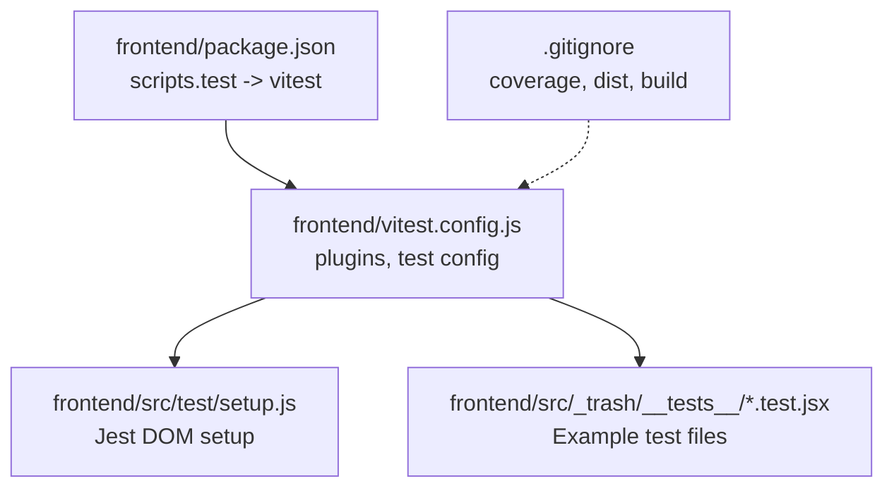
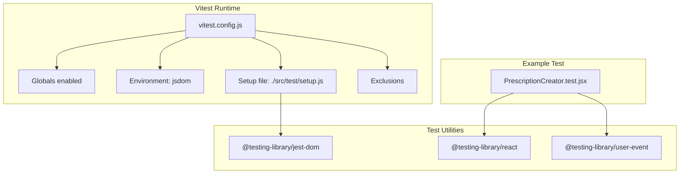
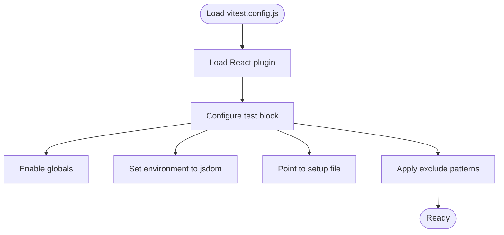
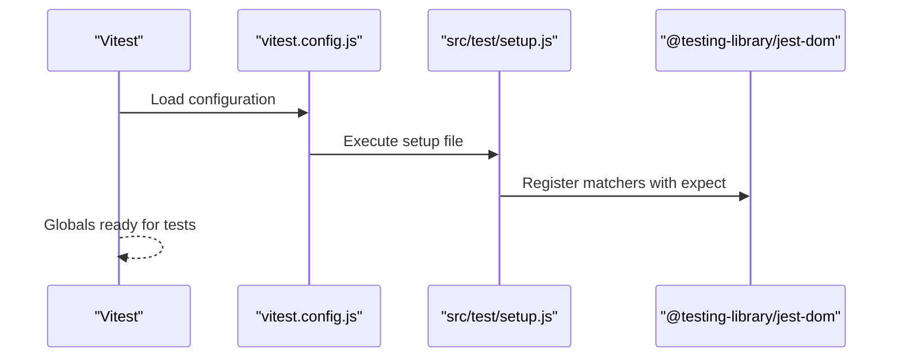
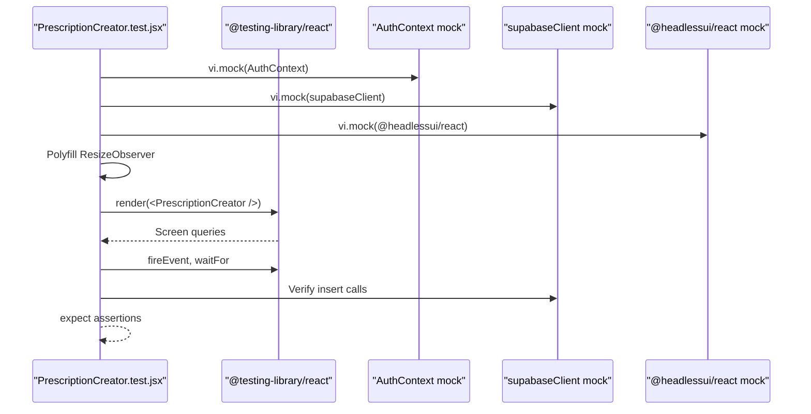
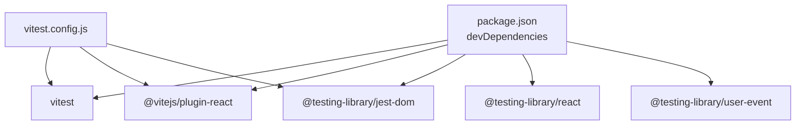

# Test Configuration

<cite>
**Referenced Files in This Document**
- [vitest.config.js](file://frontend/vitest.config.js)
- [package.json](file://frontend/package.json)
- [setup.js](file://frontend/src/test/setup.js)
- [PrescriptionCreator.test.jsx](file://frontend/src/_trash/__tests__/PrescriptionCreator.test.jsx)
- [TEST_REPORT.md](file://frontend/TEST_REPORT.md)
- [.gitignore](file://frontend/.gitignore)
- [test-report.txt](file://frontend/test-report.txt)
</cite>

## Table of Contents
1. [Introduction](#introduction)
2. [Project Structure](#project-structure)
3. [Core Components](#core-components)
4. [Architecture Overview](#architecture-overview)
5. [Detailed Component Analysis](#detailed-component-analysis)
6. [Dependency Analysis](#dependency-analysis)
7. [Performance Considerations](#performance-considerations)
8. [Troubleshooting Guide](#troubleshooting-guide)
9. [Conclusion](#conclusion)
10. [Appendices](#appendices)

## Introduction
This document explains MedVita’s testing configuration and setup for the frontend. It covers the Vitest configuration, test environment initialization, Jest DOM integration, test globals, runner settings, exclusion patterns, and how to organize and discover tests. It also provides guidance on extending the configuration for new testing scenarios and integrating with CI/CD.

## Project Structure
The testing setup is primarily defined in the Vitest configuration file and a small initialization script. Tests are currently located under a dedicated trash directory and are excluded from the default test discovery pattern. The package scripts define the test command, while the repository’s ignore file defines coverage output and build artifacts.

**Diagram sources**
- [package.json](file://frontend/package.json#L6-L11)
- [vitest.config.js](file://frontend/vitest.config.js#L1-L18)
- [setup.js](file://frontend/src/test/setup.js#L1-L2)
- [PrescriptionCreator.test.jsx](file://frontend/src/_trash/__tests__/PrescriptionCreator.test.jsx#L1-L114)
- [.gitignore](file://frontend/.gitignore#L6-L11)

**Section sources**
- [vitest.config.js](file://frontend/vitest.config.js#L1-L18)
- [package.json](file://frontend/package.json#L6-L11)
- [setup.js](file://frontend/src/test/setup.js#L1-L2)
- [.gitignore](file://frontend/.gitignore#L6-L11)

## Core Components
- Vitest configuration: Defines plugin integration, test environment, globals, setup file, and exclusion patterns.
- Test setup: Initializes Jest DOM matchers globally for all tests.
- Example test: Demonstrates mocking, user events, and assertions using Testing Library APIs.
- Scripts and ignore: Provides the test command and standard ignores for coverage and build outputs.

Key configuration highlights:
- Environment: jsdom
- Globals enabled
- Setup file path configured
- Exclusions for node_modules, dist, build, _trash, and *.config.*

**Section sources**
- [vitest.config.js](file://frontend/vitest.config.js#L4-L17)
- [setup.js](file://frontend/src/test/setup.js#L1-L2)
- [package.json](file://frontend/package.json#L6-L11)
- [PrescriptionCreator.test.jsx](file://frontend/src/_trash/__tests__/PrescriptionCreator.test.jsx#L1-L114)

## Architecture Overview
The testing architecture centers on Vitest with JSDOM as the test environment and Jest DOM matchers loaded via a setup file. The configuration integrates the React plugin and applies a consistent exclusion policy to keep test runs focused and fast.

**Diagram sources**
- [vitest.config.js](file://frontend/vitest.config.js#L4-L17)
- [setup.js](file://frontend/src/test/setup.js#L1-L2)
- [PrescriptionCreator.test.jsx](file://frontend/src/_trash/__tests__/PrescriptionCreator.test.jsx#L1-L114)
- [package.json](file://frontend/package.json#L35-L37)

## Detailed Component Analysis

### Vitest Configuration
- Plugins: React plugin is included to support JSX and React component testing.
- Test settings:
  - globals: true enables expect and other matchers without importing in each file.
  - environment: jsdom simulates a browser DOM for React components.
  - setupFiles: points to the Jest DOM initialization script.
  - exclude: standard paths and the _trash directory to avoid accidental test discovery.

**Diagram sources**
- [vitest.config.js](file://frontend/vitest.config.js#L4-L17)

**Section sources**
- [vitest.config.js](file://frontend/vitest.config.js#L4-L17)

### Test Environment Initialization
- The setup file imports the Jest DOM matchers, which extends Vitest’s expect with semantic DOM assertions.
- This ensures all tests have access to DOM-centric matchers out of the box.

**Diagram sources**
- [vitest.config.js](file://frontend/vitest.config.js#L9-L9)
- [setup.js](file://frontend/src/test/setup.js#L1-L2)

**Section sources**
- [setup.js](file://frontend/src/test/setup.js#L1-L2)

### Example Test: PrescriptionCreator
This example demonstrates:
- Mocking external modules and contexts.
- Rendering components with Testing Library.
- Simulating user interactions (events).
- Assertions on rendered content and mocked calls.
- Polyfills for third-party components (e.g., ResizeObserver).

**Diagram sources**
- [PrescriptionCreator.test.jsx](file://frontend/src/_trash/__tests__/PrescriptionCreator.test.jsx#L8-L42)
- [PrescriptionCreator.test.jsx](file://frontend/src/_trash/__tests__/PrescriptionCreator.test.jsx#L44-L112)

**Section sources**
- [PrescriptionCreator.test.jsx](file://frontend/src/_trash/__tests__/PrescriptionCreator.test.jsx#L1-L114)

### Test Discovery and Naming Conventions
- Default include pattern: files matching **/*.{test,spec}.?(c|m)[jt]s?(x)
- Current exclude patterns prevent discovery of files under node_modules, dist, build, _trash, and *.config.*
- The existing test is placed under _trash/__tests__, which is excluded by configuration, so it is not discovered by default.

**Section sources**
- [vitest.config.js](file://frontend/vitest.config.js#L10-L16)
- [test-report.txt](file://frontend/test-report.txt#L10-L11)

## Dependency Analysis
Vitest depends on several dev-time packages for React and Testing Library integrations. The configuration relies on the React plugin and the setup file to enable DOM matchers.

**Diagram sources**
- [package.json](file://frontend/package.json#L33-L47)
- [vitest.config.js](file://frontend/vitest.config.js#L1-L2)

**Section sources**
- [package.json](file://frontend/package.json#L33-L47)
- [vitest.config.js](file://frontend/vitest.config.js#L1-L2)

## Performance Considerations
- Keep tests isolated and fast by mocking expensive dependencies (e.g., network clients).
- Prefer shallow rendering for unit tests and only mount full trees when necessary.
- Use minimal fixtures and avoid unnecessary re-renders.
- Exclude large or irrelevant directories from test discovery to reduce scan time.

## Troubleshooting Guide
Common issues and resolutions:
- No test files found: The current configuration excludes the _trash directory, which contains the example test. To run tests, move them outside the excluded paths or adjust the exclude list accordingly.
- Jest DOM matchers not available: Ensure the setup file is correctly referenced in the configuration and that @testing-library/jest-dom is installed.
- Mocks not applied: Confirm that mocks are hoisted and executed before imports in the test file.
- Coverage output: Coverage is ignored by .gitignore; if you need coverage reports, configure Vitest coverage options and ensure the output directory is not ignored.

**Section sources**
- [vitest.config.js](file://frontend/vitest.config.js#L10-L16)
- [setup.js](file://frontend/src/test/setup.js#L1-L2)
- [TEST_REPORT.md](file://frontend/TEST_REPORT.md#L14-L22)
- [.gitignore](file://frontend/.gitignore#L6-L7)

## Conclusion
MedVita’s testing setup is centered on Vitest with JSDOM and Jest DOM matchers. The configuration is straightforward and extensible. Tests are currently excluded due to placement under _trash, but can be easily enabled by adjusting the configuration or moving test files. The example test illustrates effective mocking and user interaction patterns. Extending the configuration for new scenarios involves adding plugins, adjusting environment settings, and refining discovery patterns.

## Appendices

### A. Script Configuration
- The test script invokes Vitest to run tests in non-watch mode by default.

**Section sources**
- [package.json](file://frontend/package.json#L10-L10)

### B. Watch Mode and Reporting
- Watch mode: Not configured in scripts; can be added by extending the test script to pass watch-related flags to Vitest.
- Reporting: Not configured in the repository; can be added via Vitest configuration options for reporters and output formats.

**Section sources**
- [package.json](file://frontend/package.json#L6-L11)
- [vitest.config.js](file://frontend/vitest.config.js#L6-L17)

### C. CI/CD Integration
- Use the test script in CI to run tests during pipeline execution.
- Ensure the CI environment mirrors the local setup (Node.js, package installation).
- Consider adding coverage thresholds and reporter outputs in CI jobs.

**Section sources**
- [package.json](file://frontend/package.json#L6-L11)

### D. Test Organization and Aliases
- Organization: Place tests adjacent to the source files they test or in a dedicated test directory following the repository’s structure.
- Naming: Follow the established convention of placing tests in files ending with .test.jsx or .spec.jsx.
- Aliases: No alias configuration is present in the repository; if needed, Vitest supports path aliases via its configuration.

**Section sources**
- [vitest.config.js](file://frontend/vitest.config.js#L10-L16)
- [PrescriptionCreator.test.jsx](file://frontend/src/_trash/__tests__/PrescriptionCreator.test.jsx#L1-L114)