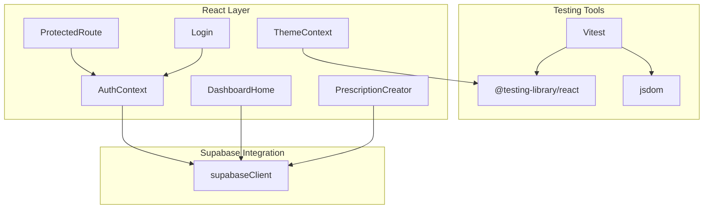
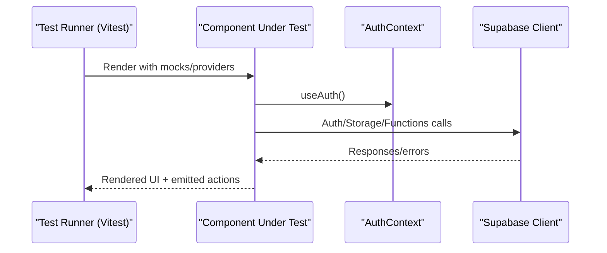
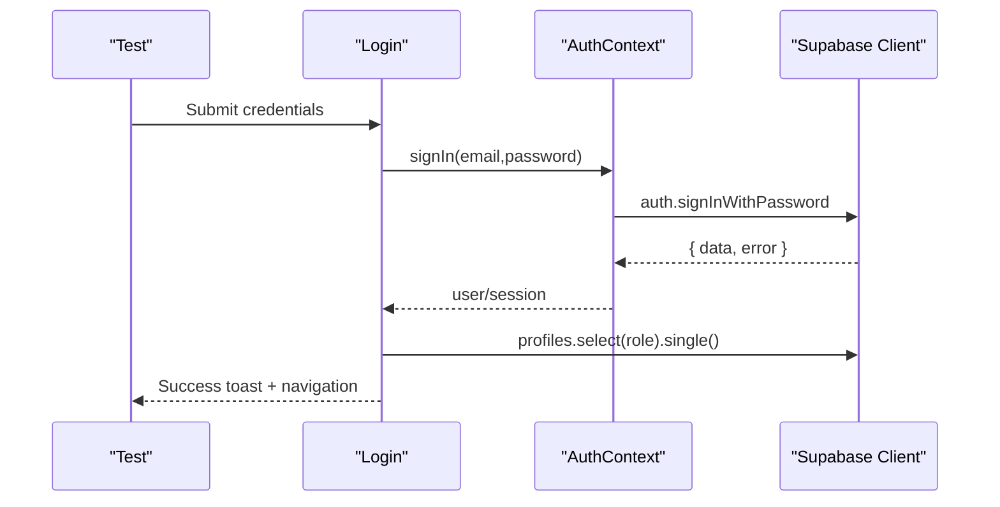
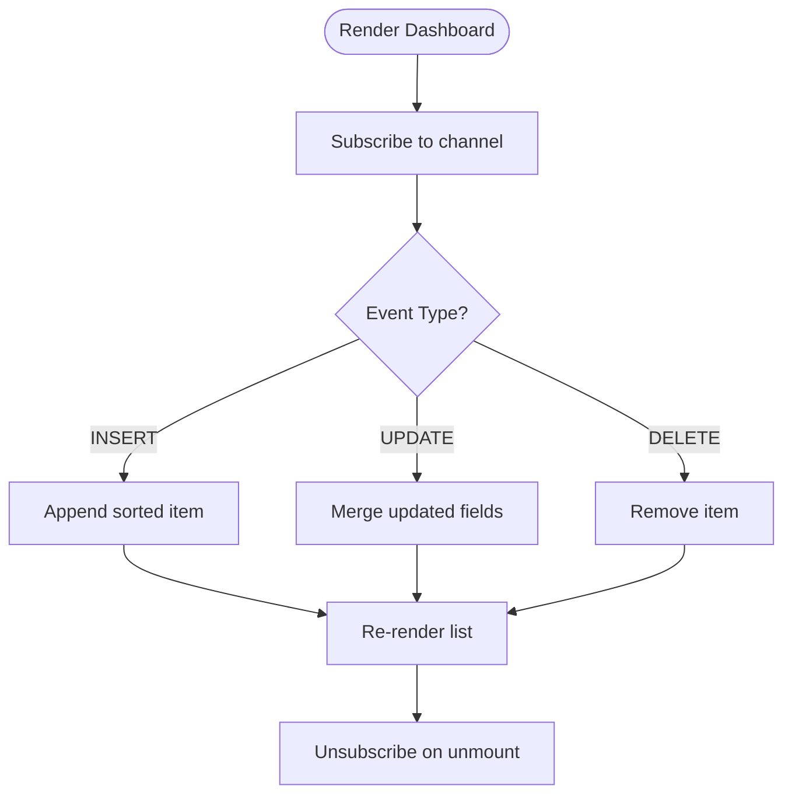
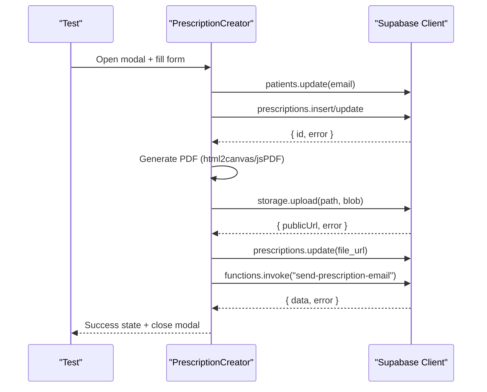
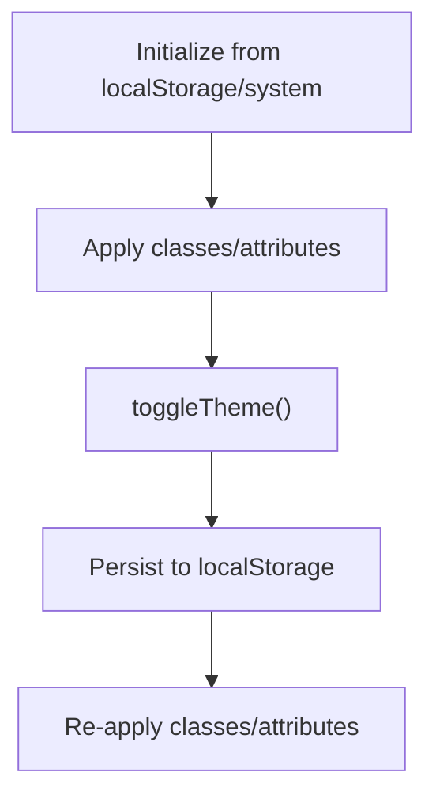
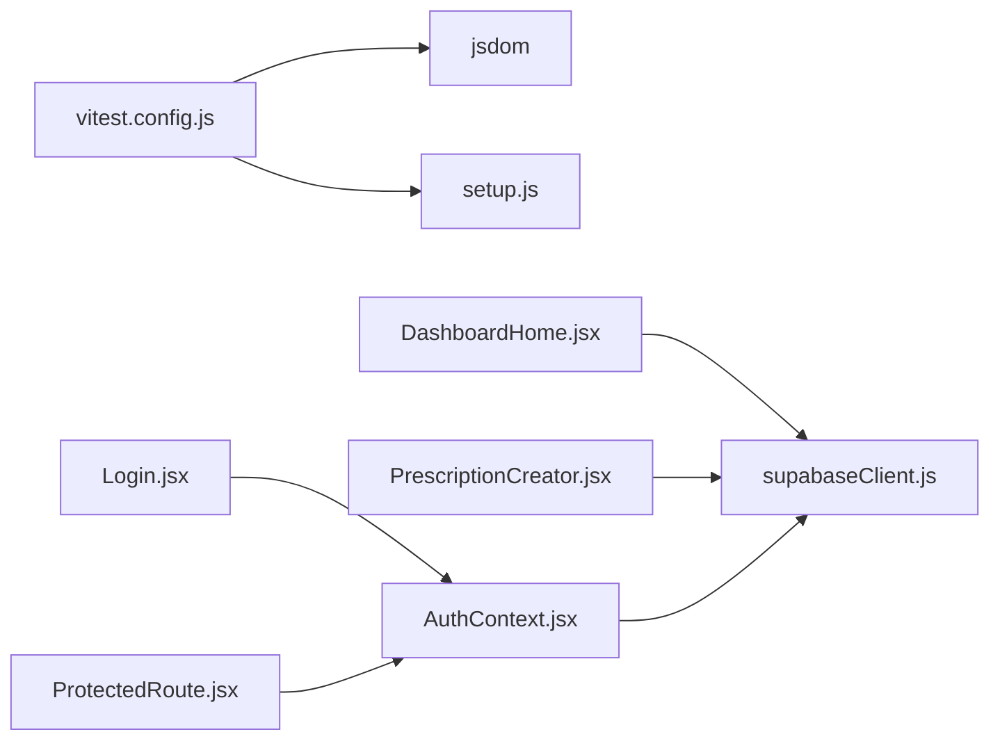

# Testing Strategy

<cite>
**Referenced Files in This Document**
- [vitest.config.js](file://frontend/vitest.config.js)
- [package.json](file://frontend/package.json)
- [setup.js](file://frontend/src/test/setup.js)
- [supabaseClient.js](file://frontend/src/lib/supabaseClient.js)
- [AuthContext.jsx](file://frontend/src/context/AuthContext.jsx)
- [ThemeContext.jsx](file://frontend/src/context/ThemeContext.jsx)
- [ProtectedRoute.jsx](file://frontend/src/components/ProtectedRoute.jsx)
- [Login.jsx](file://frontend/src/pages/Login.jsx)
- [DashboardHome.jsx](file://frontend/src/pages/DashboardHome.jsx)
- [PrescriptionCreator.jsx](file://frontend/src/components/PrescriptionCreator.jsx)
- [PrescriptionCreator.test.jsx](file://frontend/src/_trash/__tests__/PrescriptionCreator.test.jsx)
- [TEST_REPORT.md](file://frontend/TEST_REPORT.md)
</cite>

## Table of Contents
1. [Introduction](#introduction)
2. [Project Structure](#project-structure)
3. [Core Components](#core-components)
4. [Architecture Overview](#architecture-overview)
5. [Detailed Component Analysis](#detailed-component-analysis)
6. [Dependency Analysis](#dependency-analysis)
7. [Performance Considerations](#performance-considerations)
8. [Troubleshooting Guide](#troubleshooting-guide)
9. [Conclusion](#conclusion)
10. [Appendices](#appendices)

## Introduction
This document defines MedVita’s comprehensive testing strategy for quality assurance. It covers unit testing with Vitest, component testing patterns, test configuration, mock strategies, and environment setup. It also documents testing approaches for React components, custom hooks, context providers, and API integrations with Supabase. Integration testing patterns for authentication flows and real-time data synchronization are included, along with best practices, coverage expectations, CI patterns, critical healthcare workflow testing, error and edge-case handling, debugging techniques, and quality metrics tracking.

## Project Structure
The frontend testing stack is organized around Vitest as the test runner, JSDOM as the DOM environment, and Testing Library for React component assertions. Supabase client integration is centralized and used across components and pages. Context providers encapsulate authentication and theming state, enabling focused testing of isolated units and cross-cutting concerns.

**Diagram sources**
- [vitest.config.js](file://frontend/vitest.config.js#L1-L19)
- [setup.js](file://frontend/src/test/setup.js#L1-L2)
- [AuthContext.jsx](file://frontend/src/context/AuthContext.jsx#L1-L108)
- [ThemeContext.jsx](file://frontend/src/context/ThemeContext.jsx#L1-L79)
- [ProtectedRoute.jsx](file://frontend/src/components/ProtectedRoute.jsx#L1-L108)
- [Login.jsx](file://frontend/src/pages/Login.jsx#L1-L204)
- [DashboardHome.jsx](file://frontend/src/pages/DashboardHome.jsx#L1-L487)
- [PrescriptionCreator.jsx](file://frontend/src/components/PrescriptionCreator.jsx#L1-L303)
- [supabaseClient.js](file://frontend/src/lib/supabaseClient.js#L1-L11)

**Section sources**
- [vitest.config.js](file://frontend/vitest.config.js#L1-L19)
- [package.json](file://frontend/package.json#L1-L50)
- [setup.js](file://frontend/src/test/setup.js#L1-L2)

## Core Components
- Vitest configuration enables global APIs, JSDOM environment, and setup file injection. It excludes trash directories and configuration files from test discovery.
- Testing Library setup injects jest-dom matchers globally for DOM assertions.
- Supabase client reads environment variables and warns if keys are missing, centralizing integration points for authentication and storage.
- AuthContext manages session state, profile fetching, and real-time auth events, exposing a simple hook for components.
- ThemeContext persists UI preferences and applies them to the document element.
- ProtectedRoute enforces role-based access control and redirects for unauthorized users.
- Login orchestrates authentication, profile role determination, and navigation.
- DashboardHome integrates Supabase queries, real-time channels, and state updates for live queues and appointments.
- PrescriptionCreator coordinates local state, PDF generation, Supabase storage uploads, database writes, and edge function invocations.

**Section sources**
- [vitest.config.js](file://frontend/vitest.config.js#L4-L18)
- [setup.js](file://frontend/src/test/setup.js#L1-L2)
- [supabaseClient.js](file://frontend/src/lib/supabaseClient.js#L1-L11)
- [AuthContext.jsx](file://frontend/src/context/AuthContext.jsx#L1-L108)
- [ThemeContext.jsx](file://frontend/src/context/ThemeContext.jsx#L1-L79)
- [ProtectedRoute.jsx](file://frontend/src/components/ProtectedRoute.jsx#L1-L108)
- [Login.jsx](file://frontend/src/pages/Login.jsx#L1-L204)
- [DashboardHome.jsx](file://frontend/src/pages/DashboardHome.jsx#L1-L487)
- [PrescriptionCreator.jsx](file://frontend/src/components/PrescriptionCreator.jsx#L1-L303)

## Architecture Overview
The testing architecture aligns with the runtime architecture: components depend on contexts and the Supabase client. Tests isolate these dependencies via mocks and controlled providers to validate behavior deterministically.

**Diagram sources**
- [vitest.config.js](file://frontend/vitest.config.js#L6-L16)
- [AuthContext.jsx](file://frontend/src/context/AuthContext.jsx#L92-L100)
- [supabaseClient.js](file://frontend/src/lib/supabaseClient.js#L1-L11)

## Detailed Component Analysis

### Authentication and Authorization Testing
- AuthContext exposes sign-in/sign-out, session management, and profile fetching. Tests should:
  - Mock Supabase auth responses and real-time subscriptions.
  - Simulate session retrieval, auth state changes, and profile loading.
  - Verify loading states and error handling paths.
- ProtectedRoute validates role-based access and redirects. Tests should:
  - Simulate loading, unauthenticated, and unauthorized states.
  - Assert navigation to login or unauthorized page based on profile role.
- Login performs authentication, profile role lookup, and navigation. Tests should:
  - Mock sign-in responses and profile fetches.
  - Validate toast messages for various error conditions.
  - Confirm deterministic navigation based on role.

**Diagram sources**
- [Login.jsx](file://frontend/src/pages/Login.jsx#L20-L75)
- [AuthContext.jsx](file://frontend/src/context/AuthContext.jsx#L84-L90)
- [supabaseClient.js](file://frontend/src/lib/supabaseClient.js#L1-L11)

**Section sources**
- [AuthContext.jsx](file://frontend/src/context/AuthContext.jsx#L1-L108)
- [ProtectedRoute.jsx](file://frontend/src/components/ProtectedRoute.jsx#L53-L106)
- [Login.jsx](file://frontend/src/pages/Login.jsx#L1-L204)

### Real-Time Data Synchronization Testing
- DashboardHome subscribes to Supabase real-time channels for live queue updates. Tests should:
  - Mock Supabase channel creation and event emissions.
  - Validate insert/update/delete handling and UI updates.
  - Ensure cleanup of subscriptions on unmount.

**Diagram sources**
- [DashboardHome.jsx](file://frontend/src/pages/DashboardHome.jsx#L41-L76)

**Section sources**
- [DashboardHome.jsx](file://frontend/src/pages/DashboardHome.jsx#L1-L487)

### Prescription Workflow Testing
- PrescriptionCreator composes diagnosis and Rx text, updates patient email, saves to DB, generates/upload PDF, updates record, and emails via edge function. Tests should:
  - Mock storage upload and public URL resolution.
  - Mock DB insert/update and edge function invocation.
  - Validate status transitions and success flow.
  - Validate error handling paths and user feedback.

**Diagram sources**
- [PrescriptionCreator.jsx](file://frontend/src/components/PrescriptionCreator.jsx#L100-L188)
- [supabaseClient.js](file://frontend/src/lib/supabaseClient.js#L1-L11)

**Section sources**
- [PrescriptionCreator.jsx](file://frontend/src/components/PrescriptionCreator.jsx#L1-L303)

### Theme Context Testing
- ThemeContext persists theme, density, and app style in localStorage and applies them to the document element. Tests should:
  - Verify initial values from localStorage/system preference.
  - Simulate toggling theme and updating attributes.
  - Confirm localStorage persistence.

**Diagram sources**
- [ThemeContext.jsx](file://frontend/src/context/ThemeContext.jsx#L5-L51)

**Section sources**
- [ThemeContext.jsx](file://frontend/src/context/ThemeContext.jsx#L1-L79)

### Component Testing Patterns
- Use Testing Library to render components under test with minimal providers.
- Mock external dependencies (Supabase, third-party UI libraries) to isolate component logic.
- Prefer asserting user-visible outcomes (DOM nodes, accessibility roles, events) over internal state.
- Use waitFor for asynchronous operations and real-time events.

**Section sources**
- [PrescriptionCreator.test.jsx](file://frontend/src/_trash/__tests__/PrescriptionCreator.test.jsx#L1-L114)

## Dependency Analysis
- Vitest depends on React plugin and JSDOM environment; setup injects jest-dom.
- Components depend on contexts and the Supabase client.
- AuthContext depends on Supabase auth and real-time.
- ProtectedRoute depends on AuthContext and routing.
- DashboardHome depends on Supabase queries and real-time channels.
- PrescriptionCreator depends on Supabase storage, database, and edge functions.

**Diagram sources**
- [vitest.config.js](file://frontend/vitest.config.js#L1-L19)
- [setup.js](file://frontend/src/test/setup.js#L1-L2)
- [Login.jsx](file://frontend/src/pages/Login.jsx#L1-L204)
- [ProtectedRoute.jsx](file://frontend/src/components/ProtectedRoute.jsx#L1-L108)
- [DashboardHome.jsx](file://frontend/src/pages/DashboardHome.jsx#L1-L487)
- [PrescriptionCreator.jsx](file://frontend/src/components/PrescriptionCreator.jsx#L1-L303)
- [AuthContext.jsx](file://frontend/src/context/AuthContext.jsx#L1-L108)
- [supabaseClient.js](file://frontend/src/lib/supabaseClient.js#L1-L11)

**Section sources**
- [vitest.config.js](file://frontend/vitest.config.js#L1-L19)
- [package.json](file://frontend/package.json#L33-L47)

## Performance Considerations
- Keep tests fast by minimizing real network calls and using targeted mocks.
- Use stable refs and memoized callbacks to avoid unnecessary re-renders in tests.
- Prefer small, focused tests over monolithic end-to-end tests for frequent CI runs.
- Consider test isolation and teardown to prevent flakiness.

## Troubleshooting Guide
- Missing environment variables for Supabase cause warnings during client initialization. Ensure environment variables are present in the test environment.
- If tests fail due to unresolved imports in excluded directories, verify exclusion patterns in the test configuration.
- For UI library issues (e.g., Headless UI), polyfill missing browser APIs (e.g., ResizeObserver) in the test setup.
- When debugging async flows, use waitFor and log emitted events to trace real-time updates.

**Section sources**
- [supabaseClient.js](file://frontend/src/lib/supabaseClient.js#L6-L8)
- [vitest.config.js](file://frontend/vitest.config.js#L10-L16)
- [PrescriptionCreator.test.jsx](file://frontend/src/_trash/__tests__/PrescriptionCreator.test.jsx#L35-L42)

## Conclusion
MedVita’s testing strategy leverages Vitest and Testing Library to validate React components, contexts, and Supabase integrations. By mocking external dependencies, isolating component logic, and validating user-visible outcomes, the suite ensures reliability across authentication, real-time data, and critical healthcare workflows. Continuous improvement should focus on expanding unit and integration tests, refining coverage, and integrating robust CI patterns.

## Appendices

### Test Configuration and Environment
- Vitest configuration:
  - Enables globals, sets jsdom environment, and loads setup file.
  - Excludes node_modules, dist, build, trash, and config files.
- Setup file:
  - Injects jest-dom matchers globally for assertions.
- Package scripts:
  - Provides test command invoking Vitest.

**Section sources**
- [vitest.config.js](file://frontend/vitest.config.js#L4-L18)
- [setup.js](file://frontend/src/test/setup.js#L1-L2)
- [package.json](file://frontend/package.json#L6-L12)

### Mock Strategies
- Supabase client:
  - Mock storage.from(), storage.upload(), storage.getPublicUrl(), from().insert()/update(), and functions.invoke().
- Third-party UI:
  - Mock composite components (e.g., Headless UI Dialog) to avoid DOM polyfills.
- Browser APIs:
  - Provide polyfills for ResizeObserver and other missing APIs.

**Section sources**
- [PrescriptionCreator.test.jsx](file://frontend/src/_trash/__tests__/PrescriptionCreator.test.jsx#L9-L32)
- [supabaseClient.js](file://frontend/src/lib/supabaseClient.js#L1-L11)

### Testing Best Practices
- Prefer user-centric assertions over implementation details.
- Use beforeEach to reset mocks and state.
- Validate error paths and edge cases (missing profile, invalid credentials, rate limits).
- Maintain deterministic tests by controlling time-dependent operations.

### Coverage Requirements
- Target high coverage for critical paths:
  - Authentication flows (login, sign-up, sign-out).
  - Real-time updates (queue, appointments).
  - Prescription workflow (save, PDF generation, email).
  - Role-based access control.
- Track coverage via Vitest and enforce minimum thresholds in CI.

### Continuous Integration Patterns
- Run tests on pull requests and main branch.
- Fail builds on test failures or coverage drops.
- Integrate linting and build checks alongside tests.

### Critical Healthcare Workflows
- Authentication:
  - Validate error messages for invalid credentials, unconfirmed emails, and throttling.
  - Ensure profile role determines navigation.
- Real-time:
  - Validate insert/update/delete ordering and UI responsiveness.
- Prescription:
  - Validate diagnosis/Rx composition, PDF generation, storage upload, DB update, and email dispatch.

### Debugging Test Failures
- Use console logs strategically within tests to trace async operations.
- Inspect emitted events and mock calls to verify expected sequences.
- Narrow failing tests to minimal reproducible cases.

### Testing Report Analysis and Metrics
- Review test status, configuration fixes, and lint/build improvements.
- Track trends in test stability, coverage, and performance regressions.
- Use reports to guide prioritization of test additions and refactors.

**Section sources**
- [TEST_REPORT.md](file://frontend/TEST_REPORT.md#L1-L186)