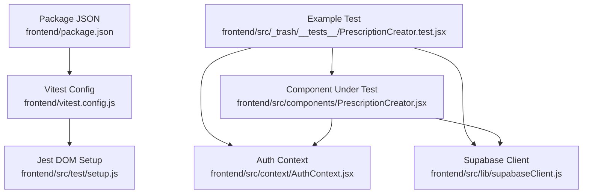
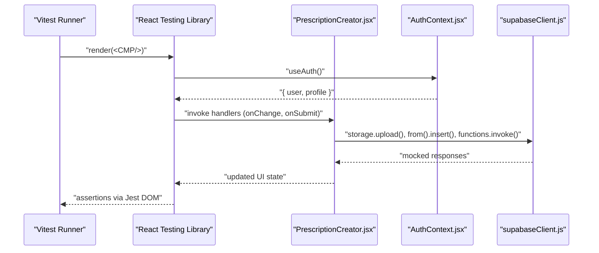
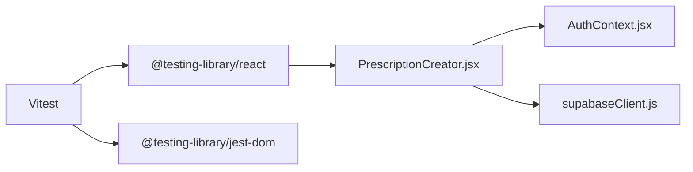

# Unit Testing

<cite>
**Referenced Files in This Document**
- [vitest.config.js](file://frontend/vitest.config.js)
- [package.json](file://frontend/package.json)
- [setup.js](file://frontend/src/test/setup.js)
- [PrescriptionCreator.test.jsx](file://frontend/src/_trash/__tests__/PrescriptionCreator.test.jsx)
- [PrescriptionCreator.jsx](file://frontend/src/components/PrescriptionCreator.jsx)
- [AuthContext.jsx](file://frontend/src/context/AuthContext.jsx)
- [supabaseClient.js](file://frontend/src/lib/supabaseClient.js)
- [Input.jsx](file://frontend/src/components/ui/Input.jsx)
- [Button.jsx](file://frontend/src/components/ui/Button.jsx)
</cite>

## Table of Contents
1. [Introduction](#introduction)
2. [Project Structure](#project-structure)
3. [Core Components](#core-components)
4. [Architecture Overview](#architecture-overview)
5. [Detailed Component Analysis](#detailed-component-analysis)
6. [Dependency Analysis](#dependency-analysis)
7. [Performance Considerations](#performance-considerations)
8. [Troubleshooting Guide](#troubleshooting-guide)
9. [Conclusion](#conclusion)

## Introduction
This document explains how unit testing is implemented in MedVita using Vitest and React Testing Library. It covers the Vitest configuration, Jest DOM setup, and testing utilities. It also documents testing patterns for React functional components, mocks for Supabase client and authentication contexts, and guidance for testing async operations, lifecycle, forms, and state management. Practical examples are provided via file references to real test and component files in the repository.

## Project Structure
Testing-related configuration and utilities are centralized under the frontend directory:
- Vitest configuration defines the test environment, plugin, and setup file.
- A Jest DOM setup file initializes DOM matchers for assertions.
- Tests live alongside the components they exercise, with a dedicated trash folder containing an example test.
- Components under test include UI primitives and domain components such as the PrescriptionCreator.

**Diagram sources**
- [vitest.config.js](file://frontend/vitest.config.js#L1-L19)
- [package.json](file://frontend/package.json#L1-L50)
- [setup.js](file://frontend/src/test/setup.js#L1-L2)
- [PrescriptionCreator.test.jsx](file://frontend/src/_trash/__tests__/PrescriptionCreator.test.jsx#L1-L114)
- [PrescriptionCreator.jsx](file://frontend/src/components/PrescriptionCreator.jsx#L1-L303)
- [AuthContext.jsx](file://frontend/src/context/AuthContext.jsx#L1-L108)
- [supabaseClient.js](file://frontend/src/lib/supabaseClient.js#L1-L11)

**Section sources**
- [vitest.config.js](file://frontend/vitest.config.js#L1-L19)
- [package.json](file://frontend/package.json#L1-L50)
- [setup.js](file://frontend/src/test/setup.js#L1-L2)
- [PrescriptionCreator.test.jsx](file://frontend/src/_trash/__tests__/PrescriptionCreator.test.jsx#L1-L114)

## Core Components
- Vitest configuration enables jsdom environment, global APIs, and loads the Jest DOM setup file. It excludes typical build and trash directories from test discovery.
- Jest DOM setup registers DOM matchers (e.g., toHaveTextContent,toBeInTheDocument) for readable assertions.
- Example test demonstrates component rendering, user interactions, async submission flow, and mocking of external dependencies.

Key capabilities evidenced by the configuration and example:
- Global test APIs and jsdom environment for DOM simulation.
- Jest DOM matchers for accessibility and DOM assertions.
- Mocking of third-party libraries and internal modules for isolated testing.

**Section sources**
- [vitest.config.js](file://frontend/vitest.config.js#L6-L17)
- [setup.js](file://frontend/src/test/setup.js#L1-L2)
- [PrescriptionCreator.test.jsx](file://frontend/src/_trash/__tests__/PrescriptionCreator.test.jsx#L1-L114)

## Architecture Overview
The testing architecture centers on Vitest orchestrating jsdom with React Testing Library. Tests import components and render them in a DOM-like environment, then assert behavior using Jest DOM matchers. External dependencies are mocked to isolate the unit under test.

**Diagram sources**
- [vitest.config.js](file://frontend/vitest.config.js#L6-L17)
- [PrescriptionCreator.jsx](file://frontend/src/components/PrescriptionCreator.jsx#L1-L303)
- [AuthContext.jsx](file://frontend/src/context/AuthContext.jsx#L1-L108)
- [supabaseClient.js](file://frontend/src/lib/supabaseClient.js#L1-L11)

## Detailed Component Analysis

### Vitest and Jest DOM Setup
- Vitest configuration sets environment to jsdom, enables globals, and loads a setup file for Jest DOM matchers.
- The setup file imports @testing-library/jest-dom to register matchers such as toHaveTextContent and toBeInTheDocument.
- Scripts include a test command that invokes Vitest.

Practical implications:
- Tests can use DOM-centric assertions without manual polyfills.
- Global test APIs (describe, it, expect, vi, beforeEach) are available implicitly.

**Section sources**
- [vitest.config.js](file://frontend/vitest.config.js#L6-L17)
- [setup.js](file://frontend/src/test/setup.js#L1-L2)
- [package.json](file://frontend/package.json#L6-L11)

### Example Test: PrescriptionCreator
The example test validates:
- Rendering behavior when the dialog is open.
- Form field presence and labeling.
- Interaction with diagnosis and prescription inputs.
- Async submission flow, including mocking Supabase operations and verifying payloads.
- Mocking of Headless UI Dialog components and a ResizeObserver polyfill for compatibility.

Mocking strategies demonstrated:
- Mocking AuthContext to supply a deterministic user and profile.
- Deep mocking of supabaseClient to stub storage, database, and edge function invocations.
- Mocking Headless UI Dialog components to avoid rendering complexities in jsdom.
- Polyfilling ResizeObserver to satisfy Headless UI requirements.

Async and lifecycle coverage:
- Simulating user input and click events.
- Waiting for asynchronous operations to settle and asserting final state.
- Verifying component state transitions during save, generate, upload, and email steps.

Form validation and state management:
- Asserting required fields and placeholder presence.
- Verifying that combined diagnosis and Rx text is formatted as expected.
- Confirming success state and cleanup after submission.

**Section sources**
- [PrescriptionCreator.test.jsx](file://frontend/src/_trash/__tests__/PrescriptionCreator.test.jsx#L1-L114)
- [PrescriptionCreator.jsx](file://frontend/src/components/PrescriptionCreator.jsx#L100-L188)
- [AuthContext.jsx](file://frontend/src/context/AuthContext.jsx#L92-L100)
- [supabaseClient.js](file://frontend/src/lib/supabaseClient.js#L1-L11)

### Component Under Test: PrescriptionCreator
Key behaviors tested in isolation:
- Uses AuthContext to access user and profile data.
- Manages local state for diagnosis, prescription text, patient email, file uploads, and status.
- Generates a PDF using html2canvas and jsPDF, uploads to Supabase Storage, and updates the record.
- Invokes a Supabase Edge Function to send an email with the generated PDF.
- Handles success and error states, disabling controls during long-running operations.

Testing implications:
- Mock Supabase client methods to avoid network calls.
- Provide a minimal AuthContext mock to supply user and profile.
- Verify side effects (uploads, inserts, function invocations) via mock assertions.

**Section sources**
- [PrescriptionCreator.jsx](file://frontend/src/components/PrescriptionCreator.jsx#L1-L303)
- [AuthContext.jsx](file://frontend/src/context/AuthContext.jsx#L1-L108)
- [supabaseClient.js](file://frontend/src/lib/supabaseClient.js#L1-L11)

### UI Primitives: Input and Button
These components are frequently used in forms and should be covered by unit tests:
- Input supports label, icon, and error messaging; error prop influences styling.
- Button supports variants, sizes, and loading state; disabled state reflects isLoading.

Testing patterns:
- Render Input and Button with various props and assert applied classes and attributes.
- For Input, assert error styling and message visibility.
- For Button, assert disabled state and loader rendering when isLoading is true.

**Section sources**
- [Input.jsx](file://frontend/src/components/ui/Input.jsx#L1-L63)
- [Button.jsx](file://frontend/src/components/ui/Button.jsx#L1-L51)

### Authentication Context: AuthProvider and useAuth
Behavior to test:
- Initial loading state and conditional rendering until session is resolved.
- Listening to auth state changes and updating user/profile accordingly.
- Sign-up, sign-in, and sign-out flows by invoking Supabase auth methods.

Mocking strategy:
- Wrap tests with a mock AuthProvider or mock the useAuth hook to return controlled values.
- Stub Supabase auth methods to simulate session retrieval and state change events.

**Section sources**
- [AuthContext.jsx](file://frontend/src/context/AuthContext.jsx#L1-L108)
- [supabaseClient.js](file://frontend/src/lib/supabaseClient.js#L1-L11)

### Supabase Client: supabaseClient
Behavior to test:
- Client creation with environment variables.
- Fallback warnings when environment variables are missing.

Mocking strategy:
- Replace the module export with a mock object that exposes storage, from, and functions APIs.
- Ensure all methods return predictable promises for testing success and error branches.

**Section sources**
- [supabaseClient.js](file://frontend/src/lib/supabaseClient.js#L1-L11)

## Dependency Analysis
The example test demonstrates key dependencies and their interactions:
- The component depends on AuthContext and Supabase client.
- Tests depend on React Testing Library for rendering and user events, and Vitest for mocking and assertions.

**Diagram sources**
- [PrescriptionCreator.jsx](file://frontend/src/components/PrescriptionCreator.jsx#L1-L303)
- [AuthContext.jsx](file://frontend/src/context/AuthContext.jsx#L1-L108)
- [supabaseClient.js](file://frontend/src/lib/supabaseClient.js#L1-L11)
- [PrescriptionCreator.test.jsx](file://frontend/src/_trash/__tests__/PrescriptionCreator.test.jsx#L1-L114)
- [vitest.config.js](file://frontend/vitest.config.js#L6-L17)
- [setup.js](file://frontend/src/test/setup.js#L1-L2)

**Section sources**
- [PrescriptionCreator.jsx](file://frontend/src/components/PrescriptionCreator.jsx#L1-L303)
- [AuthContext.jsx](file://frontend/src/context/AuthContext.jsx#L1-L108)
- [supabaseClient.js](file://frontend/src/lib/supabaseClient.js#L1-L11)
- [PrescriptionCreator.test.jsx](file://frontend/src/_trash/__tests__/PrescriptionCreator.test.jsx#L1-L114)
- [vitest.config.js](file://frontend/vitest.config.js#L6-L17)
- [setup.js](file://frontend/src/test/setup.js#L1-L2)

## Performance Considerations
- Prefer shallow rendering for leaf components and full rendering for composite components that orchestrate multiple subcomponents.
- Use waitFor and screen queries that match visible text to avoid flaky tests caused by rapid state changes.
- Mock expensive operations (PDF generation, network calls) to keep tests fast and deterministic.
- Limit reliance on timers; use fake timers if you must test time-based behavior.

## Troubleshooting Guide
Common issues and resolutions:
- Missing Jest DOM matchers: Ensure the setup file is loaded by Vitest configuration.
- Headless UI rendering errors: Provide minimal mocks for Dialog components and polyfill ResizeObserver.
- Supabase environment warnings: Set environment variables in .env.local or mock the client module.
- Async assertion failures: Use waitFor around assertions that depend on async operations completing.
- Stale state in tests: Clear mocks between tests and reset user interactions.

**Section sources**
- [setup.js](file://frontend/src/test/setup.js#L1-L2)
- [vitest.config.js](file://frontend/vitest.config.js#L6-L17)
- [PrescriptionCreator.test.jsx](file://frontend/src/_trash/__tests__/PrescriptionCreator.test.jsx#L35-L42)
- [supabaseClient.js](file://frontend/src/lib/supabaseClient.js#L6-L8)

## Conclusion
MedVita’s unit testing setup leverages Vitest with jsdom and Jest DOM matchers, enabling robust component and integration-style tests for React. The example test demonstrates effective patterns for mocking external systems, validating async flows, and asserting UI state. By following the outlined strategies—mocking Supabase, authentication contexts, and UI libraries—you can write reliable, maintainable unit tests for healthcare-specific components, forms, and stateful logic.