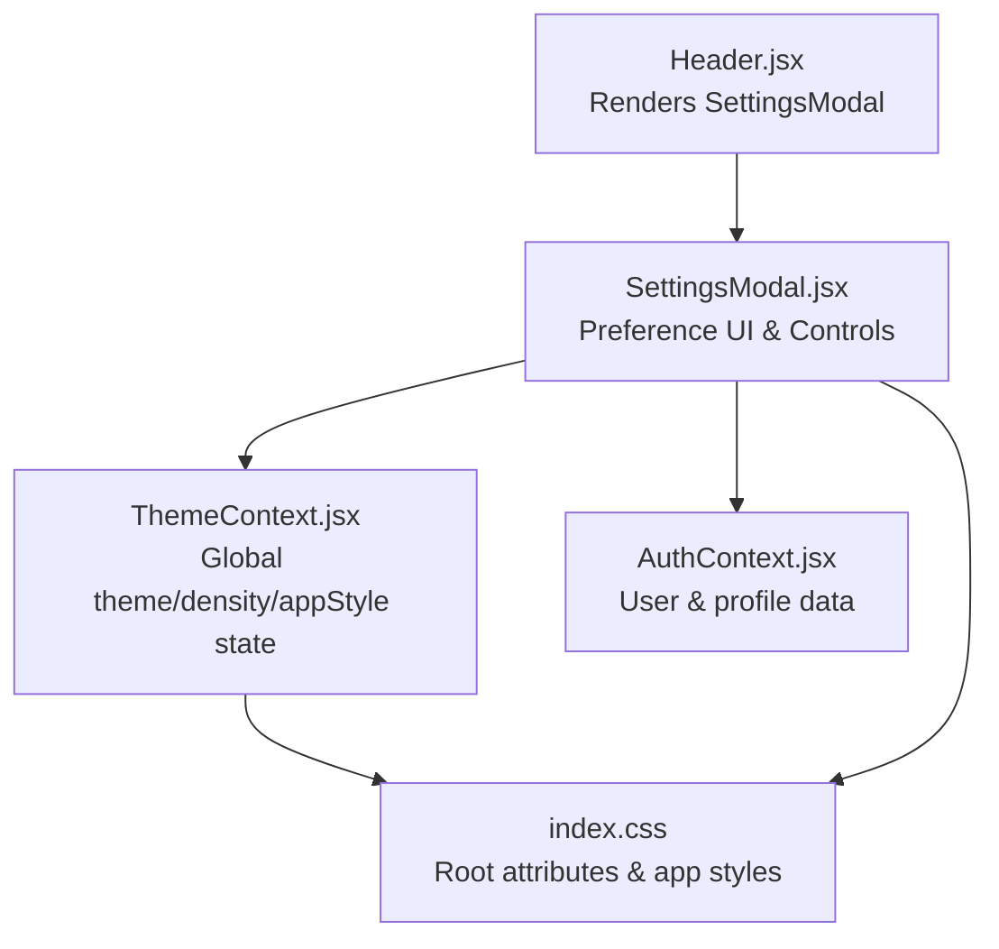
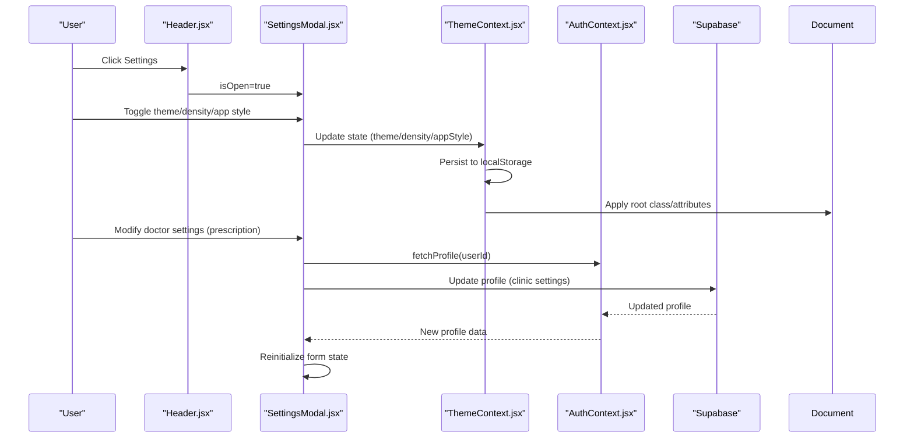
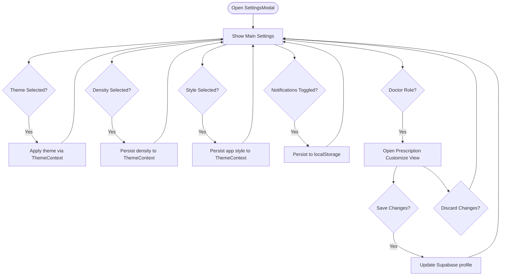
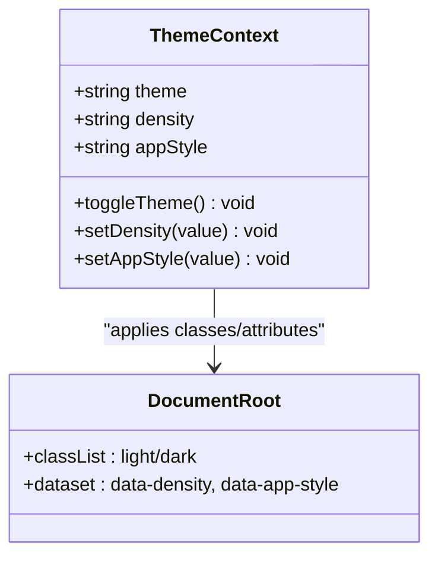
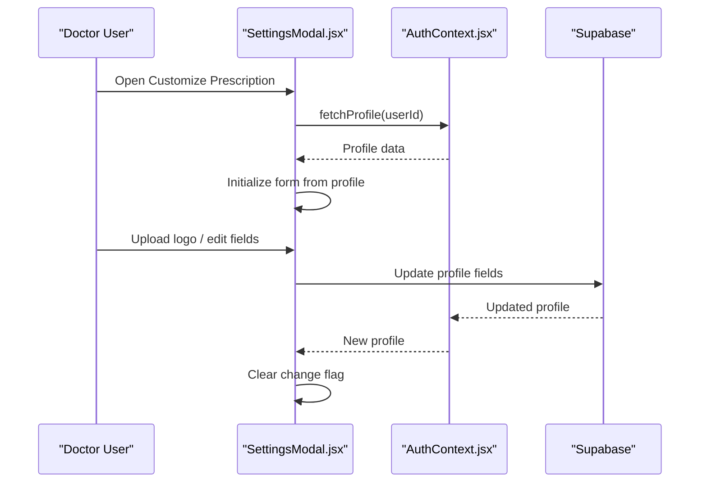
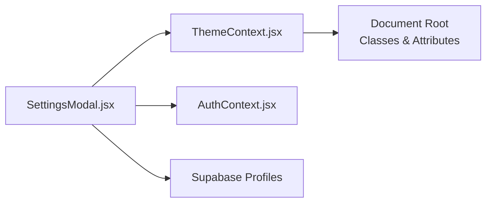

# Settings Modal & User Preferences

<cite>
**Referenced Files in This Document**
- [SettingsModal.jsx](file://frontend/src/components/SettingsModal.jsx)
- [ThemeContext.jsx](file://frontend/src/context/ThemeContext.jsx)
- [Header.jsx](file://frontend/src/components/Header.jsx)
- [index.css](file://frontend/src/index.css)
- [ThemeToggle.jsx](file://frontend/src/components/ThemeToggle.jsx)
- [AuthContext.jsx](file://frontend/src/context/AuthContext.jsx)
</cite>

## Table of Contents
1. [Introduction](#introduction)
2. [Project Structure](#project-structure)
3. [Core Components](#core-components)
4. [Architecture Overview](#architecture-overview)
5. [Detailed Component Analysis](#detailed-component-analysis)
6. [Dependency Analysis](#dependency-analysis)
7. [Performance Considerations](#performance-considerations)
8. [Accessibility Features](#accessibility-features)
9. [Responsive Design & Mobile-First Approach](#responsive-design--mobile-first-approach)
10. [Troubleshooting Guide](#troubleshooting-guide)
11. [Conclusion](#conclusion)

## Introduction
This document provides comprehensive documentation for the SettingsModal component and the user preference management system. It covers the modal interface design, preference categories (theme, density, app style), form controls for customization, integration with ThemeContext for persistence and real-time preview, validation and defaults, reset functionality, accessibility, keyboard navigation, focus management, responsive design, and practical customization workflows.

## Project Structure
The SettingsModal is part of the frontend components and integrates with global contexts for theme and authentication. The modal is rendered within the Header component and controlled via a state variable. Theme preferences are persisted and applied globally through ThemeContext, which updates the document root attributes and localStorage.

**Diagram sources**
- [Header.jsx](file://frontend/src/components/Header.jsx#L154-L154)
- [SettingsModal.jsx](file://frontend/src/components/SettingsModal.jsx#L10-L12)
- [ThemeContext.jsx](file://frontend/src/context/ThemeContext.jsx#L5-L51)
- [index.css](file://frontend/src/index.css#L34-L46)

**Section sources**
- [Header.jsx](file://frontend/src/components/Header.jsx#L154-L154)
- [SettingsModal.jsx](file://frontend/src/components/SettingsModal.jsx#L10-L12)
- [ThemeContext.jsx](file://frontend/src/context/ThemeContext.jsx#L5-L51)
- [index.css](file://frontend/src/index.css#L34-L46)

## Core Components
- SettingsModal: Central preference hub with appearance toggles, density selection, integrations, and doctor-specific customization.
- ThemeContext: Manages theme, density, and app style state with persistence and DOM attribute updates.
- Header: Hosts the SettingsModal trigger and integrates theme toggle.
- AuthContext: Provides user and profile data used for doctor-only settings.
- index.css: Applies theme, density, and app style via root attributes and style overrides.

**Section sources**
- [SettingsModal.jsx](file://frontend/src/components/SettingsModal.jsx#L10-L12)
- [ThemeContext.jsx](file://frontend/src/context/ThemeContext.jsx#L5-L51)
- [Header.jsx](file://frontend/src/components/Header.jsx#L154-L154)
- [AuthContext.jsx](file://frontend/src/context/AuthContext.jsx#L43-L61)
- [index.css](file://frontend/src/index.css#L34-L46)

## Architecture Overview
The SettingsModal reads and writes preferences via ThemeContext and AuthContext. ThemeContext persists values to localStorage and applies them to the document root (classes and attributes), enabling immediate visual feedback. Doctor-specific settings (prescription customization, clinic code, Google Calendar sync) are stored in Supabase profiles and synchronized via AuthContext.

**Diagram sources**
- [Header.jsx](file://frontend/src/components/Header.jsx#L121-L121)
- [SettingsModal.jsx](file://frontend/src/components/SettingsModal.jsx#L10-L12)
- [ThemeContext.jsx](file://frontend/src/context/ThemeContext.jsx#L34-L51)
- [AuthContext.jsx](file://frontend/src/context/AuthContext.jsx#L43-L61)

## Detailed Component Analysis

### SettingsModal Component
- Purpose: Presents a glass-morphism modal with categorized preference controls and doctor-specific customization.
- Preference Categories:
  - Appearance: Light/Dark theme buttons.
  - Workspace Style: Modern vs Minimal app style.
  - Interface Density: Compact, Normal, Spacious radio options.
  - Preferences: Push notifications toggle.
  - Integrations: Google Calendar sync (doctor role).
  - Doctor Customization: Prescription branding and details.
- Real-time Preview: Updates ThemeContext state; changes immediately reflected via root class/attributes.
- Persistence: Uses localStorage for notifications; ThemeContext persists theme/density/appStyle; Supabase persists doctor profile settings.
- Validation & Defaults:
  - Notifications default to enabled unless explicitly disabled in localStorage.
  - Density defaults to normal; app style defaults to modern; theme respects system preference or localStorage.
  - Doctor form initializes from profile data; inputs support both URL and file upload for logo.
- Reset Functionality: Back navigation from customization view discards unsaved changes; save action clears change flag.

**Diagram sources**
- [SettingsModal.jsx](file://frontend/src/components/SettingsModal.jsx#L14-L124)
- [ThemeContext.jsx](file://frontend/src/context/ThemeContext.jsx#L34-L51)

**Section sources**
- [SettingsModal.jsx](file://frontend/src/components/SettingsModal.jsx#L10-L12)
- [SettingsModal.jsx](file://frontend/src/components/SettingsModal.jsx#L14-L124)
- [SettingsModal.jsx](file://frontend/src/components/SettingsModal.jsx#L185-L670)
- [ThemeContext.jsx](file://frontend/src/context/ThemeContext.jsx#L5-L51)

### ThemeContext Integration
- State Management: Maintains theme, density, and appStyle with initialization from localStorage or system preference.
- Persistence: Writes values to localStorage on change.
- DOM Application: Adds theme class to document root and sets data-density/data-app-style attributes for CSS targeting.
- Real-time Preview: Changes take effect immediately across the app.

**Diagram sources**
- [ThemeContext.jsx](file://frontend/src/context/ThemeContext.jsx#L5-L51)
- [index.css](file://frontend/src/index.css#L34-L46)

**Section sources**
- [ThemeContext.jsx](file://frontend/src/context/ThemeContext.jsx#L5-L51)
- [index.css](file://frontend/src/index.css#L34-L46)

### Doctor-Specific Customization
- Prescription Branding: Allows uploading a logo (file or URL) and editing clinic name, qualification, address, timings, footer text.
- Clinic Code: Generates a unique 6-character alphanumeric code and supports copy-to-clipboard.
- Google Calendar Sync: Enables/disables automatic appointment syncing and reflects status in UI.
- Profile Synchronization: Updates Supabase profiles and refreshes local profile data after changes.

**Diagram sources**
- [SettingsModal.jsx](file://frontend/src/components/SettingsModal.jsx#L42-L56)
- [SettingsModal.jsx](file://frontend/src/components/SettingsModal.jsx#L99-L124)
- [SettingsModal.jsx](file://frontend/src/components/SettingsModal.jsx#L126-L152)
- [SettingsModal.jsx](file://frontend/src/components/SettingsModal.jsx#L154-L177)
- [AuthContext.jsx](file://frontend/src/context/AuthContext.jsx#L43-L61)

**Section sources**
- [SettingsModal.jsx](file://frontend/src/components/SettingsModal.jsx#L42-L56)
- [SettingsModal.jsx](file://frontend/src/components/SettingsModal.jsx#L99-L124)
- [SettingsModal.jsx](file://frontend/src/components/SettingsModal.jsx#L126-L152)
- [SettingsModal.jsx](file://frontend/src/components/SettingsModal.jsx#L154-L177)
- [AuthContext.jsx](file://frontend/src/context/AuthContext.jsx#L43-L61)

## Dependency Analysis
- SettingsModal depends on ThemeContext for theme/density/appStyle and on AuthContext for user/profile data.
- ThemeContext updates the document root and localStorage, enabling CSS-driven styling.
- Doctor-specific features depend on Supabase for persistent storage and AuthContext for profile retrieval.

**Diagram sources**
- [SettingsModal.jsx](file://frontend/src/components/SettingsModal.jsx#L10-L12)
- [ThemeContext.jsx](file://frontend/src/context/ThemeContext.jsx#L34-L51)
- [AuthContext.jsx](file://frontend/src/context/AuthContext.jsx#L43-L61)

**Section sources**
- [SettingsModal.jsx](file://frontend/src/components/SettingsModal.jsx#L10-L12)
- [ThemeContext.jsx](file://frontend/src/context/ThemeContext.jsx#L34-L51)
- [AuthContext.jsx](file://frontend/src/context/AuthContext.jsx#L43-L61)

## Performance Considerations
- Efficient DOM Updates: ThemeContext updates only root classes and attributes, minimizing reflows.
- Conditional Rendering: Doctor-only sections are hidden for non-doctor roles, reducing unnecessary renders.
- Debounced LocalStorage Writes: Notifications toggle writes to localStorage per interaction; consider batching if extended to many toggles.
- Image Handling: Logo uploads use FileReader; ensure large images are handled gracefully to avoid memory pressure.

## Accessibility Features
- Focus Management:
  - Modal uses Headless UI Dialog with built-in focus trapping; pressing Escape closes the modal.
  - Buttons and switches receive focus; interactive elements use appropriate ARIA attributes.
- Keyboard Navigation:
  - Tab order follows visual layout; radio groups and switches are keyboard operable.
  - Close button and Done actions are reachable via keyboard.
- Screen Reader Support:
  - Descriptive labels and icons; Switch components include aria-hidden indicators and sr-only labels.
  - Status badges (e.g., Google Calendar Active) provide contextual information.

**Section sources**
- [SettingsModal.jsx](file://frontend/src/components/SettingsModal.jsx#L185-L226)
- [SettingsModal.jsx](file://frontend/src/components/SettingsModal.jsx#L432-L444)
- [SettingsModal.jsx](file://frontend/src/components/SettingsModal.jsx#L476-L488)

## Responsive Design & Mobile-First Approach
- Modal Dimensions: Max width constrained with responsive padding; scrollable content area for small screens.
- Typography & Spacing: Small, readable text sizes optimized for mobile; compact density option available.
- Touch Targets: Buttons and switches sized for touch interaction; spacing accommodates finger-friendly taps.
- Overlay & Sidebar: Mobile overlay behavior complements modal accessibility; sidebar remains accessible via menu.

**Section sources**
- [SettingsModal.jsx](file://frontend/src/components/SettingsModal.jsx#L200-L211)
- [SettingsModal.jsx](file://frontend/src/components/SettingsModal.jsx#L228-L229)
- [SettingsModal.jsx](file://frontend/src/components/SettingsModal.jsx#L369-L418)

## Troubleshooting Guide
- Preferences Not Persisting:
  - Verify localStorage keys for theme/density/appStyle and notifications_enabled.
  - Confirm ThemeContext initialization runs before component mounts.
- Doctor Settings Not Updating:
  - Ensure user is authenticated and profile exists; check Supabase update errors.
  - Verify fetchProfile is called after updates to refresh UI.
- Google Calendar Sync Issues:
  - Confirm user is logged in; check sign-in/out flows and error messages.
  - Validate API initialization and permissions.
- Styling Not Applying:
  - Confirm root classes/attributes are present and CSS selectors match data-density/data-app-style.

**Section sources**
- [ThemeContext.jsx](file://frontend/src/context/ThemeContext.jsx#L5-L51)
- [SettingsModal.jsx](file://frontend/src/components/SettingsModal.jsx#L59-L62)
- [SettingsModal.jsx](file://frontend/src/components/SettingsModal.jsx#L64-L91)
- [SettingsModal.jsx](file://frontend/src/components/SettingsModal.jsx#L99-L124)

## Conclusion
The SettingsModal provides a comprehensive, accessible, and responsive interface for managing user preferences. Through tight integration with ThemeContext and AuthContext, it offers real-time preview, robust persistence, and role-aware customization. The component’s modular design and clear separation of concerns enable maintainability and extensibility for future enhancements.