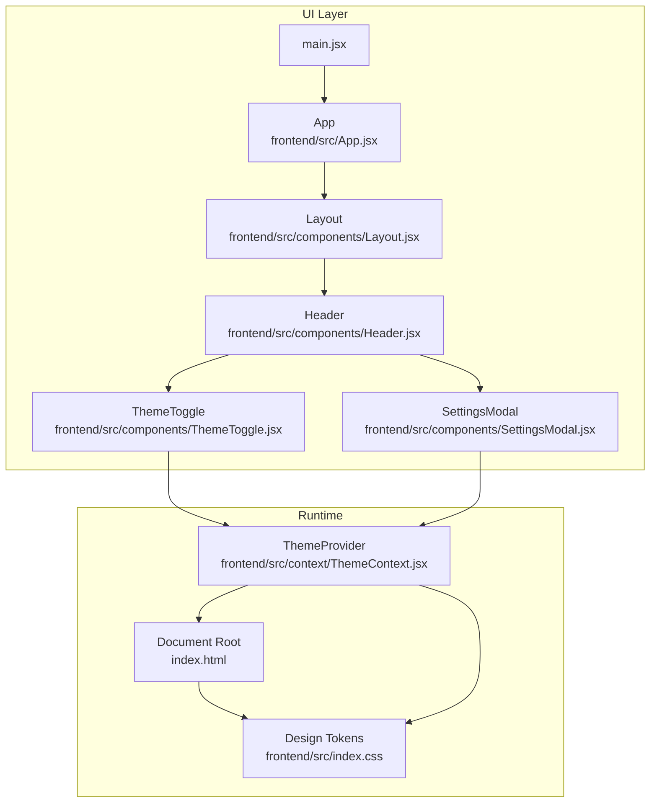
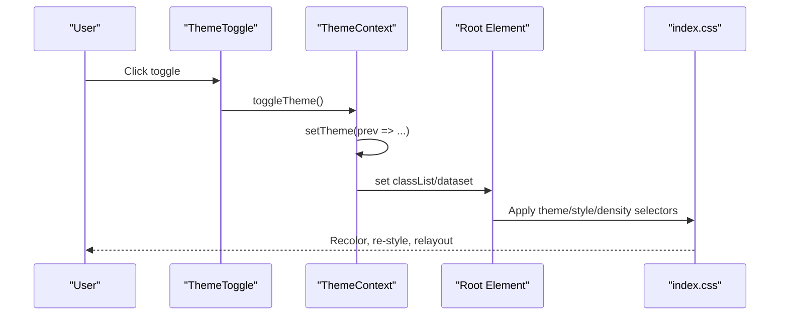
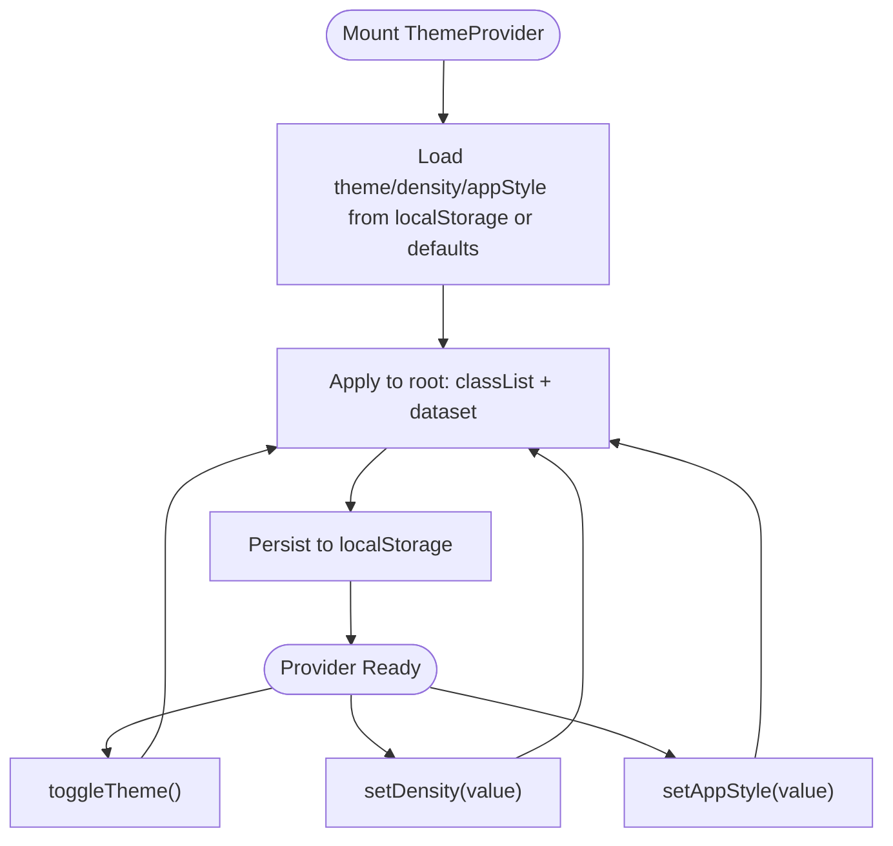
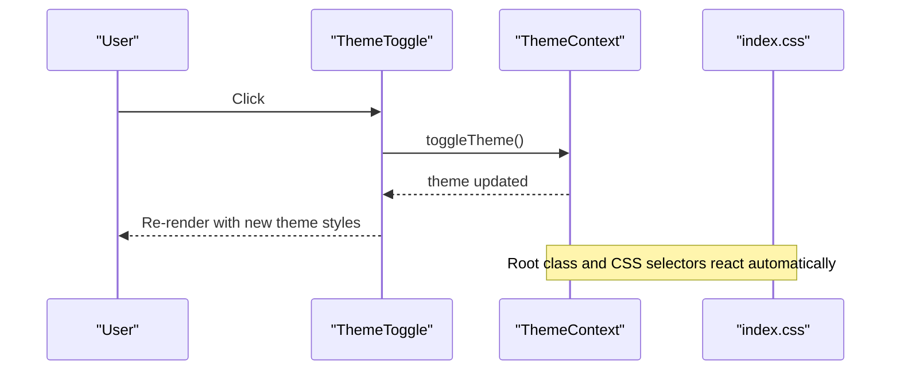
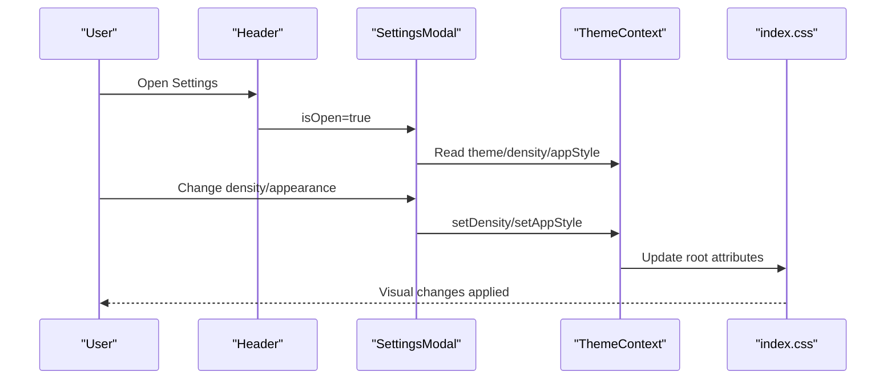
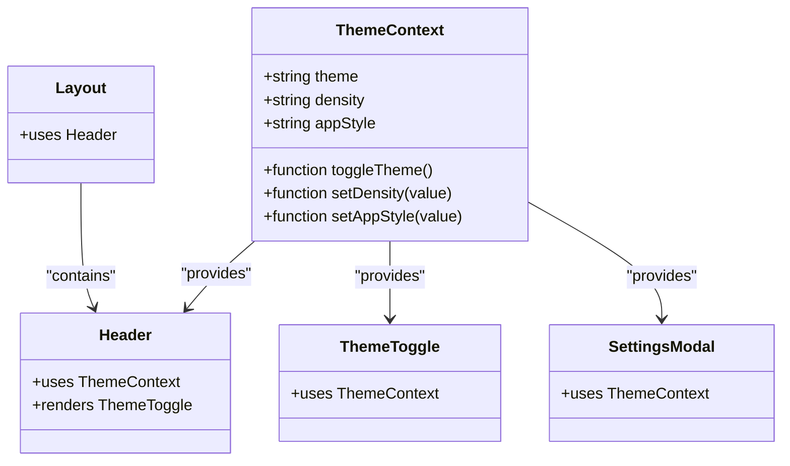
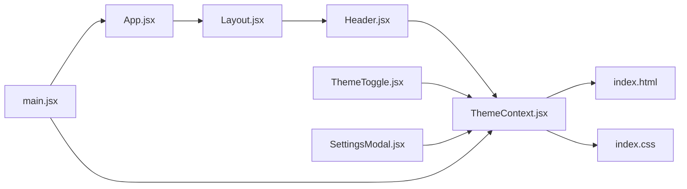

# Theme & Customization

<cite>
**Referenced Files in This Document**
- [ThemeContext.jsx](file://frontend/src/context/ThemeContext.jsx)
- [ThemeToggle.jsx](file://frontend/src/components/ThemeToggle.jsx)
- [SettingsModal.jsx](file://frontend/src/components/SettingsModal.jsx)
- [index.css](file://frontend/src/index.css)
- [main.jsx](file://frontend/src/main.jsx)
- [App.jsx](file://frontend/src/App.jsx)
- [Layout.jsx](file://frontend/src/components/Layout.jsx)
- [Header.jsx](file://frontend/src/components/Header.jsx)
- [Button.jsx](file://frontend/src/components/ui/Button.jsx)
- [package.json](file://frontend/package.json)
</cite>

## Table of Contents
1. [Introduction](#introduction)
2. [Project Structure](#project-structure)
3. [Core Components](#core-components)
4. [Architecture Overview](#architecture-overview)
5. [Detailed Component Analysis](#detailed-component-analysis)
6. [Dependency Analysis](#dependency-analysis)
7. [Performance Considerations](#performance-considerations)
8. [Troubleshooting Guide](#troubleshooting-guide)
9. [Conclusion](#conclusion)
10. [Appendices](#appendices)

## Introduction
This document explains MedVita’s visual design system with a focus on theming and customization. It covers how the ThemeProvider manages theme state, persists preferences across sessions, and integrates with component styling. It also documents the SettingsModal for user preferences, interface density controls, and accessibility features. Guidance is included for extending the theming system, creating custom themes, adapting for brand identity, and ensuring inclusive design and accessibility compliance.

## Project Structure
The theming system is centered around a React Context provider that stores and updates theme-related preferences. These preferences are applied globally via CSS custom properties and attributes on the root element. Components consume the theme context and apply Tailwind utility classes that resolve to the current design tokens.



**Diagram sources**
- [ThemeContext.jsx](file://frontend/src/context/ThemeContext.jsx#L5-L69)
- [ThemeToggle.jsx](file://frontend/src/components/ThemeToggle.jsx#L5-L30)
- [SettingsModal.jsx](file://frontend/src/components/SettingsModal.jsx#L10-L12)
- [index.css](file://frontend/src/index.css#L3-L59)
- [main.jsx](file://frontend/src/main.jsx#L8-L16)
- [App.jsx](file://frontend/src/App.jsx#L26-L59)
- [Layout.jsx](file://frontend/src/components/Layout.jsx#L5-L42)
- [Header.jsx](file://frontend/src/components/Header.jsx#L17-L157)

**Section sources**
- [main.jsx](file://frontend/src/main.jsx#L8-L16)
- [App.jsx](file://frontend/src/App.jsx#L26-L59)
- [Layout.jsx](file://frontend/src/components/Layout.jsx#L5-L42)
- [Header.jsx](file://frontend/src/components/Header.jsx#L17-L157)

## Core Components
- ThemeProvider: Manages theme, density, and app style state; persists to localStorage; applies CSS classes and attributes to the root element.
- ThemeToggle: Provides a button to switch between light and dark modes.
- SettingsModal: Centralized preferences panel for appearance, density, integrations, and doctor-specific branding settings.
- index.css: Defines design tokens, variants, and component-level styles that respond to theme context.

Key responsibilities:
- Persistence: Theme, density, and app style are saved to localStorage and restored on load.
- Global application: The provider sets a theme class on the root element and data-* attributes for density and style, enabling CSS selectors to adapt the UI.
- Component integration: UI components use Tailwind utilities and CSS custom properties to reflect the active theme.

**Section sources**
- [ThemeContext.jsx](file://frontend/src/context/ThemeContext.jsx#L5-L69)
- [ThemeToggle.jsx](file://frontend/src/components/ThemeToggle.jsx#L5-L30)
- [SettingsModal.jsx](file://frontend/src/components/SettingsModal.jsx#L10-L12)
- [index.css](file://frontend/src/index.css#L3-L59)

## Architecture Overview
The theming architecture combines React state, CSS custom properties, and Tailwind variants to deliver a flexible, persistent design system.



**Diagram sources**
- [ThemeToggle.jsx](file://frontend/src/components/ThemeToggle.jsx#L5-L30)
- [ThemeContext.jsx](file://frontend/src/context/ThemeContext.jsx#L53-L69)
- [index.css](file://frontend/src/index.css#L3-L59)

## Detailed Component Analysis

### ThemeProvider
- State initialization:
  - Theme: reads from localStorage or falls back to system preference.
  - Density: reads from localStorage or defaults to normal.
  - App style: reads from localStorage or defaults to modern.
- Effects:
  - Applies a theme class to the root element.
  - Sets data-density and data-app-style attributes.
  - Persists all three preferences to localStorage.
- Public API:
  - theme: current theme identifier.
  - toggleTheme: switches between light and dark.
  - density: current density level.
  - setDensity: updates density.
  - appStyle: current app style.
  - setAppStyle: updates app style.



**Diagram sources**
- [ThemeContext.jsx](file://frontend/src/context/ThemeContext.jsx#L5-L69)

**Section sources**
- [ThemeContext.jsx](file://frontend/src/context/ThemeContext.jsx#L5-L69)

### ThemeToggle
- Consumes theme and toggleTheme from ThemeContext.
- Renders a visually distinct button with theme-aware styling and animations.
- Uses aria-label for accessibility.



**Diagram sources**
- [ThemeToggle.jsx](file://frontend/src/components/ThemeToggle.jsx#L5-L30)
- [ThemeContext.jsx](file://frontend/src/context/ThemeContext.jsx#L53-L69)
- [index.css](file://frontend/src/index.css#L3-L59)

**Section sources**
- [ThemeToggle.jsx](file://frontend/src/components/ThemeToggle.jsx#L5-L30)

### SettingsModal
- Integrates ThemeContext to control theme, density, and app style.
- Supports doctor-specific customization (branding fields, logo upload).
- Manages notifications and Google Calendar sync toggles.
- Uses Headless UI Dialog for accessible modal behavior.



**Diagram sources**
- [Header.jsx](file://frontend/src/components/Header.jsx#L17-L157)
- [SettingsModal.jsx](file://frontend/src/components/SettingsModal.jsx#L10-L12)
- [ThemeContext.jsx](file://frontend/src/context/ThemeContext.jsx#L53-L69)
- [index.css](file://frontend/src/index.css#L3-L59)

**Section sources**
- [SettingsModal.jsx](file://frontend/src/components/SettingsModal.jsx#L10-L12)
- [Header.jsx](file://frontend/src/components/Header.jsx#L17-L157)

### Design Tokens and CSS Integration
- Design tokens are defined as CSS custom properties scoped to :root and adjusted under .dark and data-app-style selectors.
- Density variants adjust scale factor, font size, spacing, and border radius.
- App style variants switch between “modern” (glassy, vibrant) and “minimal” (flat, clean).
- Components rely on Tailwind utilities that resolve to current token values.

```mermaid
flowchart TD
Tokens["Design Tokens<br/>index.css"] --> Root[":root"]
Tokens --> Dark[".dark"]
Tokens --> Modern['[data-app-style="modern"]']
Tokens --> Minimal['[data-app-style="minimal"]']
Root --> Components["Components via Tailwind"]
Dark --> Components
Modern --> Components
Minimal --> Components
```

**Diagram sources**
- [index.css](file://frontend/src/index.css#L5-L59)
- [index.css](file://frontend/src/index.css#L96-L183)

**Section sources**
- [index.css](file://frontend/src/index.css#L5-L59)
- [index.css](file://frontend/src/index.css#L96-L183)

### Component Styling and Context Integration
- Header and Layout use Tailwind utilities that depend on current tokens and attributes.
- Buttons and other UI primitives leverage semantic color classes that adapt to the active theme.
- The provider is mounted at the application root so all routes and components inherit the theme.



**Diagram sources**
- [ThemeContext.jsx](file://frontend/src/context/ThemeContext.jsx#L5-L69)
- [Header.jsx](file://frontend/src/components/Header.jsx#L17-L157)
- [ThemeToggle.jsx](file://frontend/src/components/ThemeToggle.jsx#L5-L30)
- [SettingsModal.jsx](file://frontend/src/components/SettingsModal.jsx#L10-L12)
- [Layout.jsx](file://frontend/src/components/Layout.jsx#L5-L42)

**Section sources**
- [Header.jsx](file://frontend/src/components/Header.jsx#L17-L157)
- [Layout.jsx](file://frontend/src/components/Layout.jsx#L5-L42)
- [Button.jsx](file://frontend/src/components/ui/Button.jsx#L15-L29)

## Dependency Analysis
- ThemeContext depends on React and localStorage APIs.
- SettingsModal depends on ThemeContext and external integrations (Google Calendar, Supabase) for doctor-specific features.
- index.css defines the design system and is consumed by all components via Tailwind utilities.
- The provider is initialized in main.jsx and wraps the entire application.



**Diagram sources**
- [ThemeContext.jsx](file://frontend/src/context/ThemeContext.jsx#L5-L69)
- [Header.jsx](file://frontend/src/components/Header.jsx#L17-L157)
- [ThemeToggle.jsx](file://frontend/src/components/ThemeToggle.jsx#L5-L30)
- [SettingsModal.jsx](file://frontend/src/components/SettingsModal.jsx#L10-L12)
- [Layout.jsx](file://frontend/src/components/Layout.jsx#L5-L42)
- [App.jsx](file://frontend/src/App.jsx#L26-L59)
- [main.jsx](file://frontend/src/main.jsx#L8-L16)
- [index.css](file://frontend/src/index.css#L3-L59)

**Section sources**
- [package.json](file://frontend/package.json#L13-L31)
- [main.jsx](file://frontend/src/main.jsx#L8-L16)
- [ThemeContext.jsx](file://frontend/src/context/ThemeContext.jsx#L5-L69)

## Performance Considerations
- CSS custom properties and data attributes minimize reflows compared to recalculating styles in JavaScript.
- Persisting to localStorage avoids expensive computations on each render.
- Density and style changes are applied via a single effect, reducing cascading updates.
- Recommendations:
  - Keep the number of global selectors manageable.
  - Prefer CSS custom properties for frequently changing values.
  - Avoid excessive DOM mutations during theme transitions.

[No sources needed since this section provides general guidance]

## Troubleshooting Guide
Common issues and resolutions:
- Theme does not persist after refresh:
  - Verify localStorage keys exist and are readable.
  - Confirm the provider runs before rendering UI.
- Theme toggle has no effect:
  - Ensure the root element receives the theme class and attributes.
  - Check that CSS selectors target the correct attributes.
- SettingsModal changes not reflected:
  - Confirm ThemeContext is used inside SettingsModal.
  - Validate that index.css selectors respond to data-app-style and data-density.

**Section sources**
- [ThemeContext.jsx](file://frontend/src/context/ThemeContext.jsx#L34-L51)
- [SettingsModal.jsx](file://frontend/src/components/SettingsModal.jsx#L10-L12)
- [index.css](file://frontend/src/index.css#L3-L59)

## Conclusion
MedVita’s theming system combines a lightweight React Context provider with CSS custom properties and Tailwind utilities to deliver a flexible, persistent, and accessible design system. Users can switch themes, adjust density, and choose app styles, while developers can extend the system by adding new tokens and selectors.

[No sources needed since this section summarizes without analyzing specific files]

## Appendices

### Custom Theme Creation Guide
Steps to add a new app style or color scheme:
1. Define new tokens in index.css under :root and .dark.
2. Add a selector for the new style variant (e.g., [data-app-style="elevated"]).
3. Provide overrides for components in that variant.
4. Expose a setter in ThemeContext and wire it to SettingsModal.
5. Test persistence and responsiveness across devices.

**Section sources**
- [index.css](file://frontend/src/index.css#L5-L59)
- [index.css](file://frontend/src/index.css#L139-L183)
- [ThemeContext.jsx](file://frontend/src/context/ThemeContext.jsx#L53-L69)
- [SettingsModal.jsx](file://frontend/src/components/SettingsModal.jsx#L10-L12)

### Brand Customization Examples
- Modify primary brand colors in :root and .dark to reflect your brand identity.
- Adjust typography tokens (font families, sizes) to suit brand voice.
- Update gradients and shadows for consistent brand expression.

**Section sources**
- [index.css](file://frontend/src/index.css#L5-L59)
- [index.css](file://frontend/src/index.css#L61-L137)

### Responsive Design Adaptations
- Use density variants to adapt spacing and typography for compact or spacious layouts.
- Combine media queries with density tokens for optimal readability on all screen sizes.

**Section sources**
- [index.css](file://frontend/src/index.css#L96-L109)

### Accessibility Compliance and Inclusive Practices
- Maintain sufficient color contrast across light and dark modes.
- Use semantic HTML and ARIA attributes in dialogs and menus.
- Provide keyboard navigation and focus management.
- Avoid motion-sensitive animations for users who prefer reduced motion.

**Section sources**
- [Header.jsx](file://frontend/src/components/Header.jsx#L17-L157)
- [SettingsModal.jsx](file://frontend/src/components/SettingsModal.jsx#L10-L12)