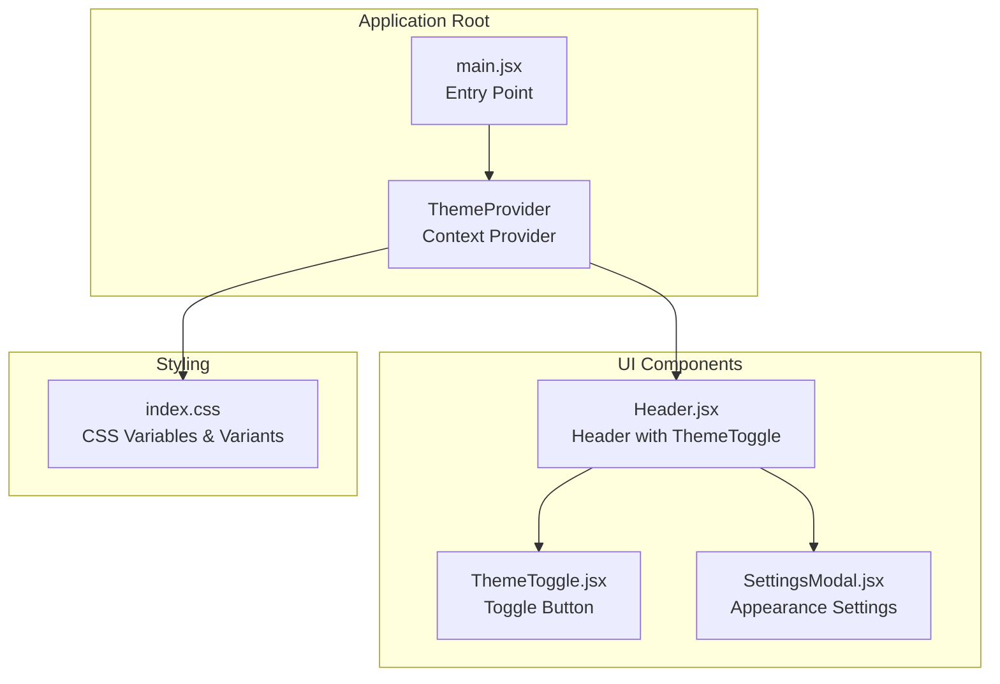
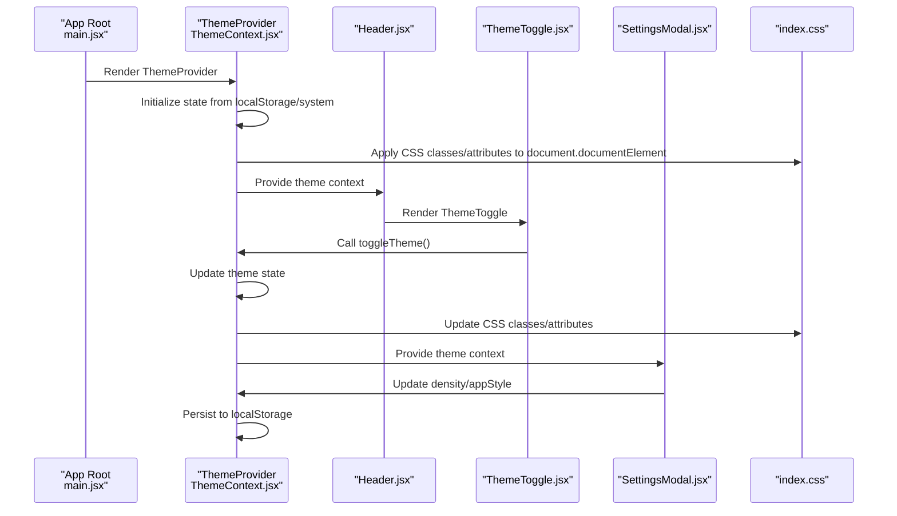
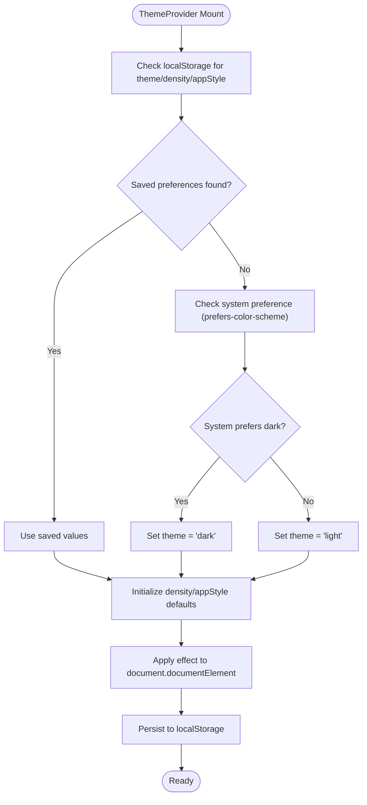
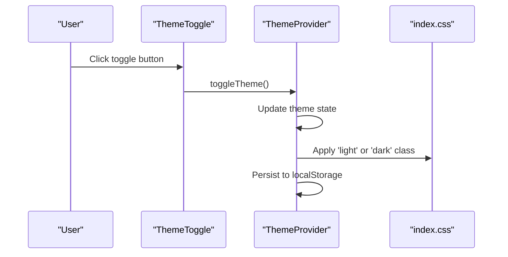
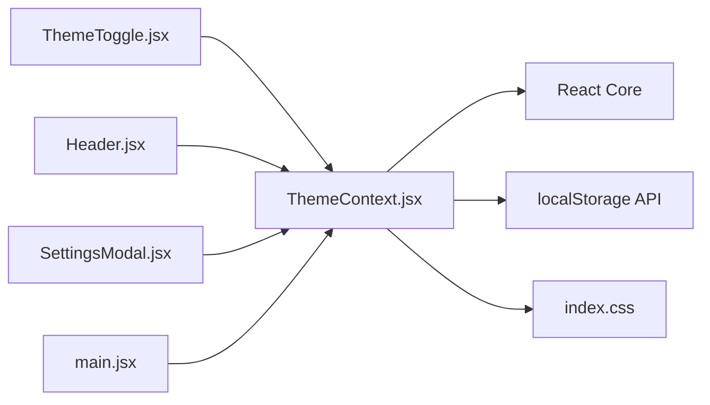

# Theme Provider Implementation

<cite>
**Referenced Files in This Document**
- [ThemeContext.jsx](file://frontend/src/context/ThemeContext.jsx)
- [ThemeToggle.jsx](file://frontend/src/components/ThemeToggle.jsx)
- [Header.jsx](file://frontend/src/components/Header.jsx)
- [SettingsModal.jsx](file://frontend/src/components/SettingsModal.jsx)
- [main.jsx](file://frontend/src/main.jsx)
- [index.css](file://frontend/src/index.css)
- [package.json](file://frontend/package.json)
</cite>

## Table of Contents
1. [Introduction](#introduction)
2. [Project Structure](#project-structure)
3. [Core Components](#core-components)
4. [Architecture Overview](#architecture-overview)
5. [Detailed Component Analysis](#detailed-component-analysis)
6. [Dependency Analysis](#dependency-analysis)
7. [Performance Considerations](#performance-considerations)
8. [Troubleshooting Guide](#troubleshooting-guide)
9. [Conclusion](#conclusion)

## Introduction
This document provides comprehensive documentation for the ThemeProvider implementation in MedVita, focusing on theme state management, persistence mechanisms, and integration patterns. The ThemeProvider enables dynamic switching between light and dark modes, manages interface density and application style preferences, and synchronizes state across components through React's Context API. It also demonstrates proper error handling for context usage and integrates with CSS class management and localStorage persistence.

## Project Structure
The theme system is implemented primarily in the frontend context and components directory. The ThemeProvider is initialized at the application root and consumed by various UI components to apply theme-related styles and behaviors.

**Diagram sources**
- [main.jsx](file://frontend/src/main.jsx#L1-L17)
- [ThemeContext.jsx](file://frontend/src/context/ThemeContext.jsx#L1-L79)
- [Header.jsx](file://frontend/src/components/Header.jsx#L1-L158)
- [ThemeToggle.jsx](file://frontend/src/components/ThemeToggle.jsx#L1-L31)
- [SettingsModal.jsx](file://frontend/src/components/SettingsModal.jsx#L1-L672)
- [index.css](file://frontend/src/index.css#L1-L781)

**Section sources**
- [main.jsx](file://frontend/src/main.jsx#L1-L17)
- [ThemeContext.jsx](file://frontend/src/context/ThemeContext.jsx#L1-L79)
- [index.css](file://frontend/src/index.css#L1-L781)

## Core Components
This section details the primary components involved in theme state management and their responsibilities.

- ThemeProvider: Manages theme state (light/dark), density (compact/normal/spacious), and appStyle (modern/minimal). It initializes state from localStorage or system preferences, applies CSS classes and attributes to the document root, and persists changes to localStorage.
- useTheme: A custom hook that provides access to theme state and actions. It throws an error if used outside of ThemeProvider, ensuring proper usage.
- ThemeToggle: A UI component that renders a button to switch between light and dark modes, integrating with the theme context.
- SettingsModal: A modal component that allows users to change theme, density, and appStyle preferences, updating state through the theme context.

**Section sources**
- [ThemeContext.jsx](file://frontend/src/context/ThemeContext.jsx#L1-L79)
- [ThemeToggle.jsx](file://frontend/src/components/ThemeToggle.jsx#L1-L31)
- [SettingsModal.jsx](file://frontend/src/components/SettingsModal.jsx#L1-L672)

## Architecture Overview
The theme architecture follows a centralized context pattern with automatic persistence and CSS class management.

**Diagram sources**
- [main.jsx](file://frontend/src/main.jsx#L1-L17)
- [ThemeContext.jsx](file://frontend/src/context/ThemeContext.jsx#L1-L79)
- [Header.jsx](file://frontend/src/components/Header.jsx#L1-L158)
- [ThemeToggle.jsx](file://frontend/src/components/ThemeToggle.jsx#L1-L31)
- [SettingsModal.jsx](file://frontend/src/components/SettingsModal.jsx#L1-L672)
- [index.css](file://frontend/src/index.css#L1-L781)

## Detailed Component Analysis

### ThemeProvider Implementation
The ThemeProvider encapsulates theme state management and persistence logic. It initializes three key preferences:
- theme: light or dark mode, determined by localStorage or system preference
- density: compact, normal, or spacious interface density
- appStyle: modern or minimal application style

State initialization logic:
- Checks localStorage for saved preferences first
- Falls back to system preference for theme detection
- Uses defaults for density and appStyle if not found

Effect synchronization:
- Applies CSS classes to document.documentElement (adds/removes 'light'/'dark')
- Sets data attributes for density and appStyle
- Persists all three preferences to localStorage on state changes

Theme switching mechanism:
- Provides a toggleTheme function that flips between light and dark
- Updates state atomically, triggering re-renders across the component tree

**Diagram sources**
- [ThemeContext.jsx](file://frontend/src/context/ThemeContext.jsx#L6-L51)

**Section sources**
- [ThemeContext.jsx](file://frontend/src/context/ThemeContext.jsx#L1-L79)

### Context Provider Pattern
The ThemeProvider uses React's Context API to distribute theme state throughout the component tree. The context value includes:
- theme: current theme state
- toggleTheme: function to switch between light and dark modes
- density: current density level
- setDensity: function to update density
- appStyle: current application style
- setAppStyle: function to update application style

Error handling:
- The useTheme custom hook validates that it is used within a ThemeProvider
- Throws a descriptive error if context is undefined

**Section sources**
- [ThemeContext.jsx](file://frontend/src/context/ThemeContext.jsx#L53-L79)

### Theme Switching Mechanisms
Theme switching occurs through two primary pathways:

1. Direct toggle via ThemeToggle component:
   - Renders a button that calls toggleTheme from context
   - Updates theme state and triggers effect synchronization

2. Settings-driven updates via SettingsModal:
   - Allows users to select between light/dark modes
   - Provides radio buttons for density selection
   - Offers style selection between modern and minimal
   - Updates state through context setters

**Diagram sources**
- [ThemeToggle.jsx](file://frontend/src/components/ThemeToggle.jsx#L1-L31)
- [ThemeContext.jsx](file://frontend/src/context/ThemeContext.jsx#L53-L55)
- [index.css](file://frontend/src/index.css#L3-L3)

**Section sources**
- [ThemeToggle.jsx](file://frontend/src/components/ThemeToggle.jsx#L1-L31)
- [SettingsModal.jsx](file://frontend/src/components/SettingsModal.jsx#L234-L259)

### useEffect Hook for CSS Class Management
The ThemeProvider's effect hook performs several critical tasks:
- Removes existing theme classes ('light', 'dark') from document.documentElement
- Adds the current theme class
- Sets data-density and data-app-style attributes
- Persists all three preferences to localStorage

This ensures that CSS selectors targeting the document root (like the dark variant selector) receive immediate updates, and user preferences persist across browser sessions.

**Section sources**
- [ThemeContext.jsx](file://frontend/src/context/ThemeContext.jsx#L34-L51)

### useTheme Custom Hook
The useTheme hook provides a clean interface for consuming theme context:
- Extracts theme state and actions from ThemeContext
- Validates context usage and throws a descriptive error if used outside provider
- Returns an object containing theme, toggleTheme, density, setDensity, appStyle, and setAppStyle

Error handling pattern:
- Checks if context equals undefined
- Throws new Error with message indicating proper usage within ThemeProvider

**Section sources**
- [ThemeContext.jsx](file://frontend/src/context/ThemeContext.jsx#L71-L79)

### CSS Integration and Variant Management
The theme system leverages CSS custom properties and Tailwind variants:
- CSS variables define color palettes for light and dark modes
- The dark variant selector targets elements under '.dark' class
- Data attributes control density and appStyle variations
- Glassmorphism effects and transitions enhance the user experience

Key CSS features:
- Dark mode variant using ':where(.dark, .dark *)'
- Density variants controlled by 'data-density' attribute
- App style variants controlled by 'data-app-style' attribute
- Comprehensive color system with brand-specific variables

**Section sources**
- [index.css](file://frontend/src/index.css#L3-L59)
- [index.css](file://frontend/src/index.css#L96-L183)

### Component Integration Patterns
Multiple components integrate with the theme system:

1. Header component:
   - Uses theme context for conditional rendering
   - Displays appropriate icons and styling based on current theme
   - Integrates ThemeToggle within the header layout

2. ThemeToggle component:
   - Minimal implementation focused on theme switching
   - Uses conditional styling based on current theme
   - Provides accessibility attributes

3. SettingsModal component:
   - Comprehensive theme customization interface
   - Allows users to modify theme, density, and appStyle
   - Persists changes through context setters

**Section sources**
- [Header.jsx](file://frontend/src/components/Header.jsx#L17-L85)
- [ThemeToggle.jsx](file://frontend/src/components/ThemeToggle.jsx#L5-L30)
- [SettingsModal.jsx](file://frontend/src/components/SettingsModal.jsx#L10-L183)

## Dependency Analysis
The theme system has minimal external dependencies and relies on React's built-in APIs for state management and context distribution.

**Diagram sources**
- [ThemeContext.jsx](file://frontend/src/context/ThemeContext.jsx#L1-L79)
- [ThemeToggle.jsx](file://frontend/src/components/ThemeToggle.jsx#L1-L31)
- [Header.jsx](file://frontend/src/components/Header.jsx#L1-L158)
- [SettingsModal.jsx](file://frontend/src/components/SettingsModal.jsx#L1-L672)
- [main.jsx](file://frontend/src/main.jsx#L1-L17)

**Section sources**
- [package.json](file://frontend/package.json#L13-L31)

## Performance Considerations
The theme system is designed for optimal performance:
- Single effect hook manages all DOM updates efficiently
- State updates trigger minimal re-renders through selective context consumption
- CSS class switching is O(1) operation performed on document.documentElement
- localStorage operations are batched during effect execution
- No heavy computations or external library dependencies

## Troubleshooting Guide
Common issues and solutions for the theme system:

1. **useTheme used outside ThemeProvider**:
   - Symptom: Error thrown indicating useTheme must be used within ThemeProvider
   - Solution: Ensure all components consuming theme context are wrapped in ThemeProvider

2. **Theme not persisting across reloads**:
   - Symptom: Theme resets to default after page refresh
   - Solution: Verify localStorage is available and not blocked by browser settings

3. **CSS not updating immediately**:
   - Symptom: Visual changes not reflected after theme switch
   - Solution: Confirm effect hook executes and document.documentElement receives correct classes

4. **System preference not detected**:
   - Symptom: Theme doesn't match system preference
   - Solution: Check browser support for prefers-color-scheme media query

5. **Settings not applying**:
   - Symptom: Density or appStyle changes don't take effect
   - Solution: Verify data attributes are being set on document.documentElement

**Section sources**
- [ThemeContext.jsx](file://frontend/src/context/ThemeContext.jsx#L71-L79)

## Conclusion
The ThemeProvider implementation in MedVita demonstrates a robust, scalable approach to theme management in React applications. By leveraging React's Context API, localStorage persistence, and CSS custom properties, it provides seamless theme switching with automatic system preference detection. The modular design allows for easy extension and maintenance, while the comprehensive integration across components ensures consistent user experience. The implementation balances performance, usability, and maintainability, serving as a solid foundation for future theming enhancements.