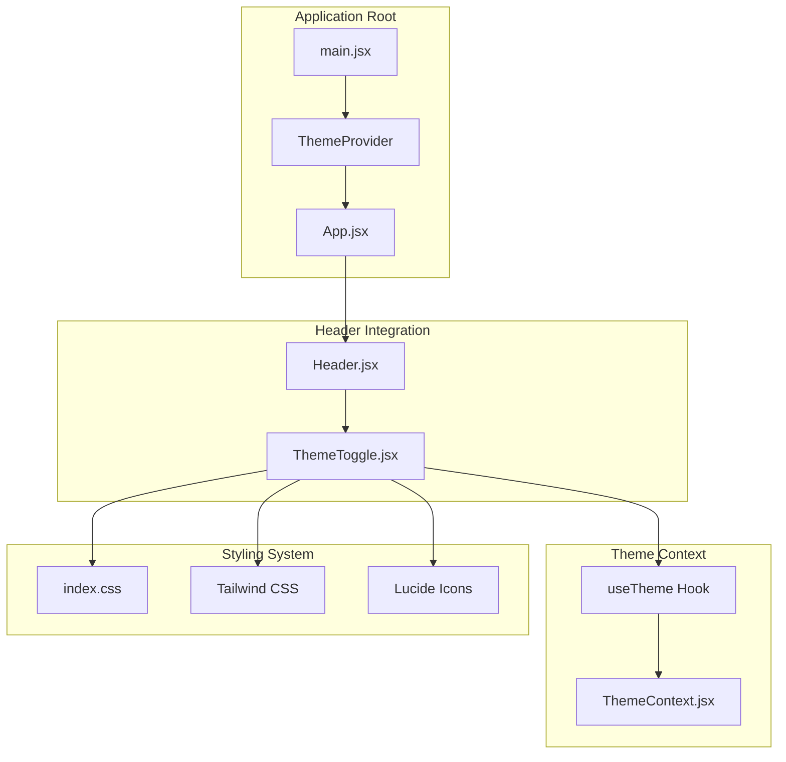
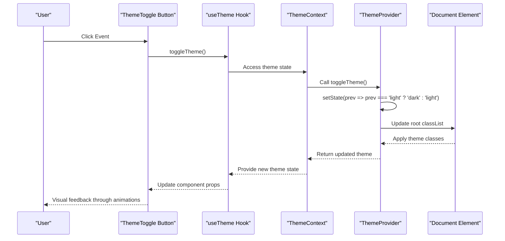
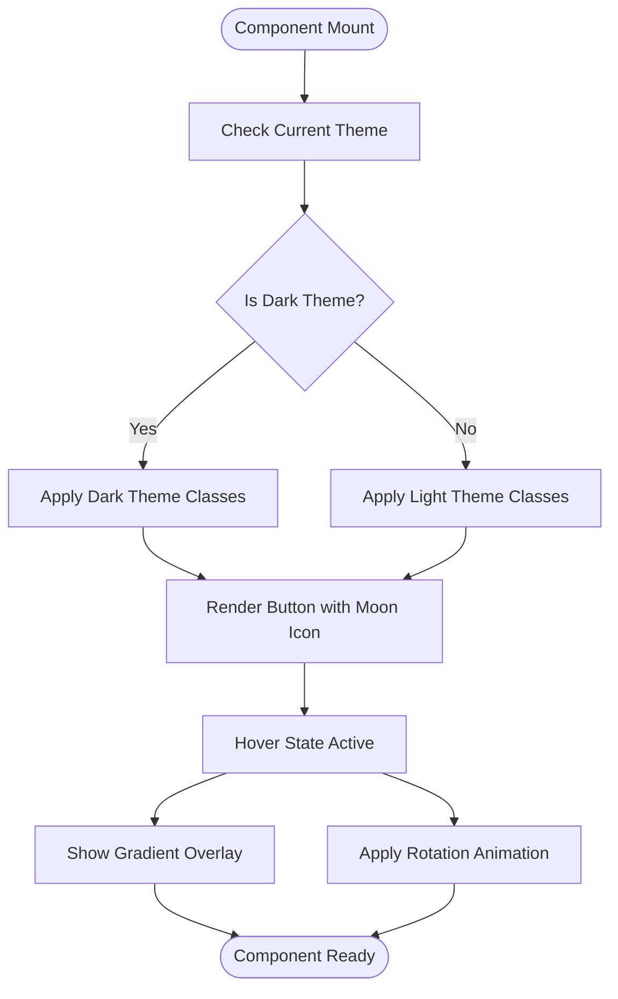
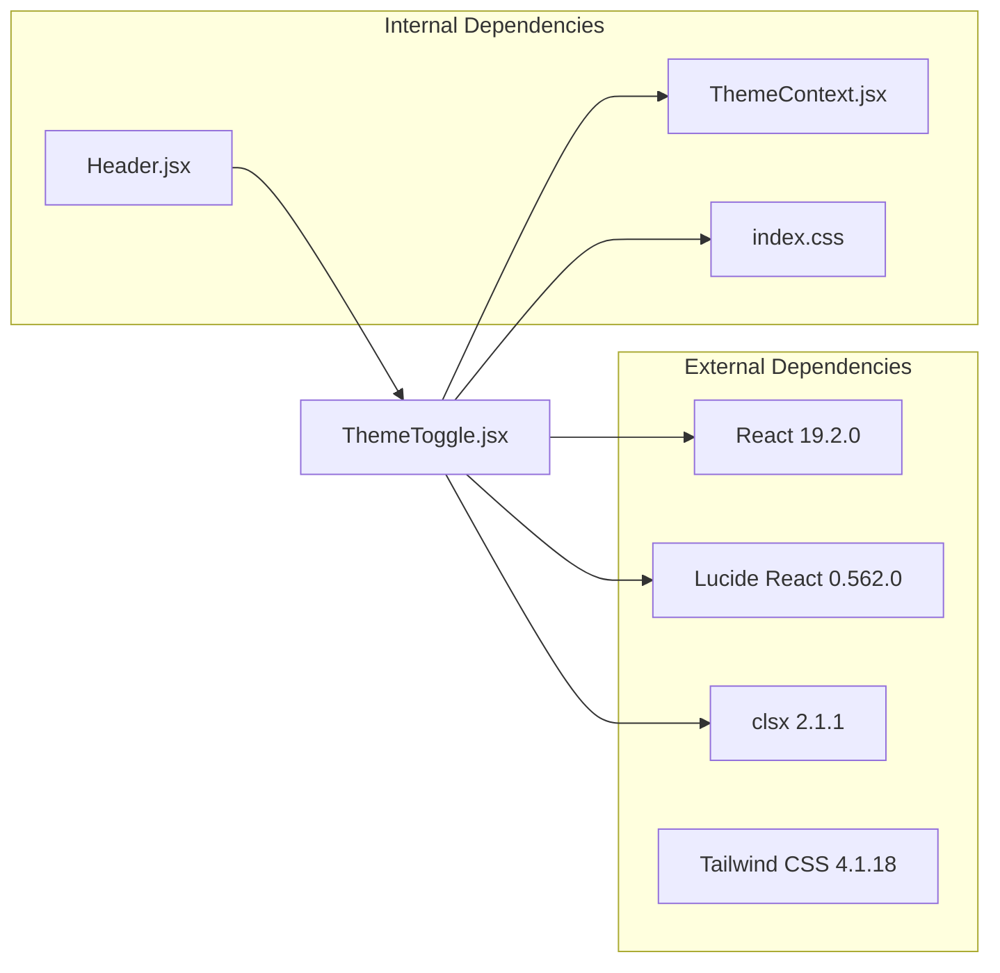
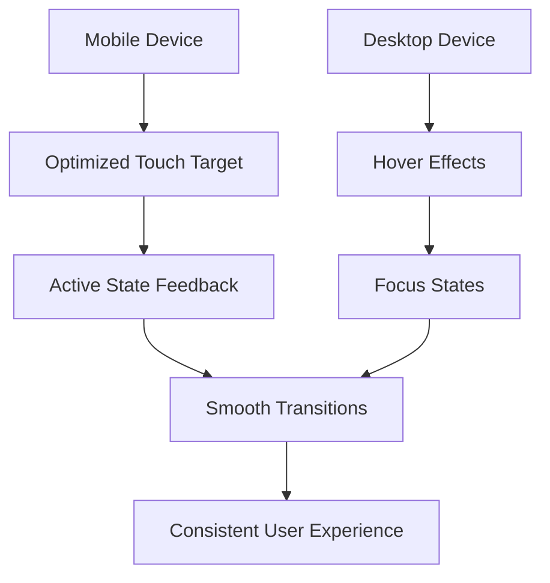

# Theme Toggle Component

<cite>
**Referenced Files in This Document**
- [ThemeToggle.jsx](file://frontend/src/components/ThemeToggle.jsx)
- [ThemeContext.jsx](file://frontend/src/context/ThemeContext.jsx)
- [Header.jsx](file://frontend/src/components/Header.jsx)
- [index.css](file://frontend/src/index.css)
- [main.jsx](file://frontend/src/main.jsx)
- [package.json](file://frontend/package.json)
</cite>

## Table of Contents
1. [Introduction](#introduction)
2. [Project Structure](#project-structure)
3. [Core Components](#core-components)
4. [Architecture Overview](#architecture-overview)
5. [Detailed Component Analysis](#detailed-component-analysis)
6. [Dependency Analysis](#dependency-analysis)
7. [Performance Considerations](#performance-considerations)
8. [Accessibility Features](#accessibility-features)
9. [Styling and Customization](#styling-and-customization)
10. [Responsive Design and Mobile Interaction](#responsive-design-and-mobile-interaction)
11. [Integration Examples](#integration-examples)
12. [Troubleshooting Guide](#troubleshooting-guide)
13. [Conclusion](#conclusion)

## Introduction

The ThemeToggle component is a crucial UI element responsible for switching between light and dark themes in the MedVita application. This component serves as the primary interface for users to control the application's visual appearance, providing immediate feedback through animated transitions and maintaining accessibility compliance.

The component integrates seamlessly with the ThemeContext system, utilizing React's Context API to manage theme state across the entire application. It combines modern UI design principles with functional accessibility requirements, offering both visual and interactive feedback during theme transitions.

## Project Structure

The ThemeToggle component is strategically positioned within the application's component hierarchy, designed for optimal integration with the header navigation system. The component follows a modular architecture that promotes reusability and maintainability.

**Diagram sources**
- [main.jsx](file://frontend/src/main.jsx#L8-L16)
- [Header.jsx](file://frontend/src/components/Header.jsx#L84-L85)
- [ThemeToggle.jsx](file://frontend/src/components/ThemeToggle.jsx#L1-L31)
- [ThemeContext.jsx](file://frontend/src/context/ThemeContext.jsx#L5-L69)

**Section sources**
- [main.jsx](file://frontend/src/main.jsx#L1-L16)
- [Header.jsx](file://frontend/src/components/Header.jsx#L1-L158)

## Core Components

The ThemeToggle component consists of several interconnected parts that work together to provide seamless theme switching functionality:

### Primary Component Structure
The component utilizes a button element as its base structure, enhanced with sophisticated styling and animation capabilities. The implementation leverages modern React patterns including hooks and context consumption.

### Theme Context Integration
Through the useTheme hook, the component accesses the global theme state and toggle function, enabling bidirectional communication with the ThemeContext provider. This integration ensures that theme changes propagate throughout the entire application.

### Icon Representation System
The component employs Lucide React icons to visually represent the current theme state, with automatic rotation animations indicating the direction of change. The sun icon appears in light mode while the moon icon displays in dark mode.

**Section sources**
- [ThemeToggle.jsx](file://frontend/src/components/ThemeToggle.jsx#L1-L31)
- [ThemeContext.jsx](file://frontend/src/context/ThemeContext.jsx#L71-L78)

## Architecture Overview

The ThemeToggle component operates within a well-defined architectural pattern that emphasizes separation of concerns and state management efficiency.

**Diagram sources**
- [ThemeToggle.jsx](file://frontend/src/components/ThemeToggle.jsx#L9-L11)
- [ThemeContext.jsx](file://frontend/src/context/ThemeContext.jsx#L53-L55)
- [ThemeContext.jsx](file://frontend/src/context/ThemeContext.jsx#L34-L51)

The architecture demonstrates a unidirectional data flow where user interactions trigger state changes that propagate through the component tree, ensuring predictable behavior and easy debugging.

**Section sources**
- [ThemeContext.jsx](file://frontend/src/context/ThemeContext.jsx#L1-L79)

## Detailed Component Analysis

### Component Implementation Details

The ThemeToggle component implements a sophisticated button design that responds to theme changes through dynamic class application and icon rotation animations.

#### Button Structure and Styling
The component creates a responsive button element with rounded corners, gradient backgrounds, and subtle shadows. The styling system automatically adapts based on the current theme, providing distinct visual identities for light and dark modes.

#### Dynamic Class Application
The component uses clsx for conditional class concatenation, applying different styles based on the current theme state. This approach ensures optimal performance while maintaining clean, readable code.

#### Icon Animation System
The component implements a dual-icon system where the sun and moon icons rotate to indicate theme transitions. The animation timing and easing functions create smooth, visually pleasing transitions.

**Diagram sources**
- [ThemeToggle.jsx](file://frontend/src/components/ThemeToggle.jsx#L11-L27)

**Section sources**
- [ThemeToggle.jsx](file://frontend/src/components/ThemeToggle.jsx#L1-L31)

### Theme Context Integration

The component's integration with ThemeContext demonstrates best practices for React state management and context consumption.

#### Hook Implementation
The useTheme hook provides a clean abstraction layer for accessing theme-related state and functions. The hook enforces proper usage by throwing descriptive errors when used outside the provider context.

#### State Management
The ThemeProvider manages theme state through React's useState hook, with automatic persistence to localStorage for maintaining user preferences across sessions.

#### Effect System
The useEffect hook synchronizes theme state with the document element, applying appropriate CSS classes and attributes that drive the visual styling system.

**Section sources**
- [ThemeContext.jsx](file://frontend/src/context/ThemeContext.jsx#L1-L79)

## Dependency Analysis

The ThemeToggle component relies on several external dependencies that contribute to its functionality and appearance.

**Diagram sources**
- [package.json](file://frontend/package.json#L13-L31)
- [ThemeToggle.jsx](file://frontend/src/components/ThemeToggle.jsx#L1-L3)

The dependency graph reveals a focused set of external libraries that enable the component's functionality without introducing unnecessary bloat. Each dependency serves a specific purpose in the component's architecture.

**Section sources**
- [package.json](file://frontend/package.json#L1-L50)

## Performance Considerations

The ThemeToggle component is designed with performance optimization in mind, implementing several strategies to minimize rendering overhead and maximize responsiveness.

### Efficient Rendering
The component uses memoized class names and conditional rendering to minimize DOM manipulation. The clsx library efficiently handles class concatenation without creating unnecessary intermediate objects.

### Animation Performance
CSS-based animations leverage GPU acceleration through transform and opacity properties, ensuring smooth 60fps animations even on lower-end devices.

### Memory Management
The component avoids creating closures or binding functions in render, reducing memory allocation and garbage collection pressure.

### State Optimization
The useTheme hook provides a stable reference to the context object, preventing unnecessary re-renders of components that consume the hook.

## Accessibility Features

The ThemeToggle component implements comprehensive accessibility features to ensure inclusive user experiences across diverse abilities and assistive technologies.

### ARIA Compliance
The component includes an aria-label attribute that provides screen readers with meaningful context about the button's purpose. This label clearly communicates the action performed when activated.

### Keyboard Navigation
The button element inherits default keyboard accessibility from HTML semantics, allowing users to activate the component using the Enter or Space keys. The component maintains focus styles through Tailwind's focus utilities.

### Screen Reader Compatibility
The aria-label provides explicit context for screen reader users, eliminating ambiguity about the button's function. The component's visual state changes are reflected in the underlying theme classes that screen readers can interpret.

### Focus Management
The component includes focus-visible styles that provide clear visual indicators for keyboard navigation users, ensuring discoverability across different input methods.

### Color Contrast
The component maintains sufficient color contrast ratios in both light and dark modes, meeting WCAG 2.1 guidelines for accessibility. The gradient backgrounds and borders are carefully chosen to preserve readability.

**Section sources**
- [ThemeToggle.jsx](file://frontend/src/components/ThemeToggle.jsx#L18-L18)

## Styling and Customization

The ThemeToggle component offers extensive customization options through Tailwind CSS utilities and CSS custom properties.

### Tailwind CSS Integration
The component leverages Tailwind's utility-first approach for rapid styling development. The class names are structured to provide clear visual hierarchy and maintain consistency with the application's design system.

### CSS Custom Properties
The styling system utilizes CSS custom properties for theme-aware color management. These properties adapt dynamically based on the current theme, ensuring consistent visual behavior across different modes.

### Responsive Design
The component includes responsive breakpoints that adjust spacing, sizing, and typography based on viewport dimensions. This ensures optimal usability across desktop, tablet, and mobile devices.

### Animation System
The component implements a sophisticated animation system using CSS transitions and transforms. The animations are carefully tuned for performance while providing engaging user feedback.

#### Customization Options
- **Size Variations**: The component accepts a className prop that allows developers to override default styling
- **Color Schemes**: Theme-specific colors are automatically applied based on the current theme state
- **Animation Timing**: Transition durations and easing functions can be customized through CSS variables
- **Spacing Adjustments**: Padding and margin values can be modified to fit different layout requirements

**Section sources**
- [ThemeToggle.jsx](file://frontend/src/components/ThemeToggle.jsx#L11-L17)
- [index.css](file://frontend/src/index.css#L1-L781)

## Responsive Design and Mobile Interaction

The ThemeToggle component is designed with mobile-first principles, ensuring optimal performance and usability across all device types.

### Mobile Touch Interaction
The component's button element provides excellent touch target sizing with appropriate padding and spacing. The hover effects are replaced with active states for touch devices, ensuring responsive feedback.

### Adaptive Layout
The component includes media queries that adjust behavior based on screen size. On smaller screens, the component maintains optimal touch targets while preserving visual appeal.

### Gesture Support
The component responds to various touch gestures including tap, press, and long-press interactions. The animation system provides tactile feedback that enhances the user experience.

### Orientation Handling
The component gracefully handles orientation changes, maintaining proper alignment and spacing regardless of device orientation.

**Section sources**
- [ThemeToggle.jsx](file://frontend/src/components/ThemeToggle.jsx#L11-L17)
- [Header.jsx](file://frontend/src/components/Header.jsx#L42-L48)

## Integration Examples

The ThemeToggle component integrates seamlessly with various parts of the application architecture, providing flexible deployment options.

### Header Integration
The component is prominently featured in the application header, positioned alongside other navigation controls. Its placement ensures high discoverability while maintaining visual balance.

### Context Provider Setup
The component requires proper setup within the ThemeProvider context. The main application entry point demonstrates the correct initialization pattern.

### Custom Styling Implementation
Developers can easily customize the component's appearance by passing additional className values. The component's design accommodates various styling approaches without requiring code modifications.

#### Example Integration Patterns
- **Direct Placement**: Import and render the component directly in desired locations
- **Wrapper Components**: Encapsulate the component within custom wrapper elements for additional functionality
- **Conditional Rendering**: Use the component conditionally based on user roles or application state
- **Styling Extensions**: Override default styles through className prop for brand-specific customization

**Section sources**
- [Header.jsx](file://frontend/src/components/Header.jsx#L84-L85)
- [main.jsx](file://frontend/src/main.jsx#L8-L16)

## Troubleshooting Guide

Common issues and solutions for the ThemeToggle component implementation.

### Theme State Not Updating
**Symptoms**: Clicking the toggle button has no visual effect
**Solution**: Verify that the ThemeProvider is properly wrapping the application and that the useTheme hook is being called within the provider context.

### Incorrect Theme Persistence
**Symptoms**: Theme preference resets between browser sessions
**Solution**: Check localStorage availability and ensure the ThemeProvider is properly configured to save state to localStorage.

### Styling Issues
**Symptoms**: Component appears unstyled or incorrectly styled
**Solution**: Verify Tailwind CSS configuration and ensure the component's class names match the expected Tailwind utilities.

### Accessibility Problems
**Symptoms**: Screen reader cannot identify the button's purpose
**Solution**: Confirm that the aria-label attribute is present and provides meaningful context about the button's function.

### Performance Issues
**Symptoms**: Slow response to user interactions or janky animations
**Solution**: Review CSS animation properties and ensure hardware acceleration is being utilized effectively.

**Section sources**
- [ThemeContext.jsx](file://frontend/src/context/ThemeContext.jsx#L71-L78)
- [ThemeToggle.jsx](file://frontend/src/components/ThemeToggle.jsx#L18-L18)

## Conclusion

The ThemeToggle component represents a well-architected solution for theme switching functionality within the MedVita application. Its implementation demonstrates best practices in React development, including proper context usage, accessibility compliance, and performance optimization.

The component successfully balances aesthetic appeal with functional requirements, providing users with intuitive theme control while maintaining technical excellence. The integration with the broader application architecture ensures seamless operation across all application features.

Through careful attention to responsive design, mobile interaction patterns, and accessibility standards, the component delivers a superior user experience that adapts to diverse usage scenarios. The extensible design allows for future enhancements while maintaining backward compatibility and performance standards.