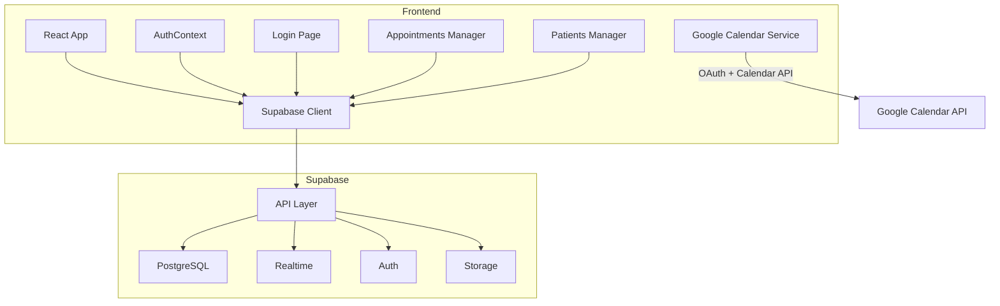
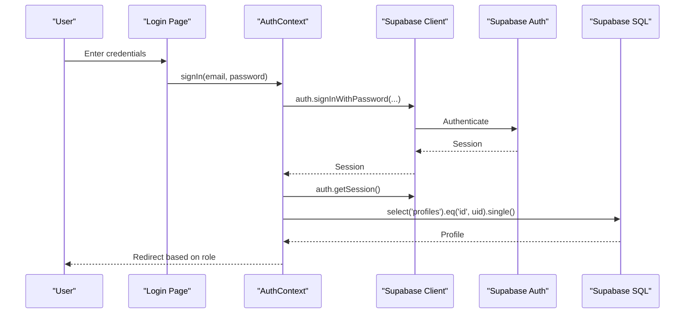
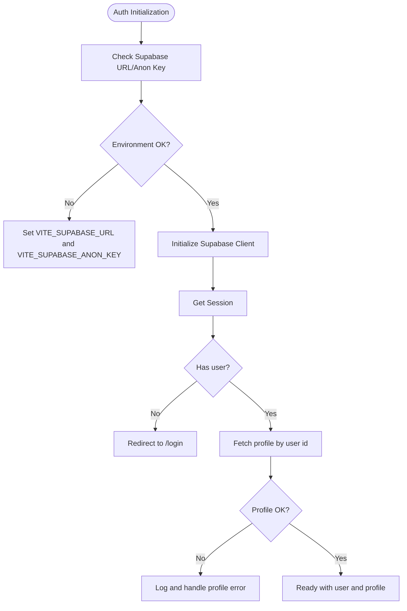
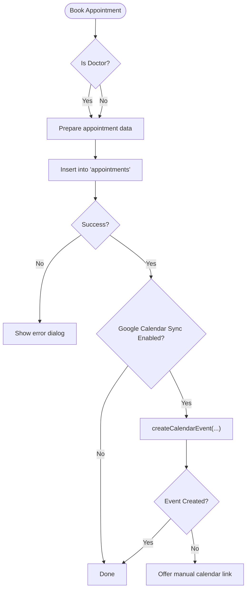
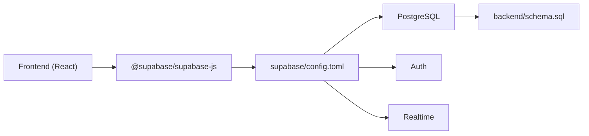

# Troubleshooting & FAQ

<cite>
**Referenced Files in This Document**
- [README.md](file://README.md)
- [frontend/.env.example](file://frontend/.env.example)
- [frontend/package.json](file://frontend/package.json)
- [supabase/config.toml](file://supabase/config.toml)
- [backend/schema.sql](file://backend/schema.sql)
- [frontend/src/lib/supabaseClient.js](file://frontend/src/lib/supabaseClient.js)
- [frontend/src/context/AuthContext.jsx](file://frontend/src/context/AuthContext.jsx)
- [frontend/src/pages/Login.jsx](file://frontend/src/pages/Login.jsx)
- [frontend/src/pages/AppointmentsManager.jsx](file://frontend/src/pages/AppointmentsManager.jsx)
- [frontend/src/pages/PatientsManager.jsx](file://frontend/src/pages/PatientsManager.jsx)
- [frontend/src/lib/googleCalendar.js](file://frontend/src/lib/googleCalendar.js)
- [frontend/GOOGLE_CALENDAR_SETUP.md](file://frontend/GOOGLE_CALENDAR_SETUP.md)
- [frontend/src/components/ProtectedRoute.jsx](file://frontend/src/components/ProtectedRoute.jsx)
</cite>

## Table of Contents
1. [Introduction](#introduction)
2. [Project Structure](#project-structure)
3. [Core Components](#core-components)
4. [Architecture Overview](#architecture-overview)
5. [Detailed Component Analysis](#detailed-component-analysis)
6. [Dependency Analysis](#dependency-analysis)
7. [Performance Considerations](#performance-considerations)
8. [Troubleshooting Guide](#troubleshooting-guide)
9. [Conclusion](#conclusion)
10. [Appendices](#appendices)

## Introduction
This document provides a comprehensive Troubleshooting and FAQ guide for MedVita. It focuses on common setup issues (environment configuration, dependency installation, database connectivity), runtime errors (authentication failures, real-time synchronization), debugging techniques for frontend and backend, performance troubleshooting (slow loading, memory leaks, query optimization), and operational guidance (diagnostic tools, log analysis, monitoring, escalation, and preventive maintenance).

## Project Structure
MedVita is a frontend-first React application integrated with Supabase for authentication, database, and real-time features. The Supabase configuration defines ports, authentication policies, and service toggles. The frontend consumes Supabase SDK and exposes environment variables for Supabase and Google Calendar integration.

**Diagram sources**
- [frontend/src/lib/supabaseClient.js](file://frontend/src/lib/supabaseClient.js#L1-L11)
- [frontend/src/context/AuthContext.jsx](file://frontend/src/context/AuthContext.jsx#L1-L108)
- [frontend/src/pages/Login.jsx](file://frontend/src/pages/Login.jsx#L1-L204)
- [frontend/src/pages/AppointmentsManager.jsx](file://frontend/src/pages/AppointmentsManager.jsx#L1-L577)
- [frontend/src/pages/PatientsManager.jsx](file://frontend/src/pages/PatientsManager.jsx#L1-L667)
- [frontend/src/lib/googleCalendar.js](file://frontend/src/lib/googleCalendar.js#L1-L199)
- [supabase/config.toml](file://supabase/config.toml#L1-L385)

**Section sources**
- [README.md](file://README.md#L1-L89)
- [frontend/package.json](file://frontend/package.json#L1-L50)
- [supabase/config.toml](file://supabase/config.toml#L1-L385)

## Core Components
- Supabase client initialization and environment validation
- Authentication context and protected routes
- Login page with error handling and redirection
- Appointments manager with Google Calendar sync
- Patients manager with search and filtering
- Google Calendar integration module

**Section sources**
- [frontend/src/lib/supabaseClient.js](file://frontend/src/lib/supabaseClient.js#L1-L11)
- [frontend/src/context/AuthContext.jsx](file://frontend/src/context/AuthContext.jsx#L1-L108)
- [frontend/src/pages/Login.jsx](file://frontend/src/pages/Login.jsx#L1-L204)
- [frontend/src/pages/AppointmentsManager.jsx](file://frontend/src/pages/AppointmentsManager.jsx#L1-L577)
- [frontend/src/pages/PatientsManager.jsx](file://frontend/src/pages/PatientsManager.jsx#L1-L667)
- [frontend/src/lib/googleCalendar.js](file://frontend/src/lib/googleCalendar.js#L1-L199)

## Architecture Overview
The frontend authenticates via Supabase Auth, queries Supabase SQL tables, and subscribes to Supabase Realtime for live updates. Google Calendar integration is optional and requires OAuth consent and token storage.

**Diagram sources**
- [frontend/src/pages/Login.jsx](file://frontend/src/pages/Login.jsx#L20-L75)
- [frontend/src/context/AuthContext.jsx](file://frontend/src/context/AuthContext.jsx#L14-L61)
- [frontend/src/lib/supabaseClient.js](file://frontend/src/lib/supabaseClient.js#L1-L11)

## Detailed Component Analysis

### Authentication and Authorization
Common issues:
- Missing Supabase URL or Anon Key in environment
- Profile not fetched or role mismatch
- Protected route access denied

Resolution steps:
- Verify environment variables are present and correct
- Confirm Supabase project is initialized and reachable
- Ensure user profile exists and role is set

**Diagram sources**
- [frontend/src/lib/supabaseClient.js](file://frontend/src/lib/supabaseClient.js#L6-L8)
- [frontend/src/context/AuthContext.jsx](file://frontend/src/context/AuthContext.jsx#L14-L61)

**Section sources**
- [frontend/src/lib/supabaseClient.js](file://frontend/src/lib/supabaseClient.js#L1-L11)
- [frontend/src/context/AuthContext.jsx](file://frontend/src/context/AuthContext.jsx#L1-L108)
- [frontend/src/pages/Login.jsx](file://frontend/src/pages/Login.jsx#L1-L204)
- [frontend/src/components/ProtectedRoute.jsx](file://frontend/src/components/ProtectedRoute.jsx#L53-L106)

### Appointments Manager and Google Calendar Sync
Common issues:
- Google Calendar sync fails silently
- Not authenticated with Google Calendar
- Events not appearing in Google Calendar

Resolution steps:
- Confirm Google Calendar integration is enabled in profile settings
- Ensure OAuth consent screen is configured and scopes are correct
- Verify environment variables for Google Client ID and API Key
- Check browser console for detailed error messages

**Diagram sources**
- [frontend/src/pages/AppointmentsManager.jsx](file://frontend/src/pages/AppointmentsManager.jsx#L134-L180)
- [frontend/src/lib/googleCalendar.js](file://frontend/src/lib/googleCalendar.js#L126-L178)

**Section sources**
- [frontend/src/pages/AppointmentsManager.jsx](file://frontend/src/pages/AppointmentsManager.jsx#L1-L577)
- [frontend/src/lib/googleCalendar.js](file://frontend/src/lib/googleCalendar.js#L1-L199)
- [frontend/GOOGLE_CALENDAR_SETUP.md](file://frontend/GOOGLE_CALENDAR_SETUP.md#L1-L117)

### Patients Manager and Data Loading
Common issues:
- Slow loading or blank lists
- Search not returning results
- Error banners displayed

Resolution steps:
- Debounce search input to reduce network calls
- Verify filters and date ranges are applied correctly
- Inspect console for thrown errors and surface messages to users

**Section sources**
- [frontend/src/pages/PatientsManager.jsx](file://frontend/src/pages/PatientsManager.jsx#L56-L121)

## Dependency Analysis
- Frontend depends on Supabase JS client and environment variables
- Supabase configuration controls API ports, auth policies, and service toggles
- Database schema defines tables, RLS policies, and triggers

**Diagram sources**
- [frontend/package.json](file://frontend/package.json#L13-L32)
- [supabase/config.toml](file://supabase/config.toml#L1-L385)
- [backend/schema.sql](file://backend/schema.sql#L1-L274)

**Section sources**
- [frontend/package.json](file://frontend/package.json#L1-L50)
- [supabase/config.toml](file://supabase/config.toml#L1-L385)
- [backend/schema.sql](file://backend/schema.sql#L1-L274)

## Performance Considerations
- Network efficiency
  - Batch queries where possible
  - Use appropriate filters to limit result sets
  - Debounce search inputs to avoid excessive requests
- Memory usage
  - Avoid storing large arrays in state
  - Clean up subscriptions and timers on unmount
- Database optimization
  - Ensure indexes exist for frequently queried columns (e.g., user_id, created_at)
  - Use LIMIT and ORDER appropriately
  - Prefer selective field retrieval

[No sources needed since this section provides general guidance]

## Troubleshooting Guide

### Setup Problems

- Environment configuration issues
  - Symptom: Missing Supabase URL or Anon Key warnings
  - Resolution: Set VITE_SUPABASE_URL and VITE_SUPABASE_ANON_KEY in frontend .env
  - Validation: Confirm values are present at runtime

  **Section sources**
  - [frontend/src/lib/supabaseClient.js](file://frontend/src/lib/supabaseClient.js#L6-L8)
  - [frontend/.env.example](file://frontend/.env.example#L6-L9)

- Dependency installation issues
  - Symptom: Build or dev server fails due to missing packages
  - Resolution: Install dependencies using npm install in frontend directory
  - Validation: Confirm package.json dependencies are satisfied

  **Section sources**
  - [frontend/package.json](file://frontend/package.json#L1-L50)

- Database connection and schema setup
  - Symptom: Tables or policies not found
  - Resolution: Import backend/schema.sql into Supabase SQL editor
  - Validation: Verify tables and policies exist in Supabase

  **Section sources**
  - [backend/schema.sql](file://backend/schema.sql#L1-L274)
  - [README.md](file://README.md#L77-L81)

### Runtime Errors

- Authentication failures
  - Symptom: Login errors, invalid credentials, rate limits
  - Resolution: Check credentials, confirm email confirmation, wait for rate limit cooldown
  - Validation: Inspect console logs and error messages from login handler

  **Section sources**
  - [frontend/src/pages/Login.jsx](file://frontend/src/pages/Login.jsx#L59-L75)

- Protected route access denied
  - Symptom: Unauthorized page or redirect loop
  - Resolution: Ensure profile role matches allowed roles; verify home route alignment
  - Validation: Check role mapping and profile presence

  **Section sources**
  - [frontend/src/components/ProtectedRoute.jsx](file://frontend/src/components/ProtectedRoute.jsx#L53-L106)

- Real-time synchronization problems
  - Symptom: Updates not reflecting immediately
  - Resolution: Verify Supabase Realtime is enabled and accessible
  - Validation: Confirm subscription events and logs

  **Section sources**
  - [supabase/config.toml](file://supabase/config.toml#L77-L83)

- Google Calendar sync issues
  - Symptom: Sync fails or not authenticated
  - Resolution: Reconfigure OAuth consent screen, verify scopes, restart dev server
  - Validation: Check browser console and token storage

  **Section sources**
  - [frontend/src/lib/googleCalendar.js](file://frontend/src/lib/googleCalendar.js#L126-L178)
  - [frontend/GOOGLE_CALENDAR_SETUP.md](file://frontend/GOOGLE_CALENDAR_SETUP.md#L83-L104)

### Debugging Techniques

- Frontend debugging
  - Use browser DevTools to inspect network requests and console logs
  - Verify environment variables are injected correctly
  - Monitor Supabase client initialization and session callbacks

  **Section sources**
  - [frontend/src/lib/supabaseClient.js](file://frontend/src/lib/supabaseClient.js#L1-L11)
  - [frontend/src/context/AuthContext.jsx](file://frontend/src/context/AuthContext.jsx#L26-L40)

- Backend and Supabase debugging
  - Review Supabase logs and SQL editor for errors
  - Validate RLS policies and triggers
  - Confirm service ports and toggles in config.toml

  **Section sources**
  - [supabase/config.toml](file://supabase/config.toml#L1-L385)
  - [backend/schema.sql](file://backend/schema.sql#L239-L274)

- Integration debugging
  - Test Google Calendar OAuth flow and token persistence
  - Validate calendar event creation and fallback links

  **Section sources**
  - [frontend/src/lib/googleCalendar.js](file://frontend/src/lib/googleCalendar.js#L56-L105)
  - [frontend/src/pages/AppointmentsManager.jsx](file://frontend/src/pages/AppointmentsManager.jsx#L163-L171)

### Performance Troubleshooting

- Slow loading times
  - Reduce initial payload sizes
  - Implement pagination or virtualization for large lists
  - Debounce search and filter operations

- Memory leaks
  - Unsubscribe from Supabase channels and remove event listeners on unmount
  - Avoid retaining large objects in state

- Database query optimization
  - Add indexes on frequently filtered columns
  - Limit result sets and use selective field retrieval
  - Use appropriate ORDER and LIMIT clauses

[No sources needed since this section provides general guidance]

### Common User-Reported Issues and Resolutions

- “I cannot log in”
  - Check credentials and confirmation status
  - Clear browser cache and retry

- “Appointments are not syncing to Google Calendar”
  - Re-enable sync and re-authenticate
  - Verify OAuth consent and scopes

- “Patients list is empty”
  - Adjust filters and search terms
  - Refresh the page and check for error banners

**Section sources**
- [frontend/src/pages/Login.jsx](file://frontend/src/pages/Login.jsx#L59-L75)
- [frontend/src/pages/AppointmentsManager.jsx](file://frontend/src/pages/AppointmentsManager.jsx#L163-L171)
- [frontend/src/pages/PatientsManager.jsx](file://frontend/src/pages/PatientsManager.jsx#L268-L272)

### Diagnostic Tools, Log Analysis, and Monitoring

- Browser tools
  - Network tab to inspect Supabase API calls
  - Console tab for runtime errors and warnings
  - Application tab to verify environment variables and local storage

- Supabase monitoring
  - Use Supabase logs and SQL editor to track queries and errors
  - Monitor Realtime subscriptions and auth events

- Frontend observability
  - Add structured logging around critical flows (auth, booking, sync)
  - Capture and report error boundaries

**Section sources**
- [frontend/src/lib/supabaseClient.js](file://frontend/src/lib/supabaseClient.js#L6-L8)
- [frontend/src/context/AuthContext.jsx](file://frontend/src/context/AuthContext.jsx#L26-L40)
- [supabase/config.toml](file://supabase/config.toml#L1-L385)

### Escalation Procedures and Support Resources

- Internal escalation
  - Capture environment details, Supabase project ID, and error logs
  - Reproduce with minimal steps and share Supabase SQL and config.toml excerpts

- External support
  - Refer users to Supabase documentation and community forums
  - For Google Calendar integration, consult OAuth and Calendar API docs

**Section sources**
- [README.md](file://README.md#L82-L89)
- [frontend/GOOGLE_CALENDAR_SETUP.md](file://frontend/GOOGLE_CALENDAR_SETUP.md#L112-L117)

### Preventive Measures and Maintenance Recommendations

- Environment hygiene
  - Keep environment variables scoped and documented
  - Avoid committing secrets to version control

- Database maintenance
  - Regularly review and optimize RLS policies
  - Monitor query performance and add indexes as needed

- Frontend stability
  - Add error boundaries and graceful degradation
  - Implement retry logic for transient failures

- Integration safeguards
  - Validate OAuth consent screen configuration regularly
  - Monitor token expiration and refresh behavior

**Section sources**
- [frontend/.env.example](file://frontend/.env.example#L1-L9)
- [supabase/config.toml](file://supabase/config.toml#L1-L385)
- [backend/schema.sql](file://backend/schema.sql#L1-L274)

## Conclusion
By following this Troubleshooting and FAQ guide, teams can quickly diagnose and resolve common setup, runtime, and integration issues in MedVita. Adopting the recommended preventive measures and monitoring practices will improve system reliability and reduce incident response time.

## Appendices

### Quick Checklist
- Environment variables present and correct
- Supabase project initialized and reachable
- Database schema imported and policies applied
- Google Calendar OAuth configured and tokens stored
- Frontend dependencies installed and healthy

**Section sources**
- [frontend/src/lib/supabaseClient.js](file://frontend/src/lib/supabaseClient.js#L6-L8)
- [backend/schema.sql](file://backend/schema.sql#L1-L274)
- [frontend/GOOGLE_CALENDAR_SETUP.md](file://frontend/GOOGLE_CALENDAR_SETUP.md#L44-L62)