# Badge Component

<cite>
**Referenced Files in This Document**
- [Badge.jsx](file://frontend/src/components/ui/Badge.jsx)
- [AppointmentsManager.jsx](file://frontend/src/pages/AppointmentsManager.jsx)
- [PatientsManager.jsx](file://frontend/src/pages/PatientsManager.jsx)
- [PatientDetails.jsx](file://frontend/src/components/PatientDetails.jsx)
- [Button.jsx](file://frontend/src/components/ui/Button.jsx)
- [README.md](file://frontend/README.md)
</cite>

## Table of Contents
1. [Introduction](#introduction)
2. [Component Specification](#component-specification)
3. [Variant Definitions](#variant-definitions)
4. [Color Schemes and Semantic Meanings](#color-schemes-and-semantic-meanings)
5. [Usage Patterns](#usage-patterns)
6. [Styling Options](#styling-options)
7. [Positioning Strategies](#positioning-strategies)
8. [Accessibility Considerations](#accessibility-considerations)
9. [Integration Examples](#integration-examples)
10. [Best Practices](#best-practices)
11. [Troubleshooting Guide](#troubleshooting-guide)
12. [Conclusion](#conclusion)

## Introduction

The Badge component is a versatile UI element designed to display metadata, status indicators, and notification counts in the MedVita healthcare management system. Built with React and Tailwind CSS, the component provides consistent visual communication of state and importance across various healthcare contexts including patient records, appointment status, system alerts, and filtering interfaces.

The component follows healthcare design principles with careful color psychology, accessibility compliance, and responsive behavior suitable for both clinical and administrative workflows.

## Component Specification

### Core Implementation

The Badge component is implemented as a flexible React functional component that accepts children content and variant styling options. The component uses clsx for conditional class merging and provides a clean, accessible interface for displaying status information.

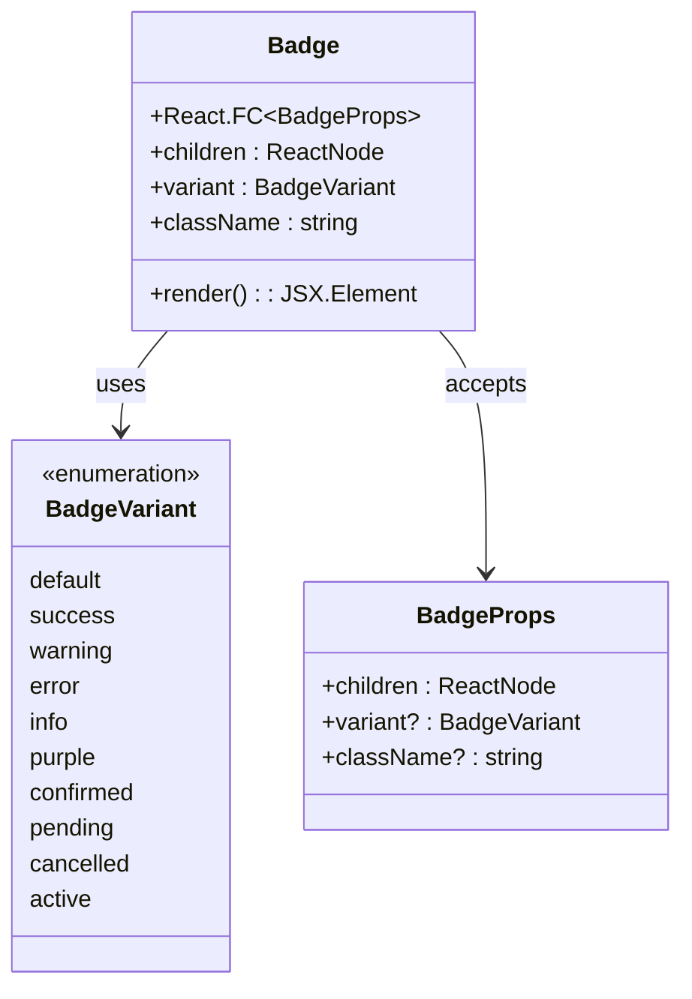

**Diagram sources**
- [Badge.jsx](file://frontend/src/components/ui/Badge.jsx#L3-L31)

### Component Architecture

The Badge component utilizes a modular design pattern with the following key characteristics:

- **Functional Component Pattern**: Stateless component with props-based configuration
- **CSS-in-JS Integration**: Uses clsx for dynamic class combination
- **Semantic HTML**: Renders as a span element for inline content
- **Flexible Styling**: Accepts additional className prop for customization
- **Default Variant Handling**: Falls back to default styling when variant is invalid

**Section sources**
- [Badge.jsx](file://frontend/src/components/ui/Badge.jsx#L1-L32)

## Variant Definitions

The Badge component supports nine distinct variants, each designed for specific healthcare contexts and semantic meanings:

### Standard Variants

| Variant | Purpose | Color Scheme | Use Case |
|---------|---------|--------------|----------|
| `default` | Neutral/default state | Gray background, gray text | Unspecified status, fallback option |
| `success` | Positive completion | Light green background, dark green text | Completed actions, successful operations |
| `warning` | Cautionary information | Light yellow background, dark orange text | Pending actions, requires attention |
| `error` | Critical/failure state | Light red background, dark red text | Errors, failed operations, cancelled events |
| `info` | Informative content | Light blue background, dark blue text | General information, notifications |

### Healthcare-Specific Variants

| Variant | Purpose | Color Scheme | Use Case |
|---------|---------|--------------|----------|
| `purple` | Alternative status | Teal background, dark teal text | Special categories, alternative states |
| `confirmed` | Doctor confirmation | Mint background, dark green text | Doctor-approved appointments, verified status |
| `pending` | Waiting state | Light orange background, dark orange text | Scheduled but awaiting confirmation |
| `cancelled` | Cancellation status | Light red background, dark red text | Cancelled appointments, discontinued actions |
| `active` | Current state | Teal background, dark teal text | Active patients, ongoing treatments |

**Section sources**
- [Badge.jsx](file://frontend/src/components/ui/Badge.jsx#L4-L15)

## Color Schemes and Semantic Meanings

### Color Psychology in Healthcare Contexts

The color scheme selection follows established healthcare design principles:

- **Green (#D1FAE5)**: Associated with healing, safety, and success
- **Yellow (#FEF3C7)**: Signals caution and attention without alarm
- **Red (#FEE2E2)**: Indicates danger, errors, and critical situations
- **Blue (#DBEAFE)**: Conveys trust, stability, and information
- **Teal (#E0F2F1)**: Balanced color representing health and wellness

### Semantic Mapping

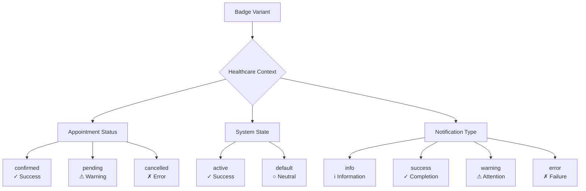

**Diagram sources**
- [Badge.jsx](file://frontend/src/components/ui/Badge.jsx#L5-L14)

**Section sources**
- [Badge.jsx](file://frontend/src/components/ui/Badge.jsx#L5-L14)

## Usage Patterns

### Appointment Status Display

The Badge component is extensively used to display appointment status in the Appointments Manager:

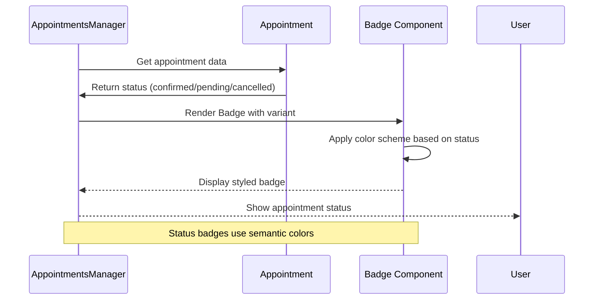

**Diagram sources**
- [AppointmentsManager.jsx](file://frontend/src/pages/AppointmentsManager.jsx#L288-L289)
- [AppointmentsManager.jsx](file://frontend/src/pages/AppointmentsManager.jsx#L550-L551)

### Patient Record Integration

In patient management interfaces, badges indicate patient status and recent activity:

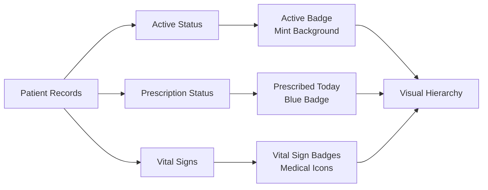

**Diagram sources**
- [PatientsManager.jsx](file://frontend/src/pages/PatientsManager.jsx#L357-L367)
- [PatientsManager.jsx](file://frontend/src/pages/PatientsManager.jsx#L442-L453)

**Section sources**
- [AppointmentsManager.jsx](file://frontend/src/pages/AppointmentsManager.jsx#L288-L289)
- [AppointmentsManager.jsx](file://frontend/src/pages/AppointmentsManager.jsx#L550-L551)
- [PatientsManager.jsx](file://frontend/src/pages/PatientsManager.jsx#L357-L367)
- [PatientsManager.jsx](file://frontend/src/pages/PatientsManager.jsx#L442-L453)

## Styling Options

### Base Styling Architecture

The Badge component implements a consistent base styling system:

- **Shape**: Circular pill-shaped design with 20px border radius
- **Typography**: Small text size (text-xs), bold font weight
- **Padding**: 3px horizontal, 1px vertical padding
- **Alignment**: Centered vertical alignment with gap spacing
- **Display**: Inline-flex container for proper alignment

### Responsive Design Features

The component adapts to different screen sizes and contexts:

- **Mobile Optimization**: Compact sizing for small screens
- **Desktop Enhancement**: Expanded padding for larger displays
- **Dark Mode Support**: Automatic color adaptation for dark themes
- **High Contrast Mode**: Maintains readability in accessibility modes

### Customization Capabilities

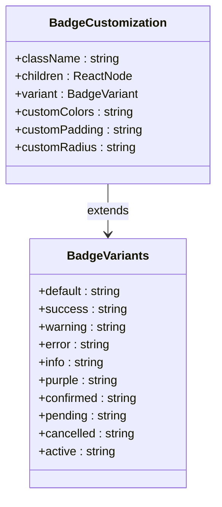

**Diagram sources**
- [Badge.jsx](file://frontend/src/components/ui/Badge.jsx#L19-L23)

**Section sources**
- [Badge.jsx](file://frontend/src/components/ui/Badge.jsx#L19-L23)

## Positioning Strategies

### Inline Positioning

Badges are commonly positioned inline with other content:

- **Left Alignment**: Status badges placed to the left of content
- **Right Alignment**: Notification badges positioned to the right
- **Top-Right Corner**: Notification counters in corners
- **Center Alignment**: Emphasis badges in the center of cards

### Container Integration

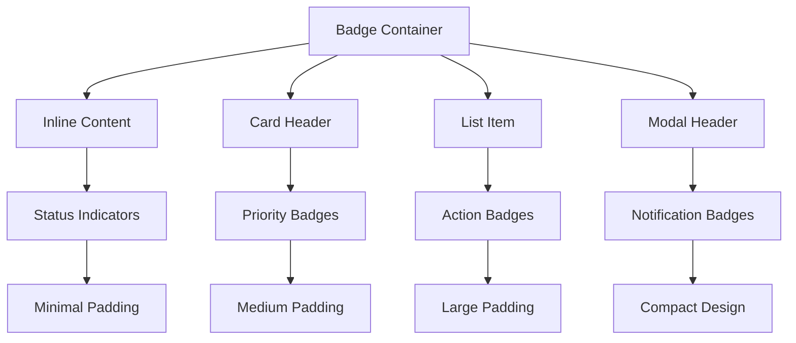

**Diagram sources**
- [AppointmentsManager.jsx](file://frontend/src/pages/AppointmentsManager.jsx#L288-L289)
- [PatientDetails.jsx](file://frontend/src/components/PatientDetails.jsx#L287-L295)

### Z-Index Management

Proper stacking context ensures badges appear above other content:

- **Modal Context**: Higher z-index for modal overlays
- **Card Context**: Standard z-index for card elements
- **Header Context**: Elevated z-index for header badges
- **Floating Context**: Fixed positioning for floating notifications

**Section sources**
- [AppointmentsManager.jsx](file://frontend/src/pages/AppointmentsManager.jsx#L288-L289)
- [PatientDetails.jsx](file://frontend/src/components/PatientDetails.jsx#L287-L295)

## Accessibility Considerations

### Color Contrast Compliance

The component maintains WCAG AA+ color contrast ratios:

- **Minimum Contrast Ratio**: 4.5:1 for normal text
- **Enhanced Contrast**: 7:1 for large text and important elements
- **Color Independence**: Information conveyed through color and text
- **Alternative Indicators**: Visual cues beyond color alone

### Screen Reader Compatibility

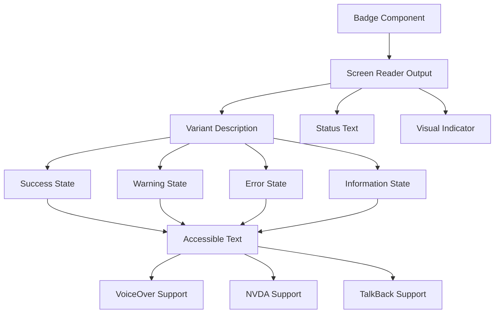

**Diagram sources**
- [Badge.jsx](file://frontend/src/components/ui/Badge.jsx#L25-L27)

### Dynamic Content Updates

The component handles real-time updates seamlessly:

- **State Changes**: Immediate visual updates when status changes
- **Animation Support**: Smooth transitions between states
- **Performance Optimization**: Efficient re-rendering
- **Memory Management**: Proper cleanup of event listeners

**Section sources**
- [Badge.jsx](file://frontend/src/components/ui/Badge.jsx#L25-L27)
- [README.md](file://frontend/README.md#L48-L48)

## Integration Examples

### Patient Records Integration

In patient management interfaces, badges provide essential status information:

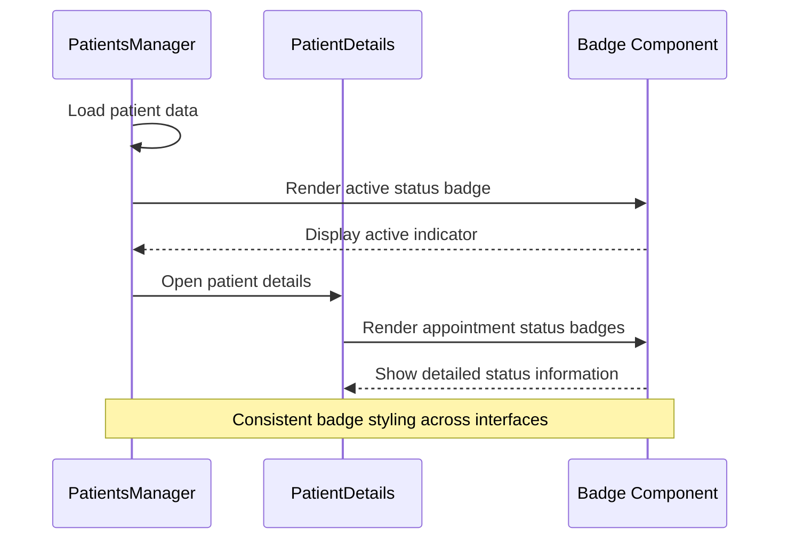

**Diagram sources**
- [PatientsManager.jsx](file://frontend/src/pages/PatientsManager.jsx#L357-L367)
- [PatientDetails.jsx](file://frontend/src/components/PatientDetails.jsx#L287-L295)

### Appointment Management Integration

The component integrates deeply with the appointment system:

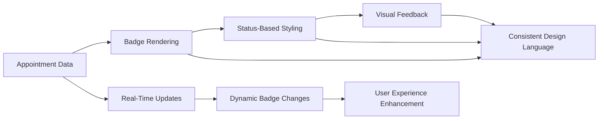

**Diagram sources**
- [AppointmentsManager.jsx](file://frontend/src/pages/AppointmentsManager.jsx#L288-L289)

**Section sources**
- [PatientsManager.jsx](file://frontend/src/pages/PatientsManager.jsx#L357-L367)
- [PatientDetails.jsx](file://frontend/src/components/PatientDetails.jsx#L287-L295)
- [AppointmentsManager.jsx](file://frontend/src/pages/AppointmentsManager.jsx#L288-L289)

## Best Practices

### Color Psychology Guidelines

When selecting badge variants for healthcare applications:

- **Critical Information**: Use red for emergency or critical status
- **Attention Required**: Use yellow/orange for pending or requires action
- **Positive Outcomes**: Use green for success, completion, or active states
- **Neutral Information**: Use gray for default or neutral status
- **Informational Content**: Use blue for informational or educational content

### Visual Hierarchy Principles

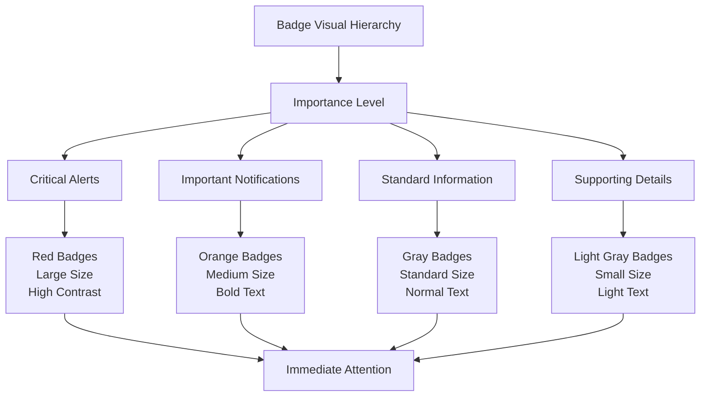

### Healthcare-Specific Recommendations

- **Consistency**: Maintain consistent color meanings across the application
- **Context Clarity**: Ensure badge meaning is clear without requiring training
- **Cultural Sensitivity**: Consider cultural associations with colors
- **Accessibility**: Test with assistive technologies regularly
- **Performance**: Minimize unnecessary re-renders for frequently updating badges

## Troubleshooting Guide

### Common Issues and Solutions

| Issue | Symptoms | Solution |
|-------|----------|----------|
| Color Contrast Problems | Low accessibility score | Adjust color combinations or add text indicators |
| Variant Not Applied | Badge uses default styling | Verify variant prop spelling and case sensitivity |
| Positioning Issues | Badge overlaps other content | Check z-index and positioning context |
| Performance Problems | Slow rendering in lists | Use memoization or virtualization for large datasets |
| Dark Mode Inconsistencies | Colors appear incorrect in dark mode | Ensure proper dark mode color variants are defined |

### Debugging Techniques

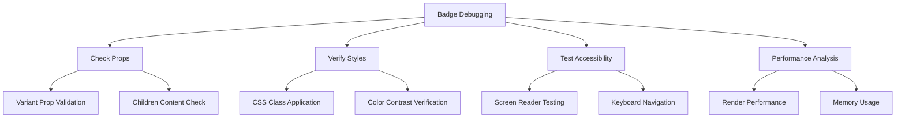

### Performance Optimization

- **Memoization**: Use React.memo for static badge content
- **Virtualization**: Implement list virtualization for large badge collections
- **Lazy Loading**: Defer badge rendering until needed
- **Optimized Updates**: Batch badge state updates when possible

**Section sources**
- [Badge.jsx](file://frontend/src/components/ui/Badge.jsx#L1-L32)

## Conclusion

The Badge component serves as a crucial element in MedVita's healthcare management system, providing clear visual communication of status, priority, and importance across various clinical and administrative contexts. Its thoughtful design balances accessibility requirements with healthcare-specific needs, ensuring reliable communication of critical information to both healthcare providers and patients.

The component's flexibility allows for extensive customization while maintaining consistency with the application's design system. Through careful color psychology, semantic meaning, and accessibility considerations, the Badge component enhances user experience and supports effective healthcare workflow management.

Future enhancements could include additional variant options for specialized healthcare contexts, improved animation support for state transitions, and expanded accessibility features for users with diverse needs.