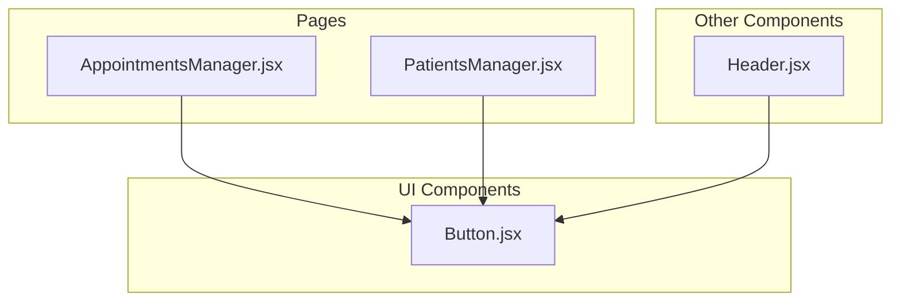
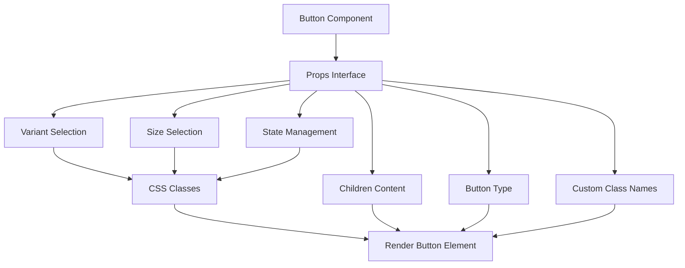
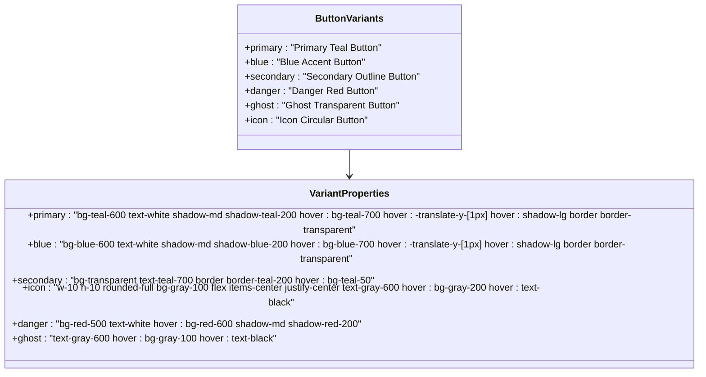
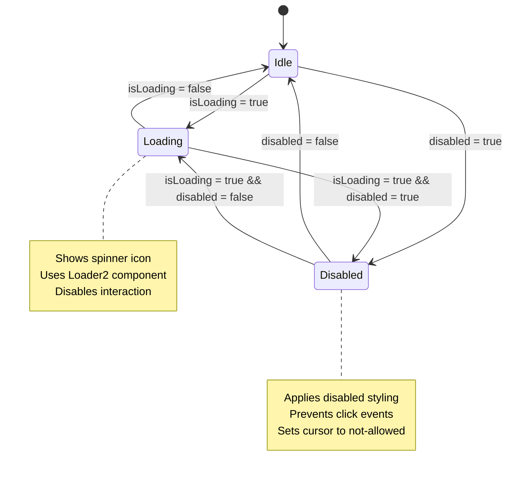
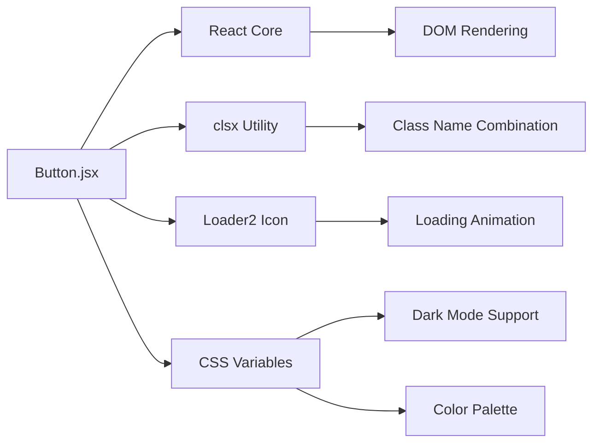
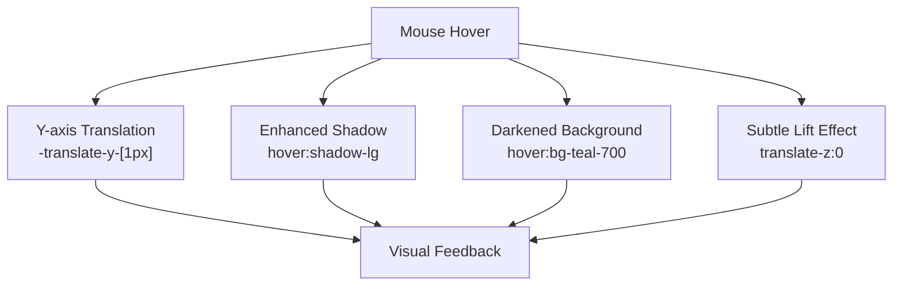
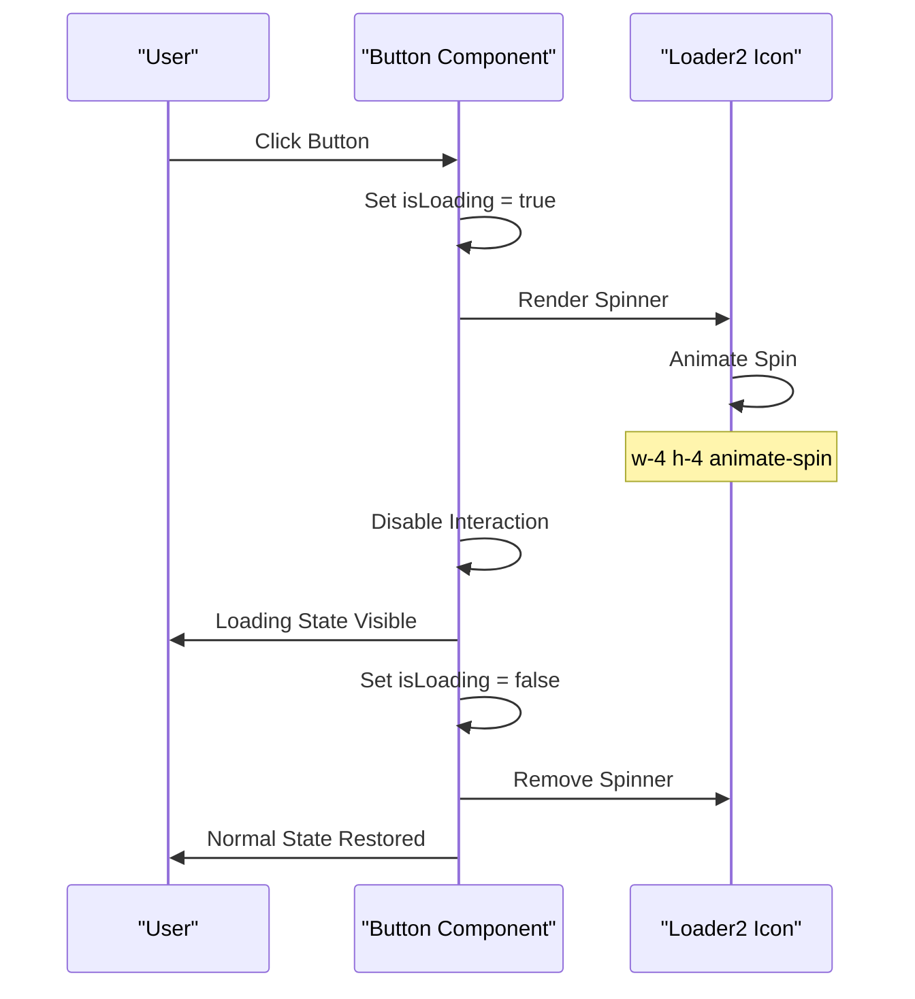

# Button Component

<cite>
**Referenced Files in This Document**
- [Button.jsx](file://frontend/src/components/ui/Button.jsx)
- [Header.jsx](file://frontend/src/components/Header.jsx)
- [AppointmentsManager.jsx](file://frontend/src/pages/AppointmentsManager.jsx)
- [PatientsManager.jsx](file://frontend/src/pages/PatientsManager.jsx)
- [index.css](file://frontend/src/index.css)
</cite>

## Table of Contents
1. [Introduction](#introduction)
2. [Project Structure](#project-structure)
3. [Core Components](#core-components)
4. [Architecture Overview](#architecture-overview)
5. [Detailed Component Analysis](#detailed-component-analysis)
6. [Dependency Analysis](#dependency-analysis)
7. [Performance Considerations](#performance-considerations)
8. [Accessibility Features](#accessibility-features)
9. [Usage Examples](#usage-examples)
10. [Animation System](#animation-system)
11. [Troubleshooting Guide](#troubleshooting-guide)
12. [Conclusion](#conclusion)

## Introduction
This document provides comprehensive documentation for the Button component used throughout the MedVita frontend application. It covers all available variants, size options, state management, props interface, default values, prop combinations, animations, accessibility features, usage examples, and best practices for button placement and labeling.

## Project Structure
The Button component is located in the UI components directory and is imported and used across multiple pages and components within the application.



**Diagram sources**
- [Button.jsx](file://frontend/src/components/ui/Button.jsx#L1-L51)
- [AppointmentsManager.jsx](file://frontend/src/pages/AppointmentsManager.jsx#L1-L577)
- [PatientsManager.jsx](file://frontend/src/pages/PatientsManager.jsx#L1-L667)
- [Header.jsx](file://frontend/src/components/Header.jsx#L1-L158)

**Section sources**
- [Button.jsx](file://frontend/src/components/ui/Button.jsx#L1-L51)
- [AppointmentsManager.jsx](file://frontend/src/pages/AppointmentsManager.jsx#L1-L577)
- [PatientsManager.jsx](file://frontend/src/pages/PatientsManager.jsx#L1-L667)
- [Header.jsx](file://frontend/src/components/Header.jsx#L1-L158)

## Core Components
The Button component is a reusable UI element that renders a styled button with configurable variants, sizes, and states. It supports loading states, disabled states, and integrates with the application's theming system.

Key features:
- Variant system with six distinct styles
- Size options for different contexts
- Loading and disabled state management
- Accessibility-compliant implementation
- Theme-aware styling

**Section sources**
- [Button.jsx](file://frontend/src/components/ui/Button.jsx#L5-L14)

## Architecture Overview
The Button component follows a functional React pattern with internal state management for variant and size selection, and external props for behavior control.



**Diagram sources**
- [Button.jsx](file://frontend/src/components/ui/Button.jsx#L5-L50)

## Detailed Component Analysis

### Props Interface and Defaults
The Button component accepts the following props with their default values:

| Prop | Type | Default | Description |
|------|------|---------|-------------|
| `children` | ReactNode | Required | Button content and label |
| `variant` | string | `'primary'` | Visual style variant |
| `size` | string | `'md'` | Button size option |
| `className` | string | `undefined` | Additional CSS classes |
| `isLoading` | boolean | `false` | Loading state indicator |
| `disabled` | boolean | `false` | Disabled state flag |
| `type` | string | `'button'` | HTML button type |

### Available Variants
The component supports six distinct visual variants:



**Diagram sources**
- [Button.jsx](file://frontend/src/components/ui/Button.jsx#L15-L22)

### Size Options
The component provides four size configurations:

| Size | Dimensions | Typography | Roundedness |
|------|------------|------------|-------------|
| `sm` | Small | `text-xs` | `rounded-full` |
| `md` | Medium | `text-sm` | `rounded-full` |
| `lg` | Large | `text-base` | `rounded-full` |
| `icon` | Fixed circular | Special sizing | Circular |

**Section sources**
- [Button.jsx](file://frontend/src/components/ui/Button.jsx#L24-L29)

### State Management
The Button component handles two primary state indicators:



**Diagram sources**
- [Button.jsx](file://frontend/src/components/ui/Button.jsx#L43-L47)

**Section sources**
- [Button.jsx](file://frontend/src/components/ui/Button.jsx#L10-L11)
- [Button.jsx](file://frontend/src/components/ui/Button.jsx#L43-L47)

## Dependency Analysis
The Button component has minimal external dependencies and integrates with the application's theming system.



**Diagram sources**
- [Button.jsx](file://frontend/src/components/ui/Button.jsx#L1-L3)
- [index.css](file://frontend/src/index.css#L146-L183)

**Section sources**
- [Button.jsx](file://frontend/src/components/ui/Button.jsx#L1-L3)
- [index.css](file://frontend/src/index.css#L146-L183)

## Performance Considerations
The Button component is optimized for performance through several mechanisms:

- **Minimal re-renders**: Uses functional component with no internal state
- **Efficient class combination**: Utilizes clsx for optimal class name merging
- **Conditional rendering**: Only renders loading spinner when needed
- **CSS transitions**: Leverages hardware-accelerated CSS properties
- **Lightweight dependencies**: Single external dependency (clsx)

## Accessibility Features
The Button component implements several accessibility best practices:

### Keyboard Navigation
- Full keyboard support through native button element
- Tab navigation follows standard browser behavior
- Focus indicators maintained through CSS

### Screen Reader Support
- Semantic button element with proper role
- Content accessible through screen readers
- No decorative elements that interfere with accessibility

### ARIA Considerations
- Native HTML button attributes preserved
- No custom ARIA roles unless specified externally
- Proper contrast ratios maintained across themes

### Focus Management
- Automatic focus handling
- Clear visual focus states
- Consistent interaction patterns

## Usage Examples

### Basic Button Types
The Button component is used extensively throughout the application with various combinations:

#### Primary Actions
```jsx
// Main action buttons
<Button variant="primary">Confirm</Button>
<Button variant="primary" size="lg">Complete Registration</Button>
```

#### Secondary Actions
```jsx
// Secondary actions and cancellations
<Button variant="secondary">Cancel</Button>
<Button variant="secondary" size="sm">Back</Button>
```

#### Danger Actions
```jsx
// Destructive actions
<Button variant="danger">Delete Account</Button>
```

#### Ghost Buttons
```jsx
// Subtle actions
<Button variant="ghost">Learn More</Button>
```

#### Icon Buttons
```jsx
// Action icons
<Button variant="icon">
  <SettingsIcon />
</Button>
```

### Advanced Usage Patterns
The component supports complex layouts and interactions:

#### Form Controls
```jsx
<div className="flex gap-3">
  <Button variant="secondary" type="button">Cancel</Button>
  <Button variant="primary" type="submit">Save Changes</Button>
</div>
```

#### Loading States
```jsx
<Button 
  variant="primary" 
  isLoading={loading}
  disabled={disabled}
>
  {loading ? 'Processing...' : 'Submit'}
</Button>
```

#### Dynamic Styling
```jsx
<Button 
  variant="primary" 
  className="bg-gradient-to-r from-cyan-500 to-blue-500"
>
  Gradient Button
</Button>
```

**Section sources**
- [AppointmentsManager.jsx](file://frontend/src/pages/AppointmentsManager.jsx#L504-L507)
- [AppointmentsManager.jsx](file://frontend/src/pages/AppointmentsManager.jsx#L564-L568)
- [PatientsManager.jsx](file://frontend/src/pages/PatientsManager.jsx#L216-L225)
- [PatientsManager.jsx](file://frontend/src/pages/PatientsManager.jsx#L281-L290)
- [PatientsManager.jsx](file://frontend/src/pages/PatientsManager.jsx#L618-L633)

## Animation System

### Hover Effects
The Button component implements sophisticated hover animations:



**Diagram sources**
- [Button.jsx](file://frontend/src/components/ui/Button.jsx#L16-L21)

### Loading Animations
The loading state features a smooth spinner animation:



**Diagram sources**
- [Button.jsx](file://frontend/src/components/ui/Button.jsx#L43-L47)

### Transition Effects
The component includes smooth transition animations:

| Property | Duration | Effect |
|----------|----------|--------|
| All transitions | `duration-150` | Smooth property changes |
| Active state | `active:scale-[0.98]` | Press-down effect |
| Disabled state | `disabled:opacity-50` | Reduced visibility |
| Shadow transitions | Custom timing | Depth changes |

**Section sources**
- [Button.jsx](file://frontend/src/components/ui/Button.jsx#L38-L42)

## Troubleshooting Guide

### Common Issues and Solutions

#### Button Not Responding
**Problem**: Button appears disabled but `disabled` prop is false
**Solution**: Check if `isLoading` prop is true, as it takes precedence over disabled state

#### Incorrect Styling
**Problem**: Button styles not applying correctly
**Solution**: Verify variant and size combinations are valid, check for conflicting className overrides

#### Animation Issues
**Problem**: Hover effects not working
**Solution**: Ensure Tailwind CSS is properly configured and utility classes are not being overridden

#### Accessibility Concerns
**Problem**: Screen reader issues
**Solution**: Verify button has proper text content and avoid empty buttons

### Debugging Tips
1. **Inspect computed styles** to verify final CSS application
2. **Check prop values** passed to the component
3. **Validate event handlers** are properly attached
4. **Test keyboard navigation** for focus management

**Section sources**
- [Button.jsx](file://frontend/src/components/ui/Button.jsx#L43-L47)

## Conclusion
The Button component provides a robust, accessible, and visually consistent interface element across the MedVita application. Its comprehensive variant system, state management, and animation capabilities make it suitable for a wide range of use cases while maintaining excellent performance and accessibility standards.

The component's design follows modern React best practices with clear separation of concerns, minimal dependencies, and extensive customization options through props and CSS classes.