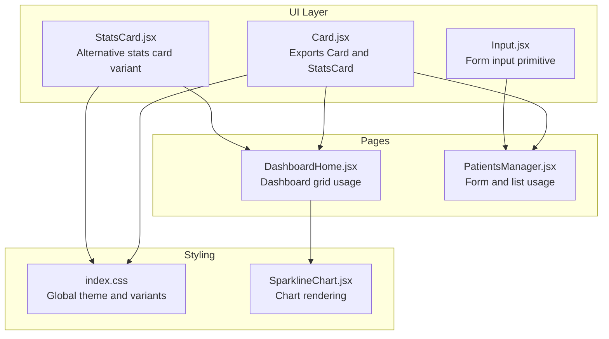
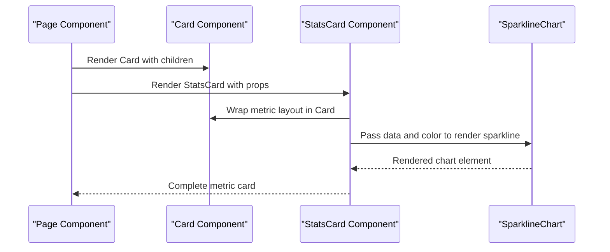
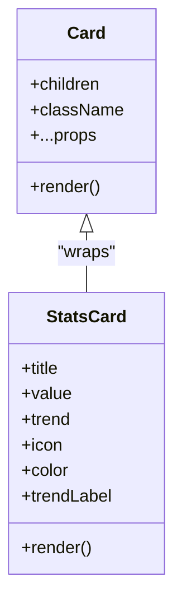
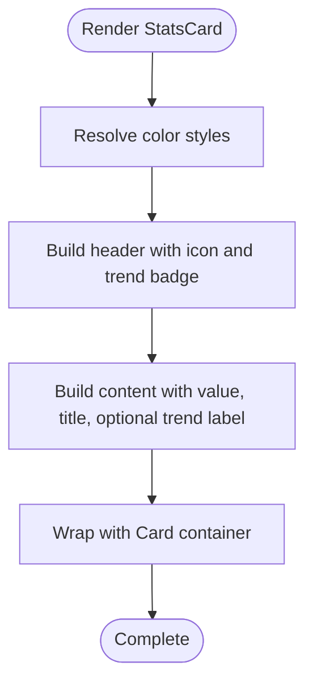
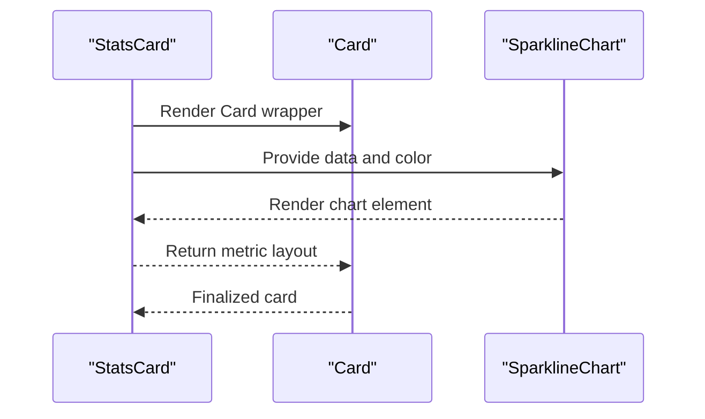
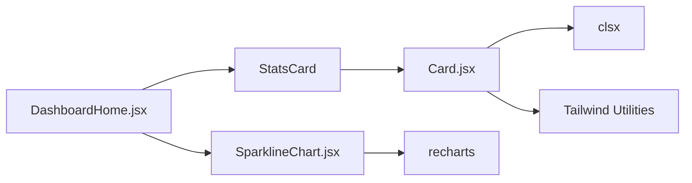
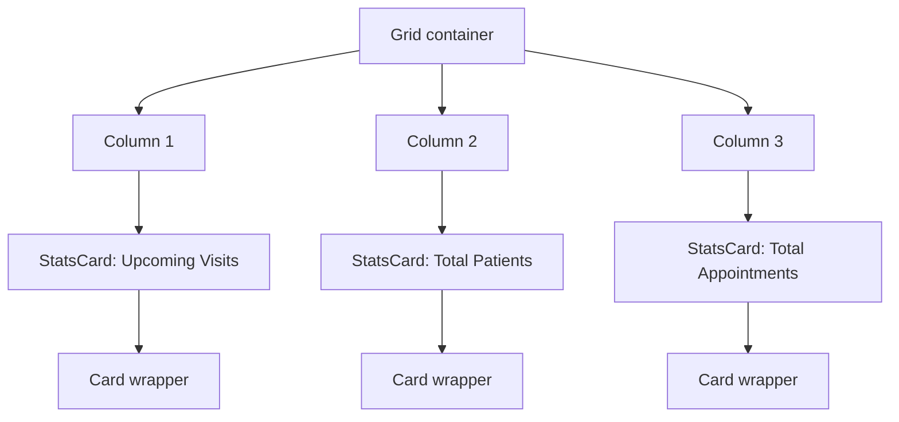
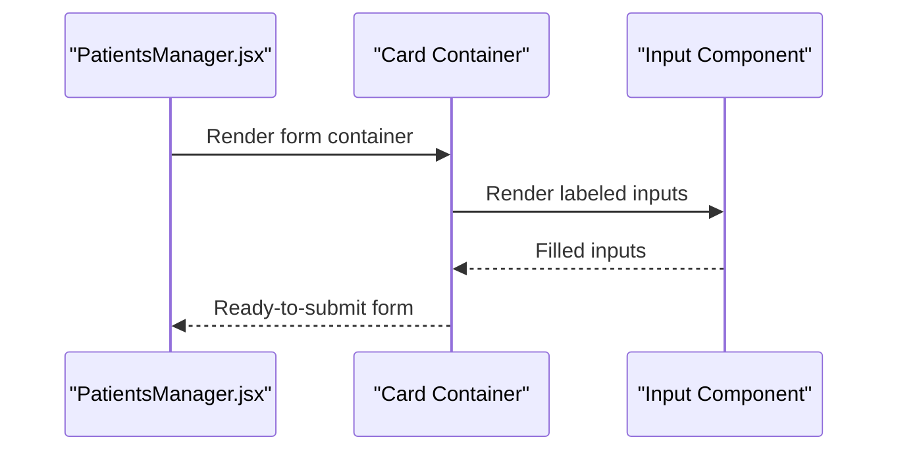

# Card Component

<cite>
**Referenced Files in This Document**
- [Card.jsx](file://frontend/src/components/ui/Card.jsx)
- [index.css](file://frontend/src/index.css)
- [DashboardHome.jsx](file://frontend/src/pages/DashboardHome.jsx)
- [PatientsManager.jsx](file://frontend/src/pages/PatientsManager.jsx)
- [SparklineChart.jsx](file://frontend/src/components/SparklineChart.jsx)
- [package.json](file://frontend/package.json)
</cite>

## Table of Contents
1. [Introduction](#introduction)
2. [Project Structure](#project-structure)
3. [Core Components](#core-components)
4. [Architecture Overview](#architecture-overview)
5. [Detailed Component Analysis](#detailed-component-analysis)
6. [Dependency Analysis](#dependency-analysis)
7. [Performance Considerations](#performance-considerations)
8. [Accessibility and Keyboard Navigation](#accessibility-and-keyboard-navigation)
9. [Usage Examples and Patterns](#usage-examples-and-patterns)
10. [Troubleshooting Guide](#troubleshooting-guide)
11. [Conclusion](#conclusion)

## Introduction
This document specifies the Card component used throughout the MedVita frontend. It covers the component's structure, styling options, content organization patterns, responsive behavior, spacing, and layout capabilities. It also documents how cards handle different content types (text, images, forms, interactive elements), provides usage patterns for dashboards and data presentation, and outlines accessibility considerations and keyboard navigation.

## Project Structure
The Card component resides in the UI primitives layer alongside other foundational components such as Button, Input, and Badge. Styling is primarily driven by Tailwind CSS utility classes applied directly in the component and page files, with global theme variables and variants defined in the main stylesheet.

**Diagram sources**
- [Card.jsx](file://frontend/src/components/ui/Card.jsx#L1-L53)
- [DashboardHome.jsx](file://frontend/src/pages/DashboardHome.jsx#L387-L487)
- [PatientsManager.jsx](file://frontend/src/pages/PatientsManager.jsx#L401-L413)
- [index.css](file://frontend/src/index.css#L1-L781)
- [SparklineChart.jsx](file://frontend/src/components/SparklineChart.jsx#L1-L21)

**Section sources**
- [Card.jsx](file://frontend/src/components/ui/Card.jsx#L1-L53)
- [index.css](file://frontend/src/index.css#L1-L781)

## Core Components
The Card component provides a reusable container with consistent spacing, rounded corners, subtle border, light shadow, and a smooth hover elevation effect. It accepts children and an optional className to merge additional styles. A specialized StatsCard variant is exported to present metrics with icons, trend indicators, and color-coded accents.

Key characteristics:
- Container element with padding, rounded corners, and soft shadow
- Hover behavior that increases shadow depth
- Accepts additional className to override or extend default styles
- StatsCard variant adds metric-focused layout with optional icon and trend badge

**Section sources**
- [Card.jsx](file://frontend/src/components/ui/Card.jsx#L3-L16)
- [Card.jsx](file://frontend/src/components/ui/Card.jsx#L18-L53)

## Architecture Overview
The Card component integrates with the broader UI ecosystem through shared styling tokens and page-level layouts. Pages compose cards to organize dashboard metrics, lists, and forms. Charts are embedded within cards to visualize trends.

**Diagram sources**
- [DashboardHome.jsx](file://frontend/src/pages/DashboardHome.jsx#L387-L419)
- [Card.jsx](file://frontend/src/components/ui/Card.jsx#L18-L53)
- [SparklineChart.jsx](file://frontend/src/components/SparklineChart.jsx#L1-L21)

## Detailed Component Analysis

### Card Component
The base Card component renders a div with:
- Background color
- Large rounded corners
- Inner padding
- Subtle border
- Soft shadow
- Transition for hover elevation

It forwards any additional className and spreads remaining props to the underlying DOM element, enabling attributes like aria-* roles and data-* attributes.

**Diagram sources**
- [Card.jsx](file://frontend/src/components/ui/Card.jsx#L3-L16)
- [Card.jsx](file://frontend/src/components/ui/Card.jsx#L18-L53)

**Section sources**
- [Card.jsx](file://frontend/src/components/ui/Card.jsx#L3-L16)

### StatsCard Component
StatsCard builds upon Card to present KPI-like content:
- Top area with icon and optional trend badge
- Metric value and title in the main content area
- Optional trend label below the title
- Color palette selection influences background, text, and icon colors

Color options include cyan, blue, purple, indigo, orange, red, and emerald. The trend badge displays positive/negative indicators with appropriate background/text colors.

**Diagram sources**
- [Card.jsx](file://frontend/src/components/ui/Card.jsx#L18-L53)

**Section sources**
- [Card.jsx](file://frontend/src/components/ui/Card.jsx#L18-L53)

### Integration with Charts
Within dashboard contexts, charts are embedded inside cards to visualize trends. The SparklineChart component renders a lightweight line chart using Recharts, transforming numeric arrays into chart data points.

**Diagram sources**
- [DashboardHome.jsx](file://frontend/src/pages/DashboardHome.jsx#L395-L418)
- [SparklineChart.jsx](file://frontend/src/components/SparklineChart.jsx#L1-L21)
- [Card.jsx](file://frontend/src/components/ui/Card.jsx#L18-L53)

**Section sources**
- [SparklineChart.jsx](file://frontend/src/components/SparklineChart.jsx#L1-L21)
- [DashboardHome.jsx](file://frontend/src/pages/DashboardHome.jsx#L395-L418)

## Dependency Analysis
The Card component relies on:
- clsx for safe class merging
- Tailwind utility classes for styling
- Optional Recharts for embedded charts

**Diagram sources**
- [Card.jsx](file://frontend/src/components/ui/Card.jsx#L1-L16)
- [package.json](file://frontend/package.json#L13-L31)
- [DashboardHome.jsx](file://frontend/src/pages/DashboardHome.jsx#L395-L418)
- [SparklineChart.jsx](file://frontend/src/components/SparklineChart.jsx#L1-L21)

**Section sources**
- [package.json](file://frontend/package.json#L13-L31)

## Performance Considerations
- Prefer minimal re-renders by passing stable prop references to Card and StatsCard.
- Avoid heavy computations inside Card children; memoize derived data.
- Keep chart data arrays small and normalized to reduce rendering overhead.
- Use CSS transitions sparingly; the existing hover elevation is lightweight.

## Accessibility and Keyboard Navigation
- Ensure interactive elements inside cards (buttons, links, inputs) receive focus and are operable via keyboard.
- Provide sufficient color contrast for text and trend badges against backgrounds.
- Use semantic HTML and ARIA attributes when extending Card with interactive regions.
- Maintain readable typography scales and adequate spacing for focus indicators.

## Usage Examples and Patterns

### Dashboard Metrics Grid
Cards are commonly arranged in a responsive grid to display KPIs. The StatsCard variant is ideal for metric cards with icons and trend indicators.

**Diagram sources**
- [DashboardHome.jsx](file://frontend/src/pages/DashboardHome.jsx#L387-L419)
- [Card.jsx](file://frontend/src/components/ui/Card.jsx#L18-L53)

**Section sources**
- [DashboardHome.jsx](file://frontend/src/pages/DashboardHome.jsx#L387-L419)

### Form Containers
Cards can serve as form containers, grouping related inputs and actions. Inputs and controls inherit consistent styling from shared utilities.

**Diagram sources**
- [PatientsManager.jsx](file://frontend/src/pages/PatientsManager.jsx#L561-L616)
- [Card.jsx](file://frontend/src/components/ui/Card.jsx#L3-L16)

**Section sources**
- [PatientsManager.jsx](file://frontend/src/pages/PatientsManager.jsx#L561-L616)

### List and Interactive Cards
Cards can host lists of items with interactive states. Hover effects and transitions enhance usability while maintaining performance.

**Section sources**
- [DashboardHome.jsx](file://frontend/src/pages/DashboardHome.jsx#L429-L482)

## Troubleshooting Guide
- Styling conflicts: If Card styles appear overridden, verify className precedence and avoid conflicting Tailwind utilities on the same element.
- Chart rendering issues: Ensure chart data is an array of numbers and passed correctly to the chart component.
- Hover effects not triggering: Confirm the parent container does not block pointer events and that transitions are not disabled globally.
- Responsive layout problems: Use grid utilities on the parent container and ensure breakpoints align with intended screen sizes.

## Conclusion
The Card component provides a consistent, accessible foundation for organizing content across MedVita’s interface. Its flexible design supports diverse content types—from metrics and forms to interactive lists—while integrating seamlessly with the project’s theming and layout systems. By following the composition and accessibility guidelines outlined here, teams can maintain visual coherence and usability across dashboard and application views.