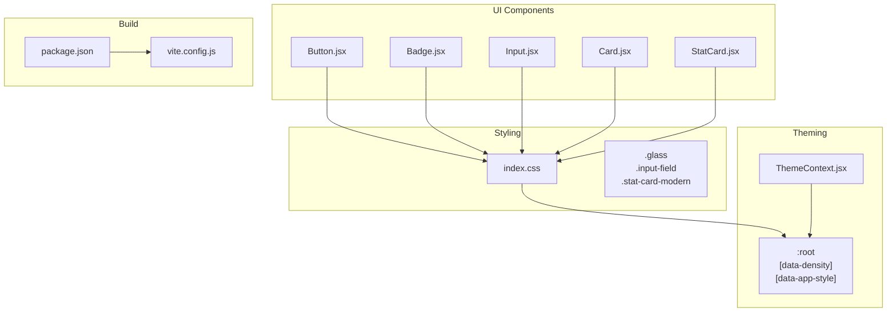
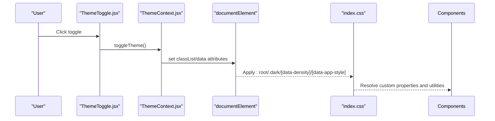
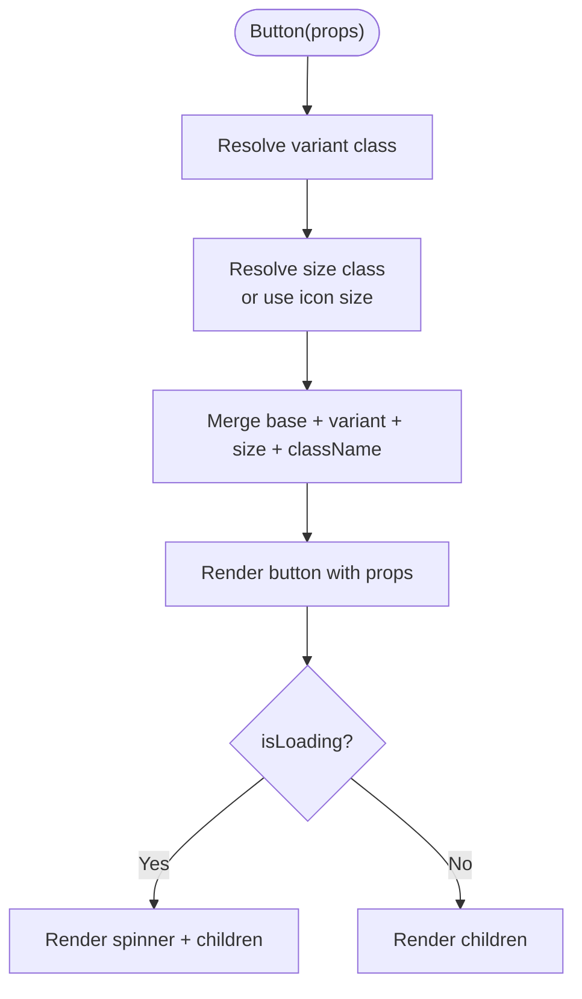
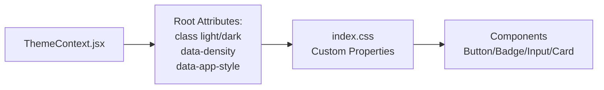

# Component Customization & Extension

<cite>
**Referenced Files in This Document**
- [Button.jsx](file://frontend/src/components/ui/Button.jsx)
- [Badge.jsx](file://frontend/src/components/ui/Badge.jsx)
- [Input.jsx](file://frontend/src/components/ui/Input.jsx)
- [Card.jsx](file://frontend/src/components/ui/Card.jsx)
- [ThemeContext.jsx](file://frontend/src/context/ThemeContext.jsx)
- [index.css](file://frontend/src/index.css)
- [StatCard.jsx](file://frontend/src/components/StatCard.jsx)
- [ThemeToggle.jsx](file://frontend/src/components/ThemeToggle.jsx)
- [package.json](file://frontend/package.json)
- [vite.config.js](file://frontend/vite.config.js)
</cite>

## Table of Contents
1. [Introduction](#introduction)
2. [Project Structure](#project-structure)
3. [Core Components](#core-components)
4. [Architecture Overview](#architecture-overview)
5. [Detailed Component Analysis](#detailed-component-analysis)
6. [Dependency Analysis](#dependency-analysis)
7. [Performance Considerations](#performance-considerations)
8. [Troubleshooting Guide](#troubleshooting-guide)
9. [Conclusion](#conclusion)
10. [Appendices](#appendices)

## Introduction
This document explains how to customize and extend MedVita’s UI component library. It covers the theming system built on CSS custom properties and Tailwind variants, the component APIs for variants and sizes, utility classes for composition, and patterns for creating custom variants, overrides, and extensions. It also provides guidelines for maintaining design consistency, performance best practices, and practical examples for brand customization, responsive overrides, and accessibility enhancements.

## Project Structure
MedVita organizes UI components under a dedicated folder and centralizes styling in a single CSS file. Theming is driven by CSS custom properties applied to the document root and toggled via a React context provider. Build-time bundling leverages Vite and Rollup chunking to optimize delivery.

**Diagram sources**
- [Button.jsx](file://frontend/src/components/ui/Button.jsx#L1-L51)
- [Badge.jsx](file://frontend/src/components/ui/Badge.jsx#L1-L32)
- [Input.jsx](file://frontend/src/components/ui/Input.jsx#L1-L63)
- [Card.jsx](file://frontend/src/components/ui/Card.jsx#L1-L54)
- [StatCard.jsx](file://frontend/src/components/StatCard.jsx#L1-L33)
- [index.css](file://frontend/src/index.css#L1-L781)
- [ThemeContext.jsx](file://frontend/src/context/ThemeContext.jsx#L1-L79)
- [package.json](file://frontend/package.json#L1-L50)
- [vite.config.js](file://frontend/vite.config.js#L1-L33)

**Section sources**
- [Button.jsx](file://frontend/src/components/ui/Button.jsx#L1-L51)
- [Badge.jsx](file://frontend/src/components/ui/Badge.jsx#L1-L32)
- [Input.jsx](file://frontend/src/components/ui/Input.jsx#L1-L63)
- [Card.jsx](file://frontend/src/components/ui/Card.jsx#L1-L54)
- [StatCard.jsx](file://frontend/src/components/StatCard.jsx#L1-L33)
- [index.css](file://frontend/src/index.css#L1-L781)
- [ThemeContext.jsx](file://frontend/src/context/ThemeContext.jsx#L1-L79)
- [package.json](file://frontend/package.json#L1-L50)
- [vite.config.js](file://frontend/vite.config.js#L1-L33)

## Core Components
- Button: supports multiple variants and sizes, integrates loading state, and merges external className with internal styles.
- Badge: variant-driven status indicators with optional visual accents.
- Input/SearchInput: form field with label, error state, and optional icons; exposes a forwardRef for imperative usage.
- Card/StatsCard: base card container and a stats variant with color mapping and trend indicators.

Key customization levers:
- Props for variant, size, and className allow targeted overrides.
- Utility classes (e.g., .glass, .input-field, .stat-card-modern) enable consistent composition.

**Section sources**
- [Button.jsx](file://frontend/src/components/ui/Button.jsx#L5-L50)
- [Badge.jsx](file://frontend/src/components/ui/Badge.jsx#L3-L31)
- [Input.jsx](file://frontend/src/components/ui/Input.jsx#L6-L44)
- [Card.jsx](file://frontend/src/components/ui/Card.jsx#L3-L16)

## Architecture Overview
Theming is controlled by a React context that updates the document root with theme, density, and app-style attributes. CSS custom properties cascade from :root and adapt under .dark, [data-density], and [data-app-style]. Components consume these variables and utility classes to render consistently across modes and styles.

**Diagram sources**
- [ThemeToggle.jsx](file://frontend/src/components/ThemeToggle.jsx#L5-L30)
- [ThemeContext.jsx](file://frontend/src/context/ThemeContext.jsx#L5-L68)
- [index.css](file://frontend/src/index.css#L61-L183)

## Detailed Component Analysis

### Button Component
- Variants: primary, blue, secondary, icon, danger, ghost.
- Sizes: sm, md, lg, with special handling for icon variant.
- Behavior: disables on isLoading, merges className with internal styles, and renders a spinner during loading.

Customization patterns:
- Add a new variant by extending the variants map and passing variant to the component.
- Override sizes by adding entries to the sizes map and selecting size.
- Compose with className to layer additional styles without replacing defaults.

**Diagram sources**
- [Button.jsx](file://frontend/src/components/ui/Button.jsx#L15-L49)

**Section sources**
- [Button.jsx](file://frontend/src/components/ui/Button.jsx#L5-L50)

### Badge Component
- Variants: default, success, warning, error, info, plus aliases mapped to teal-like palettes.
- Optional visual indicators for certain statuses.

Customization patterns:
- Extend the variants map to introduce new semantic statuses.
- Combine className to adjust spacing or typography while preserving badge shape.

**Section sources**
- [Badge.jsx](file://frontend/src/components/ui/Badge.jsx#L3-L31)

### Input and SearchInput
- Input: supports label, error ring, and left-aligned icon; uses a shared .input-field utility.
- SearchInput: convenience wrapper around input with a built-in search icon.

Customization patterns:
- Pass className to target .input-field or .input-modern for global overrides.
- Use error prop to trigger focus/error visuals.
- For advanced overrides, target [data-app-style] variants in CSS.

**Section sources**
- [Input.jsx](file://frontend/src/components/ui/Input.jsx#L6-L44)

### Card and StatsCard
- Card: base container with rounded corners, subtle shadow, and hover effects.
- StatsCard: extends Card with color mapping, trend badges, and icon support.

Customization patterns:
- Use className to override shadows, borders, or spacing.
- For themed variants, rely on color maps and pass color prop to StatsCard.

**Section sources**
- [Card.jsx](file://frontend/src/components/ui/Card.jsx#L3-L16)
- [Card.jsx](file://frontend/src/components/ui/Card.jsx#L18-L53)

### StatsCard Composition
- Renders a modern stat card with a sparkline chart and trend indicator.
- Uses utility class .stat-card-modern and applies density-aware padding.

Customization patterns:
- Replace chart component or swap color tokens for brand alignment.
- Adjust layout via className while keeping the utility class for consistent visuals.

**Section sources**
- [StatCard.jsx](file://frontend/src/components/StatCard.jsx#L3-L32)

## Dependency Analysis
The theming system depends on:
- ThemeContext for state and persistence.
- index.css for CSS custom properties and utility classes.
- Root attributes to switch themes and styles.

**Diagram sources**
- [ThemeContext.jsx](file://frontend/src/context/ThemeContext.jsx#L34-L51)
- [index.css](file://frontend/src/index.css#L61-L183)
- [Button.jsx](file://frontend/src/components/ui/Button.jsx#L37-L42)
- [Input.jsx](file://frontend/src/components/ui/Input.jsx#L29-L34)
- [Card.jsx](file://frontend/src/components/ui/Card.jsx#L6-L10)

**Section sources**
- [ThemeContext.jsx](file://frontend/src/context/ThemeContext.jsx#L34-L51)
- [index.css](file://frontend/src/index.css#L61-L183)

## Performance Considerations
- CSS custom properties minimize style recalculation across themes and densities.
- Utility-first classes reduce duplication and keep bundles lean.
- Vite/Rollup chunking separates vendor libraries to improve caching and load performance.

Recommendations:
- Prefer utility classes and CSS variables over deep component overrides.
- Keep variant sets focused to avoid bloated CSS.
- Use data-app-style minimal to reduce visual overhead when needed.

**Section sources**
- [index.css](file://frontend/src/index.css#L5-L59)
- [vite.config.js](file://frontend/vite.config.js#L11-L26)
- [package.json](file://frontend/package.json#L13-L31)

## Troubleshooting Guide
Common issues and resolutions:
- Theme not applying: ensure ThemeProvider wraps the app and root attributes are set.
- Overrides not taking effect: verify specificity and that [data-app-style] selectors are not overly restrictive.
- Bundle size growth: review chunking configuration and avoid importing large libraries per component.

**Section sources**
- [ThemeContext.jsx](file://frontend/src/context/ThemeContext.jsx#L53-L68)
- [index.css](file://frontend/src/index.css#L185-L318)
- [vite.config.js](file://frontend/vite.config.js#L15-L24)

## Conclusion
MedVita’s UI library balances flexibility and consistency through a robust theming system, utility classes, and component APIs. By leveraging CSS custom properties, data attributes, and well-defined component props, teams can implement brand customizations, responsive overrides, and accessibility improvements while maintaining performance and scalability.

## Appendices

### Theming System Reference
- CSS custom properties: define brand colors, backgrounds, text, borders, and shadows.
- Density variants: compact, normal, spacious scale fonts, spacing, and radii.
- App-style variants: modern vs. minimal with targeted utility overrides.

**Section sources**
- [index.css](file://frontend/src/index.css#L5-L183)

### Creating Custom Variants and Extensions
- Button: add a new variant in the variants map and pass variant to the component.
- Badge: add a new variant in the variants map.
- Input: extend .input-field or .input-modern in index.css for global overrides.
- Card: compose className to adjust shadows/borders; use StatsCard color mapping for themed variants.

**Section sources**
- [Button.jsx](file://frontend/src/components/ui/Button.jsx#L15-L22)
- [Badge.jsx](file://frontend/src/components/ui/Badge.jsx#L4-L15)
- [Input.jsx](file://frontend/src/components/ui/Input.jsx#L29-L34)
- [Card.jsx](file://frontend/src/components/ui/Card.jsx#L18-L27)

### Maintaining Design Consistency
- Use utility classes (.glass, .input-field, .stat-card-modern) for uniform visuals.
- Rely on CSS variables for brand tokens and theme-aware values.
- Limit custom overrides to preserve cohesive design language.

**Section sources**
- [index.css](file://frontend/src/index.css#L385-L781)

### Accessibility Enhancements
- Ensure sufficient color contrast under both light and dark modes.
- Provide focus-visible styles and keyboard navigation support.
- Use semantic roles and ARIA attributes where appropriate.

[No sources needed since this section provides general guidance]

### Examples Index
- Brand modifications: update CSS variables in :root and .dark blocks.
- Responsive overrides: use density variants and media queries in index.css.
- Accessibility: add focus rings and ensure hover/focus states are perceivable.

[No sources needed since this section provides general guidance]