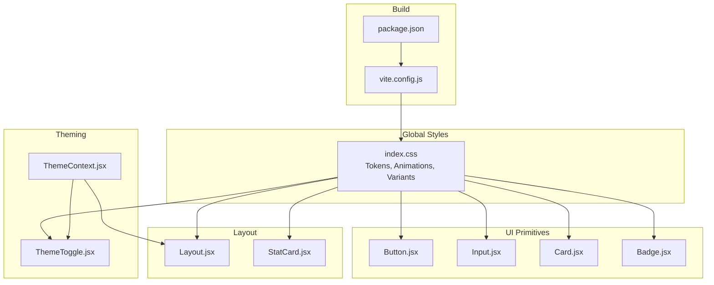
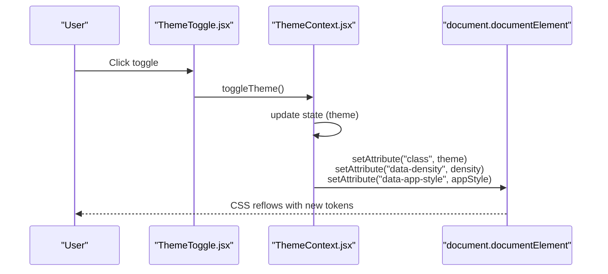
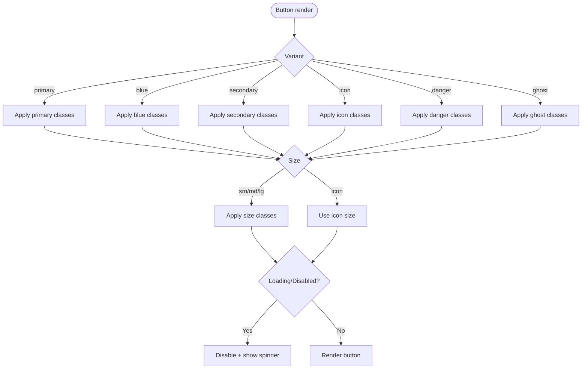
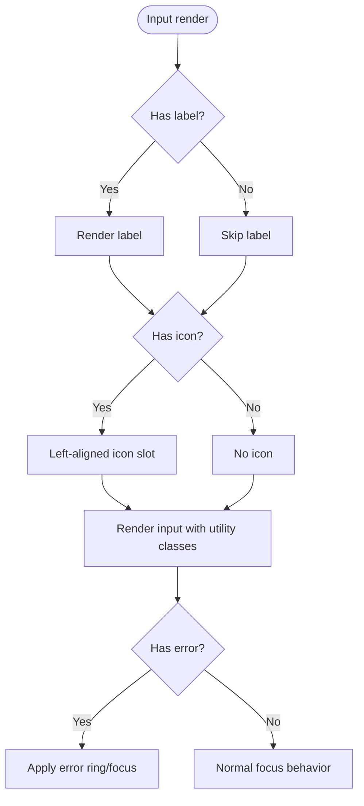
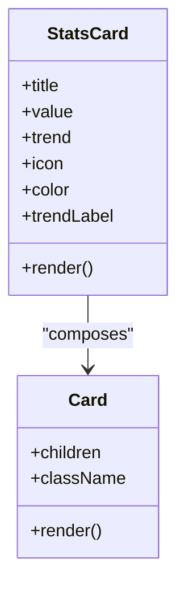
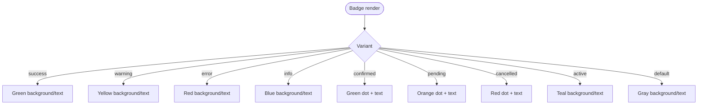
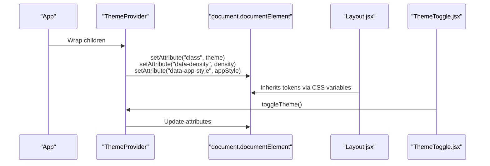
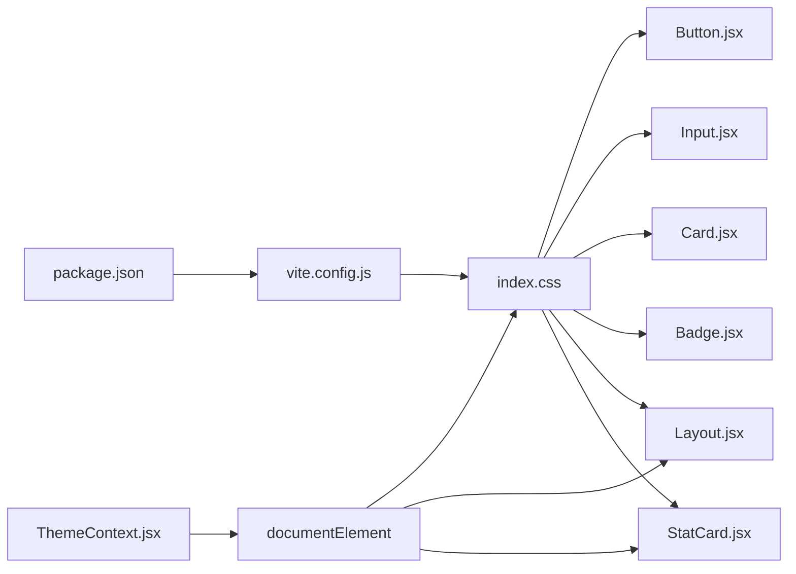

# Design System Principles

<cite>
**Referenced Files in This Document**
- [index.css](file://frontend/src/index.css)
- [Button.jsx](file://frontend/src/components/ui/Button.jsx)
- [Input.jsx](file://frontend/src/components/ui/Input.jsx)
- [Card.jsx](file://frontend/src/components/ui/Card.jsx)
- [Badge.jsx](file://frontend/src/components/ui/Badge.jsx)
- [ThemeContext.jsx](file://frontend/src/context/ThemeContext.jsx)
- [ThemeToggle.jsx](file://frontend/src/components/ThemeToggle.jsx)
- [Layout.jsx](file://frontend/src/components/Layout.jsx)
- [StatCard.jsx](file://frontend/src/components/StatCard.jsx)
- [package.json](file://frontend/package.json)
- [vite.config.js](file://frontend/vite.config.js)
</cite>

## Table of Contents
1. [Introduction](#introduction)
2. [Project Structure](#project-structure)
3. [Core Components](#core-components)
4. [Architecture Overview](#architecture-overview)
5. [Detailed Component Analysis](#detailed-component-analysis)
6. [Dependency Analysis](#dependency-analysis)
7. [Performance Considerations](#performance-considerations)
8. [Troubleshooting Guide](#troubleshooting-guide)
9. [Conclusion](#conclusion)
10. [Appendices](#appendices)

## Introduction
This document defines MedVita’s foundational design system for UI components. It consolidates the color palette, typography, spacing, animations, and design tokens used across the component library. It also explains the design philosophy behind component variations, accessibility and responsive design patterns, and provides guidelines for consistent usage and common anti-patterns to avoid.

## Project Structure
MedVita’s design system is implemented primarily through:
- A centralized design token layer in the global stylesheet
- Reusable UI primitives under the ui folder
- Theming and layout components that apply tokens consistently
- Build configuration enabling Tailwind CSS v4 and CSS custom properties

**Diagram sources**
- [index.css](file://frontend/src/index.css#L5-L94)
- [Button.jsx](file://frontend/src/components/ui/Button.jsx#L15-L29)
- [Input.jsx](file://frontend/src/components/ui/Input.jsx#L27-L37)
- [Card.jsx](file://frontend/src/components/ui/Card.jsx#L6-L15)
- [Badge.jsx](file://frontend/src/components/ui/Badge.jsx#L3-L24)
- [ThemeContext.jsx](file://frontend/src/context/ThemeContext.jsx#L53-L68)
- [ThemeToggle.jsx](file://frontend/src/components/ThemeToggle.jsx#L5-L28)
- [Layout.jsx](file://frontend/src/components/Layout.jsx#L5-L42)
- [StatCard.jsx](file://frontend/src/components/StatCard.jsx#L3-L31)
- [package.json](file://frontend/package.json#L13-L31)
- [vite.config.js](file://frontend/vite.config.js#L1-L33)

**Section sources**
- [index.css](file://frontend/src/index.css#L1-L781)
- [Button.jsx](file://frontend/src/components/ui/Button.jsx#L1-L51)
- [Input.jsx](file://frontend/src/components/ui/Input.jsx#L1-L63)
- [Card.jsx](file://frontend/src/components/ui/Card.jsx#L1-L54)
- [Badge.jsx](file://frontend/src/components/ui/Badge.jsx#L1-L32)
- [ThemeContext.jsx](file://frontend/src/context/ThemeContext.jsx#L1-L79)
- [ThemeToggle.jsx](file://frontend/src/components/ThemeToggle.jsx#L1-L31)
- [Layout.jsx](file://frontend/src/components/Layout.jsx#L1-L43)
- [StatCard.jsx](file://frontend/src/components/StatCard.jsx#L1-L33)
- [package.json](file://frontend/package.json#L1-L50)
- [vite.config.js](file://frontend/vite.config.js#L1-L33)

## Core Components
This section documents the foundational design tokens and how they are applied across components.

- Color palette
  - Brand palette: teal/cyan, emerald/green, blue
  - Surface and glass: translucent backgrounds with backdrop blur
  - Borders and glows: subtle borders and glow accents
  - Status colors: green for success, amber/yellow for warning, red for error
  - Text roles: primary, secondary, muted
  - Background gradients and cards: light and dark variants

- Typography hierarchy
  - Sans-serif and mono fonts defined via CSS variables
  - Base font size scales with density variants

- Spacing system
  - Base spacing unit scales with density: compact, normal, spacious
  - Consistent padding/margin across components

- Elevation and shadows
  - Small, medium, and large shadows
  - Glow effects for interactive states and brand accents

- Animations
  - Floating, glowing, and slide-up entrance animations
  - Pulse and heartbeat-inspired animations for medical contexts

- Density variants
  - Compact: smaller base units and tighter spacing
  - Normal: default scaling
  - Spacious: larger base units and expanded spacing

- App style variants
  - Modern: glass, gradients, and soft glows
  - Minimal: flat, clean, and low visual noise

**Section sources**
- [index.css](file://frontend/src/index.css#L5-L94)
- [index.css](file://frontend/src/index.css#L96-L109)
- [index.css](file://frontend/src/index.css#L139-L183)
- [index.css](file://frontend/src/index.css#L21-L58)
- [index.css](file://frontend/src/index.css#L711-L720)

## Architecture Overview
The design system is driven by CSS custom properties and Tailwind CSS v4. ThemeContext controls theme mode, density, and app style, applying attributes to the root element so that CSS selectors can switch variants. Components consume tokens via utility classes and CSS variables.

**Diagram sources**
- [ThemeToggle.jsx](file://frontend/src/components/ThemeToggle.jsx#L5-L28)
- [ThemeContext.jsx](file://frontend/src/context/ThemeContext.jsx#L53-L68)
- [index.css](file://frontend/src/index.css#L96-L109)
- [index.css](file://frontend/src/index.css#L139-L183)

## Detailed Component Analysis

### Button
- Variants: primary (teal), blue, secondary (outlined), icon, danger (red), ghost
- Sizes: small, medium, large, icon-specific sizing
- States: loading spinner, hover lift and shadow expansion, disabled state
- Motion: transitions for press/active states

**Diagram sources**
- [Button.jsx](file://frontend/src/components/ui/Button.jsx#L15-L29)
- [Button.jsx](file://frontend/src/components/ui/Button.jsx#L34-L49)

**Section sources**
- [Button.jsx](file://frontend/src/components/ui/Button.jsx#L1-L51)

### Input
- Features: label, error state, leading icon, focus states
- Uses shared utility classes for modern input styling
- Error state applies red ring and adjusted focus styles

**Diagram sources**
- [Input.jsx](file://frontend/src/components/ui/Input.jsx#L16-L42)
- [Input.jsx](file://frontend/src/components/ui/Input.jsx#L48-L62)

**Section sources**
- [Input.jsx](file://frontend/src/components/ui/Input.jsx#L1-L63)

### Card
- Base card: white background, rounded corners, subtle border and shadow
- Hover: shadow expansion and transition
- StatsCard: color-coded variants (teal/cyan, blue, emerald, etc.), trend badges, icons

**Diagram sources**
- [Card.jsx](file://frontend/src/components/ui/Card.jsx#L3-L16)
- [Card.jsx](file://frontend/src/components/ui/Card.jsx#L18-L53)

**Section sources**
- [Card.jsx](file://frontend/src/components/ui/Card.jsx#L1-L54)

### Badge
- Semantic variants: default, success (green), warning (yellow), error (red), info (blue), and mapped variants for confirmed, pending, cancelled, active
- Visual indicators: small dot for certain statuses
- Rounded pill shape with consistent padding

**Diagram sources**
- [Badge.jsx](file://frontend/src/components/ui/Badge.jsx#L4-L24)

**Section sources**
- [Badge.jsx](file://frontend/src/components/ui/Badge.jsx#L1-L32)

### Theme and Layout Integration
- ThemeContext manages theme mode, density, and app style, persisting selections in localStorage and applying attributes to the root element
- Layout composes Header, Sidebar, and main content area, leveraging density and app style tokens
- ThemeToggle toggles theme with animated visuals and gradient backgrounds

**Diagram sources**
- [ThemeContext.jsx](file://frontend/src/context/ThemeContext.jsx#L53-L68)
- [Layout.jsx](file://frontend/src/components/Layout.jsx#L5-L42)
- [ThemeToggle.jsx](file://frontend/src/components/ThemeToggle.jsx#L5-L28)

**Section sources**
- [ThemeContext.jsx](file://frontend/src/context/ThemeContext.jsx#L1-L79)
- [ThemeToggle.jsx](file://frontend/src/components/ThemeToggle.jsx#L1-L31)
- [Layout.jsx](file://frontend/src/components/Layout.jsx#L1-L43)

## Dependency Analysis
- Tokens and variants are defined centrally in the global stylesheet and consumed by components via CSS variables and Tailwind utilities
- ThemeContext drives token switching by setting attributes on the root element
- Build pipeline integrates Tailwind CSS v4 and CSS custom properties

**Diagram sources**
- [index.css](file://frontend/src/index.css#L5-L94)
- [Button.jsx](file://frontend/src/components/ui/Button.jsx#L15-L29)
- [Input.jsx](file://frontend/src/components/ui/Input.jsx#L27-L37)
- [Card.jsx](file://frontend/src/components/ui/Card.jsx#L6-L15)
- [Badge.jsx](file://frontend/src/components/ui/Badge.jsx#L3-L24)
- [ThemeContext.jsx](file://frontend/src/context/ThemeContext.jsx#L53-L68)
- [Layout.jsx](file://frontend/src/components/Layout.jsx#L5-L42)
- [StatCard.jsx](file://frontend/src/components/StatCard.jsx#L7-L31)
- [package.json](file://frontend/package.json#L13-L31)
- [vite.config.js](file://frontend/vite.config.js#L1-L33)

**Section sources**
- [index.css](file://frontend/src/index.css#L1-L781)
- [package.json](file://frontend/package.json#L1-L50)
- [vite.config.js](file://frontend/vite.config.js#L1-L33)

## Performance Considerations
- CSS custom properties enable efficient theme switching without JavaScript re-renders
- Tailwind CSS v4 reduces bundle size and improves build performance
- Manual chunking separates vendor libraries for optimal caching and load performance

[No sources needed since this section provides general guidance]

## Troubleshooting Guide
- Theme not applying
  - Ensure ThemeProvider wraps the app and attributes are set on the root element
  - Verify localStorage keys for theme, density, and app style are present
- Tokens not updating
  - Confirm CSS variables are defined in the global stylesheet and used by components
  - Check density and app style attributes on the root element
- Visual regressions after updates
  - Review Tailwind configuration and build output chunks
  - Validate that CSS custom properties remain intact post-build

**Section sources**
- [ThemeContext.jsx](file://frontend/src/context/ThemeContext.jsx#L53-L68)
- [index.css](file://frontend/src/index.css#L96-L109)
- [vite.config.js](file://frontend/vite.config.js#L11-L26)

## Conclusion
MedVita’s design system centers on a cohesive color palette, typography, spacing, and animation language. Tokens are defined globally and applied consistently across reusable UI primitives. ThemeContext and layout components ensure tokens adapt dynamically to user preferences and density/app style needs. Following the guidelines below will maintain consistency, accessibility, and responsiveness across the application.

## Appendices

### Design Tokens Reference
- Color roles
  - Brand: teal/cyan, emerald/green, blue
  - Surface: glass, card, sidebar
  - Borders and glows: subtle borders and brand glows
  - Status: green (success), amber (warning), red (error)
  - Text: primary, secondary, muted
- Typography
  - Sans-serif and mono families via CSS variables
  - Base font size scales with density
- Spacing
  - Base unit scales with density: compact, normal, spacious
- Elevation
  - Small, medium, large shadows; glow accents
- Animations
  - Float, glow, slide-up, pulse, heartbeat-inspired motion

**Section sources**
- [index.css](file://frontend/src/index.css#L5-L94)
- [index.css](file://frontend/src/index.css#L96-L109)
- [index.css](file://frontend/src/index.css#L21-L58)

### Accessibility and Responsive Guidelines
- Accessibility
  - Prefer semantic variants for status and emphasize sufficient color contrast
  - Ensure focus states are visible and keyboard navigable
  - Provide labels for inputs and icons
- Responsive
  - Use density variants to adjust spacing and font sizes for different screens
  - Leverage layout components that adapt to mobile and desktop breakpoints

**Section sources**
- [Input.jsx](file://frontend/src/components/ui/Input.jsx#L16-L42)
- [Layout.jsx](file://frontend/src/components/Layout.jsx#L12-L16)

### Examples of Proper Usage
- Buttons
  - Use primary for main actions, secondary for outlined alternatives, danger for destructive actions
  - Apply icon variant for compact actions
- Inputs
  - Pair labels with inputs; apply error variant when validation fails
- Cards
  - Use StatsCard with appropriate color mapping for KPIs
- Badges
  - Choose semantic variants aligned with system status

**Section sources**
- [Button.jsx](file://frontend/src/components/ui/Button.jsx#L15-L29)
- [Input.jsx](file://frontend/src/components/ui/Input.jsx#L27-L42)
- [Card.jsx](file://frontend/src/components/ui/Card.jsx#L18-L53)
- [Badge.jsx](file://frontend/src/components/ui/Badge.jsx#L4-L24)

### Common Anti-Patterns to Avoid
- Hardcoding colors instead of using semantic tokens
- Mixing multiple app styles within a single component
- Ignoring density settings for compact or spacious layouts
- Overusing animations to the point of distraction
- Neglecting focus and hover states for interactive elements

**Section sources**
- [index.css](file://frontend/src/index.css#L139-L183)
- [index.css](file://frontend/src/index.css#L21-L58)
- [Button.jsx](file://frontend/src/components/ui/Button.jsx#L38-L49)