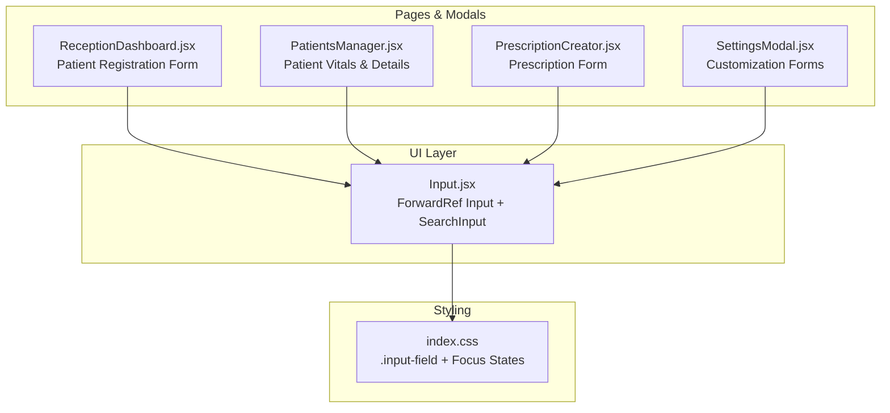
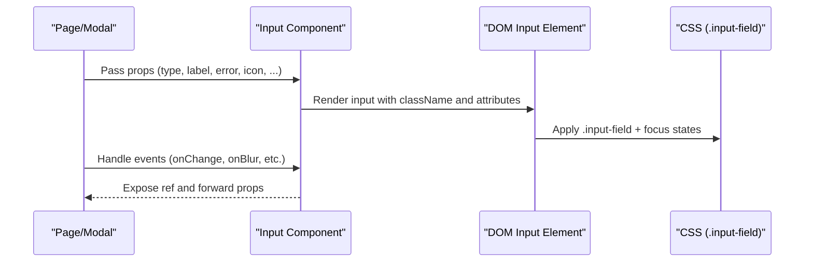
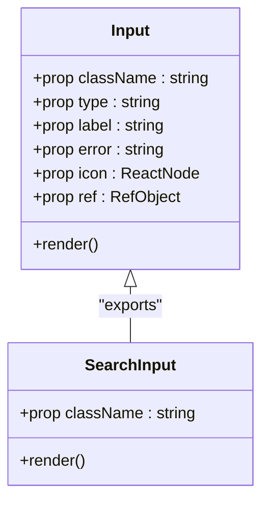
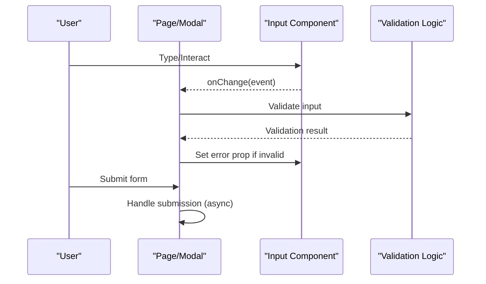
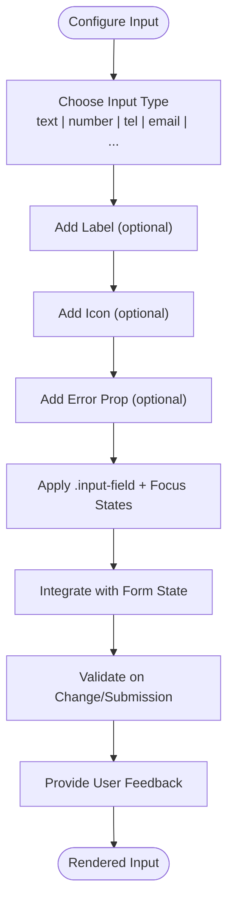
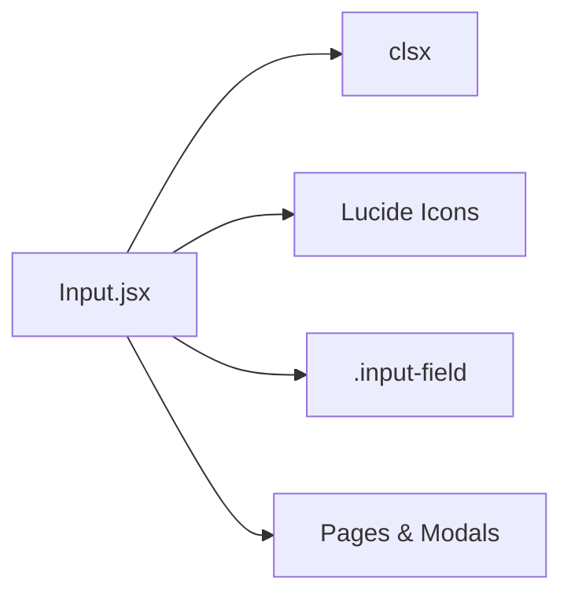

# Input Component

<cite>
**Referenced Files in This Document**
- [Input.jsx](file://frontend/src/components/ui/Input.jsx)
- [index.css](file://frontend/src/index.css)
- [ReceptionDashboard.jsx](file://frontend/src/pages/ReceptionDashboard.jsx)
- [PatientsManager.jsx](file://frontend/src/pages/PatientsManager.jsx)
- [PrescriptionCreator.jsx](file://frontend/src/components/PrescriptionCreator.jsx)
- [SettingsModal.jsx](file://frontend/src/components/SettingsModal.jsx)
</cite>

## Table of Contents
1. [Introduction](#introduction)
2. [Project Structure](#project-structure)
3. [Core Components](#core-components)
4. [Architecture Overview](#architecture-overview)
5. [Detailed Component Analysis](#detailed-component-analysis)
6. [Dependency Analysis](#dependency-analysis)
7. [Performance Considerations](#performance-considerations)
8. [Troubleshooting Guide](#troubleshooting-guide)
9. [Conclusion](#conclusion)

## Introduction
This document provides comprehensive documentation for the Input component implementation in the MedVita project. It covers input types, validation states, error handling, user feedback mechanisms, integration with form libraries, controlled/uncontrolled usage patterns, event handling, styling options, placeholder behavior, focus states, accessibility features, and practical configuration examples for text inputs, password fields, search bars, and specialized medical input formats.

## Project Structure
The Input component is implemented as a reusable UI primitive located under the UI components directory. It is consumed across multiple pages and modals throughout the application, ensuring consistent styling and behavior.

**Diagram sources**
- [Input.jsx](file://frontend/src/components/ui/Input.jsx#L1-L63)
- [index.css](file://frontend/src/index.css#L478-L504)
- [ReceptionDashboard.jsx](file://frontend/src/pages/ReceptionDashboard.jsx#L255-L326)
- [PatientsManager.jsx](file://frontend/src/pages/PatientsManager.jsx#L560-L616)
- [PrescriptionCreator.jsx](file://frontend/src/components/PrescriptionCreator.jsx#L234-L271)
- [SettingsModal.jsx](file://frontend/src/components/SettingsModal.jsx#L532-L628)

**Section sources**
- [Input.jsx](file://frontend/src/components/ui/Input.jsx#L1-L63)
- [index.css](file://frontend/src/index.css#L478-L504)

## Core Components
The Input component exposes two primary exports:
- ForwardRef Input: A configurable input field supporting label, error state, and optional icon.
- SearchInput: A convenience component optimized for search queries with built-in search icon and placeholder.

Key capabilities:
- Controlled/uncontrolled usage via React forwardRef and native props passthrough.
- Dynamic class composition using clsx for conditional styling.
- Error state highlighting via red ring focus styles.
- Optional icon support for visual cues.
- Consistent styling through shared CSS class `.input-field`.

Usage patterns across the application demonstrate:
- Native HTML input types (text, number, tel, email).
- Integration with form libraries and controlled components via onChange handlers.
- Accessibility-friendly markup with labels and placeholders.

**Section sources**
- [Input.jsx](file://frontend/src/components/ui/Input.jsx#L6-L46)
- [Input.jsx](file://frontend/src/components/ui/Input.jsx#L48-L62)

## Architecture Overview
The Input component integrates with the broader application through a unidirectional data flow pattern:
- Pages and modals pass props (type, label, error, icon, etc.) to the Input component.
- Controlled components manage state externally and propagate changes via event handlers.
- Shared CSS ensures consistent appearance and focus behavior across the app.

**Diagram sources**
- [Input.jsx](file://frontend/src/components/ui/Input.jsx#L6-L46)
- [index.css](file://frontend/src/index.css#L478-L504)

## Detailed Component Analysis

### Input Component Implementation
The Input component is implemented as a forwardRef component that:
- Accepts className, type, label, error, icon, and arbitrary props.
- Renders an optional label, an optional icon container, and an input element.
- Applies conditional classes for icon padding and error ring focus.
- Supports external refs for imperative access.

**Diagram sources**
- [Input.jsx](file://frontend/src/components/ui/Input.jsx#L6-L46)
- [Input.jsx](file://frontend/src/components/ui/Input.jsx#L48-L62)

**Section sources**
- [Input.jsx](file://frontend/src/components/ui/Input.jsx#L6-L46)
- [Input.jsx](file://frontend/src/components/ui/Input.jsx#L48-L62)

### Controlled vs Uncontrolled Usage Patterns
Across the application, inputs are used in controlled mode:
- ReceptionDashboard demonstrates controlled inputs with handleChange and formData state updates.
- PatientsManager shows controlled inputs for vitals and demographics.
- PrescriptionCreator uses controlled inputs for diagnosis and email fields.
- SettingsModal employs controlled inputs for customization settings.

These patterns ensure predictable state updates and facilitate validation and user feedback.

**Section sources**
- [ReceptionDashboard.jsx](file://frontend/src/pages/ReceptionDashboard.jsx#L255-L326)
- [PatientsManager.jsx](file://frontend/src/pages/PatientsManager.jsx#L560-L616)
- [PrescriptionCreator.jsx](file://frontend/src/components/PrescriptionCreator.jsx#L234-L271)
- [SettingsModal.jsx](file://frontend/src/components/SettingsModal.jsx#L532-L628)

### Event Handling and Form Integration
Event handling is centralized in parent components:
- onChange handlers update state and enable real-time validation.
- onSubmit handlers coordinate multi-step workflows (e.g., PDF generation, email sending).
- Disabled states prevent submission during asynchronous operations.

**Diagram sources**
- [ReceptionDashboard.jsx](file://frontend/src/pages/ReceptionDashboard.jsx#L255-L326)
- [PrescriptionCreator.jsx](file://frontend/src/components/PrescriptionCreator.jsx#L100-L188)

### Styling Options and Focus States
The component leverages a shared CSS class for consistent styling:
- .input-field defines padding, border radius, background, border, and color.
- Dark mode variants adjust background, border, and text colors.
- Focus states modify border color and add subtle shadows.
- Error state applies red ring focus classes conditionally.

Placeholder behavior:
- Placeholders are provided in consuming components to guide users.

Focus states:
- Focus triggers improved border color and background transitions in light/dark modes.

**Section sources**
- [index.css](file://frontend/src/index.css#L478-L504)

### Accessibility Features
Accessibility considerations observed in the codebase:
- Labels are associated with inputs to improve screen reader support.
- Required fields are indicated visually and semantically.
- Icons are decorative and do not replace labels.
- Keyboard navigation is supported through native input behavior.

Recommendations for enhancement:
- Use aria-describedby for dynamic error messages.
- Add aria-invalid when validation fails.
- Ensure sufficient color contrast for error states.
- Provide visible focus indicators consistent with design tokens.

**Section sources**
- [Input.jsx](file://frontend/src/components/ui/Input.jsx#L16-L41)
- [ReceptionDashboard.jsx](file://frontend/src/pages/ReceptionDashboard.jsx#L257-L269)

### Examples of Different Input Configurations
Common configurations across the application include:

- Text inputs for names, emails, phone numbers, and addresses.
- Number inputs for age and heart rate with min/max constraints.
- Text inputs for vitals like blood pressure with custom icons.
- Email inputs for patient communication.
- Search inputs for quick filtering and discovery.

**Diagram sources**
- [Input.jsx](file://frontend/src/components/ui/Input.jsx#L6-L46)
- [index.css](file://frontend/src/index.css#L478-L504)

**Section sources**
- [ReceptionDashboard.jsx](file://frontend/src/pages/ReceptionDashboard.jsx#L255-L354)
- [PatientsManager.jsx](file://frontend/src/pages/PatientsManager.jsx#L560-L616)
- [PrescriptionCreator.jsx](file://frontend/src/components/PrescriptionCreator.jsx#L234-L271)
- [SettingsModal.jsx](file://frontend/src/components/SettingsModal.jsx#L532-L628)

## Dependency Analysis
The Input component depends on:
- clsx for conditional class composition.
- Lucide icons for decorative elements (when used with icon prop).
- Tailwind-like CSS classes (.input-field) for styling.

Integration points:
- Consumed by multiple pages and modals.
- Relies on shared CSS for consistent appearance.
- Supports forwardRef for imperative access.

**Diagram sources**
- [Input.jsx](file://frontend/src/components/ui/Input.jsx#L1-L46)

**Section sources**
- [Input.jsx](file://frontend/src/components/ui/Input.jsx#L1-L46)

## Performance Considerations
- Keep re-renders minimal by using controlled components and avoiding unnecessary prop churn.
- Prefer memoization for expensive validation logic.
- Defer heavy computations until after user stops typing (debounce).
- Use CSS transitions judiciously to avoid layout thrashing.

## Troubleshooting Guide
Common issues and resolutions:
- Error state not visible: Ensure error prop is passed and CSS ring classes are applied.
- Icon overlaps text: Verify icon prop usage and left padding adjustments.
- Focus ring not visible: Confirm focus styles are not overridden by global CSS.
- Placeholder not showing: Check placeholder prop is provided in consuming components.
- Accessibility warnings: Add aria-describedby and aria-invalid as needed.

**Section sources**
- [Input.jsx](file://frontend/src/components/ui/Input.jsx#L29-L41)
- [index.css](file://frontend/src/index.css#L478-L504)

## Conclusion
The Input component provides a flexible, accessible, and consistent foundation for forms across the MedVita application. By leveraging controlled usage patterns, shared styling, and clear error feedback, it supports robust user experiences across diverse scenarios including patient registration, vitals capture, prescriptions, and settings customization. Extending the component with enhanced accessibility attributes and validation hooks will further strengthen its reliability and usability.