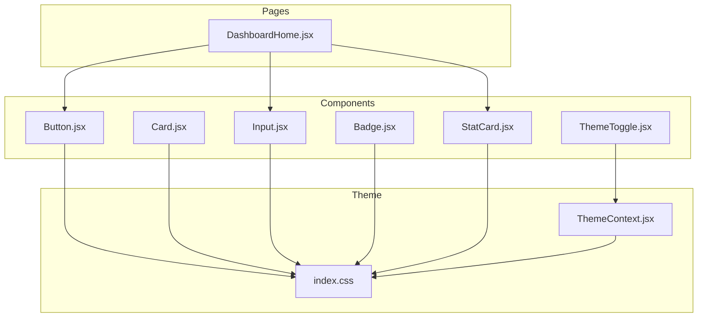
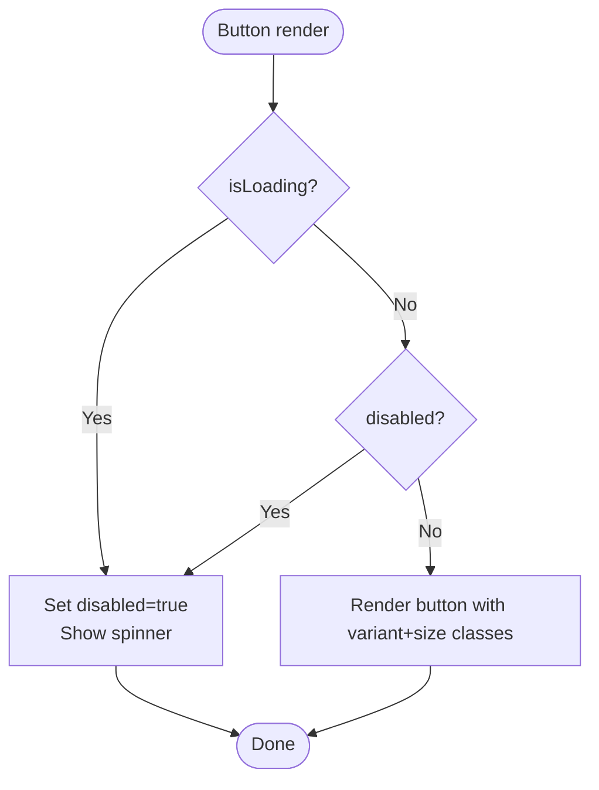
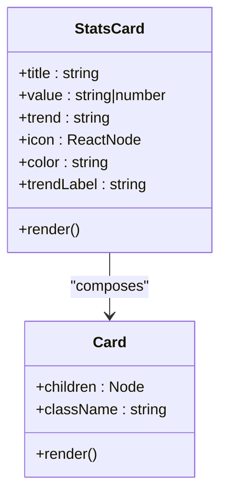
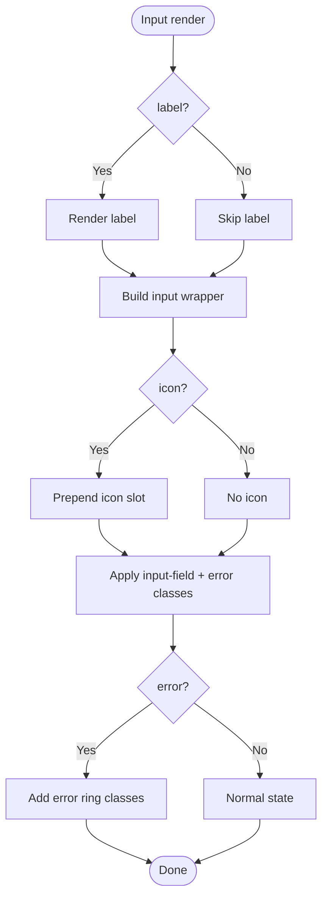
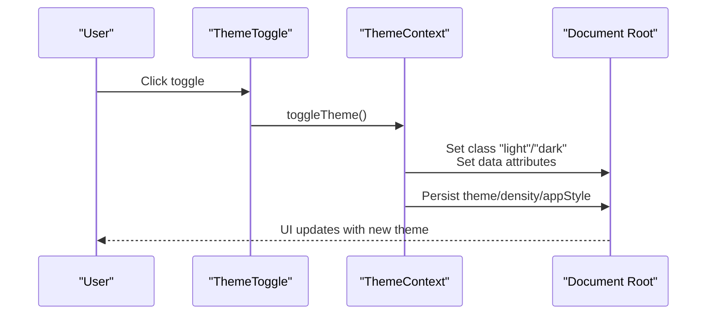
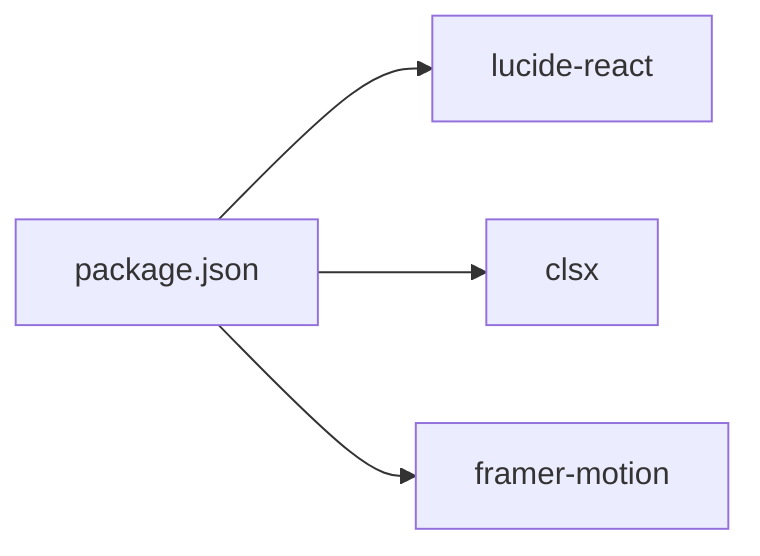

# UI Components Library

<cite>
**Referenced Files in This Document**
- [Button.jsx](file://frontend/src/components/ui/Button.jsx)
- [Card.jsx](file://frontend/src/components/ui/Card.jsx)
- [Input.jsx](file://frontend/src/components/ui/Input.jsx)
- [Badge.jsx](file://frontend/src/components/ui/Badge.jsx)
- [index.css](file://frontend/src/index.css)
- [ThemeContext.jsx](file://frontend/src/context/ThemeContext.jsx)
- [ThemeToggle.jsx](file://frontend/src/components/ThemeToggle.jsx)
- [StatCard.jsx](file://frontend/src/components/StatCard.jsx)
- [DashboardHome.jsx](file://frontend/src/pages/DashboardHome.jsx)
- [package.json](file://frontend/package.json)
</cite>

## Table of Contents
1. [Introduction](#introduction)
2. [Project Structure](#project-structure)
3. [Core Components](#core-components)
4. [Architecture Overview](#architecture-overview)
5. [Detailed Component Analysis](#detailed-component-analysis)
6. [Dependency Analysis](#dependency-analysis)
7. [Performance Considerations](#performance-considerations)
8. [Troubleshooting Guide](#troubleshooting-guide)
9. [Conclusion](#conclusion)
10. [Appendices](#appendices)

## Introduction
This document describes the UI components library for MedVita’s design system. It covers reusable primitives such as Button, Card, Input, and Badge, along with supporting utilities like StatCard, ThemeToggle, and ThemeContext. The guide explains component props, states, animations, theming, and integration patterns. It also outlines design system principles (colors, typography, spacing), accessibility considerations, and best practices for extending the library.

## Project Structure
The UI components are located under the frontend/src/components/ui directory and are complemented by global styles and theme utilities. The design system leverages Tailwind CSS v4, CSS custom properties, and a theme provider for light/dark mode and app style variations.

**Diagram sources**
- [Button.jsx](file://frontend/src/components/ui/Button.jsx#L1-L51)
- [Card.jsx](file://frontend/src/components/ui/Card.jsx#L1-L54)
- [Input.jsx](file://frontend/src/components/ui/Input.jsx#L1-L63)
- [Badge.jsx](file://frontend/src/components/ui/Badge.jsx#L1-L32)
- [StatCard.jsx](file://frontend/src/components/StatCard.jsx#L1-L33)
- [ThemeToggle.jsx](file://frontend/src/components/ThemeToggle.jsx#L1-L31)
- [ThemeContext.jsx](file://frontend/src/context/ThemeContext.jsx#L1-L79)
- [index.css](file://frontend/src/index.css#L1-L781)
- [DashboardHome.jsx](file://frontend/src/pages/DashboardHome.jsx#L1-L200)

**Section sources**
- [Button.jsx](file://frontend/src/components/ui/Button.jsx#L1-L51)
- [Card.jsx](file://frontend/src/components/ui/Card.jsx#L1-L54)
- [Input.jsx](file://frontend/src/components/ui/Input.jsx#L1-L63)
- [Badge.jsx](file://frontend/src/components/ui/Badge.jsx#L1-L32)
- [StatCard.jsx](file://frontend/src/components/StatCard.jsx#L1-L33)
- [ThemeToggle.jsx](file://frontend/src/components/ThemeToggle.jsx#L1-L31)
- [ThemeContext.jsx](file://frontend/src/context/ThemeContext.jsx#L1-L79)
- [index.css](file://frontend/src/index.css#L1-L781)
- [DashboardHome.jsx](file://frontend/src/pages/DashboardHome.jsx#L1-L200)

## Core Components
This section documents the primary UI primitives and their capabilities.

- Button
  - Purpose: Interactive actions with multiple variants, sizes, and states.
  - Props:
    - children: Node
    - variant: "primary" | "blue" | "secondary" | "icon" | "danger" | "ghost"
    - size: "sm" | "md" | "lg" | "icon"
    - className: string
    - isLoading: boolean
    - disabled: boolean
    - type: "button" | "submit" | "reset"
  - States and Behaviors:
    - Loading state displays an animated spinner and disables interaction.
    - Hover, focus, active, and disabled states apply transitions and shadows.
    - Icon variant overrides sizing to a compact circular form.
  - Accessibility:
    - Inherits native button semantics; disabled state prevents interaction.
  - Example usage:
    - See [Button usage in DashboardHome](file://frontend/src/pages/DashboardHome.jsx#L136-L150).

- Card
  - Purpose: Container with elevated surface and subtle hover lift.
  - Props:
    - children: Node
    - className: string
  - Extended variant: StatsCard
    - Props:
      - title: string
      - value: string | number
      - trend: string
      - icon: ReactNode
      - color: "cyan" | "blue" | "purple" | "indigo" | "orange" | "red" | "emerald"
      - trendLabel: string
    - Behavior:
      - Renders a colored icon area and trend indicator with positive/negative coloring.
  - Example usage:
    - See [StatsCard usage in StatCard component](file://frontend/src/components/StatCard.jsx#L1-L33).

- Input
  - Purpose: Text field with optional label, icon, and error messaging.
  - Props:
    - className: string
    - type: string
    - label: string
    - error: string
    - icon: ReactNode
  - Extended variant: SearchInput
    - Props: className + forwarded props
    - Behavior:
      - Prepend a Search icon and apply consistent padding.
  - Accessibility:
    - Optional label mapping to input via htmlFor.
    - Error message rendered with semantic assistive text.
  - Example usage:
    - See [Search input in PatientsManager page](file://frontend/src/pages/DashboardHome.jsx#L247-L259).

- Badge
  - Purpose: Status or metadata labels with semantic variants.
  - Props:
    - children: Node
    - variant: "default" | "success" | "warning" | "error" | "info" | "purple" | "confirmed" | "pending" | "cancelled" | "active"
  - Behavior:
    - Some variants render a small dot to indicate state.
  - Example usage:
    - See [Badge usage in DashboardHome](file://frontend/src/pages/DashboardHome.jsx#L115-L123).

**Section sources**
- [Button.jsx](file://frontend/src/components/ui/Button.jsx#L5-L50)
- [Card.jsx](file://frontend/src/components/ui/Card.jsx#L3-L16)
- [Card.jsx](file://frontend/src/components/ui/Card.jsx#L18-L53)
- [Input.jsx](file://frontend/src/components/ui/Input.jsx#L6-L44)
- [Input.jsx](file://frontend/src/components/ui/Input.jsx#L48-L62)
- [Badge.jsx](file://frontend/src/components/ui/Badge.jsx#L3-L31)
- [StatCard.jsx](file://frontend/src/components/StatCard.jsx#L1-L33)
- [DashboardHome.jsx](file://frontend/src/pages/DashboardHome.jsx#L115-L150)
- [DashboardHome.jsx](file://frontend/src/pages/DashboardHome.jsx#L247-L259)

## Architecture Overview
MedVita’s UI architecture centers on:
- Primitive components (Button, Card, Input, Badge) built with Tailwind classes and composed via clsx.
- Global design tokens defined in CSS custom properties and scoped to light/dark/app-style variants.
- ThemeContext managing theme, density, and app style preferences persisted in localStorage.
- Page-level components composing primitives and leveraging animations and icons.

```mermaid
graph TB
TCTX["ThemeContext.jsx<br/>provides theme, density, appStyle"]
CSS["index.css<br/>CSS variables, dark variant, app styles"]
BTN["Button.jsx"]
CRD["Card.jsx"]
INP["Input.jsx"]
BGD["Badge.jsx"]
STC["StatCard.jsx"]
TGL["ThemeToggle.jsx"]
TCTX --> CSS
BTN --> CSS
CRD --> CSS
INP --> CSS
BGD --> CSS
STC --> CSS
TGL --> TCTX
```

**Diagram sources**
- [ThemeContext.jsx](file://frontend/src/context/ThemeContext.jsx#L1-L79)
- [index.css](file://frontend/src/index.css#L1-L781)
- [Button.jsx](file://frontend/src/components/ui/Button.jsx#L1-L51)
- [Card.jsx](file://frontend/src/components/ui/Card.jsx#L1-L54)
- [Input.jsx](file://frontend/src/components/ui/Input.jsx#L1-L63)
- [Badge.jsx](file://frontend/src/components/ui/Badge.jsx#L1-L32)
- [StatCard.jsx](file://frontend/src/components/StatCard.jsx#L1-L33)
- [ThemeToggle.jsx](file://frontend/src/components/ThemeToggle.jsx#L1-L31)

## Detailed Component Analysis

### Button Component
- Implementation highlights:
  - Uses variants and sizes maps for consistent styling.
  - Conditional sizing for icon variant.
  - isLoading disables the button and renders a spinner.
  - Transition effects for hover, active, and disabled states.
- Accessibility:
  - Native button type and disabled handling.
- Composition:
  - Integrates with icons from lucide-react.

**Diagram sources**
- [Button.jsx](file://frontend/src/components/ui/Button.jsx#L5-L50)

**Section sources**
- [Button.jsx](file://frontend/src/components/ui/Button.jsx#L5-L50)

### Card and StatsCard Component
- Implementation highlights:
  - Card provides a glass-like container with rounded corners and hover elevation.
  - StatsCard composes Card with color-coded accents and trend indicators.
- Theming:
  - Uses CSS variables for backgrounds, borders, and shadows.
- Composition:
  - Accepts an icon prop to render inside a colored circle.

**Diagram sources**
- [Card.jsx](file://frontend/src/components/ui/Card.jsx#L3-L16)
- [Card.jsx](file://frontend/src/components/ui/Card.jsx#L18-L53)

**Section sources**
- [Card.jsx](file://frontend/src/components/ui/Card.jsx#L3-L16)
- [Card.jsx](file://frontend/src/components/ui/Card.jsx#L18-L53)

### Input Component
- Implementation highlights:
  - Supports label, error messaging, and leading icon.
  - Applies focused/error ring classes conditionally.
  - SearchInput variant predefines icon and placeholder.
- Accessibility:
  - Optional label mapped to input element.
  - Error messages rendered as assistive text.

**Diagram sources**
- [Input.jsx](file://frontend/src/components/ui/Input.jsx#L6-L44)
- [Input.jsx](file://frontend/src/components/ui/Input.jsx#L48-L62)

**Section sources**
- [Input.jsx](file://frontend/src/components/ui/Input.jsx#L6-L44)
- [Input.jsx](file://frontend/src/components/ui/Input.jsx#L48-L62)

### Badge Component
- Implementation highlights:
  - Semantic variants for status and informational states.
  - Optional colored dot for specific states.
- Theming:
  - Uses color tokens via CSS variable-backed classes.

**Section sources**
- [Badge.jsx](file://frontend/src/components/ui/Badge.jsx#L3-L31)

### Theme System and Theming Support
- ThemeContext manages:
  - theme: "light" | "dark"
  - density: "normal" | "compact" | "spacious"
  - appStyle: "modern" | "minimal"
- Effects:
  - Applies theme classes and data attributes to document root.
  - Persists selections in localStorage.
- ThemeToggle:
  - Provides a visually rich toggle with gradient backgrounds and hover animations.
  - Uses lucide-react icons and transitions.

**Diagram sources**
- [ThemeToggle.jsx](file://frontend/src/components/ThemeToggle.jsx#L5-L29)
- [ThemeContext.jsx](file://frontend/src/context/ThemeContext.jsx#L53-L68)

**Section sources**
- [ThemeContext.jsx](file://frontend/src/context/ThemeContext.jsx#L1-L79)
- [ThemeToggle.jsx](file://frontend/src/components/ThemeToggle.jsx#L1-L31)
- [index.css](file://frontend/src/index.css#L61-L183)

## Dependency Analysis
- External libraries:
  - lucide-react: Icons used across components.
  - clsx: Conditional class merging.
  - framer-motion: Page-level animations (not core primitives).
- Internal dependencies:
  - Components depend on shared CSS classes and CSS variables.
  - ThemeContext is consumed by ThemeToggle and drives global styles.

**Diagram sources**
- [package.json](file://frontend/package.json#L13-L31)

**Section sources**
- [package.json](file://frontend/package.json#L13-L31)

## Performance Considerations
- Prefer variant and size props over ad-hoc class overrides to minimize runtime class computation.
- Use forwardRef for form controls to avoid unnecessary re-renders.
- Keep animations scoped; avoid heavy transforms on frequently updated nodes.
- Leverage CSS custom properties for theme-driven updates to reduce JS overhead.
- Use clsx for efficient class concatenation.

## Troubleshooting Guide
- Button does not disable:
  - Ensure isLoading is passed; it sets disabled and hides spinner.
  - Verify variant and size combinations do not override disabled state.
- Input error ring not appearing:
  - Confirm error prop is truthy; classes are applied conditionally.
  - Ensure input-field class is present.
- Theme not switching:
  - Check ThemeContext provider wraps the app.
  - Verify localStorage keys and data attributes are being set.
- StatsCard color mismatch:
  - Confirm color prop matches supported values.
  - Ensure icon is passed for proper tinting.

**Section sources**
- [Button.jsx](file://frontend/src/components/ui/Button.jsx#L10-L13)
- [Button.jsx](file://frontend/src/components/ui/Button.jsx#L43-L44)
- [Input.jsx](file://frontend/src/components/ui/Input.jsx#L32-L34)
- [ThemeContext.jsx](file://frontend/src/context/ThemeContext.jsx#L34-L51)
- [Card.jsx](file://frontend/src/components/ui/Card.jsx#L19-L27)

## Conclusion
MedVita’s UI components library emphasizes consistency, accessibility, and extensibility through a robust theme system and shared design tokens. The primitives are modular, configurable, and designed to compose seamlessly into higher-order components and pages.

## Appendices

### Design System Principles
- Colors:
  - Brand palette: Cyan, Emerald, Blue.
  - Surface and border tokens adapt per theme and app style.
- Typography:
  - Sans and mono fonts configured via CSS variables.
- Spacing and density:
  - Base font size, spacing, and radius scale with density variants.
- Animations:
  - Shared keyframes and utility classes for floating, glowing, and slide-up effects.

**Section sources**
- [index.css](file://frontend/src/index.css#L5-L59)
- [index.css](file://frontend/src/index.css#L96-L109)
- [index.css](file://frontend/src/index.css#L140-L183)
- [index.css](file://frontend/src/index.css#L26-L58)
- [index.css](file://frontend/src/index.css#L715-L718)

### Accessibility Compliance Checklist
- Buttons:
  - Use appropriate type; disabled state prevents interaction.
- Inputs:
  - Associate labels with inputs; error messages are present.
- Themes:
  - Ensure sufficient contrast in light/dark modes.
- Focus:
  - Visible focus styles via ring utilities.

**Section sources**
- [Button.jsx](file://frontend/src/components/ui/Button.jsx#L35-L49)
- [Input.jsx](file://frontend/src/components/ui/Input.jsx#L16-L41)
- [index.css](file://frontend/src/index.css#L332-L340)

### Integration Patterns and Composition Strategies
- Compose primitives to build domain-specific components (e.g., StatCard).
- Use ThemeContext to centralize theme-aware rendering.
- Forward refs for inputs to integrate with form libraries.
- Use className prop to extend base styles without breaking variants.

**Section sources**
- [Card.jsx](file://frontend/src/components/ui/Card.jsx#L18-L53)
- [ThemeContext.jsx](file://frontend/src/context/ThemeContext.jsx#L58-L68)
- [Input.jsx](file://frontend/src/components/ui/Input.jsx#L6-L13)